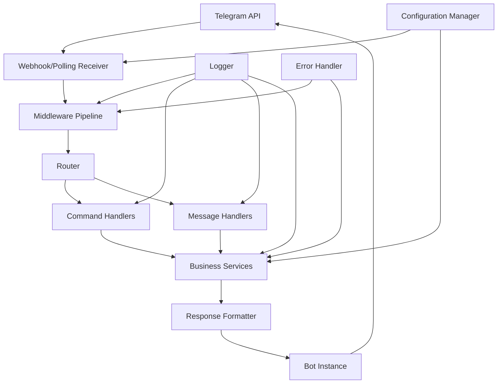

# core-bot-framework - Task 13

Execute task 13 for the core-bot-framework specification.

## Task Description
Create main entry point in src/main.py

## Requirements Reference
**Requirements**: 1.1, 1.3, 1.4

## Usage
```
/Task:13-core-bot-framework
```

## Instructions

Execute with @spec-task-executor agent the following task: "Create main entry point in src/main.py"

```
Use the @spec-task-executor agent to implement task 13: "Create main entry point in src/main.py" for the core-bot-framework specification and include all the below context.

# Steering Context
## Steering Documents Context

No steering documents found or all are empty.

# Specification Context
## Specification Context (Pre-loaded): core-bot-framework

### Requirements
# Requirements Document - Core Bot Framework

## Introduction

The Core Bot Framework is a foundational Telegram bot implementation using Aiogram 3 that provides essential functionality for user interaction and system management. This framework serves as the base infrastructure for a Telegram bot with basic command handling, webhook connectivity, and menu navigation capabilities. The bot will establish the core communication layer between users and the bot's services through standardized command interfaces and secure webhook handling.

## Alignment with Product Vision

This feature establishes the fundamental infrastructure required for any Telegram bot application, providing a solid foundation for future feature development and user engagement through reliable messaging capabilities.

## Requirements

### Requirement 1: Telegram Bot Configuration

**User Story:** As a system administrator, I want to configure a Telegram bot using Aiogram 3 framework, so that the bot can connect to Telegram's API and handle user interactions securely.

#### Acceptance Criteria

1. WHEN the bot is initialized THEN the system SHALL establish a connection with Telegram API using a valid bot token
2. WHEN the bot token is invalid THEN the system SHALL log an appropriate error and fail gracefully
3. WHEN the bot is configured THEN the system SHALL support both polling and webhook modes for receiving updates
4. WHEN the bot starts THEN the system SHALL validate all required configuration parameters before beginning operation

### Requirement 2: Basic Command Implementation

**User Story:** As a user, I want to interact with the bot using basic commands like /start and /menu, so that I can begin using the bot's functionality and navigate its features.

#### Acceptance Criteria

1. WHEN a user sends /start command THEN the bot SHALL respond with a welcome message and basic usage instructions
2. WHEN a user sends /menu command THEN the bot SHALL display the main menu with available options
3. WHEN a user sends an unrecognized command THEN the bot SHALL respond with a helpful message explaining available commands
4. WHEN commands are executed THEN the bot SHALL respond within 3 seconds under normal network conditions
5. WHEN multiple users send commands simultaneously THEN the bot SHALL handle all requests without blocking

### Requirement 3: Webhook Integration

**User Story:** As a system administrator, I want to connect the bot to Telegram API using webhooks, so that the bot can receive real-time updates efficiently without constant polling.

#### Acceptance Criteria

1. WHEN webhook mode is enabled THEN the system SHALL configure a secure HTTPS endpoint for receiving Telegram updates
2. WHEN a webhook receives an update THEN the system SHALL process it asynchronously without blocking other requests
3. WHEN webhook configuration fails THEN the system SHALL fallback to polling mode and log the webhook error
4. WHEN the webhook endpoint receives invalid requests THEN the system SHALL reject them and log security warnings
5. WHEN webhook SSL certificate is invalid THEN the system SHALL fail with a clear error message during configuration

### Requirement 4: Error Handling and Logging

**User Story:** As a system administrator, I want comprehensive error handling and logging, so that I can monitor bot performance and troubleshoot issues effectively.

#### Acceptance Criteria

1. WHEN any error occurs THEN the system SHALL log the error with timestamp, severity level, and context information
2. WHEN a user encounters an error THEN the bot SHALL respond with a user-friendly error message without exposing system details
3. WHEN critical errors occur THEN the system SHALL attempt graceful recovery and continue operating if possible
4. WHEN the bot is unable to send a message THEN the system SHALL retry with exponential backoff up to 3 attempts

### Requirement 5: Message Processing

**User Story:** As a developer, I want a structured message processing system, so that different types of user inputs can be handled appropriately and extensibly.

#### Acceptance Criteria

1. WHEN a text message is received THEN the system SHALL route it to the appropriate handler based on content
2. WHEN an unsupported message type is received THEN the bot SHALL inform the user about supported message types
3. WHEN message processing takes longer than expected THEN the system SHALL send a "processing" indicator to the user
4. WHEN message handlers are registered THEN the system SHALL support middleware for preprocessing and postprocessing

## Non-Functional Requirements

### Performance
- The bot SHALL respond to commands within 3 seconds under normal conditions
- The system SHALL handle at least 100 concurrent users without performance degradation
- Memory usage SHALL not exceed 512MB during normal operation

### Security
- All communication with Telegram API SHALL use HTTPS/TLS encryption
- Bot token SHALL be stored securely using environment variables
- Webhook endpoint SHALL validate incoming request signatures
- User input SHALL be sanitized to prevent injection attacks

### Reliability
- The bot SHALL have 99% uptime during operational hours
- System SHALL automatically restart after crashes with state preservation
- Failed message deliveries SHALL be retried with exponential backoff
- Critical errors SHALL be logged with sufficient detail for debugging

### Usability
- Command responses SHALL be clear and include helpful instructions
- Error messages SHALL be user-friendly and actionable
- Menu navigation SHALL be intuitive with clear option descriptions
- Bot SHALL provide help documentation accessible via commands

---

### Design
# Design Document - Core Bot Framework

## Overview

The Core Bot Framework establishes a modern, scalable Telegram bot architecture using Aiogram 3. The design emphasizes clean separation of concerns, extensibility, and maintainability through a layered architecture with clear boundaries between configuration, routing, handlers, and services. This foundation enables rapid development of bot features while maintaining code quality and system reliability.

## Steering Document Alignment

### Technical Standards
Since this is a new project, we are establishing the following technical standards:
- **Framework**: Aiogram 3 for Telegram bot implementation
- **Language**: Python 3.11+ with type hints throughout
- **Architecture**: Layered architecture with dependency injection
- **Configuration**: Environment-based configuration with validation
- **Logging**: Structured logging with contextual information
- **Error Handling**: Centralized error handling with graceful degradation

### Project Structure
The project will follow a domain-driven structure organized by functionality:
```
yabot/
├── src/
│   ├── core/           # Core framework components
│   ├── handlers/       # Message and command handlers
│   ├── services/       # Business logic services
│   ├── config/         # Configuration management
│   └── utils/          # Shared utilities
├── tests/              # Test suite
├── docs/               # Documentation
└── requirements.txt    # Dependencies
```

## Code Reuse Analysis

Since this is a new project, all components will be built from scratch with focus on:

### Framework Foundation
- **Aiogram 3**: Modern async/await based Telegram bot framework
- **Pydantic**: Data validation and settings management
- **Structlog**: Structured logging for better observability
- **Python-dotenv**: Environment variable management

### Design Patterns
- **Dependency Injection**: Clean separation and testability
- **Command Pattern**: Extensible command handling
- **Middleware Pattern**: Request/response processing pipeline
- **Observer Pattern**: Event-driven architecture for extensibility

## Architecture



## Components and Interfaces

### BotApplication
- **Purpose:** Main application orchestrator that initializes and coordinates all components
- **Interfaces:**
  - `start()`: Initialize bot and start receiving updates
  - `stop()`: Graceful shutdown with cleanup
  - `configure_webhook(url: str)`: Set up webhook mode
  - `configure_polling()`: Set up polling mode
- **Dependencies:** ConfigManager, Router, MiddlewareManager
- **Reuses:** None (new component)

### ConfigManager
- **Purpose:** Centralized configuration management with validation and environment support
- **Interfaces:**
  - `get_bot_token() -> str`: Retrieve validated bot token
  - `get_webhook_config() -> WebhookConfig`: Get webhook settings
  - `get_logging_config() -> LoggingConfig`: Get logging configuration
  - `validate_config() -> bool`: Validate all configuration parameters
- **Dependencies:** Environment variables, Pydantic models
- **Reuses:** None (new component)

### Router
- **Purpose:** Routes incoming messages to appropriate handlers based on message type and content
- **Interfaces:**
  - `register_command_handler(command: str, handler: Callable)`: Register command handlers
  - `register_message_handler(filter: Filter, handler: Callable)`: Register message handlers
  - `route_update(update: Update) -> Handler`: Find appropriate handler for update
- **Dependencies:** Handler registry, Message filters
- **Reuses:** None (new component)

### CommandHandler
- **Purpose:** Handles bot commands like /start and /menu with standardized response patterns
- **Interfaces:**
  - `handle_start(message: Message)`: Process /start command
  - `handle_menu(message: Message)`: Process /menu command
  - `handle_unknown(message: Message)`: Handle unrecognized commands
- **Dependencies:** ResponseFormatter, Logger
- **Reuses:** None (new component)

### MiddlewareManager
- **Purpose:** Manages request/response processing pipeline for cross-cutting concerns
- **Interfaces:**
  - `add_middleware(middleware: Middleware)`: Register middleware
  - `process_request(update: Update) -> Update`: Pre-process incoming updates
  - `process_response(response: Response) -> Response`: Post-process outgoing responses
- **Dependencies:** Middleware instances
- **Reuses:** None (new component)

### WebhookHandler
- **Purpose:** Handles webhook endpoint for receiving Telegram updates with security validation
- **Interfaces:**
  - `setup_webhook(url: str, certificate: Optional[str])`: Configure webhook
  - `validate_request(request: Request) -> bool`: Validate incoming webhook requests
  - `process_update(update: Update)`: Process received updates
- **Dependencies:** Security validator, Router
- **Reuses:** None (new component)

### ErrorHandler
- **Purpose:** Centralized error handling with user-friendly responses and comprehensive logging
- **Interfaces:**
  - `handle_error(error: Exception, context: Context)`: Process and respond to errors
  - `log_error(error: Exception, context: dict)`: Log error with context
  - `get_user_message(error: Exception) -> str`: Generate user-friendly error message
- **Dependencies:** Logger, ResponseFormatter
- **Reuses:** None (new component)

## Data Models

### BotConfig
```python
class BotConfig(BaseModel):
    bot_token: str
    webhook_url: Optional[str] = None
    webhook_secret: Optional[str] = None
    polling_enabled: bool = True
    max_connections: int = 100
    request_timeout: int = 30
```

### WebhookConfig
```python
class WebhookConfig(BaseModel):
    url: str
    secret_token: Optional[str] = None
    certificate: Optional[str] = None
    ip_address: Optional[str] = None
    max_connections: int = 40
    allowed_updates: List[str] = Field(default_factory=list)
```

### LoggingConfig
```python
class LoggingConfig(BaseModel):
    level: str = "INFO"
    format: str = "json"
    file_path: Optional[str] = None
    max_file_size: int = 10485760  # 10MB
    backup_count: int = 5
```

### CommandResponse
```python
class CommandResponse(BaseModel):
    text: str
    parse_mode: Optional[str] = "HTML"
    reply_markup: Optional[dict] = None
    disable_notification: bool = False
```

## Error Handling

### Error Scenarios

1. **Invalid Bot Token**
   - **Handling:** Log error, fail fast during initialization
   - **User Impact:** Bot fails to start with clear configuration error message

2. **Webhook Configuration Failure**
   - **Handling:** Log warning, fallback to polling mode automatically
   - **User Impact:** No impact, transparent fallback maintains functionality

3. **Message Processing Timeout**
   - **Handling:** Log timeout, send "processing" message to user, retry with backoff
   - **User Impact:** User sees processing indicator, eventually receives response or timeout message

4. **Network Connectivity Issues**
   - **Handling:** Implement exponential backoff, queue messages for retry
   - **User Impact:** Delayed responses, but eventual delivery guaranteed

5. **Unhandled Command or Message**
   - **Handling:** Route to default handler, log for analytics
   - **User Impact:** Helpful message explaining available commands

## Testing Strategy

### Unit Testing
- **Framework:** pytest with async support
- **Coverage:** All handlers, services, and utility functions
- **Mocking:** Telegram API calls, external dependencies
- **Key Components:** CommandHandler, Router, ConfigManager, ErrorHandler

### Integration Testing
- **Approach:** Test component interactions with test bot instance
- **Key Flows:**
  - Bot initialization and configuration
  - Command processing end-to-end
  - Webhook setup and message routing
  - Error handling and recovery

### End-to-End Testing
- **Approach:** Automated tests against test Telegram bot
- **User Scenarios:**
  - New user sends /start command
  - User navigates through /menu options
  - Error scenarios trigger appropriate responses
  - Webhook vs polling mode operations

**Note**: Specification documents have been pre-loaded. Do not use get-content to fetch them again.

## Task Details
- Task ID: 13
- Description: Create main entry point in src/main.py
- Requirements: 1.1, 1.3, 1.4

## Instructions
- Implement ONLY task 13: "Create main entry point in src/main.py"
- Follow all project conventions and leverage existing code
- Mark the task as complete using: claude-code-spec-workflow get-tasks core-bot-framework 13 --mode complete
- Provide a completion summary
```

## Task Completion
When the task is complete, mark it as done:
```bash
claude-code-spec-workflow get-tasks core-bot-framework 13 --mode complete
```

## Next Steps
After task completion, you can:
- Execute the next task using /core-bot-framework-task-[next-id]
- Check overall progress with /spec-status core-bot-framework
