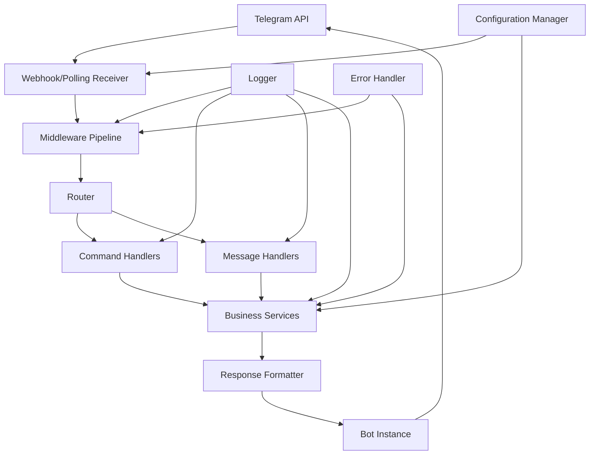

# Design Document - Core Bot Framework

## Overview

The Core Bot Framework establishes a modern, scalable Telegram bot architecture using Aiogram 3. The design emphasizes clean separation of concerns, extensibility, and maintainability through a layered architecture with clear boundaries between configuration, routing, handlers, and services. This foundation enables rapid development of bot features while maintaining code quality and system reliability.

## Steering Document Alignment

### Technical Standards
Since this is a new project, we are establishing the following technical standards:
- **Framework**: Aiogram 3 for Telegram bot implementation
- **Language**: Python 3.11+ with type hints throughout
- **Architecture**: Layered architecture with dependency injection
- **Configuration**: Environment-based configuration with validation
- **Logging**: Structured logging with contextual information
- **Error Handling**: Centralized error handling with graceful degradation

### Project Structure
The project will follow a domain-driven structure organized by functionality:
```
yabot/
├── src/
│   ├── core/           # Core framework components
│   ├── handlers/       # Message and command handlers
│   ├── services/       # Business logic services
│   ├── config/         # Configuration management
│   └── utils/          # Shared utilities
├── tests/              # Test suite
├── docs/               # Documentation
└── requirements.txt    # Dependencies
```

## Code Reuse Analysis

Since this is a new project, all components will be built from scratch with focus on:

### Framework Foundation
- **Aiogram 3**: Modern async/await based Telegram bot framework
- **Pydantic**: Data validation and settings management
- **Structlog**: Structured logging for better observability
- **Python-dotenv**: Environment variable management

### Design Patterns
- **Dependency Injection**: Clean separation and testability
- **Command Pattern**: Extensible command handling
- **Middleware Pattern**: Request/response processing pipeline
- **Observer Pattern**: Event-driven architecture for extensibility

## Architecture



## Components and Interfaces

### BotApplication
- **Purpose:** Main application orchestrator that initializes and coordinates all components
- **Interfaces:**
  - `start()`: Initialize bot and start receiving updates
  - `stop()`: Graceful shutdown with cleanup
  - `configure_webhook(url: str)`: Set up webhook mode
  - `configure_polling()`: Set up polling mode
- **Dependencies:** ConfigManager, Router, MiddlewareManager
- **Reuses:** None (new component)

### ConfigManager
- **Purpose:** Centralized configuration management with validation and environment support
- **Interfaces:**
  - `get_bot_token() -> str`: Retrieve validated bot token
  - `get_webhook_config() -> WebhookConfig`: Get webhook settings
  - `get_logging_config() -> LoggingConfig`: Get logging configuration
  - `validate_config() -> bool`: Validate all configuration parameters
- **Dependencies:** Environment variables, Pydantic models
- **Reuses:** None (new component)

### Router
- **Purpose:** Routes incoming messages to appropriate handlers based on message type and content
- **Interfaces:**
  - `register_command_handler(command: str, handler: Callable)`: Register command handlers
  - `register_message_handler(filter: Filter, handler: Callable)`: Register message handlers
  - `route_update(update: Update) -> Handler`: Find appropriate handler for update
- **Dependencies:** Handler registry, Message filters
- **Reuses:** None (new component)

### CommandHandler
- **Purpose:** Handles bot commands like /start and /menu with standardized response patterns
- **Interfaces:**
  - `handle_start(message: Message)`: Process /start command
  - `handle_menu(message: Message)`: Process /menu command
  - `handle_unknown(message: Message)`: Handle unrecognized commands
- **Dependencies:** ResponseFormatter, Logger
- **Reuses:** None (new component)

### MiddlewareManager
- **Purpose:** Manages request/response processing pipeline for cross-cutting concerns
- **Interfaces:**
  - `add_middleware(middleware: Middleware)`: Register middleware
  - `process_request(update: Update) -> Update`: Pre-process incoming updates
  - `process_response(response: Response) -> Response`: Post-process outgoing responses
- **Dependencies:** Middleware instances
- **Reuses:** None (new component)

### WebhookHandler
- **Purpose:** Handles webhook endpoint for receiving Telegram updates with security validation
- **Interfaces:**
  - `setup_webhook(url: str, certificate: Optional[str])`: Configure webhook
  - `validate_request(request: Request) -> bool`: Validate incoming webhook requests
  - `process_update(update: Update)`: Process received updates
- **Dependencies:** Security validator, Router
- **Reuses:** None (new component)

### ErrorHandler
- **Purpose:** Centralized error handling with user-friendly responses and comprehensive logging
- **Interfaces:**
  - `handle_error(error: Exception, context: Context)`: Process and respond to errors
  - `log_error(error: Exception, context: dict)`: Log error with context
  - `get_user_message(error: Exception) -> str`: Generate user-friendly error message
- **Dependencies:** Logger, ResponseFormatter
- **Reuses:** None (new component)

## Data Models

### BotConfig
```python
class BotConfig(BaseModel):
    bot_token: str
    webhook_url: Optional[str] = None
    webhook_secret: Optional[str] = None
    polling_enabled: bool = True
    max_connections: int = 100
    request_timeout: int = 30
```

### WebhookConfig
```python
class WebhookConfig(BaseModel):
    url: str
    secret_token: Optional[str] = None
    certificate: Optional[str] = None
    ip_address: Optional[str] = None
    max_connections: int = 40
    allowed_updates: List[str] = Field(default_factory=list)
```

### LoggingConfig
```python
class LoggingConfig(BaseModel):
    level: str = "INFO"
    format: str = "json"
    file_path: Optional[str] = None
    max_file_size: int = 10485760  # 10MB
    backup_count: int = 5
```

### CommandResponse
```python
class CommandResponse(BaseModel):
    text: str
    parse_mode: Optional[str] = "HTML"
    reply_markup: Optional[dict] = None
    disable_notification: bool = False
```

## Error Handling

### Error Scenarios

1. **Invalid Bot Token**
   - **Handling:** Log error, fail fast during initialization
   - **User Impact:** Bot fails to start with clear configuration error message

2. **Webhook Configuration Failure**
   - **Handling:** Log warning, fallback to polling mode automatically
   - **User Impact:** No impact, transparent fallback maintains functionality

3. **Message Processing Timeout**
   - **Handling:** Log timeout, send "processing" message to user, retry with backoff
   - **User Impact:** User sees processing indicator, eventually receives response or timeout message

4. **Network Connectivity Issues**
   - **Handling:** Implement exponential backoff, queue messages for retry
   - **User Impact:** Delayed responses, but eventual delivery guaranteed

5. **Unhandled Command or Message**
   - **Handling:** Route to default handler, log for analytics
   - **User Impact:** Helpful message explaining available commands

## Testing Strategy

### Unit Testing
- **Framework:** pytest with async support
- **Coverage:** All handlers, services, and utility functions
- **Mocking:** Telegram API calls, external dependencies
- **Key Components:** CommandHandler, Router, ConfigManager, ErrorHandler

### Integration Testing
- **Approach:** Test component interactions with test bot instance
- **Key Flows:**
  - Bot initialization and configuration
  - Command processing end-to-end
  - Webhook setup and message routing
  - Error handling and recovery

### End-to-End Testing
- **Approach:** Automated tests against test Telegram bot
- **User Scenarios:**
  - New user sends /start command
  - User navigates through /menu options
  - Error scenarios trigger appropriate responses
  - Webhook vs polling mode operations