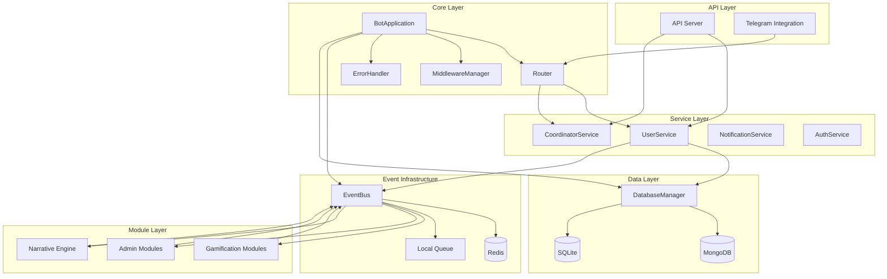

# conectar-todo - Task 12

Execute task 12 for the conectar-todo specification.

## Task Description
Connect achievement_system to event system in src/modules/gamification/achievement_system.py

## Code Reuse
**Leverage existing code**: existing achievement

## Requirements Reference
**Requirements**: 4.1, 4.5

## Usage
```
/Task:12-conectar-todo
```

## Instructions

Execute with @spec-task-executor agent the following task: "Connect achievement_system to event system in src/modules/gamification/achievement_system.py"

```
Use the @spec-task-executor agent to implement task 12: "Connect achievement_system to event system in src/modules/gamification/achievement_system.py" for the conectar-todo specification and include all the below context.

# Steering Context
## Steering Documents Context

No steering documents found or all are empty.

# Specification Context
## Specification Context (Pre-loaded): conectar-todo

### Requirements
# Requirements Document

## Introduction

This specification defines the requirements for connecting and integrating all services, modules, and components within the YABOT system. The goal is to establish robust communication channels, event-driven workflows, and service orchestration to create a unified, cohesive bot ecosystem where all components work harmoniously together.

Currently, the system has modular components that are partially isolated. This feature will create the "electrical wiring" of the bot, ensuring seamless data flow, event propagation, and service coordination across all layers from core infrastructure to user-facing features.

## Alignment with Product Vision

This feature supports the core architectural goals by:
- Establishing reliable service-to-service communication patterns
- Creating event-driven workflows that enable real-time responsiveness
- Ensuring data consistency across multiple databases and services
- Providing a solid foundation for all user-facing features (gamification, narratives, administration)
- Enabling scalable and maintainable system architecture

## Requirements

### Requirement 1: Core Services Orchestration

**User Story:** As a system administrator, I want all core services (application, router, middleware, error handler) to be properly orchestrated, so that command processing, event handling, and error management work reliably across the entire system.

#### Acceptance Criteria

1. WHEN the bot application starts THEN the system SHALL initialize core services in the correct dependency order (config → database → events → user service → handlers)
2. WHEN a command is received THEN the system SHALL route it through middleware pipeline and error handler before reaching the appropriate handler
3. WHEN an error occurs in any service THEN the error handler SHALL capture it, log contextual information, and provide graceful degradation
4. WHEN the router receives an update THEN the system SHALL process it through the complete middleware chain and return appropriate responses

### Requirement 2: User Service and Database Integration

**User Story:** As a developer, I want the user service to seamlessly interact with both MongoDB and SQLite databases, so that user profiles and states can be consistently managed across the dual-database architecture.

#### Acceptance Criteria

1. WHEN a new user registers THEN the system SHALL create records in both SQLite (profile) and MongoDB (state) databases atomically
2. WHEN user data is updated THEN the system SHALL maintain consistency between both databases and publish relevant events
3. WHEN database operations fail THEN the system SHALL implement proper rollback mechanisms and retry strategies
4. WHEN user context is requested THEN the system SHALL efficiently aggregate data from both databases
5. IF one database is unavailable THEN the system SHALL continue operating with degraded functionality and queue operations for later sync

### Requirement 3: Event Bus Integration

**User Story:** As a system architect, I want the event bus to connect all services and modules, so that actions in one component trigger appropriate responses in other components throughout the system.

#### Acceptance Criteria

1. WHEN a user claims a daily gift THEN the system SHALL publish an event that triggers wallet updates, achievement checks, and notification processing
2. WHEN events are published THEN the system SHALL deliver them to all registered subscribers with guaranteed delivery mechanisms
3. WHEN Redis is unavailable THEN the system SHALL queue events locally and process them when Redis reconnects
4. WHEN services start THEN the system SHALL automatically register their event subscriptions with the event bus
5. WHEN events fail to process THEN the system SHALL implement retry logic with exponential backoff and dead letter queues

### Requirement 4: Gamification Module Integration

**User Story:** As a user, I want gamification features (wallet, daily gifts, missions, store, achievements) to be fully integrated through the event system, so that my actions in one area automatically trigger appropriate updates and rewards across all other gamification modules.

#### Acceptance Criteria

1. WHEN a user completes a mission THEN the system SHALL update besitos wallet, check for achievements, and trigger relevant notifications
2. WHEN a user makes a store purchase THEN the system SHALL deduct besitos, update inventory, and publish transaction events
3. WHEN daily gifts are claimed THEN the system SHALL update wallet balance, mission progress, and achievement tracking
4. WHEN auction events occur THEN the system SHALL coordinate wallet transactions, inventory updates, and winner notifications
5. WHEN trivia is completed THEN the system SHALL award besitos, update achievements, and track progress across the gamification system

### Requirement 5: Narrative Engine Integration

**User Story:** As a content creator, I want the narrative engine to be fully integrated with user service and gamification modules, so that storytelling dynamically adapts based on real-time user progress and choices trigger coordinated updates across all connected systems.

#### Acceptance Criteria

1. WHEN narrative content is requested THEN the system SHALL access user missions, achievements, and choices to personalize the story
2. WHEN users make narrative choices THEN the system SHALL update story progression and trigger relevant gamification events
3. WHEN story milestones are reached THEN the system SHALL award appropriate rewards and update user achievement progress
4. WHEN narrative events occur THEN the system SHALL coordinate with mission manager to update quest progress
5. IF narrative service is unavailable THEN the system SHALL provide fallback content while maintaining user progress tracking

### Requirement 6: Administrative System Integration

**User Story:** As an administrator, I want administrative tools (notifications, access control, scheduling, message protection) to be fully integrated with the core system, so that I can manage the bot effectively while monitoring all connected services.

#### Acceptance Criteria

1. WHEN administrators send notifications THEN the system SHALL deliver them through the event bus to appropriate user segments
2. WHEN access control rules are updated THEN the system SHALL immediately enforce them across all services and modules
3. WHEN scheduled posts are triggered THEN the system SHALL coordinate with user service and gamification modules as needed
4. WHEN administrative actions occur THEN the system SHALL log them and publish audit events for monitoring
5. WHEN system health is checked THEN the administrative interface SHALL display status of all connected services and databases

### Requirement 7: API REST Integration

**User Story:** As an external developer, I want the REST API to provide unified access to all internal services, so that external systems can interact with user data, gamification features, and narrative content through a consistent interface.

#### Acceptance Criteria

1. WHEN API endpoints are called THEN the system SHALL coordinate responses using the same internal services that power the bot
2. WHEN API operations modify data THEN the system SHALL publish the same events that internal operations generate
3. WHEN API requests require user data THEN the system SHALL use the unified user service to aggregate information from both databases
4. WHEN external systems trigger gamification actions THEN the system SHALL process them through the same event-driven workflows as internal actions
5. IF internal services are degraded THEN the API SHALL return appropriate error responses with service status information

## Non-Functional Requirements

### Performance
- Service initialization SHALL complete within 10 seconds under normal conditions
- Event publishing SHALL have a latency of less than 100ms for local events and less than 500ms for Redis-based events
- Database operations SHALL maintain sub-200ms response times for user operations
- Cross-service communication SHALL not introduce more than 50ms of additional latency per service call
- Service-to-service API calls SHALL complete within 1 second for standard operations
- Event processing throughput SHALL handle at least 100 events per second during peak load

### Security
- All inter-service communication SHALL use authenticated channels
- Event payloads SHALL not contain sensitive user data in plain text
- Database connections SHALL use encrypted connections where supported
- API endpoints SHALL validate all requests through the unified authentication system

### Reliability
- The system SHALL handle individual service failures gracefully without complete system failure
- Event delivery SHALL implement at-least-once delivery guarantees
- Database operations SHALL include proper transaction management and rollback capabilities
- The system SHALL maintain 99.9% uptime for core user-facing operations
- WHEN services are restored after failure THEN the system SHALL automatically resume normal operations and process queued operations
- WHEN database connections are reestablished THEN the system SHALL execute queued transactions in correct order
- The system SHALL include health check endpoints for monitoring service connectivity status

### Usability
- Service health status SHALL be visible through administrative interfaces
- Error messages SHALL provide actionable information for debugging connection issues
- Event flow SHALL be traceable through logs for troubleshooting
- Integration points SHALL be clearly documented for future development

---

### Design
# Design Document

## Overview

This design establishes a comprehensive integration framework for the YABOT system, transforming the current modular architecture into a fully connected, event-driven ecosystem. The design creates the "electrical wiring" of the bot, enabling seamless communication between core services, gamification modules, administrative tools, narrative engines, and external APIs.

The integration follows a layered approach: Core Infrastructure → Service Integration → Module Orchestration → API Unification, ensuring each layer builds upon the previous one with clear separation of concerns and robust error handling.

## Steering Document Alignment

### Technical Standards (tech.md)
While no explicit tech.md was found, the design adheres to the established patterns in the codebase:
- **Event-driven architecture** using Redis Pub/Sub with local fallback
- **Dual-database strategy** maintaining MongoDB for dynamic state and SQLite for persistent data
- **Dependency injection** patterns for service orchestration
- **Resilient design** with graceful degradation and retry mechanisms
- **FastAPI** for REST API implementation following existing patterns

### Project Structure (structure.md)
The design follows the existing project organization:
- **src/core/** - Core infrastructure components
- **src/services/** - Business logic and orchestration services
- **src/modules/** - Feature-specific modules (gamification, admin, narrative)
- **src/api/** - External interface layer
- **src/events/** - Event-driven communication
- **src/database/** - Data persistence layer

## Code Reuse Analysis

### Existing Components to Leverage

- **ConfigManager**: Centralized configuration management for service connections
- **DatabaseManager**: Multi-database connection handling with health checks
- **EventBus**: Redis Pub/Sub infrastructure with local fallback and retry mechanisms
- **UserService**: Foundation for user state management across databases
- **ErrorHandler**: Consistent error handling with contextual logging
- **MiddlewareManager**: Request/response processing pipeline
- **Router**: Event and command routing infrastructure

### Integration Points

- **BotApplication**: Central orchestrator will be enhanced to manage service lifecycle
- **API Server**: FastAPI endpoints will be unified with internal service calls
- **Existing Modules**: Gamification, admin, and narrative modules will be connected through event subscriptions
- **Database Schemas**: Existing MongoDB and SQLite schemas will be leveraged for cross-module data sharing

## Architecture

The integration architecture follows a hub-and-spoke pattern with the EventBus as the central communication hub, allowing services to communicate asynchronously while maintaining loose coupling.



## Components and Interfaces

### ServiceRegistry
- **Purpose:** Centralizes service discovery and lifecycle management
- **Interfaces:**
  - `register_service(name, instance, dependencies)`
  - `get_service(name)`
  - `health_check_all()`
- **Dependencies:** ConfigManager
- **Reuses:** Extends existing service initialization patterns in BotApplication

### IntegrationManager
- **Purpose:** Orchestrates cross-service operations and event workflows
- **Interfaces:**
  - `coordinate_workflow(workflow_name, context)`
  - `register_workflow(workflow_definition)`
  - `handle_service_failure(service_name, error)`
- **Dependencies:** EventBus, ServiceRegistry
- **Reuses:** Built on existing CoordinatorService foundation

### EventSubscriptionManager
- **Purpose:** Manages event subscriptions and delivery across modules
- **Interfaces:**
  - `subscribe(event_type, handler, service_name)`
  - `unsubscribe(event_type, service_name)`
  - `publish_with_retry(event_type, payload)`
- **Dependencies:** EventBus
- **Reuses:** Extends existing EventBus publish/subscribe mechanisms

### ConnectionHealthMonitor
- **Purpose:** Monitors service connectivity and triggers recovery procedures
- **Interfaces:**
  - `monitor_service(service_name)`
  - `get_health_status()`
  - `trigger_recovery(failed_services)`
  - `get_performance_metrics()`
  - `check_circuit_breaker_status(service_name)`
- **Dependencies:** ServiceRegistry, DatabaseManager, EventBus
- **Reuses:** Leverages existing database health check patterns
- **Performance Targets:** Monitor < 100ms event latency, 99.9% uptime metrics

### GamificationIntegrator
- **Purpose:** Coordinates gamification module interactions through events
- **Interfaces:**
  - `process_wallet_transaction(user_id, amount, reason)`
  - `update_mission_progress(user_id, mission_id, progress)`
  - `trigger_achievement_check(user_id, action_type)`
- **Dependencies:** UserService, EventBus
- **Reuses:** Integrates existing gamification modules (besitos_wallet, daily_gift, mission_manager)

### NarrativeIntegrator
- **Purpose:** Connects narrative engine with user state and gamification data
- **Interfaces:**
  - `generate_personalized_content(user_id, context)`
  - `process_narrative_choice(user_id, choice_data)`
  - `update_story_progress(user_id, progress_data)`
- **Dependencies:** UserService, GamificationIntegrator, EventBus
- **Reuses:** Builds on existing narrative module foundation

## Data Models

### ServiceStatus
```python
class ServiceStatus:
    name: str
    status: Literal["healthy", "degraded", "failed"]
    last_check: datetime
    error_count: int
    dependencies: List[str]
    metadata: Dict[str, Any]
```

### IntegrationEvent
```python
class IntegrationEvent:
    event_id: str
    event_type: str
    source_service: str
    target_services: List[str]
    payload: Dict[str, Any]
    timestamp: datetime
    retry_count: int = 0
    correlation_id: Optional[str] = None
```

### WorkflowDefinition
```python
class WorkflowDefinition:
    name: str
    steps: List[WorkflowStep]
    timeout: int
    retry_policy: RetryPolicy
    error_handling: ErrorHandlingStrategy
```

### ServiceDependency
```python
class ServiceDependency:
    service_name: str
    depends_on: List[str]
    startup_order: int
    critical: bool = True
    fallback_strategy: Optional[str] = None
```

## Error Handling

### Error Scenarios

1. **Service Initialization Failure**
   - **Handling:** Log error, mark service as failed, continue with non-critical services
   - **User Impact:** Graceful degradation, specific features may be unavailable

2. **Database Connection Loss**
   - **Handling:** Queue operations locally, retry connection with exponential backoff
   - **User Impact:** Temporary delays, automatic recovery when connection restored

3. **Event Bus Disconnection**
   - **Handling:** Fall back to local event queue, attempt Redis reconnection
   - **User Impact:** Local events continue, cross-service coordination paused

4. **Module Subscription Failure**
   - **Handling:** Log subscription error, attempt re-registration, notify admin
   - **User Impact:** Specific module features affected, core functionality preserved

5. **Cross-Service Communication Timeout**
   - **Handling:** Implement circuit breaker pattern (5 failures in 30s triggers open state, 60s timeout), provide cached responses
   - **User Impact:** Fallback responses, degraded but functional experience
   - **Recovery:** Automatic half-open state testing every 60 seconds, full recovery after 3 successful calls

## Testing Strategy

### Unit Testing
- Test individual service registration and discovery
- Validate event subscription and publication mechanisms
- Test error handling and recovery procedures
- Mock external dependencies for isolated testing

### Integration Testing
- Test complete service startup sequence
- Validate cross-service communication flows
- Test database consistency across MongoDB and SQLite
- Verify event propagation across all modules
- Load testing: Validate 100 events/second throughput capacity
- Performance testing: Confirm < 100ms local event latency, < 500ms Redis event latency

### End-to-End Testing
- Test complete user workflows (registration, gamification actions, narrative interactions)
- Validate admin operations affect all connected services
- Test API endpoints produce same results as internal operations
- Verify system recovery after various failure scenarios

## Implementation Phases

### Phase 1: Core Infrastructure Integration
- Enhance BotApplication with ServiceRegistry
- Implement IntegrationManager for service coordination
- Extend EventBus with improved subscription management
- Add comprehensive health monitoring

### Phase 2: Service Layer Integration
- Connect UserService with all gamification modules
- Implement CoordinatorService for complex workflows
- Add authentication and authorization integration
- Establish consistent error handling across services

### Phase 3: Module Integration
- Connect gamification modules through event workflows
- Integrate narrative engine with user state data
- Implement admin module coordination
- Add cross-module data consistency mechanisms

### Phase 4: API Unification
- Unify REST API endpoints with internal services
- Implement API-level event publishing
- Add external system integration hooks
- Complete monitoring and observability features

**Note**: Specification documents have been pre-loaded. Do not use get-content to fetch them again.

## Task Details
- Task ID: 12
- Description: Connect achievement_system to event system in src/modules/gamification/achievement_system.py
- Leverage: existing achievement
- Requirements: 4.1, 4.5

## Instructions
- Implement ONLY task 12: "Connect achievement_system to event system in src/modules/gamification/achievement_system.py"
- Follow all project conventions and leverage existing code
- Mark the task as complete using: claude-code-spec-workflow get-tasks conectar-todo 12 --mode complete
- Provide a completion summary
```

## Task Completion
When the task is complete, mark it as done:
```bash
claude-code-spec-workflow get-tasks conectar-todo 12 --mode complete
```

## Next Steps
After task completion, you can:
- Execute the next task using /conectar-todo-task-[next-id]
- Check overall progress with /spec-status conectar-todo
