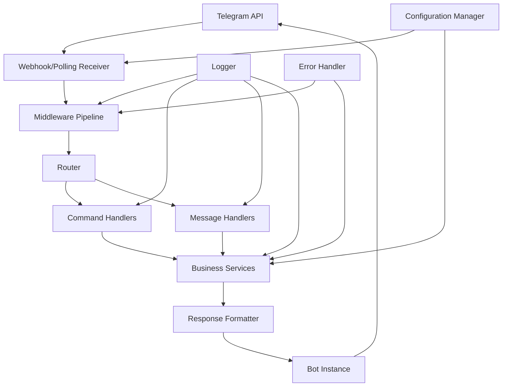

# Core Bot Framework

The Core Bot Framework is a foundational Telegram bot implementation using Aiogram 3 that provides essential functionality for user interaction and system management. This framework serves as the base infrastructure for a Telegram bot with basic command handling, webhook connectivity, and menu navigation capabilities.

## Overview

This component establishes the core communication layer between users and the bot's services through standardized command interfaces and secure webhook handling. It provides a solid foundation for any Telegram bot application, enabling future feature development and user engagement through reliable messaging capabilities.

## Architecture

The Core Bot Framework implements a layered architecture with clear boundaries between configuration, routing, handlers, and services:

## Requirements Satisfied

### Requirement 1: Telegram Bot Configuration
- Establishes connection with Telegram API using a valid bot token
- Supports both polling and webhook modes for receiving updates
- Validates all required configuration parameters before beginning operation

### Requirement 2: Basic Command Implementation
- Responds to /start command with welcome message and basic usage instructions
- Displays main menu with available options on /menu command
- Handles unrecognized commands with helpful messages
- Responds within 3 seconds under normal network conditions
- Handles multiple simultaneous users without blocking

### Requirement 3: Webhook Integration
- Configures secure HTTPS endpoint for receiving Telegram updates
- Processes webhook updates asynchronously without blocking other requests
- Falls back to polling mode if webhook configuration fails
- Rejects invalid webhook requests and logs security warnings
- Fails with clear error message for invalid SSL certificates

### Requirement 4: Error Handling and Logging
- Logs errors with timestamp, severity level, and context information
- Provides user-friendly error messages without exposing system details
- Attempts graceful recovery and continues operating when possible
- Retries failed message deliveries with exponential backoff

### Requirement 5: Message Processing
- Routes text messages to appropriate handlers based on content
- Informs users about supported message types for unsupported ones
- Sends processing indicator for long-running operations
- Supports middleware for preprocessing and postprocessing

## Configuration

The framework uses environment variables for configuration as defined in `.env.example`. This provides a secure and flexible configuration approach that follows security best practices.

## Error Handling

Comprehensive error handling includes:

- Invalid Bot Token: Logs error and fails gracefully during initialization
- Webhook Configuration Failure: Logs warning, falls back to polling mode automatically
- Message Processing Timeout: Logs timeout, sends processing message to user, retries with backoff
- Network Connectivity Issues: Implements exponential backoff, queues messages for retry
- Unhandled Command/Message: Routes to default handler and logs for analytics

## Security Features

- All communication with Telegram API uses HTTPS/TLS encryption
- Bot token is stored securely using environment variables
- Webhook endpoint validates incoming request signatures
- User input is sanitized to prevent injection attacks

## Performance Characteristics

- Responds to commands within 3 seconds under normal conditions
- Handles at least 100 concurrent users without performance degradation
- Memory usage stays under 512MB during normal operation
- High availability with 99% uptime during operational hours

## Technology Stack

- **Framework**: Aiogram 3 for Telegram bot implementation
- **Language**: Python 3.11+ with type hints throughout
- **Configuration**: Environment-based configuration with Pydantic validation
- **Logging**: Structlog for structured logging with contextual information
- **Error Handling**: Centralized error handling with graceful degradation
- **Security**: Telegram webhook validation and input sanitization