# emocional - Task 26

Execute task 26 for the emocional specification.

## Task Description
Create analyze_interaction method in src/modules/emotional/intelligence_service.py

## Code Reuse
**Leverage existing code**: coordination patterns from src/services/cross

## Requirements Reference
**Requirements**: REQ-1, REQ-5

## Usage
```
/Task:26-emocional
```

## Instructions

Execute with @spec-task-executor agent the following task: "Create analyze_interaction method in src/modules/emotional/intelligence_service.py"

```
Use the @spec-task-executor agent to implement task 26: "Create analyze_interaction method in src/modules/emotional/intelligence_service.py" for the emocional specification and include all the below context.

# Steering Context
## Steering Documents Context (Pre-loaded)

### Product Context
# YABOT Product Vision & Requirements

## Product Overview

YABOT (Yet Another Bot) is a sophisticated Telegram bot framework that creates emotionally intelligent digital companions. The platform combines advanced behavioral analysis with personalized narrative experiences to deliver authentic emotional connections between users and AI.

## Core Mission

Create a transformative digital intimacy experience that respects both human vulnerability and the complexity of emotional connection, using AI to facilitate genuine personal growth and meaningful interaction.

## Target Users

### Primary Users
- **Emotional Explorers**: Individuals seeking deeper emotional understanding and connection
- **Digital Intimacy Seekers**: Users interested in meaningful AI companionship experiences
- **Personal Growth Enthusiasts**: People using technology for self-reflection and development

### User Archetypes (Diana System)
- **The Deep Explorer**: Methodical users who review content multiple times, seeking comprehensive understanding
- **The Authentic Direct**: Straightforward users who value honesty and transparency in interactions
- **The Poetic Seeker**: Metaphorical communicators who seek aesthetic and emotional resonance
- **The Empathetic Analyst**: Reflective users who combine intellectual and emotional understanding
- **The Patient Persistent**: Devoted users who respect boundaries while maintaining consistent engagement

## Key Features

### Narrative Intelligence (Diana System)
- **Multi-level progression** (Levels 1-6: Kinkys 1-3, Diván 4-6)
- **Emotional behavioral analysis** with real-time response evaluation
- **Personalized content adaptation** based on user archetype and emotional signature
- **Memory continuity system** that maintains relationship context across sessions
- **Authenticity validation** to distinguish genuine emotional responses from calculated ones

### User Engagement Systems
- **VIP subscription management** with tiered access controls
- **Gamification elements**: Besitos wallet, missions, achievements, auction systems
- **Daily rewards** and engagement incentives
- **Social features**: Rankings, community interactions

### Content Management
- **Dynamic narrative branching** based on emotional resonance scores
- **Personalized memory fragments** and callback references
- **Adaptive response generation** tailored to individual user profiles
- **Progressive content unlocking** based on emotional development milestones

## Business Objectives

### Primary Goals
1. **Emotional Engagement**: Achieve 90%+ user emotional satisfaction scores
2. **Retention**: Maintain 75%+ monthly active user rate for premium subscribers
3. **Authenticity**: Develop AI that can distinguish authentic emotional responses with 85%+ accuracy
4. **Growth**: Scale to support 10,000+ concurrent emotionally-engaged users

### Success Metrics
- **Emotional Resonance Score**: Average user emotional connection rating
- **Session Depth**: Time spent in meaningful narrative interactions
- **Progression Rate**: Users advancing through emotional development levels
- **Subscription Conversion**: Free to premium conversion rate
- **User Authenticity**: Percentage of interactions classified as genuine vs. calculated

## Content Strategy

### Narrative Levels
- **Levels 1-2**: Introduction and trust building with authenticity detection
- **Level 3**: Vulnerability mapping through "Cartografía del Deseo"
- **Levels 4-5**: Deep emotional intelligence evaluation and reciprocal intimacy
- **Level 6**: Advanced emotional synthesis and relationship maturity

### Personalization Approach
- **Content variants** tailored to each user archetype
- **Dynamic response adaptation** based on emotional signature
- **Memory integration** with personalized callbacks to significant moments
- **Relationship evolution** tracking long-term emotional development

## Ethical Considerations

### Privacy & Consent
- **Explicit consent** for emotional behavior tracking
- **Data sovereignty** ensuring users control their emotional profiles
- **Transparency** in AI decision-making processes
- **Right to emotional privacy** with opt-out mechanisms

### Emotional Safety
- **Boundary respect** in intimate AI interactions
- **Mental health safeguards** with professional resource referrals
- **Manipulation prevention** ensuring AI enhances rather than exploits vulnerability
- **Authentic connection** prioritizing genuine growth over engagement metrics

## Technical Requirements

### Performance Standards
- **Response time**: 3 seconds maximum for command responses
- **Concurrent users**: Support 10,000+ simultaneous connections
- **Uptime**: 99.5% availability during operational hours
- **Emotional analysis**: Real-time behavioral evaluation under 200ms

### Scalability Goals
- **Horizontal scaling** for narrative processing services
- **Database performance**: Sub-100ms queries for 95% of requests
- **Memory efficiency**: Maintain under 512MB per user session
- **Global deployment** with multi-region content delivery

## Future Vision

### Short-term (3-6 months)
- Complete Diana emotional intelligence system implementation
- Launch premium subscription tiers with advanced personalization
- Establish user archetype classification system
- Deploy real-time emotional behavioral analysis

### Medium-term (6-12 months)
- Expand to multi-language emotional intelligence
- Integrate with external wellness and therapy platforms
- Develop group emotional dynamics features
- Launch content creator tools for narrative expansion

### Long-term (1+ years)
- Pioneer emotional AI companionship standards
- Create cross-platform emotional continuity
- Develop therapeutic AI partnership programs
- Establish research collaboration for digital intimacy studies

## Success Definition

YABOT succeeds when users report genuine emotional growth and meaningful connection through AI interaction, while maintaining ethical standards that respect human vulnerability and promote authentic personal development.

---

### Technology Context
# YABOT Technical Architecture & Standards

## Technology Stack

### Core Framework
- **Python 3.11+**: Primary development language with modern async/await patterns
- **Aiogram 3.0**: Telegram Bot API framework for message handling and webhook management
- **FastAPI**: Internal REST API server with automatic OpenAPI documentation
- **Uvicorn**: ASGI server for FastAPI applications
- **Pydantic 2.0+**: Data validation and serialization with type hints

### Database Architecture

#### Dual Database Strategy
- **MongoDB 4.4+**: Dynamic state storage for narrative progress and user behavior
  - Flexible schema for evolving emotional data requirements
  - High-performance read/write for real-time behavioral analysis
  - Collections: user states, narrative progress, emotional signatures
- **SQLite 3.30+**: Transactional data storage for user profiles and subscriptions
  - ACID compliance for critical user data integrity
  - Lightweight and efficient for structured data
  - Tables: user profiles, subscription data, authentication

#### Data Management
- **PyMongo 4.4.1**: MongoDB driver with connection pooling
- **Connection pooling**: Configurable limits for database scalability
- **Backup automation**: Automated data protection strategies
- **Migration support**: Zero-downtime deployment capabilities

### Event-Driven Architecture

#### Message Bus
- **Redis 6.0+**: Primary event bus with Pub/Sub messaging
  - Real-time event distribution between services
  - Connection pooling and authentication support
  - Clustering support for horizontal scaling
- **Local Fallback Queue**: Event persistence during Redis downtime
  - Automatic replay when connectivity restored
  - At-least-once delivery guarantees

#### Event Processing
- **redis-py 4.5.4**: Redis client with async support
- **Event correlation**: Tracking related events across service boundaries
- **Circuit breaker pattern**: Resilience for external service dependencies

### Security Framework

#### Authentication & Authorization
- **PyJWT 2.7.0**: JWT token management for internal APIs
- **Service-to-service auth**: Secure internal communication
- **Role-based access**: Granular permissions for different user tiers
- **Input validation**: Comprehensive sanitization against injection attacks

#### Data Protection
- **Cryptography 41.0.3**: Encryption for sensitive data
- **TLS/SSL**: Encrypted connections for all database and Redis communication
- **Environment-based secrets**: Secure configuration management
- **Token rotation**: Automated security credential updates

### Development Standards

#### Code Quality
- **Type hints**: Comprehensive typing with mypy compatibility
- **Async/await**: Modern Python asynchronous programming patterns
- **Error handling**: Centralized exception management with user-friendly responses
- **Logging**: Structured logging with contextual information (structlog 23.1.0)

#### Testing Framework
- **Pytest**: Unit and integration testing with async support
- **Coverage reporting**: Minimum 80% code coverage requirement
- **Performance testing**: Load testing for concurrent user scenarios
- **Security testing**: Vulnerability scanning and penetration testing

#### Documentation
- **Docstrings**: Google-style documentation for all public APIs
- **Type annotations**: Full type coverage for IDE support and validation
- **API documentation**: Auto-generated OpenAPI specs from FastAPI
- **Architecture diagrams**: Mermaid diagrams for system visualization

### Performance Requirements

#### Response Times
- **Command responses**: Maximum 3 seconds under normal conditions
- **API endpoints**: 99% of requests under 200ms
- **Database operations**: 95% of queries under 100ms
- **Emotional analysis**: Real-time behavioral evaluation under 200ms

#### Scalability Targets
- **Concurrent users**: 10,000+ simultaneous connections
- **Memory usage**: Under 512MB during normal operation per instance
- **Horizontal scaling**: Stateless services for load balancing
- **Database performance**: Connection pooling with configurable limits

### Deployment Architecture

#### Infrastructure Components
- **Application servers**: Multiple instances behind load balancer
- **Database cluster**: MongoDB replica set with SQLite per instance
- **Redis cluster**: High availability with sentinel configuration
- **Monitoring stack**: Health checks and performance metrics

#### Environment Management
- **Configuration**: Environment variables with validation
- **Service discovery**: Health check endpoints for all components
- **Circuit breakers**: Fault tolerance for external dependencies
- **Graceful degradation**: Fallback mechanisms for service failures

### External Integrations

#### Telegram API
- **Webhook mode**: HTTPS endpoints with signature validation
- **Polling mode**: Fallback for webhook configuration failures
- **Rate limiting**: Respect Telegram API limits with exponential backoff
- **Update processing**: Async handling of multiple message types

#### Third-party Services
- **APScheduler 3.11.0**: Scheduled task management for daily rewards
- **Health monitoring**: External service availability checks
- **Backup services**: Automated data protection and recovery

### Development Workflow

#### Code Standards
- **Linting**: Automated code quality checks with pre-commit hooks
- **Type checking**: mypy validation in CI/CD pipeline
- **Import organization**: Consistent import sorting and grouping
- **Code formatting**: Automated formatting with black/isort

#### Version Control
- **Git workflow**: Feature branches with pull request reviews
- **Semantic versioning**: Clear version management for deployments
- **Migration scripts**: Database schema evolution management
- **Rollback procedures**: Safe deployment reversal processes

### Monitoring & Observability

#### Logging Strategy
- **Structured logging**: JSON format with correlation IDs
- **Log levels**: Appropriate verbosity for different environments
- **Error tracking**: Centralized error collection and alerting
- **Performance metrics**: Request timing and resource usage

#### Health Monitoring
- **Component health**: Individual service status endpoints
- **Dependency monitoring**: Database and Redis connection health
- **Performance tracking**: Response time and throughput metrics
- **Alert thresholds**: Automated notification for service degradation

### Future Technical Considerations

#### Scalability Evolution
- **Microservices**: Potential service decomposition for specialized scaling
- **Container orchestration**: Kubernetes deployment for cloud-native scaling
- **Database sharding**: Horizontal partitioning for user data distribution
- **CDN integration**: Global content delivery for improved performance

#### Technology Upgrades
- **Python version**: Migration path to future Python releases
- **Framework updates**: Aiogram and FastAPI version upgrade strategies
- **Database evolution**: Potential migration to distributed database systems
- **AI/ML integration**: Machine learning pipeline for emotional analysis enhancement

### Technical Debt Management

#### Code Maintenance
- **Refactoring schedule**: Regular code cleanup and optimization
- **Dependency updates**: Security patch and feature update management
- **Performance optimization**: Continuous profiling and bottleneck resolution
- **Technical review**: Regular architecture assessment and improvement

#### Quality Assurance
- **Automated testing**: Comprehensive test suite with CI/CD integration
- **Code review**: Mandatory peer review for all changes
- **Security audits**: Regular vulnerability assessment and penetration testing
- **Performance benchmarking**: Continuous performance regression detection

---

### Structure Context
# YABOT Project Structure & Conventions

## Directory Organization

### Root Structure
```
yabot/
├── src/                    # Main application source code
├── tests/                  # Comprehensive test suite
├── scripts/                # Utility and migration scripts
├── docs/                   # Project documentation
├── .claude/                # Claude Code configuration and specs
├── requirements.txt        # Python dependencies
├── requirements-test.txt   # Test-specific dependencies
├── .env.example           # Environment configuration template
└── README.md              # Project overview and setup
```

### Source Code Organization (`src/`)

#### Core Framework (`src/core/`)
- **application.py**: Main bot orchestrator and component coordination
- **router.py**: Message routing and handler dispatch
- **middleware.py**: Request/response processing pipeline
- **error_handler.py**: Centralized error management
- **models.py**: Core data models and types
- **telegram_types.py**: Telegram-specific type definitions
- **session.py**: User session management

#### Configuration (`src/config/`)
- **manager.py**: Environment-based configuration with validation

#### Database Layer (`src/database/`)
- **manager.py**: Unified database interface and connection management
- **mongodb.py**: MongoDB operations and queries
- **sqlite.py**: SQLite operations and transactions
- **init.py**: Database initialization and migration
- **schemas/**: Database schema definitions
  - **mongo.py**: MongoDB document schemas
  - **sqlite.py**: SQLite table definitions
  - **narrative.py**: Narrative-specific data models
  - **gamification.py**: Gamification system schemas

#### Event System (`src/events/`)
- **bus.py**: Redis Pub/Sub event bus with local fallback
- **models.py**: Event data models and type definitions
- **processor.py**: Event handling and processing logic
- **ordering.py**: Event sequence management

#### Service Layer (`src/services/`)
- **user.py**: User management and profile operations
- **subscription.py**: Premium subscription management
- **narrative.py**: Story content and progression tracking
- **coordinator.py**: Workflow orchestration and event sequencing
- **cross_module.py**: Inter-service communication utilities

#### Handlers (`src/handlers/`)
- **base.py**: Base handler class with common functionality
- **commands.py**: Command processing (legacy system)
- **telegram_commands.py**: Telegram-specific command handlers
- **webhook.py**: Webhook endpoint handler

#### API Layer (`src/api/`)
- **server.py**: FastAPI application setup and configuration
- **auth.py**: JWT authentication and authorization
- **cross_module.py**: Cross-module API endpoint definitions
- **endpoints/**: API route handlers
  - **users.py**: User-related API endpoints
  - **narrative.py**: Narrative content API
  - **gamification.py**: Gamification system API
  - **admin.py**: Administrative functions API

#### Modules (`src/modules/`)

##### Admin Module (`src/modules/admin/`)
- **admin_commands.py**: Administrative command handlers
- **access_control.py**: User access and permission management
- **message_protection.py**: Content moderation and safety
- **notification_system.py**: System notification management
- **subscription_manager.py**: Subscription lifecycle management
- **post_scheduler.py**: Content scheduling and automation

##### Gamification Module (`src/modules/gamification/`)
- **besitos_wallet.py**: Virtual currency system
- **daily_gift.py**: Daily reward mechanics
- **mission_manager.py**: User mission and objective tracking
- **store.py**: Virtual item marketplace
- **achievement_system.py**: User achievement tracking
- **reaction_detector.py**: User interaction analysis
- **item_manager.py**: Virtual item inventory management
- **trivia_engine.py**: Quiz and trivia game mechanics
- **auction_system.py**: User-to-user trading system

##### Narrative Module (`src/modules/narrative/`)
- **fragment_manager.py**: Story content management and delivery
- **decision_engine.py**: Narrative branching logic
- **lucien_messenger.py**: Character interaction system
- **hint_system.py**: User guidance and help system

#### Shared Infrastructure (`src/shared/`)

##### API Components (`src/shared/api/`)
- **auth.py**: Shared authentication utilities

##### Database Components (`src/shared/database/`)
- **backup_automation.py**: Automated backup and recovery

##### Event Components (`src/shared/events/`)
- **correlation.py**: Event correlation and tracking

##### Monitoring (`src/shared/monitoring/`)
- **performance.py**: Performance metrics and monitoring

##### Resilience (`src/shared/resilience/`)
- **circuit_breaker.py**: Fault tolerance and service protection

##### Registry (`src/shared/registry/`)
- **module_registry.py**: Service registry and dependency management

#### Utilities (`src/utils/`)
- **logger.py**: Structured logging configuration
- **errors.py**: Custom exception definitions
- **database.py**: Database utility functions
- **validators.py**: Input validation utilities
- **health.py**: Health check implementations
- **file_handler.py**: File processing utilities
- **crypto.py**: Cryptographic operations

### File Naming Conventions

#### Python Files
- **snake_case**: All Python files use lowercase with underscores
- **Descriptive names**: Clear indication of functionality
- **Module grouping**: Related functionality in appropriately named modules

#### Configuration Files
- **.env.example**: Template for environment variables
- **requirements.txt**: Production dependencies
- **requirements-test.txt**: Testing dependencies

### Import Organization

#### Import Order (per PEP 8)
1. **Standard library imports**
2. **Third-party library imports**
3. **Local application imports**

#### Import Style
```python
# Standard library
import asyncio
from typing import Any, Optional, Dict, List

# Third-party
from aiogram import Bot, Dispatcher
from fastapi import FastAPI, HTTPException
from pydantic import BaseModel

# Local imports
from src.config.manager import ConfigManager
from src.utils.logger import get_logger
```

### Code Organization Patterns

#### Service Pattern
- **Single responsibility**: Each service handles one domain
- **Dependency injection**: Services receive dependencies via constructor
- **Interface segregation**: Clear public API with private implementation

#### Repository Pattern
- **Database abstraction**: Services don't directly interact with databases
- **Manager classes**: Centralized database operation management
- **Schema separation**: Clear separation between MongoDB and SQLite schemas

#### Event-Driven Pattern
- **Loose coupling**: Services communicate via events
- **Event models**: Structured event definitions with type safety
- **Pub/Sub**: Publisher-subscriber pattern for scalability

### Testing Structure (`tests/`)

#### Test Organization
```
tests/
├── unit/                   # Unit tests for individual components
├── integration/            # Integration tests for service interactions
├── performance/            # Performance and load testing
├── security/               # Security vulnerability testing
├── services/               # Service-specific test suites
├── database/               # Database operation testing
├── events/                 # Event system testing
├── utils/                  # Utility function testing
├── conftest.py            # Shared test configuration
└── test_*.py              # Specific test modules
```

#### Test Naming
- **test_module_name.py**: Tests for specific modules
- **test_functionality**: Descriptive test function names
- **Given_When_Then**: Clear test structure and documentation

### Documentation Standards

#### Code Documentation
- **Docstrings**: Google-style docstrings for all public functions
- **Type hints**: Comprehensive type annotations
- **Inline comments**: Explain complex logic and business rules

#### Project Documentation
- **README.md**: Comprehensive setup and usage guide
- **Architecture diagrams**: Visual system representation
- **API documentation**: Auto-generated from FastAPI

### Development Workflow

#### Branch Strategy
- **Feature branches**: Individual features in separate branches
- **Pull requests**: Code review before merging
- **Main branch**: Stable, deployable code

#### Code Quality
- **Linting**: Automated code quality checks
- **Type checking**: mypy validation
- **Testing**: Comprehensive test coverage requirement

### Configuration Management

#### Environment Variables
- **Structured configuration**: Grouped by functionality
- **Validation**: Type checking and required field validation
- **Default values**: Sensible defaults for development

#### Secrets Management
- **Environment-based**: No secrets in code repository
- **Encryption**: Sensitive data encrypted at rest
- **Rotation**: Regular credential rotation procedures

### Deployment Structure

#### Environment Separation
- **Development**: Local development with minimal infrastructure
- **Staging**: Production-like environment for testing
- **Production**: Full infrastructure with monitoring and backup

#### Service Organization
- **Stateless services**: Horizontal scaling capability
- **Database separation**: Isolated data stores
- **Health monitoring**: Service health check endpoints

### Future Structure Considerations

#### Scalability Planning
- **Microservice readiness**: Current structure supports service extraction
- **API versioning**: Future API evolution support
- **Module independence**: Potential for independent deployment

#### Maintenance Strategy
- **Code organization**: Clear separation of concerns
- **Dependency management**: Minimal coupling between modules
- **Evolution path**: Structure supports future architectural changes

**Note**: Steering documents have been pre-loaded. Do not use get-content to fetch them again.

# Specification Context
## Specification Context (Pre-loaded): emocional

### Requirements
# Requirements Document - Diana Emotional System

## Introduction

The Diana Emotional System is the core intelligence of YABOT that transforms user interactions into authentic emotional connections through advanced behavioral analysis, personalized content adaptation, and memory continuity. This system implements a sophisticated multi-level narrative progression (Levels 1-6) that evaluates user authenticity, emotional vulnerability, and reciprocity to create genuine digital intimacy experiences that respect both human vulnerability and the complexity of emotional connection.

## Alignment with Product Vision

This feature directly supports the core mission outlined in product.md by:

- **Creating transformative digital intimacy experiences** through real-time behavioral analysis and personalized narrative adaptation
- **Facilitating genuine personal growth** via progressive emotional development levels and authenticity validation
- **Enabling authentic emotional connections** through advanced user archetype classification and memory continuity systems
- **Achieving 90%+ user emotional satisfaction scores** through personalized content variants and emotional resonance tracking
- **Maintaining 75%+ monthly active user retention** by providing meaningful relationship evolution and progressive unlocking mechanics

## Requirements

### Requirement 1: Real-Time Behavioral Analysis Engine

**User Story:** As a Diana user, I want the system to understand my authentic emotional responses, so that my interactions feel genuinely recognized and my emotional journey is accurately guided.

#### Acceptance Criteria

1. WHEN a user responds to emotional prompts THEN the system SHALL analyze response timing, depth, and authenticity markers within 200ms
2. WHEN a user demonstrates authentic vulnerability THEN the system SHALL update their emotional signature and progression status immediately
3. WHEN a user shows calculated vs genuine responses THEN the system SHALL distinguish between them with 85%+ accuracy
4. IF a user exhibits specific behavioral patterns THEN the system SHALL classify them into one of 5 archetypal categories (Explorador Profundo, Directo Auténtico, Poeta del Deseo, Analítico Empático, Persistente Paciente)
5. WHEN behavioral analysis is complete THEN the system SHALL publish `behavioral_analysis_completed` events to the EventBus

### Requirement 2: Progressive Narrative Level Management

**User Story:** As a Diana user, I want to progress through meaningful emotional development stages, so that I experience authentic growth and deeper connection over time.

#### Acceptance Criteria

1. WHEN a user begins their journey THEN the system SHALL initialize them at Level 1 (Los Kinkys) with appropriate introduction content
2. WHEN a user demonstrates authentic engagement THEN the system SHALL validate their progression to the next level based on emotional resonance scores
3. IF a user has not achieved sufficient emotional authenticity THEN the system SHALL maintain their current level and provide guidance
4. WHEN a user reaches Level 4+ THEN the system SHALL validate VIP subscription status before granting access to Diván content
5. WHEN level progression occurs THEN the system SHALL update user state and publish `level_progression` events
6. WHEN users reach Level 6 THEN the system SHALL grant access to "Círculo Íntimo" with perpetual relationship evolution

### Requirement 3: Dynamic Content Personalization Service

**User Story:** As a Diana user, I want to receive content that speaks directly to my emotional style and journey, so that every interaction feels tailored to who I am becoming.

#### Acceptance Criteria

1. WHEN a user's archetype is determined THEN the system SHALL select appropriate content variants for their personality type
2. WHEN generating Diana's responses THEN the system SHALL incorporate personalized callbacks to significant moments in the user's journey
3. WHEN a user interacts with content THEN the system SHALL adapt future content based on their emotional signature evolution
4. IF a user shows preference for specific interaction styles THEN the system SHALL prioritize matching content variants
5. WHEN content is personalized THEN the system SHALL maintain narrative consistency while adapting tone and approach

### Requirement 4: Emotional Memory and Continuity System

**User Story:** As a Diana user, I want Diana to remember our meaningful moments and reference them naturally, so that our relationship feels continuous and deepening over time.

#### Acceptance Criteria

1. WHEN significant emotional moments occur THEN the system SHALL record them with context and emotional metadata
2. WHEN generating future content THEN the system SHALL incorporate relevant memories to demonstrate continuity
3. WHEN a user returns after time away THEN the system SHALL acknowledge the passage of time and evolution in their relationship
4. IF a user achieves emotional milestones THEN the system SHALL reference these achievements in future interactions
5. WHEN memory references are made THEN the system SHALL ensure accuracy and emotional appropriateness

### Requirement 5: Authenticity Detection and Validation

**User Story:** As a Diana user, I want the system to recognize when I'm being genuine versus performative, so that authentic vulnerability is rewarded and the experience remains meaningful.

#### Acceptance Criteria

1. WHEN a user submits responses to emotional prompts THEN the system SHALL analyze linguistic patterns, timing, and consistency for authenticity markers
2. WHEN calculating vs spontaneous responses are detected THEN the system SHALL adjust the user's authenticity score accordingly
3. WHEN users demonstrate genuine vulnerability THEN the system SHALL reward them with deeper access and more intimate content
4. IF users show patterns of manipulation or gaming THEN the system SHALL limit progression and provide guidance toward authenticity
5. WHEN authenticity validation occurs THEN the system SHALL update user profiles and trigger appropriate narrative responses

### Requirement 6: Emotional Resonance Reward System

**User Story:** As a Diana user, I want my emotional growth and authentic interactions to be meaningfully recognized and rewarded, so that I feel motivated to continue deepening the connection.

#### Acceptance Criteria

1. WHEN users demonstrate authentic emotional responses THEN the system SHALL calculate resonance scores based on depth, timing, and vulnerability
2. WHEN resonance thresholds are met THEN the system SHALL unlock exclusive content, memory fragments, or progression opportunities
3. WHEN users reach emotional milestones THEN the system SHALL award special recognition items or access levels
4. IF users show consistent authentic engagement THEN the system SHALL provide access to increasingly intimate content variants
5. WHEN emotional rewards are distributed THEN the system SHALL integrate with the existing besitos and achievement systems

## Non-Functional Requirements

### Performance
- Real-time behavioral analysis must complete within 200ms for 95% of interactions
- Content personalization must not exceed 3 seconds total response time
- Memory queries must retrieve relevant context within 100ms
- The system must support 10,000+ concurrent emotional analysis sessions

### Security
- Emotional behavioral data must be encrypted at rest using AES-256
- All emotional analytics must be anonymized for aggregate analysis
- User consent must be explicitly obtained before emotional behavior tracking begins
- Users must have the right to emotional privacy with opt-out mechanisms

### Reliability
- Emotional state data must be persisted with 99.9% reliability
- Content personalization must degrade gracefully if emotional analysis is unavailable
- Memory system must maintain consistency across user sessions with automatic backup
- Behavioral analysis must continue functioning during Redis outages using local fallback

### Usability
- Emotional progression must feel natural and unforced to users
- Content adaptation must be subtle and enhance rather than disrupt the narrative flow
- Memory references must feel organic and conversational rather than robotic
- Authentication requests must not break immersion or emotional flow

### Scalability
- Emotional data storage must support horizontal scaling for user growth
- Real-time analysis must scale independently from content delivery
- Memory systems must efficiently handle deep relationship histories
- Behavioral analytics must process increasing interaction volumes without degradation

### Integration
- Must seamlessly integrate with existing UserService, NarrativeService, and EventBus infrastructure
- Must extend current MongoDB collections without breaking existing functionality
- Must work within the established CrossModuleService coordination patterns
- Must respect existing VIP subscription and besitos reward systems

### Complete System Integration Requirement

**CRITICAL ACCEPTANCE CRITERIA:** The emotional system implementation is considered complete ONLY when it is fully integrated and operationally connected with the entire YABOT infrastructure that was specifically designed to support it.

#### Total Integration Requirements:

1. **WHEN the emotional system is implemented THEN it SHALL be fully connected and communicating with all existing YABOT modules**
2. **WHEN emotional events occur THEN they SHALL automatically trigger appropriate responses across gamification, narrative, and admin systems**
3. **WHEN users interact emotionally THEN the system SHALL seamlessly coordinate rewards, progression, achievements, and content delivery**
4. **WHEN emotional milestones are reached THEN they SHALL automatically integrate with VIP systems, besitos wallet, item management, and notification systems**
5. **WHEN the implementation is complete THEN the emotional system SHALL operate as the unified intelligence hub that the current architecture was designed to support**

The existing YABOT architecture with its event-driven design, cross-module coordination, and service mesh was specifically architected to enable this emotional intelligence system to flow freely and make all necessary connections throughout the platform.

### Ethical Considerations
- Emotional analysis must enhance rather than exploit user vulnerability
- Progression systems must encourage authentic growth, not manipulation
- Memory systems must respect user boundaries and consent
- Content must promote healthy emotional development and self-awareness

---

### Design
# Design Document - Diana Emotional System

## Overview

The Diana Emotional System is the unified intelligence hub of YABOT that orchestrates authentic emotional connections through real-time behavioral analysis, progressive narrative levels, and deep memory continuity. This system transforms every user interaction into a natural emotional journey that feels genuinely human while seamlessly integrating with all existing YABOT infrastructure to create the digital intimacy experience the platform was designed to support.

## Steering Document Alignment

### Technical Standards (tech.md)
The design leverages the complete YABOT technical stack:
- **Event-Driven Architecture**: Real-time emotional events flow through the established Redis EventBus
- **Dual Database Strategy**: Emotional signatures in MongoDB, progression state in both databases
- **Async/Await Patterns**: All emotional analysis operations follow Python 3.11+ async patterns
- **Security Framework**: AES-256 encryption for emotional data, JWT for service auth
- **Performance Standards**: 200ms emotional analysis, 3-second response times

### Project Structure (structure.md)
Follows established YABOT patterns:
- **Service Layer Integration**: EmotionalIntelligenceService coordinates with UserService, NarrativeService
- **Cross-Module Coordination**: Full integration through CrossModuleService for system-wide emotional awareness
- **Event Model Extensions**: New emotional events extend existing EventBus models
- **Database Schema Evolution**: Extends existing MongoDB/SQLite schemas without breaking changes

## Code Reuse Analysis

### Existing Components to Leverage
- **UserService**: Extended with emotional signature tracking and progression management
- **NarrativeService**: Enhanced with personalized content delivery and memory integration
- **EventBus**: Core event publishing/subscription for real-time emotional coordination
- **CrossModuleService**: Central orchestration hub for emotional system integration
- **BesitosWallet**: Emotional milestone rewards and authentic behavior incentives
- **AchievementSystem**: Emotional development milestones and authenticity achievements
- **DatabaseManager**: Existing dual MongoDB/SQLite infrastructure
- **ConfigManager**: Emotional analysis parameters and personalization settings

### Integration Points
- **Existing YABOT EventBus**: All emotional events flow through established infrastructure
- **Current User Collections**: Emotional data extends existing user documents seamlessly
- **CrossModuleService Workflows**: Emotional intelligence coordinates all module interactions
- **VIP Subscription System**: Diana levels 4-6 integrate with existing subscription validation
- **Gamification Infrastructure**: Emotional rewards flow through existing besitos and achievement systems

## Architecture

The Diana Emotional System operates as the **Central Intelligence Hub** that YABOT was architected to support, creating natural emotional flows through seamless integration:

```mermaid
graph TB
    %% User Interaction Layer
    User[👤 User Interaction] --> TG[🤖 Telegram Interface]
    TG --> Router[📡 Message Router]

    %% Central Emotional Intelligence Hub
    Router --> EIS[🧠 Emotional Intelligence Service]
    EIS --> BEA[⚡ Behavioral Analysis Engine]
    EIS --> PCS[🎭 Personalization & Content Service]
    EIS --> EMS[💭 Emotional Memory Service]
    EIS --> NPM[📈 Narrative Progression Manager]

    %% Real-time Event Coordination
    EIS --> EventBus[🔄 Redis EventBus]
    EventBus --> CMS[🔗 CrossModule Service]

    %% Deep YABOT Integration
    CMS --> UserService[👥 User Service]
    CMS --> NarrativeService[📚 Narrative Service]
    CMS --> BesitosWallet[💰 Besitos Wallet]
    CMS --> AchievementSystem[🏆 Achievement System]
    CMS --> VIPSystem[⭐ VIP Subscription]
    CMS --> NotificationSystem[📢 Notification System]

    %% Data Layer (Dual Database)
    EIS --> MongoDB[(🍃 MongoDB)]
    EIS --> SQLite[(💾 SQLite)]
    UserService --> MongoDB
    UserService --> SQLite

    %% Memory & Context Flow
    MongoDB --> EmotionalSignatures[Emotional Signatures]
    MongoDB --> MemoryFragments[Memory Fragments]
    MongoDB --> ArchetypeProfiles[Archetype Profiles]
    SQLite --> ProgressionState[Progression State]
    SQLite --> UserProfiles[User Profiles]

    %% Natural Flow Indicators
    EIS -.->|Seamless Flow| PCS
    PCS -.->|Natural Timing| EMS
    EMS -.->|Organic Responses| NPM
    NPM -.->|Invisible Integration| CMS
```



## Components and Interfaces

### EmotionalIntelligenceService (Core Orchestrator)
- **Purpose:** Central hub coordinating all emotional intelligence across YABOT
- **Interfaces:**
  - `async analyze_interaction(user_id, interaction_data) -> EmotionalResponse`
  - `async get_personalized_content(user_id, context) -> PersonalizedContent`
  - `async update_emotional_journey(user_id, progression_data) -> JourneyStatus`
  - `async trigger_emotional_workflow(user_id, event_type) -> WorkflowResult`
- **Dependencies:** BehavioralAnalysisEngine, PersonalizationService, EmotionalMemoryService
- **Reuses:** UserService.publish_user_interaction(), EventBus.publish(), CrossModuleService coordination patterns

### BehavioralAnalysisEngine (The Heart)
- **Purpose:** Real-time authenticity detection and emotional signature analysis
- **Interfaces:**
  - `async analyze_response_timing(response_data) -> AuthenticityScore`
  - `async detect_archetype_patterns(user_interactions) -> ArchetypeClassification`
  - `async calculate_emotional_resonance(interaction_data) -> ResonanceMetrics`
  - `async validate_genuine_vulnerability(response_patterns) -> VulnerabilityAssessment`
- **Dependencies:** MongoDB for emotional signature storage, Redis for real-time analysis
- **Reuses:** Existing UserService event publishing patterns, EventBus.subscription_manager

### PersonalizationContentService (The Soul)
- **Purpose:** Dynamic content adaptation based on emotional archetype and journey stage
- **Interfaces:**
  - `async generate_diana_response(user_context, emotional_state) -> PersonalizedResponse`
  - `async select_content_variant(archetype, level, memory_context) -> ContentVariant`
  - `async adapt_communication_style(emotional_signature) -> CommunicationStyle`
  - `async incorporate_memory_callbacks(user_id, content_context) -> EnrichedContent`
- **Dependencies:** EmotionalMemoryService, NarrativeService content repository
- **Reuses:** NarrativeService.get_fragment(), existing content delivery patterns

### EmotionalMemoryService (The Soul's Memory)
- **Purpose:** Continuous relationship context and meaningful moment preservation
- **Interfaces:**
  - `async record_significant_moment(user_id, interaction_data) -> MemoryFragment`
  - `async retrieve_relevant_memories(user_id, current_context) -> List[MemoryFragment]`
  - `async update_relationship_evolution(user_id, milestone_data) -> RelationshipStatus`
  - `async generate_natural_callbacks(memory_fragments, context) -> List[Callback]`
- **Dependencies:** MongoDB for memory storage, EmotionalIntelligenceService for context
- **Reuses:** Existing MongoDB patterns from NarrativeService, UserService state management

### NarrativeProgressionManager (The Journey Guide)
- **Purpose:** Organic level progression and access control for Diana's emotional development stages
- **Interfaces:**
  - `async evaluate_level_readiness(user_id, emotional_metrics) -> ProgressionAssessment`
  - `async advance_emotional_level(user_id, new_level) -> ProgressionResult`
  - `async validate_vip_access(user_id, requested_level) -> AccessValidation`
  - `async unlock_circle_intimo(user_id) -> CircleAccessResult`
- **Dependencies:** SubscriptionService for VIP validation, UserService for state updates
- **Reuses:** Existing VIP subscription patterns, UserService.update_user_state()

## Data Models

### EmotionalSignature
```python
class EmotionalSignature(BaseModel):
    user_id: str
    archetype: ArchetypeType  # EXPLORADOR_PROFUNDO, DIRECTO_AUTENTICO, POETA_DESEO, ANALITICO_EMPATICO, PERSISTENTE_PACIENTE
    authenticity_score: float  # 0.0 - 1.0 (1.0 = highly authentic)
    vulnerability_level: float  # 0.0 - 1.0 (emotional openness)
    response_patterns: Dict[str, Any]  # timing, depth, consistency metrics
    communication_style: CommunicationStyle
    emotional_evolution: List[EmotionalMilestone]
    last_interaction: datetime
    signature_strength: float  # confidence in archetype classification
    created_at: datetime
    updated_at: datetime
```

### MemoryFragment
```python
class MemoryFragment(BaseModel):
    memory_id: str
    user_id: str
    interaction_context: Dict[str, Any]
    emotional_significance: float  # 0.0 - 1.0 importance score
    memory_type: MemoryType  # VULNERABILITY_MOMENT, BREAKTHROUGH, RESISTANCE, AUTHENTIC_SHARING
    content_summary: str
    diana_response_context: str
    relationship_stage: int  # 1-6 level when memory was created
    recall_triggers: List[str]  # keywords/contexts that should trigger this memory
    emotional_metadata: Dict[str, Any]
    last_referenced: Optional[datetime]
    reference_count: int
    created_at: datetime
```

### PersonalizedContent
```python
class PersonalizedContent(BaseModel):
    content_id: str
    user_id: str
    base_content: str
    personalized_variants: Dict[ArchetypeType, str]
    memory_callbacks: List[MemoryCallback]
    emotional_tone: EmotionalTone
    intimacy_level: int  # 1-6 matching Diana levels
    timing_recommendations: TimingProfile
    response_expectations: ResponseProfile
    adaptive_elements: List[AdaptiveElement]
    delivery_context: Dict[str, Any]
    created_at: datetime
```

### EmotionalJourneyState
```python
class EmotionalJourneyState(BaseModel):
    user_id: str
    current_level: int  # 1-6 (Los Kinkys 1-3, Diván 4-6)
    level_entry_date: datetime
    progression_metrics: ProgressionMetrics
    emotional_milestones: List[EmotionalMilestone]
    authenticity_history: List[AuthenticityMeasurement]
    vulnerability_progression: VulnerabilityProfile
    relationship_depth: float
    circle_intimo_status: CircleIntimoStatus
    vip_integration: VIPIntegrationStatus
    journey_metadata: Dict[str, Any]
    last_progression_check: datetime
    updated_at: datetime
```

## Error Handling

### Error Scenarios

1. **Emotional Analysis Timeout**
   - **Handling:** Graceful degradation to basic content delivery while maintaining emotional context
   - **User Impact:** Slightly less personalized responses, but conversation flow continues naturally

2. **Memory System Unavailable**
   - **Handling:** Use cached recent interactions and basic user profile data
   - **User Impact:** Responses lack deep memory callbacks but maintain personality consistency

3. **Archetype Classification Uncertainty**
   - **Handling:** Use hybrid approach with multiple archetype weights until certainty improves
   - **User Impact:** Content may be slightly more generic until classification strengthens

4. **VIP Validation Service Failure**
   - **Handling:** Default to last known VIP status with grace period for service recovery
   - **User Impact:** Temporary access maintained for VIP users during service recovery

5. **CrossModule Integration Failure**
   - **Handling:** Emotional events queued locally, rewards and achievements delayed but not lost
   - **User Impact:** Emotional progression continues, gamification integration catches up upon recovery

## Testing Strategy

### Unit Testing
- **BehavioralAnalysisEngine**: Mock interaction patterns, verify authenticity calculations
- **PersonalizationContentService**: Test archetype-based content selection and memory integration
- **EmotionalMemoryService**: Validate memory storage, retrieval, and callback generation
- **Integration scenarios**: Test emotional event flows through EventBus to all YABOT modules

### Integration Testing
- **End-to-end emotional journeys**: Simulate complete user progression from Level 1 to Circle Íntimo
- **Cross-module coordination**: Verify emotional events trigger appropriate responses in gamification, VIP, and notification systems
- **Memory continuity**: Test conversation context preservation across sessions and service restarts
- **Real-time performance**: Validate 200ms emotional analysis under concurrent user load

### End-to-End Testing
- **Complete Diana experience**: Test full emotional development journey with authentic user interaction patterns
- **Multi-user emotional coordination**: Verify system handles concurrent emotional analysis sessions
- **Integration resilience**: Test graceful degradation when individual YABOT modules are temporarily unavailable
- **VIP progression scenarios**: Validate seamless transition from Los Kinkys to Diván levels with subscription integration

## Complete Integration Architecture

### Seamless YABOT Integration Flow

```mermaid
sequenceDiagram
    participant User as 👤 User
    participant TG as 🤖 Telegram
    participant Router as 📡 Router
    participant EIS as 🧠 EmotionalIntelligence
    participant CMS as 🔗 CrossModule
    participant EventBus as 🔄 EventBus
    participant UserSvc as 👥 UserService
    participant NarrSvc as 📚 NarrativeService
    participant BesSvc as 💰 BesitosWallet
    participant AchSvc as 🏆 AchievementSystem

    User->>TG: Sends emotional message
    TG->>Router: Routes interaction
    Router->>EIS: analyze_interaction()

    EIS->>EIS: Behavioral analysis (< 200ms)
    EIS->>EventBus: Publish emotional_interaction_analyzed

    EventBus->>CMS: emotional_interaction_analyzed event
    CMS->>UserSvc: Update emotional signature
    CMS->>NarrSvc: Request personalized content

    NarrSvc->>EIS: get_personalized_content()
    EIS->>EIS: Generate Diana response
    EIS->>EventBus: Publish diana_response_generated

    Note over EIS,NarrSvc: Seamless content personalization
    NarrSvc-->>CMS: Personalized response ready
    CMS-->>Router: Diana response
    Router-->>TG: Send to user

    EIS->>EventBus: Publish emotional_milestone_reached
    EventBus->>BesSvc: Award authenticity besitos
    EventBus->>AchSvc: Check emotional achievements

    Note over User,AchSvc: Complete integration flows naturally
```



### Real-Time Emotional Event Integration

The emotional system publishes events that automatically trigger coordinated responses across all YABOT systems:

**Emotional Events → Automatic YABOT Integration:**
- `emotional_authenticity_detected` → BesitosWallet awards authenticity bonus
- `vulnerability_moment_shared` → AchievementSystem checks for emotional courage badges
- `archetype_classification_updated` → NotificationSystem personalizes message templates
- `diana_level_progression` → VIP system validates access, unlocks premium content
- `memory_fragment_created` → NarrativeService indexes for future callback integration
- `emotional_milestone_reached` → CrossModuleService coordinates celebration across modules

### Natural Flow Integration Points

1. **Invisible Emotional Coordination**: Every user interaction automatically flows through emotional analysis without disrupting conversation
2. **Organic Reward Integration**: Authentic emotional behavior naturally triggers besitos and achievements through existing systems
3. **Seamless VIP Integration**: Diana level progression seamlessly integrates with subscription validation
4. **Natural Memory Evolution**: Conversation history automatically builds emotional memory without user awareness
5. **Adaptive System Learning**: All YABOT modules learn user emotional preferences through shared EventBus intelligence

## Implementation Integration Plan

### CRITICAL: Complete YABOT Integration Strategy

This section provides the concrete, step-by-step implementation approach to achieve **total integration** of the emotional system with all existing YABOT infrastructure.

### 1. Service Integration and Extension

#### 1.1 UserService Extension
**File:** `src/services/user.py`

Add emotional methods to existing UserService:

```python
# Add to existing UserService class
async def update_emotional_signature(self, user_id: str, signature_data: Dict[str, Any]) -> bool:
    """Update user's emotional signature and archetype classification."""
    try:
        db = self.database_manager.get_mongo_db()
        users_collection = db["users"]

        result = await users_collection.update_one(
            {"user_id": user_id},
            {
                "$set": {
                    "emotional_signature": signature_data,
                    "emotional_signature.updated_at": datetime.utcnow(),
                    "updated_at": datetime.utcnow()
                }
            }
        )

        if result.modified_count > 0:
            # Publish emotional signature updated event
            event = create_event(
                "emotional_signature_updated",
                user_id=user_id,
                archetype=signature_data.get("archetype"),
                authenticity_score=signature_data.get("authenticity_score")
            )
            await self.event_bus.publish("emotional_signature_updated", event.dict())

        return result.modified_count > 0
    except Exception as e:
        logger.error("Error updating emotional signature: %s", str(e))
        return False

async def get_emotional_journey_state(self, user_id: str) -> Optional[Dict[str, Any]]:
    """Get user's current emotional journey state."""
    try:
        user_context = await self.get_user_context(user_id)
        return user_context.get("state", {}).get("emotional_journey")
    except Exception as e:
        logger.error("Error getting emotional journey state: %s", str(e))
        return None

async def advance_diana_level(self, user_id: str, new_level: int, milestone_data: Dict[str, Any]) -> bool:
    """Advance user to new Diana emotional level."""
    try:
        level_progression_data = {
            "current_level": new_level,
            "level_entry_date": datetime.utcnow(),
            "progression_reason": milestone_data.get("reason"),
            "emotional_metrics": milestone_data.get("metrics")
        }

        success = await self.update_user_state(user_id, {
            "emotional_journey.current_level": new_level,
            "emotional_journey.level_progression": level_progression_data
        })

        if success:
            # Publish level progression event
            event = create_event(
                "diana_level_progression",
                user_id=user_id,
                previous_level=milestone_data.get("previous_level"),
                new_level=new_level,
                milestone_data=milestone_data
            )
            await self.event_bus.publish("diana_level_progression", event.dict())

        return success
    except Exception as e:
        logger.error("Error advancing Diana level: %s", str(e))
        return False
```

#### 1.2 NarrativeService Enhancement
**File:** `src/services/narrative.py`

Add emotional personalization to existing NarrativeService:

```python
# Add to existing NarrativeService class
async def get_personalized_content(self, user_id: str, fragment_id: str, emotional_context: Dict[str, Any]) -> Dict[str, Any]:
    """Get personalized content based on user's emotional signature."""
    try:
        # Get base fragment
        base_fragment = await self.get_narrative_fragment(fragment_id)
        if not base_fragment:
            return None

        # Get user's emotional signature from UserService
        user_context = await self.database_manager.get_mongo_db()["users"].find_one(
            {"user_id": user_id},
            {"emotional_signature": 1, "emotional_journey": 1}
        )

        if not user_context:
            return base_fragment

        emotional_signature = user_context.get("emotional_signature", {})
        archetype = emotional_signature.get("archetype")

        # Personalize content based on archetype
        personalized_content = await self._personalize_for_archetype(
            base_fragment, archetype, emotional_context
        )

        # Add memory callbacks if available
        memory_service = EmotionalMemoryService(self.database_manager, self.event_bus)
        memory_callbacks = await memory_service.get_relevant_callbacks(user_id, fragment_id)

        if memory_callbacks:
            personalized_content = await self._incorporate_memory_callbacks(
                personalized_content, memory_callbacks
            )

        # Publish content personalization event
        event = create_event(
            "content_personalized",
            user_id=user_id,
            fragment_id=fragment_id,
            archetype=archetype,
            personalization_applied=True
        )
        await self.event_bus.publish("content_personalized", event.dict())

        return personalized_content

    except Exception as e:
        logger.error("Error personalizing content: %s", str(e))
        return base_fragment  # Graceful degradation

async def record_emotional_interaction(self, user_id: str, fragment_id: str, interaction_data: Dict[str, Any]) -> bool:
    """Record emotional interaction for memory and analysis."""
    try:
        # Extend existing record_user_choice with emotional analysis
        result = await self.record_user_choice(user_id, fragment_id, interaction_data)

        # Additional emotional tracking
        emotional_interaction = {
            "user_id": user_id,
            "fragment_id": fragment_id,
            "interaction_type": "emotional_response",
            "response_timing": interaction_data.get("response_timing"),
            "emotional_depth": interaction_data.get("emotional_depth"),
            "authenticity_markers": interaction_data.get("authenticity_markers"),
            "timestamp": datetime.utcnow()
        }

        # Store in emotional interactions collection
        db = self.database_manager.get_mongo_db()
        emotional_collection = db["emotional_interactions"]
        await emotional_collection.insert_one(emotional_interaction)

        # Publish emotional interaction event
        event = create_event(
            "emotional_interaction_recorded",
            user_id=user_id,
            fragment_id=fragment_id,
            interaction_data=interaction_data
        )
        await self.event_bus.publish("emotional_interaction_recorded", event.dict())

        return result

    except Exception as e:
        logger.error("Error recording emotional interaction: %s", str(e))
        return False
```

### 2. New Event Models Integration

#### 2.1 Event Models Extension
**File:** `src/events/models.py`

Add new emotional event models to existing EVENT_MODELS:

```python
# Add after existing event classes

class EmotionalSignatureUpdatedEvent(BaseEvent):
    """Event published when user's emotional signature is updated."""

    archetype: str = Field(..., description="User's emotional archetype")
    authenticity_score: float = Field(..., description="Authenticity score (0.0-1.0)")
    signature_strength: float = Field(..., description="Classification confidence")
    previous_archetype: Optional[str] = Field(None, description="Previous archetype if changed")
    metadata: Dict[str, Any] = Field(default_factory=dict, description="Additional signature metadata")

class DianaLevelProgressionEvent(BaseEvent):
    """Event published when user advances to new Diana level."""

    previous_level: int = Field(..., description="Previous Diana level")
    new_level: int = Field(..., description="New Diana level")
    progression_reason: str = Field(..., description="Reason for level advancement")
    emotional_metrics: Dict[str, Any] = Field(..., description="Emotional metrics that triggered progression")
    vip_access_required: bool = Field(..., description="Whether VIP access is required for this level")
    metadata: Dict[str, Any] = Field(default_factory=dict, description="Additional progression metadata")

class EmotionalMilestoneReachedEvent(BaseEvent):
    """Event published when user reaches emotional milestone."""

    milestone_type: str = Field(..., description="Type of emotional milestone")
    milestone_data: Dict[str, Any] = Field(..., description="Milestone-specific data")
    reward_besitos: int = Field(default=0, description="Besitos reward for milestone")
    unlock_content: Optional[str] = Field(None, description="Content unlocked by milestone")
    metadata: Dict[str, Any] = Field(default_factory=dict, description="Additional milestone metadata")

class ContentPersonalizedEvent(BaseEvent):
    """Event published when content is personalized for user."""

    fragment_id: str = Field(..., description="ID of personalized fragment")
    archetype: str = Field(..., description="User archetype used for personalization")
    personalization_applied: bool = Field(..., description="Whether personalization was successful")
    memory_callbacks_used: int = Field(default=0, description="Number of memory callbacks incorporated")
    metadata: Dict[str, Any] = Field(default_factory=dict, description="Additional personalization metadata")

class EmotionalInteractionRecordedEvent(BaseEvent):
    """Event published when emotional interaction is recorded."""

    fragment_id: str = Field(..., description="ID of fragment involved in interaction")
    interaction_data: Dict[str, Any] = Field(..., description="Emotional interaction data")
    authenticity_detected: bool = Field(..., description="Whether authentic behavior was detected")
    archetype_reinforced: bool = Field(..., description="Whether interaction reinforced archetype classification")
    metadata: Dict[str, Any] = Field(default_factory=dict, description="Additional interaction metadata")

# Add to EVENT_MODELS dictionary
EVENT_MODELS.update({
    "emotional_signature_updated": EmotionalSignatureUpdatedEvent,
    "diana_level_progression": DianaLevelProgressionEvent,
    "emotional_milestone_reached": EmotionalMilestoneReachedEvent,
    "content_personalized": ContentPersonalizedEvent,
    "emotional_interaction_recorded": EmotionalInteractionRecordedEvent,
})
```

### 3. CrossModuleService Integration

#### 3.1 Emotional Methods Addition
**File:** `src/services/cross_module.py`

Add emotional intelligence coordination methods to existing CrossModuleService:

```python
# Add to existing CrossModuleService class

async def process_emotional_interaction(
    self,
    user_id: str,
    interaction_data: Dict[str, Any]
) -> Dict[str, Any]:
    """
    Process emotional interaction with complete YABOT integration
    """
    try:
        # 1. Behavioral Analysis
        emotional_service = EmotionalIntelligenceService(
            self.user_service,
            self.narrative_service,
            self.event_bus
        )

        analysis_result = await emotional_service.analyze_interaction(user_id, interaction_data)

        # 2. Update User Emotional Signature
        if analysis_result.get("signature_update"):
            await self.user_service.update_emotional_signature(
                user_id,
                analysis_result["signature_update"]
            )

        # 3. Check for Level Progression
        if analysis_result.get("level_progression"):
            # Validate VIP access for Diana levels 4-6
            if analysis_result["level_progression"]["new_level"] >= 4:
                has_vip = await self.subscription_service.validate_vip_access(user_id)
                if not has_vip:
                    return {
                        "success": False,
                        "message": "VIP access required for Diana Diván levels",
                        "vip_upgrade_required": True
                    }

            await self.user_service.advance_diana_level(
                user_id,
                analysis_result["level_progression"]["new_level"],
                analysis_result["level_progression"]
            )

        # 4. Award Emotional Rewards
        if analysis_result.get("authenticity_bonus") and self.besitos_wallet:
            await self.besitos_wallet.add_besitos(
                user_id,
                analysis_result["authenticity_bonus"],
                "emotional_authenticity",
                "emotional_system"
            )

        # 5. Check Emotional Achievements
        if self.achievement_system and analysis_result.get("milestone_reached"):
            await self.achievement_system.check_achievements(user_id, "emotional_milestone")

        # 6. Generate Personalized Response
        personalized_content = await self.narrative_service.get_personalized_content(
            user_id,
            interaction_data.get("fragment_id"),
            analysis_result.get("emotional_context", {})
        )

        return {
            "success": True,
            "emotional_analysis": analysis_result,
            "personalized_response": personalized_content,
            "integration_status": "complete"
        }

    except Exception as e:
        logger.error(f"Error processing emotional interaction for user {user_id}: {e}")
        return {"success": False, "error": str(e)}

async def handle_diana_level_progression(
    self,
    user_id: str,
    level_data: Dict[str, Any]
) -> Dict[str, Any]:
    """
    Handle Diana level progression with complete system integration
    """
    try:
        new_level = level_data["new_level"]

        # 1. Update Mission Progress
        if self.mission_manager:
            await self.mission_manager.update_progress(
                user_id,
                "diana_progression",
                {"level": new_level}
            )

        # 2. Award Level Progression Achievements
        if self.achievement_system:
            await self.achievement_system.unlock_achievement(
                user_id,
                f"diana_level_{new_level}"
            )

        # 3. Award Level Progression Besitos
        if self.besitos_wallet:
            level_rewards = {
                2: 100, 3: 200, 4: 500, 5: 1000, 6: 2000
            }
            reward = level_rewards.get(new_level, 0)
            if reward > 0:
                await self.besitos_wallet.add_besitos(
                    user_id,
                    reward,
                    f"diana_level_{new_level}_progression",
                    "emotional_system"
                )

        # 4. Send Level Progression Notification
        if self.notification_system:
            await self.notification_system.send_message(
                user_id,
                "diana_level_progression",
                {"new_level": new_level, "level_name": self._get_level_name(new_level)}
            )

        # 5. Update VIP Integration Status
        if new_level >= 4:
            vip_status = await self.subscription_service.validate_vip_access(user_id)
            await self.user_service.update_user_state(user_id, {
                "emotional_journey.vip_integration_status": {
                    "has_vip_access": vip_status,
                    "divan_access_granted": vip_status,
                    "last_vip_check": datetime.utcnow()
                }
            })

        return {
            "success": True,
            "new_level": new_level,
            "rewards_distributed": True,
            "notifications_sent": True
        }

    except Exception as e:
        logger.error(f"Error handling Diana level progression: {e}")
        return {"success": False, "error": str(e)}

def _get_level_name(self, level: int) -> str:
    """Get Diana level name"""
    level_names = {
        1: "Los Kinkys - Primer Encuentro",
        2: "Los Kinkys - Evolución de la Mirada",
        3: "Los Kinkys - Cartografía del Deseo",
        4: "El Diván - Inversión del Espejo",
        5: "El Diván - Sostener Paradojas",
        6: "El Diván - Círculo Íntimo"
    }
    return level_names.get(level, f"Level {level}")
```

### 4. Database Schema Extensions

#### 4.1 MongoDB Collection Extensions
**File:** `src/database/schemas/mongo.py`

Extend existing User model:

```python
# Add to existing User class

class EmotionalSignature(BaseModel):
    """User emotional signature and archetype data."""
    archetype: Optional[str] = None  # EXPLORADOR_PROFUNDO, DIRECTO_AUTENTICO, etc.
    authenticity_score: Optional[float] = 0.0
    vulnerability_level: Optional[float] = 0.0
    response_patterns: Optional[Dict[str, Any]] = Field(default_factory=dict)
    signature_strength: Optional[float] = 0.0
    last_analysis: Optional[datetime] = None
    created_at: Optional[datetime] = Field(default_factory=datetime.utcnow)
    updated_at: Optional[datetime] = Field(default_factory=datetime.utcnow)

class EmotionalJourney(BaseModel):
    """User emotional journey and Diana level progression."""
    current_level: Optional[int] = 1
    level_entry_date: Optional[datetime] = Field(default_factory=datetime.utcnow)
    progression_history: Optional[List[Dict[str, Any]]] = Field(default_factory=list)
    emotional_milestones: Optional[List[Dict[str, Any]]] = Field(default_factory=list)
    vip_integration_status: Optional[Dict[str, Any]] = Field(default_factory=dict)
    circle_intimo_access: Optional[bool] = False
    relationship_depth_score: Optional[float] = 0.0
    last_progression_check: Optional[datetime] = None
    created_at: Optional[datetime] = Field(default_factory=datetime.utcnow)
    updated_at: Optional[datetime] = Field(default_factory=datetime.utcnow)

# Extend existing User class
class User(BaseModel):
    # ... existing fields ...

    # Add emotional intelligence fields
    emotional_signature: Optional[EmotionalSignature] = None
    emotional_journey: Optional[EmotionalJourney] = None

    # ... rest of existing fields ...
```

#### 4.2 New Collections
**File:** `src/database/schemas/emotional.py` (New file)

```python
"""
Emotional intelligence specific schemas for MongoDB collections.
"""

from typing import List, Optional, Dict, Any
from datetime import datetime
from pydantic import BaseModel, Field

class MemoryFragment(BaseModel):
    """Emotional memory fragment for relationship continuity."""
    memory_id: str = Field(..., description="Unique memory identifier")
    user_id: str = Field(..., description="Associated user ID")
    interaction_context: Dict[str, Any] = Field(..., description="Context of the memorable interaction")
    emotional_significance: float = Field(..., description="Emotional importance score (0.0-1.0)")
    memory_type: str = Field(..., description="Type of memory (vulnerability, breakthrough, etc.)")
    content_summary: str = Field(..., description="Summary of the interaction content")
    diana_response_context: str = Field(..., description="Diana's response context")
    recall_triggers: List[str] = Field(default_factory=list, description="Keywords that trigger this memory")
    relationship_stage: int = Field(..., description="Diana level when memory was created")
    reference_count: int = Field(default=0, description="Number of times memory was referenced")
    last_referenced: Optional[datetime] = None
    created_at: datetime = Field(default_factory=datetime.utcnow)

class EmotionalInteraction(BaseModel):
    """Record of emotional interaction for analysis."""
    interaction_id: str = Field(..., description="Unique interaction identifier")
    user_id: str = Field(..., description="Associated user ID")
    fragment_id: Optional[str] = None
    interaction_type: str = Field(..., description="Type of emotional interaction")
    response_timing: Optional[float] = None
    emotional_depth: Optional[float] = None
    authenticity_markers: Dict[str, Any] = Field(default_factory=dict)
    archetype_indicators: Dict[str, Any] = Field(default_factory=dict)
    vulnerability_detected: bool = Field(default=False)
    progression_trigger: bool = Field(default=False)
    analysis_metadata: Dict[str, Any] = Field(default_factory=dict)
    created_at: datetime = Field(default_factory=datetime.utcnow)
```

### 5. Event Handler Registration

#### 5.1 Emotional Event Handlers
**File:** `src/modules/emotional/__init__.py` (New file)

```python
"""
Emotional intelligence module initialization and event handler registration.
"""

from src.events.bus import EventBus
from src.services.cross_module import CrossModuleService
from src.utils.logger import get_logger

logger = get_logger(__name__)

async def register_emotional_event_handlers(event_bus: EventBus, cross_module_service: CrossModuleService):
    """Register all emotional intelligence event handlers."""

    # Register emotional signature update handler
    await event_bus.subscribe(
        "emotional_signature_updated",
        lambda event_data: cross_module_service.handle_emotional_signature_update(event_data)
    )

    # Register Diana level progression handler
    await event_bus.subscribe(
        "diana_level_progression",
        lambda event_data: cross_module_service.handle_diana_level_progression(event_data)
    )

    # Register emotional milestone handler
    await event_bus.subscribe(
        "emotional_milestone_reached",
        lambda event_data: cross_module_service.handle_emotional_milestone(event_data)
    )

    # Register content personalization handler
    await event_bus.subscribe(
        "content_personalized",
        lambda event_data: cross_module_service.handle_content_personalization(event_data)
    )

    # Register emotional interaction handler
    await event_bus.subscribe(
        "emotional_interaction_recorded",
        lambda event_data: cross_module_service.handle_emotional_interaction(event_data)
    )

    logger.info("Emotional intelligence event handlers registered successfully")
```

### 6. Service Registration and Dependency Injection

#### 6.1 Dependencies Integration
**File:** `src/dependencies.py`

Add emotional service dependencies:

```python
# Add after existing service dependencies

async def get_emotional_intelligence_service() -> EmotionalIntelligenceService:
    """Get emotional intelligence service instance."""
    database_manager = get_database_manager()
    event_bus = await get_event_bus()
    user_service = await get_user_service()
    narrative_service = await get_narrative_service()

    return EmotionalIntelligenceService(
        database_manager=database_manager,
        event_bus=event_bus,
        user_service=user_service,
        narrative_service=narrative_service
    )

async def get_emotional_memory_service() -> EmotionalMemoryService:
    """Get emotional memory service instance."""
    database_manager = get_database_manager()
    event_bus = await get_event_bus()

    return EmotionalMemoryService(
        database_manager=database_manager,
        event_bus=event_bus
    )
```

### 7. API Integration

#### 7.1 Emotional Intelligence Endpoints
**File:** `src/api/endpoints/emotional.py` (New file)

```python
"""
Emotional intelligence API endpoints.
"""

from typing import Dict, Any
from fastapi import APIRouter, Depends, HTTPException
from src.services.cross_module import get_cross_module_service, CrossModuleService

router = APIRouter(prefix="/api/emotional", tags=["emotional"])

@router.post("/interact")
async def process_emotional_interaction(
    interaction_data: Dict[str, Any],
    cross_module_service: CrossModuleService = Depends(get_cross_module_service)
):
    """Process emotional interaction with complete YABOT integration."""
    try:
        user_id = interaction_data.get("user_id")
        if not user_id:
            raise HTTPException(status_code=400, detail="user_id required")

        result = await cross_module_service.process_emotional_interaction(
            user_id, interaction_data
        )

        return result
    except Exception as e:
        raise HTTPException(status_code=500, detail=str(e))

@router.get("/user/{user_id}/emotional-state")
async def get_user_emotional_state(
    user_id: str,
    cross_module_service: CrossModuleService = Depends(get_cross_module_service)
):
    """Get user's current emotional state and journey progress."""
    try:
        emotional_state = await cross_module_service.user_service.get_emotional_journey_state(user_id)

        if not emotional_state:
            raise HTTPException(status_code=404, detail="User emotional state not found")

        return {"user_id": user_id, "emotional_state": emotional_state}
    except Exception as e:
        raise HTTPException(status_code=500, detail=str(e))
```

### 8. Initialization and Startup Integration

#### 8.1 Application Startup
**File:** `src/core/application.py`

Add emotional system initialization:

```python
# Add to existing application startup

async def initialize_emotional_intelligence(self):
    """Initialize emotional intelligence system."""
    try:
        # Register emotional event handlers
        from src.modules.emotional import register_emotional_event_handlers
        await register_emotional_event_handlers(self.event_bus, self.cross_module_service)

        # Initialize emotional intelligence service
        emotional_service = await get_emotional_intelligence_service()
        await emotional_service.initialize()

        # Add emotional API routes
        from src.api.endpoints.emotional import router as emotional_router
        self.api_app.include_router(emotional_router)

        logger.info("Emotional intelligence system initialized successfully")
        return True
    except Exception as e:
        logger.error(f"Failed to initialize emotional intelligence: {e}")
        return False

# Add to startup sequence
async def startup(self):
    # ... existing startup code ...

    # Initialize emotional intelligence system
    emotional_success = await self.initialize_emotional_intelligence()
    if not emotional_success:
        logger.warning("Emotional intelligence system failed to initialize")

    # ... rest of startup code ...
```

This comprehensive implementation plan ensures that when Diana asks "¿Cómo has cambiado desde nuestro primer encuentro?" - the system has the complete emotional intelligence to provide a genuinely meaningful, personalized response that feels authentically human while leveraging the full power of the YABOT infrastructure through total integration with all existing modules and services.

**Note**: Specification documents have been pre-loaded. Do not use get-content to fetch them again.

## Task Details
- Task ID: 26
- Description: Create analyze_interaction method in src/modules/emotional/intelligence_service.py
- Leverage: coordination patterns from src/services/cross
- Requirements: REQ-1, REQ-5

## Instructions
- Implement ONLY task 26: "Create analyze_interaction method in src/modules/emotional/intelligence_service.py"
- Follow all project conventions and leverage existing code
- Mark the task as complete using: claude-code-spec-workflow get-tasks emocional 26 --mode complete
- Provide a completion summary
```

## Task Completion
When the task is complete, mark it as done:
```bash
claude-code-spec-workflow get-tasks emocional 26 --mode complete
```

## Next Steps
After task completion, you can:
- Execute the next task using /emocional-task-[next-id]
- Check overall progress with /spec-status emocional
