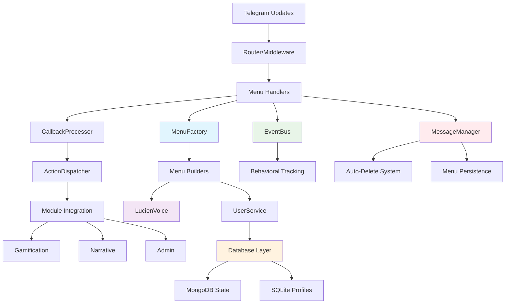

# menu - Task 37

Execute task 37 for the menu specification.

## Task Description
Create menu system coordinator in src/handlers/menu_system.py

## Code Reuse
**Leverage existing code**: MenuHandlerSystem, CallbackProcessor, ActionDispatcher

## Requirements Reference
**Requirements**: REQ-MENU-001.1, REQ-MENU-002.1

## Usage
```
/Task:37-menu
```

## Instructions

Execute with @spec-task-executor agent the following task: "Create menu system coordinator in src/handlers/menu_system.py"

```
Use the @spec-task-executor agent to implement task 37: "Create menu system coordinator in src/handlers/menu_system.py" for the menu specification and include all the below context.

# Steering Context
## Steering Documents Context (Pre-loaded)

### Product Context
# YABOT Product Vision & Requirements

## Product Overview

YABOT (Yet Another Bot) is a sophisticated Telegram bot framework that creates emotionally intelligent digital companions. The platform combines advanced behavioral analysis with personalized narrative experiences to deliver authentic emotional connections between users and AI.

## Core Mission

Create a transformative digital intimacy experience that respects both human vulnerability and the complexity of emotional connection, using AI to facilitate genuine personal growth and meaningful interaction.

## Target Users

### Primary Users
- **Emotional Explorers**: Individuals seeking deeper emotional understanding and connection
- **Digital Intimacy Seekers**: Users interested in meaningful AI companionship experiences
- **Personal Growth Enthusiasts**: People using technology for self-reflection and development

### User Archetypes (Diana System)
- **The Deep Explorer**: Methodical users who review content multiple times, seeking comprehensive understanding
- **The Authentic Direct**: Straightforward users who value honesty and transparency in interactions
- **The Poetic Seeker**: Metaphorical communicators who seek aesthetic and emotional resonance
- **The Empathetic Analyst**: Reflective users who combine intellectual and emotional understanding
- **The Patient Persistent**: Devoted users who respect boundaries while maintaining consistent engagement

## Key Features

### Narrative Intelligence (Diana System)
- **Multi-level progression** (Levels 1-6: Kinkys 1-3, Diván 4-6)
- **Emotional behavioral analysis** with real-time response evaluation
- **Personalized content adaptation** based on user archetype and emotional signature
- **Memory continuity system** that maintains relationship context across sessions
- **Authenticity validation** to distinguish genuine emotional responses from calculated ones

### User Engagement Systems
- **VIP subscription management** with tiered access controls
- **Gamification elements**: Besitos wallet, missions, achievements, auction systems
- **Daily rewards** and engagement incentives
- **Social features**: Rankings, community interactions

### Content Management
- **Dynamic narrative branching** based on emotional resonance scores
- **Personalized memory fragments** and callback references
- **Adaptive response generation** tailored to individual user profiles
- **Progressive content unlocking** based on emotional development milestones

## Business Objectives

### Primary Goals
1. **Emotional Engagement**: Achieve 90%+ user emotional satisfaction scores
2. **Retention**: Maintain 75%+ monthly active user rate for premium subscribers
3. **Authenticity**: Develop AI that can distinguish authentic emotional responses with 85%+ accuracy
4. **Growth**: Scale to support 10,000+ concurrent emotionally-engaged users

### Success Metrics
- **Emotional Resonance Score**: Average user emotional connection rating
- **Session Depth**: Time spent in meaningful narrative interactions
- **Progression Rate**: Users advancing through emotional development levels
- **Subscription Conversion**: Free to premium conversion rate
- **User Authenticity**: Percentage of interactions classified as genuine vs. calculated

## Content Strategy

### Narrative Levels
- **Levels 1-2**: Introduction and trust building with authenticity detection
- **Level 3**: Vulnerability mapping through "Cartografía del Deseo"
- **Levels 4-5**: Deep emotional intelligence evaluation and reciprocal intimacy
- **Level 6**: Advanced emotional synthesis and relationship maturity

### Personalization Approach
- **Content variants** tailored to each user archetype
- **Dynamic response adaptation** based on emotional signature
- **Memory integration** with personalized callbacks to significant moments
- **Relationship evolution** tracking long-term emotional development

## Ethical Considerations

### Privacy & Consent
- **Explicit consent** for emotional behavior tracking
- **Data sovereignty** ensuring users control their emotional profiles
- **Transparency** in AI decision-making processes
- **Right to emotional privacy** with opt-out mechanisms

### Emotional Safety
- **Boundary respect** in intimate AI interactions
- **Mental health safeguards** with professional resource referrals
- **Manipulation prevention** ensuring AI enhances rather than exploits vulnerability
- **Authentic connection** prioritizing genuine growth over engagement metrics

## Technical Requirements

### Performance Standards
- **Response time**: 3 seconds maximum for command responses
- **Concurrent users**: Support 10,000+ simultaneous connections
- **Uptime**: 99.5% availability during operational hours
- **Emotional analysis**: Real-time behavioral evaluation under 200ms

### Scalability Goals
- **Horizontal scaling** for narrative processing services
- **Database performance**: Sub-100ms queries for 95% of requests
- **Memory efficiency**: Maintain under 512MB per user session
- **Global deployment** with multi-region content delivery

## Future Vision

### Short-term (3-6 months)
- Complete Diana emotional intelligence system implementation
- Launch premium subscription tiers with advanced personalization
- Establish user archetype classification system
- Deploy real-time emotional behavioral analysis

### Medium-term (6-12 months)
- Expand to multi-language emotional intelligence
- Integrate with external wellness and therapy platforms
- Develop group emotional dynamics features
- Launch content creator tools for narrative expansion

### Long-term (1+ years)
- Pioneer emotional AI companionship standards
- Create cross-platform emotional continuity
- Develop therapeutic AI partnership programs
- Establish research collaboration for digital intimacy studies

## Success Definition

YABOT succeeds when users report genuine emotional growth and meaningful connection through AI interaction, while maintaining ethical standards that respect human vulnerability and promote authentic personal development.

---

### Technology Context
# YABOT Technical Architecture & Standards

## Technology Stack

### Core Framework
- **Python 3.11+**: Primary development language with modern async/await patterns
- **Aiogram 3.0**: Telegram Bot API framework for message handling and webhook management
- **FastAPI**: Internal REST API server with automatic OpenAPI documentation
- **Uvicorn**: ASGI server for FastAPI applications
- **Pydantic 2.0+**: Data validation and serialization with type hints

### Database Architecture

#### Dual Database Strategy
- **MongoDB 4.4+**: Dynamic state storage for narrative progress and user behavior
  - Flexible schema for evolving emotional data requirements
  - High-performance read/write for real-time behavioral analysis
  - Collections: user states, narrative progress, emotional signatures
- **SQLite 3.30+**: Transactional data storage for user profiles and subscriptions
  - ACID compliance for critical user data integrity
  - Lightweight and efficient for structured data
  - Tables: user profiles, subscription data, authentication

#### Data Management
- **PyMongo 4.4.1**: MongoDB driver with connection pooling
- **Connection pooling**: Configurable limits for database scalability
- **Backup automation**: Automated data protection strategies
- **Migration support**: Zero-downtime deployment capabilities

### Event-Driven Architecture

#### Message Bus
- **Redis 6.0+**: Primary event bus with Pub/Sub messaging
  - Real-time event distribution between services
  - Connection pooling and authentication support
  - Clustering support for horizontal scaling
- **Local Fallback Queue**: Event persistence during Redis downtime
  - Automatic replay when connectivity restored
  - At-least-once delivery guarantees

#### Event Processing
- **redis-py 4.5.4**: Redis client with async support
- **Event correlation**: Tracking related events across service boundaries
- **Circuit breaker pattern**: Resilience for external service dependencies

### Security Framework

#### Authentication & Authorization
- **PyJWT 2.7.0**: JWT token management for internal APIs
- **Service-to-service auth**: Secure internal communication
- **Role-based access**: Granular permissions for different user tiers
- **Input validation**: Comprehensive sanitization against injection attacks

#### Data Protection
- **Cryptography 41.0.3**: Encryption for sensitive data
- **TLS/SSL**: Encrypted connections for all database and Redis communication
- **Environment-based secrets**: Secure configuration management
- **Token rotation**: Automated security credential updates

### Development Standards

#### Code Quality
- **Type hints**: Comprehensive typing with mypy compatibility
- **Async/await**: Modern Python asynchronous programming patterns
- **Error handling**: Centralized exception management with user-friendly responses
- **Logging**: Structured logging with contextual information (structlog 23.1.0)

#### Testing Framework
- **Pytest**: Unit and integration testing with async support
- **Coverage reporting**: Minimum 80% code coverage requirement
- **Performance testing**: Load testing for concurrent user scenarios
- **Security testing**: Vulnerability scanning and penetration testing

#### Documentation
- **Docstrings**: Google-style documentation for all public APIs
- **Type annotations**: Full type coverage for IDE support and validation
- **API documentation**: Auto-generated OpenAPI specs from FastAPI
- **Architecture diagrams**: Mermaid diagrams for system visualization

### Performance Requirements

#### Response Times
- **Command responses**: Maximum 3 seconds under normal conditions
- **API endpoints**: 99% of requests under 200ms
- **Database operations**: 95% of queries under 100ms
- **Emotional analysis**: Real-time behavioral evaluation under 200ms

#### Scalability Targets
- **Concurrent users**: 10,000+ simultaneous connections
- **Memory usage**: Under 512MB during normal operation per instance
- **Horizontal scaling**: Stateless services for load balancing
- **Database performance**: Connection pooling with configurable limits

### Deployment Architecture

#### Infrastructure Components
- **Application servers**: Multiple instances behind load balancer
- **Database cluster**: MongoDB replica set with SQLite per instance
- **Redis cluster**: High availability with sentinel configuration
- **Monitoring stack**: Health checks and performance metrics

#### Environment Management
- **Configuration**: Environment variables with validation
- **Service discovery**: Health check endpoints for all components
- **Circuit breakers**: Fault tolerance for external dependencies
- **Graceful degradation**: Fallback mechanisms for service failures

### External Integrations

#### Telegram API
- **Webhook mode**: HTTPS endpoints with signature validation
- **Polling mode**: Fallback for webhook configuration failures
- **Rate limiting**: Respect Telegram API limits with exponential backoff
- **Update processing**: Async handling of multiple message types

#### Third-party Services
- **APScheduler 3.11.0**: Scheduled task management for daily rewards
- **Health monitoring**: External service availability checks
- **Backup services**: Automated data protection and recovery

### Development Workflow

#### Code Standards
- **Linting**: Automated code quality checks with pre-commit hooks
- **Type checking**: mypy validation in CI/CD pipeline
- **Import organization**: Consistent import sorting and grouping
- **Code formatting**: Automated formatting with black/isort

#### Version Control
- **Git workflow**: Feature branches with pull request reviews
- **Semantic versioning**: Clear version management for deployments
- **Migration scripts**: Database schema evolution management
- **Rollback procedures**: Safe deployment reversal processes

### Monitoring & Observability

#### Logging Strategy
- **Structured logging**: JSON format with correlation IDs
- **Log levels**: Appropriate verbosity for different environments
- **Error tracking**: Centralized error collection and alerting
- **Performance metrics**: Request timing and resource usage

#### Health Monitoring
- **Component health**: Individual service status endpoints
- **Dependency monitoring**: Database and Redis connection health
- **Performance tracking**: Response time and throughput metrics
- **Alert thresholds**: Automated notification for service degradation

### Future Technical Considerations

#### Scalability Evolution
- **Microservices**: Potential service decomposition for specialized scaling
- **Container orchestration**: Kubernetes deployment for cloud-native scaling
- **Database sharding**: Horizontal partitioning for user data distribution
- **CDN integration**: Global content delivery for improved performance

#### Technology Upgrades
- **Python version**: Migration path to future Python releases
- **Framework updates**: Aiogram and FastAPI version upgrade strategies
- **Database evolution**: Potential migration to distributed database systems
- **AI/ML integration**: Machine learning pipeline for emotional analysis enhancement

### Technical Debt Management

#### Code Maintenance
- **Refactoring schedule**: Regular code cleanup and optimization
- **Dependency updates**: Security patch and feature update management
- **Performance optimization**: Continuous profiling and bottleneck resolution
- **Technical review**: Regular architecture assessment and improvement

#### Quality Assurance
- **Automated testing**: Comprehensive test suite with CI/CD integration
- **Code review**: Mandatory peer review for all changes
- **Security audits**: Regular vulnerability assessment and penetration testing
- **Performance benchmarking**: Continuous performance regression detection

---

### Structure Context
# YABOT Project Structure & Conventions

## Directory Organization

### Root Structure
```
yabot/
├── src/                    # Main application source code
├── tests/                  # Comprehensive test suite
├── scripts/                # Utility and migration scripts
├── docs/                   # Project documentation
├── .claude/                # Claude Code configuration and specs
├── requirements.txt        # Python dependencies
├── requirements-test.txt   # Test-specific dependencies
├── .env.example           # Environment configuration template
└── README.md              # Project overview and setup
```

### Source Code Organization (`src/`)

#### Core Framework (`src/core/`)
- **application.py**: Main bot orchestrator and component coordination
- **router.py**: Message routing and handler dispatch
- **middleware.py**: Request/response processing pipeline
- **error_handler.py**: Centralized error management
- **models.py**: Core data models and types
- **telegram_types.py**: Telegram-specific type definitions
- **session.py**: User session management

#### Configuration (`src/config/`)
- **manager.py**: Environment-based configuration with validation

#### Database Layer (`src/database/`)
- **manager.py**: Unified database interface and connection management
- **mongodb.py**: MongoDB operations and queries
- **sqlite.py**: SQLite operations and transactions
- **init.py**: Database initialization and migration
- **schemas/**: Database schema definitions
  - **mongo.py**: MongoDB document schemas
  - **sqlite.py**: SQLite table definitions
  - **narrative.py**: Narrative-specific data models
  - **gamification.py**: Gamification system schemas

#### Event System (`src/events/`)
- **bus.py**: Redis Pub/Sub event bus with local fallback
- **models.py**: Event data models and type definitions
- **processor.py**: Event handling and processing logic
- **ordering.py**: Event sequence management

#### Service Layer (`src/services/`)
- **user.py**: User management and profile operations
- **subscription.py**: Premium subscription management
- **narrative.py**: Story content and progression tracking
- **coordinator.py**: Workflow orchestration and event sequencing
- **cross_module.py**: Inter-service communication utilities

#### Handlers (`src/handlers/`)
- **base.py**: Base handler class with common functionality
- **commands.py**: Command processing (legacy system)
- **telegram_commands.py**: Telegram-specific command handlers
- **webhook.py**: Webhook endpoint handler

#### API Layer (`src/api/`)
- **server.py**: FastAPI application setup and configuration
- **auth.py**: JWT authentication and authorization
- **cross_module.py**: Cross-module API endpoint definitions
- **endpoints/**: API route handlers
  - **users.py**: User-related API endpoints
  - **narrative.py**: Narrative content API
  - **gamification.py**: Gamification system API
  - **admin.py**: Administrative functions API

#### Modules (`src/modules/`)

##### Admin Module (`src/modules/admin/`)
- **admin_commands.py**: Administrative command handlers
- **access_control.py**: User access and permission management
- **message_protection.py**: Content moderation and safety
- **notification_system.py**: System notification management
- **subscription_manager.py**: Subscription lifecycle management
- **post_scheduler.py**: Content scheduling and automation

##### Gamification Module (`src/modules/gamification/`)
- **besitos_wallet.py**: Virtual currency system
- **daily_gift.py**: Daily reward mechanics
- **mission_manager.py**: User mission and objective tracking
- **store.py**: Virtual item marketplace
- **achievement_system.py**: User achievement tracking
- **reaction_detector.py**: User interaction analysis
- **item_manager.py**: Virtual item inventory management
- **trivia_engine.py**: Quiz and trivia game mechanics
- **auction_system.py**: User-to-user trading system

##### Narrative Module (`src/modules/narrative/`)
- **fragment_manager.py**: Story content management and delivery
- **decision_engine.py**: Narrative branching logic
- **lucien_messenger.py**: Character interaction system
- **hint_system.py**: User guidance and help system

#### Shared Infrastructure (`src/shared/`)

##### API Components (`src/shared/api/`)
- **auth.py**: Shared authentication utilities

##### Database Components (`src/shared/database/`)
- **backup_automation.py**: Automated backup and recovery

##### Event Components (`src/shared/events/`)
- **correlation.py**: Event correlation and tracking

##### Monitoring (`src/shared/monitoring/`)
- **performance.py**: Performance metrics and monitoring

##### Resilience (`src/shared/resilience/`)
- **circuit_breaker.py**: Fault tolerance and service protection

##### Registry (`src/shared/registry/`)
- **module_registry.py**: Service registry and dependency management

#### Utilities (`src/utils/`)
- **logger.py**: Structured logging configuration
- **errors.py**: Custom exception definitions
- **database.py**: Database utility functions
- **validators.py**: Input validation utilities
- **health.py**: Health check implementations
- **file_handler.py**: File processing utilities
- **crypto.py**: Cryptographic operations

### File Naming Conventions

#### Python Files
- **snake_case**: All Python files use lowercase with underscores
- **Descriptive names**: Clear indication of functionality
- **Module grouping**: Related functionality in appropriately named modules

#### Configuration Files
- **.env.example**: Template for environment variables
- **requirements.txt**: Production dependencies
- **requirements-test.txt**: Testing dependencies

### Import Organization

#### Import Order (per PEP 8)
1. **Standard library imports**
2. **Third-party library imports**
3. **Local application imports**

#### Import Style
```python
# Standard library
import asyncio
from typing import Any, Optional, Dict, List

# Third-party
from aiogram import Bot, Dispatcher
from fastapi import FastAPI, HTTPException
from pydantic import BaseModel

# Local imports
from src.config.manager import ConfigManager
from src.utils.logger import get_logger
```

### Code Organization Patterns

#### Service Pattern
- **Single responsibility**: Each service handles one domain
- **Dependency injection**: Services receive dependencies via constructor
- **Interface segregation**: Clear public API with private implementation

#### Repository Pattern
- **Database abstraction**: Services don't directly interact with databases
- **Manager classes**: Centralized database operation management
- **Schema separation**: Clear separation between MongoDB and SQLite schemas

#### Event-Driven Pattern
- **Loose coupling**: Services communicate via events
- **Event models**: Structured event definitions with type safety
- **Pub/Sub**: Publisher-subscriber pattern for scalability

### Testing Structure (`tests/`)

#### Test Organization
```
tests/
├── unit/                   # Unit tests for individual components
├── integration/            # Integration tests for service interactions
├── performance/            # Performance and load testing
├── security/               # Security vulnerability testing
├── services/               # Service-specific test suites
├── database/               # Database operation testing
├── events/                 # Event system testing
├── utils/                  # Utility function testing
├── conftest.py            # Shared test configuration
└── test_*.py              # Specific test modules
```

#### Test Naming
- **test_module_name.py**: Tests for specific modules
- **test_functionality**: Descriptive test function names
- **Given_When_Then**: Clear test structure and documentation

### Documentation Standards

#### Code Documentation
- **Docstrings**: Google-style docstrings for all public functions
- **Type hints**: Comprehensive type annotations
- **Inline comments**: Explain complex logic and business rules

#### Project Documentation
- **README.md**: Comprehensive setup and usage guide
- **Architecture diagrams**: Visual system representation
- **API documentation**: Auto-generated from FastAPI

### Development Workflow

#### Branch Strategy
- **Feature branches**: Individual features in separate branches
- **Pull requests**: Code review before merging
- **Main branch**: Stable, deployable code

#### Code Quality
- **Linting**: Automated code quality checks
- **Type checking**: mypy validation
- **Testing**: Comprehensive test coverage requirement

### Configuration Management

#### Environment Variables
- **Structured configuration**: Grouped by functionality
- **Validation**: Type checking and required field validation
- **Default values**: Sensible defaults for development

#### Secrets Management
- **Environment-based**: No secrets in code repository
- **Encryption**: Sensitive data encrypted at rest
- **Rotation**: Regular credential rotation procedures

### Deployment Structure

#### Environment Separation
- **Development**: Local development with minimal infrastructure
- **Staging**: Production-like environment for testing
- **Production**: Full infrastructure with monitoring and backup

#### Service Organization
- **Stateless services**: Horizontal scaling capability
- **Database separation**: Isolated data stores
- **Health monitoring**: Service health check endpoints

### Future Structure Considerations

#### Scalability Planning
- **Microservice readiness**: Current structure supports service extraction
- **API versioning**: Future API evolution support
- **Module independence**: Potential for independent deployment

#### Maintenance Strategy
- **Code organization**: Clear separation of concerns
- **Dependency management**: Minimal coupling between modules
- **Evolution path**: Structure supports future architectural changes

**Note**: Steering documents have been pre-loaded. Do not use get-content to fetch them again.

# Specification Context
## Specification Context (Pre-loaded): menu

### Requirements
# Requirements Document - Menu System

## Introduction

The menu system for YABOT is a comprehensive user interaction interface that provides a fully functional, role-based navigation system for users to interact with all bot features. The system integrates the existing MenuFactory architecture with Telegram bot handlers, callbacks, and routers to create a seamless user experience that embodies Lucien's sophisticated voice and personality while respecting the organic menu design principles.

This system serves as the primary interface between users and all bot functionality, including narrative progression, gamification features, VIP access, administrative tools, and emotional intelligence systems.

## Alignment with Product Vision

This feature directly supports YABOT's core mission of creating emotionally intelligent digital companions by:

- **Emotional Connection**: Using Lucien's sophisticated voice throughout all menu interactions to maintain personality consistency
- **Personalized Experience**: Adapting menu options and presentations based on user archetype, narrative level, and worthiness score
- **Progressive Disclosure**: Implementing the organic menu system that shows all options with elegant restrictions rather than hiding unavailable features
- **User Growth**: Supporting the Diana system's 6-level progression (Kinkys 1-3, Diván 4-6) through adaptive menu presentations
- **VIP Differentiation**: Providing exclusive access and enhanced experiences for premium subscribers
- **Authentic Interaction**: Maintaining the sophisticated butler persona that analyzes user worthiness and guides their journey

## Requirements

### REQ-MENU-001: Core Menu Handler System

**User Story:** As a new user, I want to interact with intuitive menus that respond to my commands and callbacks, so that I can easily navigate and access all bot features.

#### Acceptance Criteria

1. **REQ-MENU-001.1:** WHEN a user sends `/start` THEN the system SHALL display the main menu with Lucien's welcome message
2. **REQ-MENU-001.2:** WHEN a user sends `/menu` THEN the system SHALL display the current context-appropriate menu
3. **REQ-MENU-001.3:** WHEN a user clicks an inline keyboard button THEN the system SHALL process the callback and navigate to the appropriate menu or action
4. **REQ-MENU-001.4:** WHEN a user selects a menu option THEN the system SHALL provide feedback using Lucien's voice and character
5. **REQ-MENU-001.5:** WHEN the system processes any menu interaction THEN it SHALL update the user's behavioral assessment for Lucien's evaluation

### REQ-MENU-002: Telegram Integration Layer

**User Story:** As a developer, I want a complete integration between the menu system and Telegram bot framework, so that users can interact seamlessly through Telegram's interface.

#### Acceptance Criteria

1. **REQ-MENU-002.1:** WHEN the bot receives a message THEN the router SHALL direct it to the appropriate handler
2. **REQ-MENU-002.2:** WHEN a callback query is received THEN the system SHALL process it through the callback handler
3. **REQ-MENU-002.3:** WHEN a menu is displayed THEN it SHALL use proper Telegram inline keyboards with callback data
4. **REQ-MENU-002.4:** WHEN callback data exceeds Telegram limits THEN the system SHALL compress or map the data appropriately
5. **REQ-MENU-002.5:** WHEN menu navigation occurs THEN the system SHALL maintain proper back/home navigation options

### REQ-MENU-003: Role-Based Access Control

**User Story (Free User):** As a free user, I want to see menu options appropriate to my access level, so that I can access features I'm entitled to while understanding what's available for future growth.

**User Story (VIP User):** As a VIP user, I want to access exclusive premium features through the menu system, so that I can enjoy the full benefits of my subscription.

**User Story (Admin User):** As an admin user, I want to access administrative functions through dedicated menu options, so that I can manage the system effectively.

#### Acceptance Criteria

1. **REQ-MENU-003.1:** WHEN a free user accesses menus THEN they SHALL see all options with elegant restrictions for premium features
2. **REQ-MENU-003.2:** WHEN a VIP user accesses menus THEN they SHALL have full access to premium features and content
3. **REQ-MENU-003.3:** WHEN an admin accesses menus THEN they SHALL see administrative options in addition to user features
4. **REQ-MENU-003.4:** WHEN a user lacks sufficient worthiness score THEN Lucien SHALL explain the requirements elegantly
5. **REQ-MENU-003.5:** WHEN a user's narrative level changes THEN menu options SHALL update accordingly

### REQ-MENU-004: Organic Menu System Implementation

**User Story:** As a new user, I want to see all available options even if I can't access them yet, so that I understand the full scope of features and am motivated to progress.

#### Acceptance Criteria

1. **REQ-MENU-004.1:** WHEN displaying restricted features THEN the system SHALL show them with elegant explanations rather than hiding them
2. **REQ-MENU-004.2:** WHEN a user selects a restricted item THEN Lucien SHALL provide sophisticated guidance on how to unlock it
3. **REQ-MENU-004.3:** WHEN menu items require worthiness THEN the system SHALL display the requirement contextually
4. **REQ-MENU-004.4:** WHEN VIP features are shown THEN they SHALL be presented as exclusive opportunities rather than barriers
5. **REQ-MENU-004.5:** WHEN user progression occurs THEN menus SHALL adapt to reflect new access levels

### REQ-MENU-005: Lucien Voice Integration

**User Story:** As a returning user, I want all menu interactions to maintain Lucien's sophisticated personality, so that my experience feels consistent and immersive.

#### Acceptance Criteria

1. **REQ-MENU-005.1:** WHEN any menu is displayed THEN Lucien's voice SHALL be present in headers, descriptions, and explanations
2. **REQ-MENU-005.2:** WHEN menu options are presented THEN they SHALL use Lucien's sophisticated terminology from the style guide
3. **REQ-MENU-005.3:** WHEN restrictions are explained THEN Lucien SHALL use elegant language that motivates rather than discourages
4. **REQ-MENU-005.4:** WHEN user progression is acknowledged THEN Lucien SHALL adapt his tone based on relationship level
5. **REQ-MENU-005.5:** WHEN errors occur THEN Lucien SHALL handle them gracefully with his characteristic sophistication

### REQ-MENU-006: Menu Factory Integration

**User Story:** As a developer, I want to leverage the existing MenuFactory architecture, so that the menu system is maintainable and follows established patterns.

#### Acceptance Criteria

1. **REQ-MENU-006.1:** WHEN menus are generated THEN the system SHALL use the existing MenuFactory and builders
2. **REQ-MENU-006.2:** WHEN user context is needed THEN the system SHALL integrate with UserService for profile data
3. **REQ-MENU-006.3:** WHEN menu caching is beneficial THEN the system SHALL utilize the existing cache manager
4. **REQ-MENU-006.4:** WHEN menu validation is required THEN the system SHALL use existing validation utilities
5. **REQ-MENU-006.5:** WHEN new menu types are added THEN they SHALL follow the established builder pattern

### REQ-MENU-007: Event-Driven Architecture

**User Story:** As a system administrator, I want menu interactions to integrate with the event system, so that user behavior can be tracked and other modules can respond appropriately.

#### Acceptance Criteria

1. **REQ-MENU-007.1:** WHEN menu interactions occur THEN events SHALL be published to the event bus
2. **REQ-MENU-007.2:** WHEN behavioral assessments are made THEN they SHALL be tracked through the emotional intelligence system
3. **REQ-MENU-007.3:** WHEN worthiness scores change THEN relevant modules SHALL be notified through events
4. **REQ-MENU-007.4:** WHEN VIP status changes THEN menu access SHALL update automatically through event handling
5. **REQ-MENU-007.5:** WHEN administrative actions occur THEN they SHALL be logged and tracked appropriately

### REQ-MENU-008: Dynamic Content and Personalization

**User Story:** As a progressing user, I want menu content to adapt to my personal journey and preferences, so that my experience feels tailored and evolving.

#### Acceptance Criteria

1. **REQ-MENU-008.1:** WHEN user archetype is detected THEN menu presentations SHALL adapt to match communication style
2. **REQ-MENU-008.2:** WHEN narrative progression occurs THEN available content SHALL expand appropriately
3. **REQ-MENU-008.3:** WHEN worthiness score changes THEN menu explanations SHALL reflect current standing
4. **REQ-MENU-008.4:** WHEN besitos balance changes THEN purchasable items SHALL update their availability status
5. **REQ-MENU-008.5:** WHEN user behavior patterns emerge THEN Lucien's assessment tone SHALL adapt accordingly

## Non-Functional Requirements

### Performance
- Menu generation SHALL complete within 500ms for cached menus
- Menu generation SHALL complete within 2 seconds for dynamic menus
- Callback processing SHALL complete within 1 second
- The system SHALL support 1000+ concurrent menu interactions

### Security
- All callback data SHALL be validated and sanitized
- User role verification SHALL occur on every menu access
- Administrative functions SHALL require proper authentication
- No sensitive data SHALL be exposed in callback payloads

### Reliability
- Menu system SHALL maintain 99.5% uptime
- Graceful degradation SHALL occur if external services are unavailable
- Menu state SHALL be recoverable after system restarts
- Error handling SHALL provide meaningful feedback to users

### Usability
- Menu navigation SHALL be intuitive for non-technical users
- All text SHALL follow Lucien's style guide for consistency
- Menu hierarchies SHALL not exceed 3 levels deep
- Menu options SHALL provide clear descriptions of functionality

---

### Design
# Design Document - Menu System

## Overview

The menu system design creates a fully functional Telegram bot interface that integrates the existing MenuFactory architecture with comprehensive handlers, callbacks, and routers. The system provides seamless user interaction through organic menu principles, role-based access control, Lucien's sophisticated personality integration, and **automatic message management to maintain a clean chat experience**.

A key design principle is **chat cleanliness**: the system automatically deletes system messages and notifications, keeping only the main menu visible at all times for an optimal user experience.

The design builds upon YABOT's existing infrastructure including the MenuFactory, UserService, EventBus, and Lucien voice generation systems to create a cohesive, scalable, and maintainable menu interaction layer.

## Steering Document Alignment

### Technical Standards (tech.md)
- **Event-Driven Architecture**: Leverages existing Redis EventBus with Pub/Sub messaging for menu interactions
- **Dual Database Strategy**: Integrates with MongoDB for dynamic menu state and SQLite for user profiles
- **Async/Await Patterns**: Follows Python 3.11+ modern asynchronous programming standards
- **Service Pattern**: Implements single responsibility services with dependency injection
- **Repository Pattern**: Uses existing database managers for abstraction
- **Security Framework**: Implements JWT authentication and input validation for callback data

### Project Structure (structure.md)
- **Handler Organization**: Follows `src/handlers/` pattern with base handler inheritance
- **Service Layer**: Integrates with `src/services/` for user management and coordination
- **Module Pattern**: Connects with `src/modules/` for gamification, narrative, and admin features
- **Event System**: Uses `src/events/` for behavioral tracking and user interaction events
- **UI Components**: Extends `src/ui/` with menu factory and Lucien voice integration

## Code Reuse Analysis

### Existing Components to Leverage

- **MenuFactory (`src/ui/menu_factory.py`)**: Complete menu generation system with organic principles, role-based access, and Lucien voice integration
- **CommandHandler (`src/handlers/telegram_commands.py`)**: Existing command processing with Lucien evaluation tracking
- **BaseHandler (`src/handlers/base.py`)**: Abstract base class for standardized response creation
- **UserService (`src/services/user.py`)**: User context management and behavioral assessment tracking
- **EventBus (`src/events/bus.py`)**: Redis-based event publishing for user interactions
- **LucienVoiceGenerator (`src/ui/lucien_voice_generator.py`)**: Sophisticated personality system with relationship levels

### Integration Points

- **Telegram Bot Framework**: Aiogram 3.0 integration through existing router and middleware
- **Database Layer**: MongoDB for menu state, SQLite for user profiles through DatabaseManager
- **Cache System**: Existing cache manager for menu optimization and performance
- **Behavioral Tracking**: Emotional intelligence system for worthiness scoring and user archetype detection
- **VIP System**: Subscription management and access control through existing admin modules

## Architecture

The menu system follows a layered architecture with **automatic message management** for chat cleanliness:



## Components and Interfaces

### MenuHandlerSystem (New Component)
- **Purpose:** Central coordinator for all menu-related interactions with automatic message cleanup
- **Interfaces:**
  - `handle_command(message: Message) -> CommandResponse`
  - `handle_callback(callback_query: CallbackQuery) -> CommandResponse`
  - `get_menu_for_context(user_context: Dict) -> Menu`
  - `cleanup_previous_messages(chat_id: int, user_id: int) -> None`
- **Dependencies:** MenuFactory, UserService, EventBus, MessageManager
- **Reuses:** Existing CommandHandler pattern, BaseHandler response creation

### MessageManager (New Component)
- **Purpose:** Manages chat cleanliness by tracking and automatically deleting system messages
- **Interfaces:**
  - `track_message(chat_id: int, message_id: int, message_type: str, ttl: int) -> None`
  - `delete_old_messages(chat_id: int) -> None`
  - `update_main_menu(chat_id: int, new_menu: Menu) -> int`
  - `preserve_main_menu(chat_id: int, message_id: int) -> None`
- **Dependencies:** Telegram Bot API, Redis cache for message tracking
- **Reuses:** Existing cache manager for temporary data storage

### CallbackProcessor (New Component)
- **Purpose:** Processes Telegram callback queries and routes to appropriate actions with message cleanup
- **Interfaces:**
  - `process_callback(callback_data: str, user_context: Dict) -> ActionResult`
  - `validate_callback_data(data: str) -> bool`
  - `compress_callback_data(data: str) -> str`
  - `cleanup_after_callback(chat_id: int) -> None`
- **Dependencies:** MenuFactory, ActionDispatcher, MessageManager
- **Reuses:** Existing callback data compression from MenuFactory

### ActionDispatcher (New Component)
- **Purpose:** Routes menu actions to appropriate modules and services
- **Interfaces:**
  - `dispatch_action(action_type: str, action_data: str, user_context: Dict) -> ActionResult`
  - `register_action_handler(action_type: str, handler: ActionHandler) -> None`
- **Dependencies:** Module registry, service layer
- **Reuses:** Existing module pattern and service coordination

### MenuIntegrationRouter (New Component)
- **Purpose:** Telegram bot router specifically for menu interactions with message lifecycle management
- **Interfaces:**
  - `route_message(message: Message) -> Handler`
  - `route_callback(callback_query: CallbackQuery) -> Handler`
- **Dependencies:** Existing router pattern, handler registry, MessageManager
- **Reuses:** Core router architecture and middleware pipeline

### TelegramMenuRenderer (New Component)
- **Purpose:** Converts Menu objects to Telegram inline keyboards with edit message capability
- **Interfaces:**
  - `render_menu(menu: Menu) -> InlineKeyboardMarkup`
  - `render_menu_response(menu: Menu, edit_message: bool = True) -> CommandResponse`
  - `edit_existing_menu(chat_id: int, message_id: int, new_menu: Menu) -> bool`
- **Dependencies:** MenuFactory Menu objects, Telegram types, MessageManager
- **Reuses:** Existing CommandResponse creation from BaseHandler

## Data Models

### MenuInteractionEvent (New Model)
```python
@dataclass
class MenuInteractionEvent:
    user_id: str
    menu_id: str
    action_type: str
    action_data: str
    timestamp: datetime
    user_context: Dict[str, Any]
    lucien_assessment: Optional[BehavioralAssessment]
    message_cleanup_triggered: bool = False
```

### CallbackActionResult (New Model)
```python
@dataclass
class CallbackActionResult:
    success: bool
    response_message: str
    new_menu: Optional[Menu]
    user_context_updates: Dict[str, Any]
    events_to_publish: List[Dict[str, Any]]
    should_edit_menu: bool = True
    cleanup_messages: bool = True
```

### MessageTrackingRecord (New Model)
```python
@dataclass
class MessageTrackingRecord:
    chat_id: int
    message_id: int
    message_type: str  # 'main_menu', 'notification', 'system_message', 'temporary'
    created_at: datetime
    ttl_seconds: int
    should_delete: bool = True
    is_main_menu: bool = False
```

### MenuNavigationContext (New Model)
```python
@dataclass
class MenuNavigationContext:
    current_menu_id: str
    navigation_path: List[str]
    user_context: Dict[str, Any]
    session_data: Dict[str, Any]
    main_menu_message_id: Optional[int] = None
    chat_cleanup_enabled: bool = True
```

## Chat Cleanliness Strategy

### Message Management Rules

1. **Main Menu Persistence**: The main menu message is always preserved and updated in-place
2. **Automatic Cleanup**: System notifications, temporary messages, and responses are automatically deleted
3. **TTL-Based Deletion**: Different message types have different time-to-live values
4. **Edit Over Send**: Menu updates use `edit_message` instead of sending new messages

### Message Types and TTL

```python
MESSAGE_TTL_CONFIG = {
    'main_menu': -1,  # Never delete (preserved)
    'system_notification': 5,  # 5 seconds
    'error_message': 10,  # 10 seconds
    'success_feedback': 3,  # 3 seconds
    'loading_message': 2,  # 2 seconds
    'temporary_info': 8,  # 8 seconds
    'lucien_response': 6,  # 6 seconds (for standalone responses)
}
```

### Cleanup Triggers

1. **On Menu Navigation**: Cleanup previous messages when displaying new menu
2. **After Callback Processing**: Remove temporary messages after action completion
3. **Periodic Cleanup**: Background task to remove expired messages
4. **User Command**: Immediate cleanup when user sends new command

## Error Handling

### Error Scenarios

1. **Invalid Callback Data**
   - **Handling:** Validate and sanitize all callback data, use compression mapping for oversized data
   - **User Impact:** Lucien provides elegant explanation via temporary message (auto-deleted after 10s)

2. **Menu Generation Failure**
   - **Handling:** Fallback to basic menu with core navigation options, edit existing menu message
   - **User Impact:** Lucien acknowledges the inconvenience via the main menu header

3. **Message Deletion Failure**
   - **Handling:** Log error, continue operation, queue deletion retry
   - **User Impact:** Minimal impact, occasional extra messages may remain briefly

4. **Main Menu Update Failure**
   - **Handling:** Send new menu message, track as new main menu, attempt cleanup of old message
   - **User Impact:** Brief period with duplicate menu, automatic cleanup resolves

5. **Database Connection Issues**
   - **Handling:** Local fallback for critical operations, queue events for replay
   - **User Impact:** Basic menu navigation continues, message tracking may be limited

## Testing Strategy

### Unit Testing
- **Message Manager**: Test message tracking, TTL handling, and cleanup logic
- **Menu Rendering**: Verify edit message functionality and fallback to new message
- **Callback Processing**: Validate cleanup triggers and message management integration
- **Cleanup Algorithms**: Test TTL expiration and bulk message deletion

### Integration Testing
- **Message Lifecycle**: Complete flow from menu display to callback processing to cleanup
- **Chat Cleanliness**: Verify only main menu remains after various user interactions
- **Error Recovery**: Message management during error conditions and recovery
- **Concurrent Users**: Message tracking and cleanup for multiple simultaneous users

### End-to-End Testing
- **User Experience**: Complete user journey with focus on chat cleanliness
- **Menu Persistence**: Main menu updates correctly through navigation without duplication
- **Notification Handling**: System notifications appear and disappear appropriately
- **Performance Under Load**: Message management performance under high user load

## Implementation Phases

### Phase 1: Core Infrastructure + Message Management
- **MenuHandlerSystem**: Central menu coordination with cleanup
- **MessageManager**: Message tracking and automatic deletion
- **TelegramMenuRenderer**: Menu rendering with edit message capability
- **Basic Integration**: Connect with existing MenuFactory and CommandHandler

### Phase 2: Advanced Features + Chat Optimization
- **CallbackProcessor**: Telegram callback handling with cleanup
- **ActionDispatcher**: Module action routing
- **Event Integration**: Behavioral tracking and assessment
- **Performance Optimization**: Message tracking optimization and bulk operations

### Phase 3: Enhanced Experience
- **Dynamic Personalization**: Real-time menu adaptation
- **Advanced Lucien Integration**: Context-aware personality responses
- **Analytics Integration**: Message management metrics and optimization
- **Admin Tools**: Chat management and debugging interfaces

## Performance Considerations

### Message Management Performance
- **Bulk Message Deletion**: Group delete operations for efficiency
- **Async Cleanup**: Non-blocking message deletion using background tasks
- **Cache Optimization**: Efficient message tracking using Redis with TTL
- **Rate Limiting**: Respect Telegram API limits for message operations

### Memory Management
- **Message Tracking Cleanup**: Automatic removal of expired tracking records
- **Cache TTL**: Appropriate cache expiration for message metadata
- **Memory Leak Prevention**: Proper cleanup of message references

## Security Considerations

### Message Security
- **Message Content Validation**: Ensure no sensitive data in auto-deleted messages
- **Cleanup Verification**: Verify message deletion success for sensitive content
- **User Privacy**: Respect user data in temporary message handling

### Rate Limiting
- **Telegram API Compliance**: Respect message editing and deletion rate limits
- **Abuse Prevention**: Prevent excessive message operations from single users
- **Graceful Degradation**: Fallback strategies when rate limits are reached

**Note**: Specification documents have been pre-loaded. Do not use get-content to fetch them again.

## Task Details
- Task ID: 37
- Description: Create menu system coordinator in src/handlers/menu_system.py
- Leverage: MenuHandlerSystem, CallbackProcessor, ActionDispatcher
- Requirements: REQ-MENU-001.1, REQ-MENU-002.1

## Instructions
- Implement ONLY task 37: "Create menu system coordinator in src/handlers/menu_system.py"
- Follow all project conventions and leverage existing code
- Mark the task as complete using: claude-code-spec-workflow get-tasks menu 37 --mode complete
- Provide a completion summary
```

## Task Completion
When the task is complete, mark it as done:
```bash
claude-code-spec-workflow get-tasks menu 37 --mode complete
```

## Next Steps
After task completion, you can:
- Execute the next task using /menu-task-[next-id]
- Check overall progress with /spec-status menu
