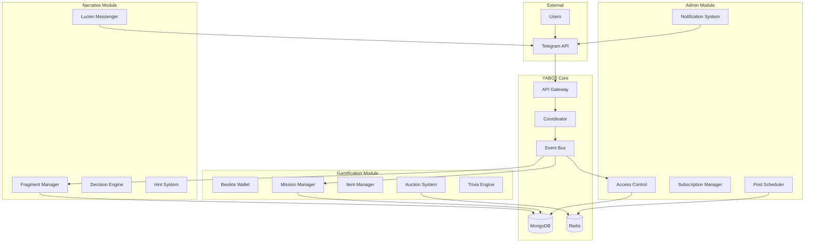
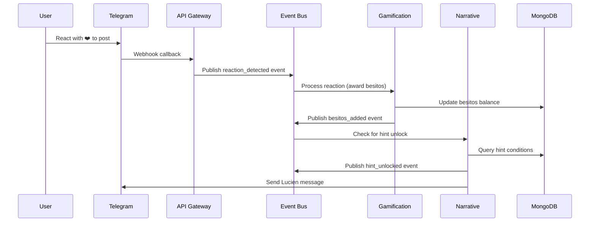
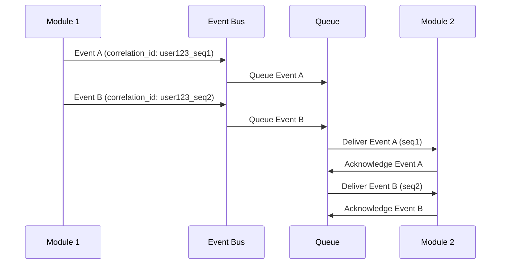

# modulos-atomicos - Task 38

Execute task 38 for the modulos-atomicos specification.

## Task Description
c. Create admin workflow E2E test in tests/e2e/test_admin_workflows.py

## Code Reuse
**Leverage existing code**: Admin interface test patterns

## Requirements Reference
**Requirements**: Requirement 3 user stories

## Usage
```
/Task:38-modulos-atomicos
```

## Instructions

Execute with @spec-task-executor agent the following task: "c. Create admin workflow E2E test in tests/e2e/test_admin_workflows.py"

```
Use the @spec-task-executor agent to implement task 38: "c. Create admin workflow E2E test in tests/e2e/test_admin_workflows.py" for the modulos-atomicos specification and include all the below context.

# Steering Context
## Steering Documents Context

No steering documents found or all are empty.

# Specification Context
## Specification Context (Pre-loaded): modulos-atomicos

### Requirements
# Requirements - Módulos Atómicos

## Introduction

This specification defines the implementation of atomic modules for the YABOT system, enabling parallel development of three core modules: Narrative Immersion, Gamification, and Channel Administration. Each module operates as an independent microservice connected through an event bus architecture, allowing for cross-module interactions and maintaining loose coupling.

The system implements a comprehensive event-driven architecture where user actions generate events that trigger responses across multiple modules simultaneously, creating an adaptive and engaging user experience.

## Alignment with Product Vision

This feature directly supports the product goals by:
- Creating an immersive narrative experience through interactive storytelling
- Implementing gamification mechanics to increase user engagement and retention
- Providing robust channel administration for content control and access management
- Enabling cross-module interactions that create a cohesive, integrated user experience

## Requirements

### Requirement 1: Narrative Immersion Module

**User Story:** As a user, I want to experience an interactive narrative with choices and progression, so that I can engage with dynamic storytelling content.

#### Acceptance Criteria

1. WHEN a user requests a narrative fragment THEN the system SHALL retrieve the fragment from MongoDB with text and decision options
2. WHEN a user makes a narrative decision THEN the system SHALL update their narrative_state in the database and publish a decision_made event
3. WHEN narrative pistas (hints) are unlocked THEN the system SHALL store them in the user's mochila (backpack) collection via API
4. IF a user has VIP status THEN the system SHALL allow access to premium narrative levels
5. WHEN a narrative checkpoint is reached THEN the system SHALL validate progression conditions via the coordinator service
6. WHEN Lucien messages are triggered THEN the system SHALL send dynamic templated messages via Telegram API

### Requirement 2: Gamification Module

**User Story:** As a user, I want to earn and spend virtual currency (besitos), complete missions, and collect items, so that I can progress in a rewarding game system.

#### Acceptance Criteria

1. WHEN besitos are awarded THEN the system SHALL perform atomic transactions in the database and publish besitos_added events
2. WHEN besitos are spent THEN the system SHALL validate balance and publish besitos_spent events
3. WHEN missions are assigned THEN the system SHALL track progress in the database via API
4. WHEN a mission is completed THEN the system SHALL publish mission_completed events
5. WHEN users react to content THEN the system SHALL detect reactions via Telegram hooks and publish reaction_detected events
6. WHEN users access the mochila THEN the system SHALL provide CRUD operations for item collection via MongoDB API
7. WHEN users browse the tienda (store) THEN the system SHALL display inline menus and process item_purchased events
8. WHEN subastas (auctions) are active THEN the system SHALL manage timers with Redis and handle bid_placed and auction_closed events
9. WHEN trivias are answered THEN the system SHALL process Telegram polls and publish trivia_answered events
10. WHEN logros (achievements) are unlocked THEN the system SHALL trigger database events and publish badge_unlocked events
11. WHEN daily gifts are claimed THEN the system SHALL enforce cooldowns with Redis and publish daily_gift_claimed events

### Requirement 3: Channel Administration Module

**User Story:** As an administrator, I want to control user access, manage subscriptions, and schedule content, so that I can maintain organized and secure channels.

#### Acceptance Criteria

1. WHEN user access is validated THEN the system SHALL use Telegram API to verify permissions and publish user_access_checked events
2. WHEN subscriptions expire THEN the system SHALL run cron jobs and publish subscription_expired events
3. WHEN posts are scheduled THEN the system SHALL use APScheduler and publish post_scheduled events
4. WHEN inline buttons are clicked THEN the system SHALL handle Telegram callbacks and publish button_clicked events
5. WHEN message protection is required THEN the system SHALL apply Telegram API flags to restrict access
6. WHEN notifications are sent THEN the system SHALL deliver push messages and publish notification_sent events
7. WHEN admin commands are executed THEN the system SHALL provide private command interfaces with inline menus

### Requirement 4: Event Bus Integration

**User Story:** As a module service, I want to communicate with other modules through reliable event messaging, so that cross-module interactions can occur seamlessly with guaranteed delivery and ordering.

#### Acceptance Criteria

1. WHEN any module publishes an event THEN the event bus SHALL deliver it to all subscribed modules within 100ms
2. WHEN an event fails to be delivered THEN the system SHALL retry up to 3 times with exponential backoff
3. WHEN a reaction_detected event occurs THEN gamification SHALL award besitos AND narrative SHALL potentially unlock pistas
4. WHEN a decision_made event occurs THEN gamification SHALL potentially assign missions AND administration SHALL potentially grant access
5. WHEN VIP access is required THEN the coordinator SHALL validate subscriptions before allowing fragment_unlocked events
6. WHEN cross-module workflows execute THEN events SHALL be processed in chronological order using correlation IDs
7. WHEN events fail to process THEN the system SHALL publish error events with original event ID and error details
8. WHEN event ordering is critical THEN the system SHALL use message queues to maintain sequence per user
9. WHEN modules are unavailable THEN events SHALL be queued and processed when modules recover

### Requirement 5: Module Isolation and Failure Recovery

**User Story:** As a system administrator, I want modules to operate independently and recover gracefully from failures, so that system availability is maintained even when individual modules fail.

#### Acceptance Criteria

1. WHEN a module fails THEN other modules SHALL continue operating without disruption
2. WHEN a module recovers THEN it SHALL process queued events from the time of failure
3. WHEN database connections fail THEN modules SHALL implement circuit breaker patterns with 30-second timeouts
4. WHEN cross-module API calls fail THEN fallback responses SHALL be provided within 5 seconds
5. WHEN data inconsistency is detected THEN reconciliation processes SHALL run automatically
6. WHEN module health checks fail THEN monitoring systems SHALL alert administrators within 1 minute
7. WHEN modules restart THEN they SHALL resume from their last known state

### Requirement 6: Database Integration

**User Story:** As a developer, I want consistent data storage patterns across modules, so that data integrity and performance are maintained.

#### Acceptance Criteria

1. WHEN narrative fragments are stored THEN the system SHALL use MongoDB with JSON structure for text and decisions
2. WHEN user state is updated THEN the system SHALL maintain narrative_progress in the users collection
3. WHEN items are managed THEN the system SHALL use MongoDB collections with CRUD APIs
4. WHEN real-time data is needed THEN the system SHALL use Redis for caching and timers
5. WHEN database transactions are required THEN the system SHALL ensure atomicity for critical operations
6. WHEN database migrations occur THEN the system SHALL maintain backward compatibility
7. WHEN data corruption is detected THEN automatic backup restoration SHALL be triggered

### Requirement 7: API Layer

**User Story:** As a module developer, I want internal APIs for quick data queries, so that modules can efficiently communicate without full event cycles.

#### Acceptance Criteria

1. WHEN besitos balance is queried THEN the API SHALL respond via /user/{id}/besitos endpoint
2. WHEN narrative state is needed THEN the API SHALL provide current fragment and progress information
3. WHEN subscription status is checked THEN the API SHALL return current VIP status and expiration
4. WHEN API calls are made THEN responses SHALL be returned within 100ms for cached data and 500ms for database queries
5. WHEN API errors occur THEN proper HTTP status codes and error messages SHALL be returned in Spanish
6. WHEN API rate limits are exceeded THEN HTTP 429 status SHALL be returned with retry-after headers
7. WHEN authentication fails THEN HTTP 401 status SHALL be returned with specific error codes
8. WHEN inter-module API calls timeout THEN circuit breaker SHALL open for 30 seconds

## Non-Functional Requirements

### Performance
- Event processing SHALL complete within 500ms for 95% of events
- Database queries SHALL return results within 100ms for 90% of queries
- The system SHALL support 1000 concurrent users per module
- Redis operations SHALL complete within 10ms for 99% of requests
- Cross-module API calls SHALL complete within 200ms for 95% of requests

### Security
- All API endpoints SHALL require authentication via Telegram user verification
- Sensitive data SHALL be encrypted at rest in MongoDB
- Event bus messages SHALL include correlation IDs for audit trails
- Admin functions SHALL require additional authorization checks
- Inter-module communication SHALL use authenticated API keys

### Reliability
- Each module SHALL have 99.9% uptime
- Event delivery SHALL be guaranteed with retry mechanisms
- Database transactions SHALL be atomic and consistent
- System SHALL gracefully handle module failures without affecting other modules
- Data backup SHALL occur every 6 hours with point-in-time recovery

### Usability
- Telegram interface SHALL respond to user actions within 2 seconds
- Error messages SHALL be user-friendly in Spanish
- Admin interfaces SHALL provide clear feedback for all operations
- Cross-module workflows SHALL appear seamless to end users
- System status SHALL be visible to administrators through monitoring dashboards

---

### Design
# Design Document - Módulos Atómicos

## Overview

This document defines the technical architecture for implementing three atomic modules within the YABOT system: Narrative Immersion, Gamification, and Channel Administration. The design follows a microservices architecture pattern with event-driven communication, leveraging the existing YABOT infrastructure while maintaining module independence and scalability.

The system architecture enables parallel development and deployment of modules while ensuring seamless cross-module interactions through a robust event bus and API layer.

## Steering Document Alignment

### Technical Standards
The design follows existing YABOT technical patterns:
- **Event Bus**: Extends current `src/events/bus.py` with Redis pub/sub and local queue fallback
- **Database Layer**: Uses established MongoDB patterns from `src/database/mongodb.py`
- **Handler Architecture**: Follows `src/handlers/base.py` patterns for consistent request processing
- **Service Layer**: Builds on existing service patterns in `src/services/`

### Project Structure
Module organization follows YABOT conventions:
```
src/
├── modules/
│   ├── narrative/     # Narrative Immersion Module
│   ├── gamification/  # Gamification Module
│   └── admin/         # Channel Administration Module
├── shared/
│   ├── events/        # Enhanced event bus
│   ├── api/           # Inter-module API layer
│   └── database/      # Database utilities
```

## Code Reuse Analysis

### Existing Components to Leverage
- **Event Bus Foundation**: `src/events/bus.py` and `src/events/models.py` - Will be extended with new event types
- **Database Handlers**: `src/database/mongodb.py` - Collection patterns and indexing strategies
- **Core Models**: `src/core/models.py` - Pydantic base classes for validation
- **Service Coordination**: `src/services/` - Service layer patterns for business logic
- **Handler Base**: `src/handlers/base.py` - Telegram command and webhook processing
- **Configuration**: `src/config/manager.py` - Environment and database configuration

### Missing Components (To Be Created)
- **Inter-Module Authentication**: New API key management system
- **Circuit Breaker**: Fault tolerance patterns for module communication
- **Performance Monitoring**: Metrics collection for requirement compliance
- **Event Correlation**: Correlation ID tracking and event ordering

### Integration Points
- **Event System**: Extend `src/events/models.py` with 12 new event types for cross-module interactions
- **Database Schema**: Add new collections (auctions, trivias, achievements) and extend users collection
- **API Infrastructure**: Extend `src/api/server.py` with module-specific endpoints and authentication
- **Service Layer**: Build new services following patterns in `src/services/narrative.py` and `src/services/subscription.py`
- **Handler Extension**: Create module-specific handlers inheriting from `src/handlers/base.py`

## Architecture

The system implements a modular, event-driven architecture with three main components:



## Components and Interfaces

### Narrative Immersion Module

#### Fragment Manager
- **Purpose**: Manages narrative content storage and retrieval
- **Interfaces**:
  - `get_fragment(fragment_id: str) -> NarrativeFragment`
  - `get_user_progress(user_id: str) -> NarrativeProgress`
  - `update_progress(user_id: str, fragment_id: str) -> bool`
- **Dependencies**: MongoDB, Event Bus
- **Reuses**: `src/database/mongodb.py` patterns, `src/core/models.py` base classes

#### Decision Engine
- **Purpose**: Processes user narrative choices and determines outcomes
- **Interfaces**:
  - `process_decision(user_id: str, choice_id: str) -> DecisionResult`
  - `validate_choice(user_id: str, choice_id: str) -> bool`
- **Dependencies**: Fragment Manager, Event Bus, Coordinator
- **Reuses**: `src/services/coordinator.py` orchestration patterns

#### Hint System
- **Purpose**: Manages narrative hints and unlocking logic
- **Interfaces**:
  - `unlock_hint(user_id: str, hint_id: str) -> bool`
  - `get_user_hints(user_id: str) -> List[Hint]`
- **Dependencies**: Item Manager (Gamification), MongoDB
- **Reuses**: Cross-module API patterns from existing services

#### Lucien Messenger
- **Purpose**: Sends dynamic templated messages via Telegram
- **Interfaces**:
  - `send_message(user_id: str, template: str, context: dict) -> bool`
  - `schedule_message(user_id: str, template: str, delay: int) -> bool`
- **Dependencies**: Telegram API, Redis (for scheduling)
- **Reuses**: `src/handlers/base.py` response patterns

### Gamification Module

#### Besitos Wallet
- **Purpose**: Manages virtual currency transactions with atomicity
- **Interfaces**:
  - `add_besitos(user_id: str, amount: int, reason: str) -> Transaction`
  - `spend_besitos(user_id: str, amount: int, reason: str) -> Transaction`
  - `get_balance(user_id: str) -> int`
- **Dependencies**: MongoDB (atomic transactions), Event Bus
- **Reuses**: Database transaction patterns from existing codebase

#### Mission Manager
- **Purpose**: Assigns and tracks user missions
- **Interfaces**:
  - `assign_mission(user_id: str, mission_type: str) -> Mission`
  - `update_progress(user_id: str, mission_id: str, progress: dict) -> bool`
  - `complete_mission(user_id: str, mission_id: str) -> Reward`
- **Dependencies**: Event Bus, MongoDB
- **Reuses**: `src/events/models.py` event patterns

#### Item Manager (Mochila)
- **Purpose**: Manages user item collection and inventory
- **Interfaces**:
  - `add_item(user_id: str, item_id: str) -> bool`
  - `remove_item(user_id: str, item_id: str) -> bool`
  - `get_inventory(user_id: str) -> List[Item]`
- **Dependencies**: MongoDB
- **Reuses**: `src/database/mongodb.py` collection patterns

#### Auction System
- **Purpose**: Manages timed auctions with Redis-based timers
- **Interfaces**:
  - `create_auction(item_id: str, duration: int) -> Auction`
  - `place_bid(user_id: str, auction_id: str, amount: int) -> bool`
  - `close_auction(auction_id: str) -> AuctionResult`
- **Dependencies**: Redis (timers), Event Bus, Besitos Wallet
- **Reuses**: Redis patterns from existing caching infrastructure

#### Trivia Engine
- **Purpose**: Manages Telegram polls and trivia question processing
- **Interfaces**:
  - `create_trivia(question: str, options: List[str], correct_answer: int) -> Trivia`
  - `process_answer(user_id: str, trivia_id: str, answer: int) -> TriviaResult`
  - `get_trivia_results(trivia_id: str) -> TriviaStats`
- **Dependencies**: Telegram API, Event Bus, Besitos Wallet
- **Reuses**: `src/handlers/base.py` for Telegram poll handling

#### Daily Gift System
- **Purpose**: Manages daily gift claims with Redis cooldowns
- **Interfaces**:
  - `claim_daily_gift(user_id: str) -> GiftResult`
  - `check_gift_availability(user_id: str) -> GiftStatus`
  - `reset_daily_cooldowns() -> List[str]`
- **Dependencies**: Redis (cooldown tracking), Event Bus
- **Reuses**: Redis TTL patterns for cooldown management

#### Achievement System
- **Purpose**: Tracks and unlocks user achievements (logros)
- **Interfaces**:
  - `check_achievements(user_id: str, action: str) -> List[Achievement]`
  - `unlock_achievement(user_id: str, achievement_id: str) -> bool`
  - `get_user_achievements(user_id: str) -> List[Achievement]`
- **Dependencies**: Event Bus, MongoDB
- **Reuses**: Database trigger patterns from existing event handlers

### Channel Administration Module

#### Access Control
- **Purpose**: Validates user permissions and channel access
- **Interfaces**:
  - `validate_access(user_id: str, channel_id: str) -> AccessResult`
  - `grant_access(user_id: str, channel_id: str, duration: int) -> bool`
  - `revoke_access(user_id: str, channel_id: str) -> bool`
- **Dependencies**: Telegram API, Subscription Manager
- **Reuses**: `src/api/auth.py` authentication patterns

#### Subscription Manager
- **Purpose**: Manages VIP subscriptions and expiration
- **Interfaces**:
  - `create_subscription(user_id: str, plan: str, duration: int) -> Subscription`
  - `check_vip_status(user_id: str) -> VipStatus`
  - `process_expiration() -> List[ExpiredSubscription]`
- **Dependencies**: MongoDB, Cron Jobs, Event Bus
- **Reuses**: `src/services/subscription.py` existing patterns

#### Post Scheduler
- **Purpose**: Schedules and manages automated content posting
- **Interfaces**:
  - `schedule_post(content: str, channel_id: str, publish_time: datetime) -> ScheduledPost`
  - `cancel_post(post_id: str) -> bool`
  - `execute_scheduled_posts() -> List[PostResult]`
- **Dependencies**: APScheduler, Telegram API, Redis
- **Reuses**: Existing scheduling patterns

#### Message Protection System
- **Purpose**: Applies Telegram API flags to restrict message access
- **Interfaces**:
  - `protect_message(message_id: str, protection_level: str) -> bool`
  - `check_message_access(user_id: str, message_id: str) -> AccessResult`
- **Dependencies**: Telegram API, Access Control
- **Reuses**: Existing Telegram API wrapper patterns

#### Admin Command Interface
- **Purpose**: Provides private admin commands with inline menus
- **Interfaces**:
  - `process_admin_command(user_id: str, command: str, args: dict) -> CommandResult`
  - `generate_admin_menu(user_id: str) -> InlineKeyboard`
- **Dependencies**: Telegram API, Access Control
- **Reuses**: `src/handlers/base.py` command processing patterns

## Data Models

### Narrative Models
```python
class NarrativeFragment(BaseModel):
    fragment_id: str
    title: str
    content: str
    choices: List[Choice]
    vip_required: bool = False
    metadata: Dict[str, Any]

class Choice(BaseModel):
    choice_id: str
    text: str
    next_fragment_id: Optional[str]
    conditions: Dict[str, Any]

class NarrativeProgress(BaseModel):
    user_id: str
    current_fragment: str
    completed_fragments: List[str]
    unlocked_hints: List[str]
    last_updated: datetime
```

### Gamification Models
```python
class BesitosTransaction(BaseModel):
    transaction_id: str
    user_id: str
    amount: int
    transaction_type: str  # 'credit' or 'debit'
    reason: str
    timestamp: datetime

class Mission(BaseModel):
    mission_id: str
    user_id: str
    mission_type: str
    description: str
    progress: Dict[str, Any]
    reward: Dict[str, Any]
    status: str  # 'active', 'completed', 'failed'

class Item(BaseModel):
    item_id: str
    name: str
    description: str
    type: str
    metadata: Dict[str, Any]

class Auction(BaseModel):
    auction_id: str
    item_id: str
    start_time: datetime
    end_time: datetime
    current_bid: int
    current_bidder: Optional[str]
    bid_history: List[Bid]
    status: str  # 'active', 'closed', 'cancelled'
    notification_sent: bool = False

class Bid(BaseModel):
    bidder_id: str
    amount: int
    timestamp: datetime
    correlation_id: str

class Trivia(BaseModel):
    trivia_id: str
    question: str
    options: List[str]
    correct_answer: int
    created_time: datetime
    end_time: datetime
    participants: List[TriviaParticipant]
    status: str  # 'active', 'closed'

class TriviaParticipant(BaseModel):
    user_id: str
    answer: int
    timestamp: datetime
    points_awarded: int

class Achievement(BaseModel):
    achievement_id: str
    name: str
    description: str
    criteria: Dict[str, Any]
    reward: Dict[str, Any]
    unlocked_by: List[str]  # user_ids
    created_date: datetime
```

### Administration Models
```python
class Subscription(BaseModel):
    subscription_id: str
    user_id: str
    plan_type: str
    start_date: datetime
    end_date: datetime
    status: str  # 'active', 'expired', 'cancelled'

class ScheduledPost(BaseModel):
    post_id: str
    channel_id: str
    content: str
    publish_time: datetime
    status: str  # 'scheduled', 'published', 'failed', 'retrying'
    retry_count: int = 0
    last_error: Optional[str] = None
    correlation_id: str
    metadata: Dict[str, Any]

class MessageProtection(BaseModel):
    message_id: str
    channel_id: str
    protection_level: str  # 'vip_only', 'admin_only', 'timed_access'
    access_conditions: Dict[str, Any]
    created_time: datetime
    expires_at: Optional[datetime]
```

## Error Handling

### Error Scenarios

1. **Module Communication Failure**
   - **Handling**: Circuit breaker pattern with 30-second timeout
   - **User Impact**: Graceful degradation with cached responses
   - **Recovery**: Automatic retry with exponential backoff

2. **Database Connection Loss**
   - **Handling**: Connection pooling with automatic reconnection
   - **User Impact**: Temporary "service unavailable" messages
   - **Recovery**: Health checks every 10 seconds

3. **Event Bus Overload**
   - **Handling**: Queue overflow protection with priority processing
   - **User Impact**: Delayed cross-module interactions
   - **Recovery**: Load balancing and event batching

4. **Cross-Module Data Inconsistency**
   - **Handling**: Reconciliation processes with conflict resolution
   - **User Impact**: Minimal - background synchronization
   - **Recovery**: Automated data repair with audit logs

5. **API Rate Limiting Exceeded**
   - **Handling**: HTTP 429 with exponential backoff retry-after headers
   - **User Impact**: "Por favor, intenta de nuevo en unos segundos" message
   - **Recovery**: Automatic retry with jittered backoff

6. **Authentication Failure**
   - **Handling**: HTTP 401 with specific error codes (AUTH001, AUTH002, etc.)
   - **User Impact**: "Sesión expirada, por favor reinicia" message
   - **Recovery**: Token refresh or re-authentication flow

7. **Event Queue Overflow**
   - **Handling**: Priority-based event processing with critical events first
   - **User Impact**: Delayed cross-module interactions (max 5 seconds)
   - **Recovery**: Queue scaling and event batching

## API Specifications

### Inter-Module Authentication
```python
# API Key-based authentication for inter-module calls
class ModuleAPIKey(BaseModel):
    module_name: str
    api_key: str
    permissions: List[str]
    expires_at: datetime

# Authentication middleware
async def authenticate_module_request(request: Request) -> Optional[str]:
    """Validates API key and returns module name if valid"""
    pass
```

### Performance Monitoring
```python
# Performance tracking for requirements compliance
class PerformanceMetrics(BaseModel):
    operation: str
    duration_ms: float
    timestamp: datetime
    module: str
    success: bool
    correlation_id: str

# Circuit breaker implementation
class CircuitBreaker:
    def __init__(self, failure_threshold: int = 5, timeout: int = 30):
        self.failure_count = 0
        self.failure_threshold = failure_threshold
        self.timeout = timeout
        self.last_failure_time = None
        self.state = 'CLOSED'  # CLOSED, OPEN, HALF_OPEN
```

### Redis Key Patterns
```python
# Redis key naming conventions
REDIS_KEYS = {
    'auction_timer': 'auction:{auction_id}:timer',
    'daily_gift_cooldown': 'gift:{user_id}:cooldown',
    'event_queue': 'events:{module}:queue',
    'user_session': 'session:{user_id}',
    'circuit_breaker': 'circuit:{module}:{operation}'
}

# TTL settings
TTL_SETTINGS = {
    'daily_gift_cooldown': 86400,  # 24 hours
    'auction_timer': 3600,  # 1 hour max
    'user_session': 1800,  # 30 minutes
    'circuit_breaker': 30  # 30 seconds
}
```

## Event Flow Diagrams

### Cross-Module Reaction Workflow


### Event Ordering with Correlation IDs


## Database Schema Extensions

### MongoDB Collection Indexes
```python
# Enhanced indexing strategy for performance requirements
INDEX_STRATEGY = {
    'users': [
        {'user_id': 1},  # Existing
        {'narrative_progress.current_fragment': 1, 'user_id': 1},  # Compound for narrative queries
        {'besitos_balance': 1},  # New for gamification
        {'subscription.status': 1, 'subscription.end_date': 1}  # VIP queries
    ],
    'narrative_fragments': [
        {'fragment_id': 1},  # Existing
        {'vip_required': 1, 'created_at': -1},  # VIP content filtering
        {'metadata.tags': 1}  # Tag-based queries
    ],
    'events': [  # New collection for event auditing
        {'correlation_id': 1},
        {'user_id': 1, 'timestamp': -1},
        {'event_type': 1, 'timestamp': -1}
    ]
}
```

## Testing Strategy

### Unit Testing
- **Framework**: pytest with async support
- **Coverage Target**: 90% code coverage per module
- **Key Components**:
  - **Fragment Manager**: Test narrative logic with mocked MongoDB
  - **Besitos Wallet**: Validate atomic transactions with test database
  - **Access Control**: Permission validation with mocked Telegram API
  - **Event Bus**: Message routing with in-memory queue
  - **Circuit Breaker**: Failure threshold and recovery testing

### Integration Testing
- **Framework**: pytest-asyncio with Docker containers
- **Test Environment**: Isolated MongoDB and Redis instances
- **Key Flows**:
  - **Reaction Workflow**: User reacts → Besitos awarded → Hint unlocked (500ms target)
  - **Decision Flow**: User chooses → Mission assigned → Access granted
  - **VIP Validation**: Subscription check → Fragment access → Event correlation
  - **Subscription Expiration**: Cron job → Access revocation → User notification
  - **Performance Testing**: 1000 concurrent users simulation

### End-to-End Testing
- **Framework**: Selenium with Telegram Bot API simulation
- **Performance Validation**: Response times within 2 seconds
- **User Scenarios**:
  - **Complete Narrative Journey**: Multiple fragments with choices and VIP content
  - **Gamification Loop**: Earn besitos → Buy items → Complete missions → Unlock achievements
  - **Admin Workflow**: Schedule posts → Manage subscriptions → Monitor user activity
  - **Error Recovery**: Module failure → Recovery → Event processing continuation

**Note**: Specification documents have been pre-loaded. Do not use get-content to fetch them again.

## Task Details
- Task ID: 38
- Description: c. Create admin workflow E2E test in tests/e2e/test_admin_workflows.py
- Leverage: Admin interface test patterns
- Requirements: Requirement 3 user stories

## Instructions
- Implement ONLY task 38: "c. Create admin workflow E2E test in tests/e2e/test_admin_workflows.py"
- Follow all project conventions and leverage existing code
- Mark the task as complete using: claude-code-spec-workflow get-tasks modulos-atomicos 38 --mode complete
- Provide a completion summary
```

## Task Completion
When the task is complete, mark it as done:
```bash
claude-code-spec-workflow get-tasks modulos-atomicos 38 --mode complete
```

## Next Steps
After task completion, you can:
- Execute the next task using /modulos-atomicos-task-[next-id]
- Check overall progress with /spec-status modulos-atomicos
