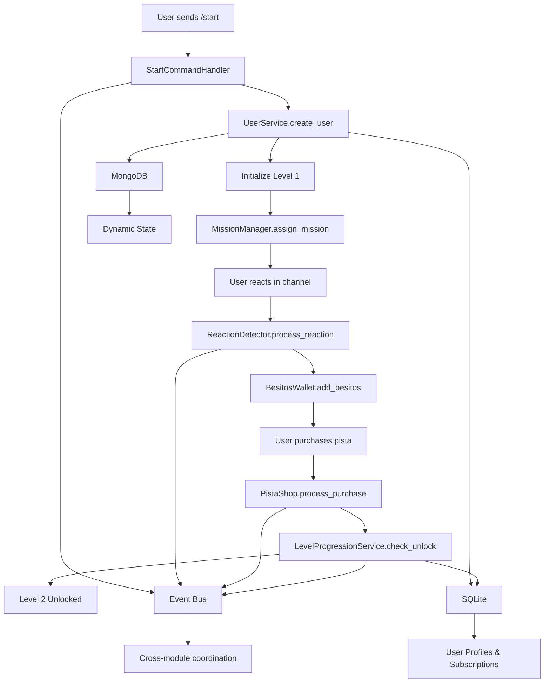

# ui - Task 18

Execute task 18 for the ui specification.

## Task Description
Add Level 1 reaction mission template to MissionManager

## Code Reuse
**Leverage existing code**: src/modules/gamification/mission

## Requirements Reference
**Requirements**: 2.1, 2.2

## Usage
```
/Task:18-ui
```

## Instructions

Execute with @spec-task-executor agent the following task: "Add Level 1 reaction mission template to MissionManager"

```
Use the @spec-task-executor agent to implement task 18: "Add Level 1 reaction mission template to MissionManager" for the ui specification and include all the below context.

# Steering Context
## Steering Documents Context (Pre-loaded)

### Product Context
# YABOT Product Vision & Requirements

## Product Overview

YABOT (Yet Another Bot) is a sophisticated Telegram bot framework that creates emotionally intelligent digital companions. The platform combines advanced behavioral analysis with personalized narrative experiences to deliver authentic emotional connections between users and AI.

## Core Mission

Create a transformative digital intimacy experience that respects both human vulnerability and the complexity of emotional connection, using AI to facilitate genuine personal growth and meaningful interaction.

## Target Users

### Primary Users
- **Emotional Explorers**: Individuals seeking deeper emotional understanding and connection
- **Digital Intimacy Seekers**: Users interested in meaningful AI companionship experiences
- **Personal Growth Enthusiasts**: People using technology for self-reflection and development

### User Archetypes (Diana System)
- **The Deep Explorer**: Methodical users who review content multiple times, seeking comprehensive understanding
- **The Authentic Direct**: Straightforward users who value honesty and transparency in interactions
- **The Poetic Seeker**: Metaphorical communicators who seek aesthetic and emotional resonance
- **The Empathetic Analyst**: Reflective users who combine intellectual and emotional understanding
- **The Patient Persistent**: Devoted users who respect boundaries while maintaining consistent engagement

## Key Features

### Narrative Intelligence (Diana System)
- **Multi-level progression** (Levels 1-6: Kinkys 1-3, Diván 4-6)
- **Emotional behavioral analysis** with real-time response evaluation
- **Personalized content adaptation** based on user archetype and emotional signature
- **Memory continuity system** that maintains relationship context across sessions
- **Authenticity validation** to distinguish genuine emotional responses from calculated ones

### User Engagement Systems
- **VIP subscription management** with tiered access controls
- **Gamification elements**: Besitos wallet, missions, achievements, auction systems
- **Daily rewards** and engagement incentives
- **Social features**: Rankings, community interactions

### Content Management
- **Dynamic narrative branching** based on emotional resonance scores
- **Personalized memory fragments** and callback references
- **Adaptive response generation** tailored to individual user profiles
- **Progressive content unlocking** based on emotional development milestones

## Business Objectives

### Primary Goals
1. **Emotional Engagement**: Achieve 90%+ user emotional satisfaction scores
2. **Retention**: Maintain 75%+ monthly active user rate for premium subscribers
3. **Authenticity**: Develop AI that can distinguish authentic emotional responses with 85%+ accuracy
4. **Growth**: Scale to support 10,000+ concurrent emotionally-engaged users

### Success Metrics
- **Emotional Resonance Score**: Average user emotional connection rating
- **Session Depth**: Time spent in meaningful narrative interactions
- **Progression Rate**: Users advancing through emotional development levels
- **Subscription Conversion**: Free to premium conversion rate
- **User Authenticity**: Percentage of interactions classified as genuine vs. calculated

## Content Strategy

### Narrative Levels
- **Levels 1-2**: Introduction and trust building with authenticity detection
- **Level 3**: Vulnerability mapping through "Cartografía del Deseo"
- **Levels 4-5**: Deep emotional intelligence evaluation and reciprocal intimacy
- **Level 6**: Advanced emotional synthesis and relationship maturity

### Personalization Approach
- **Content variants** tailored to each user archetype
- **Dynamic response adaptation** based on emotional signature
- **Memory integration** with personalized callbacks to significant moments
- **Relationship evolution** tracking long-term emotional development

## Ethical Considerations

### Privacy & Consent
- **Explicit consent** for emotional behavior tracking
- **Data sovereignty** ensuring users control their emotional profiles
- **Transparency** in AI decision-making processes
- **Right to emotional privacy** with opt-out mechanisms

### Emotional Safety
- **Boundary respect** in intimate AI interactions
- **Mental health safeguards** with professional resource referrals
- **Manipulation prevention** ensuring AI enhances rather than exploits vulnerability
- **Authentic connection** prioritizing genuine growth over engagement metrics

## Technical Requirements

### Performance Standards
- **Response time**: 3 seconds maximum for command responses
- **Concurrent users**: Support 10,000+ simultaneous connections
- **Uptime**: 99.5% availability during operational hours
- **Emotional analysis**: Real-time behavioral evaluation under 200ms

### Scalability Goals
- **Horizontal scaling** for narrative processing services
- **Database performance**: Sub-100ms queries for 95% of requests
- **Memory efficiency**: Maintain under 512MB per user session
- **Global deployment** with multi-region content delivery

## Future Vision

### Short-term (3-6 months)
- Complete Diana emotional intelligence system implementation
- Launch premium subscription tiers with advanced personalization
- Establish user archetype classification system
- Deploy real-time emotional behavioral analysis

### Medium-term (6-12 months)
- Expand to multi-language emotional intelligence
- Integrate with external wellness and therapy platforms
- Develop group emotional dynamics features
- Launch content creator tools for narrative expansion

### Long-term (1+ years)
- Pioneer emotional AI companionship standards
- Create cross-platform emotional continuity
- Develop therapeutic AI partnership programs
- Establish research collaboration for digital intimacy studies

## Success Definition

YABOT succeeds when users report genuine emotional growth and meaningful connection through AI interaction, while maintaining ethical standards that respect human vulnerability and promote authentic personal development.

---

### Technology Context
# YABOT Technical Architecture & Standards

## Technology Stack

### Core Framework
- **Python 3.11+**: Primary development language with modern async/await patterns
- **Aiogram 3.0**: Telegram Bot API framework for message handling and webhook management
- **FastAPI**: Internal REST API server with automatic OpenAPI documentation
- **Uvicorn**: ASGI server for FastAPI applications
- **Pydantic 2.0+**: Data validation and serialization with type hints

### Database Architecture

#### Dual Database Strategy
- **MongoDB 4.4+**: Dynamic state storage for narrative progress and user behavior
  - Flexible schema for evolving emotional data requirements
  - High-performance read/write for real-time behavioral analysis
  - Collections: user states, narrative progress, emotional signatures
- **SQLite 3.30+**: Transactional data storage for user profiles and subscriptions
  - ACID compliance for critical user data integrity
  - Lightweight and efficient for structured data
  - Tables: user profiles, subscription data, authentication

#### Data Management
- **PyMongo 4.4.1**: MongoDB driver with connection pooling
- **Connection pooling**: Configurable limits for database scalability
- **Backup automation**: Automated data protection strategies
- **Migration support**: Zero-downtime deployment capabilities

### Event-Driven Architecture

#### Message Bus
- **Redis 6.0+**: Primary event bus with Pub/Sub messaging
  - Real-time event distribution between services
  - Connection pooling and authentication support
  - Clustering support for horizontal scaling
- **Local Fallback Queue**: Event persistence during Redis downtime
  - Automatic replay when connectivity restored
  - At-least-once delivery guarantees

#### Event Processing
- **redis-py 4.5.4**: Redis client with async support
- **Event correlation**: Tracking related events across service boundaries
- **Circuit breaker pattern**: Resilience for external service dependencies

### Security Framework

#### Authentication & Authorization
- **PyJWT 2.7.0**: JWT token management for internal APIs
- **Service-to-service auth**: Secure internal communication
- **Role-based access**: Granular permissions for different user tiers
- **Input validation**: Comprehensive sanitization against injection attacks

#### Data Protection
- **Cryptography 41.0.3**: Encryption for sensitive data
- **TLS/SSL**: Encrypted connections for all database and Redis communication
- **Environment-based secrets**: Secure configuration management
- **Token rotation**: Automated security credential updates

### Development Standards

#### Code Quality
- **Type hints**: Comprehensive typing with mypy compatibility
- **Async/await**: Modern Python asynchronous programming patterns
- **Error handling**: Centralized exception management with user-friendly responses
- **Logging**: Structured logging with contextual information (structlog 23.1.0)

#### Testing Framework
- **Pytest**: Unit and integration testing with async support
- **Coverage reporting**: Minimum 80% code coverage requirement
- **Performance testing**: Load testing for concurrent user scenarios
- **Security testing**: Vulnerability scanning and penetration testing

#### Documentation
- **Docstrings**: Google-style documentation for all public APIs
- **Type annotations**: Full type coverage for IDE support and validation
- **API documentation**: Auto-generated OpenAPI specs from FastAPI
- **Architecture diagrams**: Mermaid diagrams for system visualization

### Performance Requirements

#### Response Times
- **Command responses**: Maximum 3 seconds under normal conditions
- **API endpoints**: 99% of requests under 200ms
- **Database operations**: 95% of queries under 100ms
- **Emotional analysis**: Real-time behavioral evaluation under 200ms

#### Scalability Targets
- **Concurrent users**: 10,000+ simultaneous connections
- **Memory usage**: Under 512MB during normal operation per instance
- **Horizontal scaling**: Stateless services for load balancing
- **Database performance**: Connection pooling with configurable limits

### Deployment Architecture

#### Infrastructure Components
- **Application servers**: Multiple instances behind load balancer
- **Database cluster**: MongoDB replica set with SQLite per instance
- **Redis cluster**: High availability with sentinel configuration
- **Monitoring stack**: Health checks and performance metrics

#### Environment Management
- **Configuration**: Environment variables with validation
- **Service discovery**: Health check endpoints for all components
- **Circuit breakers**: Fault tolerance for external dependencies
- **Graceful degradation**: Fallback mechanisms for service failures

### External Integrations

#### Telegram API
- **Webhook mode**: HTTPS endpoints with signature validation
- **Polling mode**: Fallback for webhook configuration failures
- **Rate limiting**: Respect Telegram API limits with exponential backoff
- **Update processing**: Async handling of multiple message types

#### Third-party Services
- **APScheduler 3.11.0**: Scheduled task management for daily rewards
- **Health monitoring**: External service availability checks
- **Backup services**: Automated data protection and recovery

### Development Workflow

#### Code Standards
- **Linting**: Automated code quality checks with pre-commit hooks
- **Type checking**: mypy validation in CI/CD pipeline
- **Import organization**: Consistent import sorting and grouping
- **Code formatting**: Automated formatting with black/isort

#### Version Control
- **Git workflow**: Feature branches with pull request reviews
- **Semantic versioning**: Clear version management for deployments
- **Migration scripts**: Database schema evolution management
- **Rollback procedures**: Safe deployment reversal processes

### Monitoring & Observability

#### Logging Strategy
- **Structured logging**: JSON format with correlation IDs
- **Log levels**: Appropriate verbosity for different environments
- **Error tracking**: Centralized error collection and alerting
- **Performance metrics**: Request timing and resource usage

#### Health Monitoring
- **Component health**: Individual service status endpoints
- **Dependency monitoring**: Database and Redis connection health
- **Performance tracking**: Response time and throughput metrics
- **Alert thresholds**: Automated notification for service degradation

### Future Technical Considerations

#### Scalability Evolution
- **Microservices**: Potential service decomposition for specialized scaling
- **Container orchestration**: Kubernetes deployment for cloud-native scaling
- **Database sharding**: Horizontal partitioning for user data distribution
- **CDN integration**: Global content delivery for improved performance

#### Technology Upgrades
- **Python version**: Migration path to future Python releases
- **Framework updates**: Aiogram and FastAPI version upgrade strategies
- **Database evolution**: Potential migration to distributed database systems
- **AI/ML integration**: Machine learning pipeline for emotional analysis enhancement

### Technical Debt Management

#### Code Maintenance
- **Refactoring schedule**: Regular code cleanup and optimization
- **Dependency updates**: Security patch and feature update management
- **Performance optimization**: Continuous profiling and bottleneck resolution
- **Technical review**: Regular architecture assessment and improvement

#### Quality Assurance
- **Automated testing**: Comprehensive test suite with CI/CD integration
- **Code review**: Mandatory peer review for all changes
- **Security audits**: Regular vulnerability assessment and penetration testing
- **Performance benchmarking**: Continuous performance regression detection

---

### Structure Context
# YABOT Project Structure & Conventions

## Directory Organization

### Root Structure
```
yabot/
├── src/                    # Main application source code
├── tests/                  # Comprehensive test suite
├── scripts/                # Utility and migration scripts
├── docs/                   # Project documentation
├── .claude/                # Claude Code configuration and specs
├── requirements.txt        # Python dependencies
├── requirements-test.txt   # Test-specific dependencies
├── .env.example           # Environment configuration template
└── README.md              # Project overview and setup
```

### Source Code Organization (`src/`)

#### Core Framework (`src/core/`)
- **application.py**: Main bot orchestrator and component coordination
- **router.py**: Message routing and handler dispatch
- **middleware.py**: Request/response processing pipeline
- **error_handler.py**: Centralized error management
- **models.py**: Core data models and types
- **telegram_types.py**: Telegram-specific type definitions
- **session.py**: User session management

#### Configuration (`src/config/`)
- **manager.py**: Environment-based configuration with validation

#### Database Layer (`src/database/`)
- **manager.py**: Unified database interface and connection management
- **mongodb.py**: MongoDB operations and queries
- **sqlite.py**: SQLite operations and transactions
- **init.py**: Database initialization and migration
- **schemas/**: Database schema definitions
  - **mongo.py**: MongoDB document schemas
  - **sqlite.py**: SQLite table definitions
  - **narrative.py**: Narrative-specific data models
  - **gamification.py**: Gamification system schemas

#### Event System (`src/events/`)
- **bus.py**: Redis Pub/Sub event bus with local fallback
- **models.py**: Event data models and type definitions
- **processor.py**: Event handling and processing logic
- **ordering.py**: Event sequence management

#### Service Layer (`src/services/`)
- **user.py**: User management and profile operations
- **subscription.py**: Premium subscription management
- **narrative.py**: Story content and progression tracking
- **coordinator.py**: Workflow orchestration and event sequencing
- **cross_module.py**: Inter-service communication utilities

#### Handlers (`src/handlers/`)
- **base.py**: Base handler class with common functionality
- **commands.py**: Command processing (legacy system)
- **telegram_commands.py**: Telegram-specific command handlers
- **webhook.py**: Webhook endpoint handler

#### API Layer (`src/api/`)
- **server.py**: FastAPI application setup and configuration
- **auth.py**: JWT authentication and authorization
- **cross_module.py**: Cross-module API endpoint definitions
- **endpoints/**: API route handlers
  - **users.py**: User-related API endpoints
  - **narrative.py**: Narrative content API
  - **gamification.py**: Gamification system API
  - **admin.py**: Administrative functions API

#### Modules (`src/modules/`)

##### Admin Module (`src/modules/admin/`)
- **admin_commands.py**: Administrative command handlers
- **access_control.py**: User access and permission management
- **message_protection.py**: Content moderation and safety
- **notification_system.py**: System notification management
- **subscription_manager.py**: Subscription lifecycle management
- **post_scheduler.py**: Content scheduling and automation

##### Gamification Module (`src/modules/gamification/`)
- **besitos_wallet.py**: Virtual currency system
- **daily_gift.py**: Daily reward mechanics
- **mission_manager.py**: User mission and objective tracking
- **store.py**: Virtual item marketplace
- **achievement_system.py**: User achievement tracking
- **reaction_detector.py**: User interaction analysis
- **item_manager.py**: Virtual item inventory management
- **trivia_engine.py**: Quiz and trivia game mechanics
- **auction_system.py**: User-to-user trading system

##### Narrative Module (`src/modules/narrative/`)
- **fragment_manager.py**: Story content management and delivery
- **decision_engine.py**: Narrative branching logic
- **lucien_messenger.py**: Character interaction system
- **hint_system.py**: User guidance and help system

#### Shared Infrastructure (`src/shared/`)

##### API Components (`src/shared/api/`)
- **auth.py**: Shared authentication utilities

##### Database Components (`src/shared/database/`)
- **backup_automation.py**: Automated backup and recovery

##### Event Components (`src/shared/events/`)
- **correlation.py**: Event correlation and tracking

##### Monitoring (`src/shared/monitoring/`)
- **performance.py**: Performance metrics and monitoring

##### Resilience (`src/shared/resilience/`)
- **circuit_breaker.py**: Fault tolerance and service protection

##### Registry (`src/shared/registry/`)
- **module_registry.py**: Service registry and dependency management

#### Utilities (`src/utils/`)
- **logger.py**: Structured logging configuration
- **errors.py**: Custom exception definitions
- **database.py**: Database utility functions
- **validators.py**: Input validation utilities
- **health.py**: Health check implementations
- **file_handler.py**: File processing utilities
- **crypto.py**: Cryptographic operations

### File Naming Conventions

#### Python Files
- **snake_case**: All Python files use lowercase with underscores
- **Descriptive names**: Clear indication of functionality
- **Module grouping**: Related functionality in appropriately named modules

#### Configuration Files
- **.env.example**: Template for environment variables
- **requirements.txt**: Production dependencies
- **requirements-test.txt**: Testing dependencies

### Import Organization

#### Import Order (per PEP 8)
1. **Standard library imports**
2. **Third-party library imports**
3. **Local application imports**

#### Import Style
```python
# Standard library
import asyncio
from typing import Any, Optional, Dict, List

# Third-party
from aiogram import Bot, Dispatcher
from fastapi import FastAPI, HTTPException
from pydantic import BaseModel

# Local imports
from src.config.manager import ConfigManager
from src.utils.logger import get_logger
```

### Code Organization Patterns

#### Service Pattern
- **Single responsibility**: Each service handles one domain
- **Dependency injection**: Services receive dependencies via constructor
- **Interface segregation**: Clear public API with private implementation

#### Repository Pattern
- **Database abstraction**: Services don't directly interact with databases
- **Manager classes**: Centralized database operation management
- **Schema separation**: Clear separation between MongoDB and SQLite schemas

#### Event-Driven Pattern
- **Loose coupling**: Services communicate via events
- **Event models**: Structured event definitions with type safety
- **Pub/Sub**: Publisher-subscriber pattern for scalability

### Testing Structure (`tests/`)

#### Test Organization
```
tests/
├── unit/                   # Unit tests for individual components
├── integration/            # Integration tests for service interactions
├── performance/            # Performance and load testing
├── security/               # Security vulnerability testing
├── services/               # Service-specific test suites
├── database/               # Database operation testing
├── events/                 # Event system testing
├── utils/                  # Utility function testing
├── conftest.py            # Shared test configuration
└── test_*.py              # Specific test modules
```

#### Test Naming
- **test_module_name.py**: Tests for specific modules
- **test_functionality**: Descriptive test function names
- **Given_When_Then**: Clear test structure and documentation

### Documentation Standards

#### Code Documentation
- **Docstrings**: Google-style docstrings for all public functions
- **Type hints**: Comprehensive type annotations
- **Inline comments**: Explain complex logic and business rules

#### Project Documentation
- **README.md**: Comprehensive setup and usage guide
- **Architecture diagrams**: Visual system representation
- **API documentation**: Auto-generated from FastAPI

### Development Workflow

#### Branch Strategy
- **Feature branches**: Individual features in separate branches
- **Pull requests**: Code review before merging
- **Main branch**: Stable, deployable code

#### Code Quality
- **Linting**: Automated code quality checks
- **Type checking**: mypy validation
- **Testing**: Comprehensive test coverage requirement

### Configuration Management

#### Environment Variables
- **Structured configuration**: Grouped by functionality
- **Validation**: Type checking and required field validation
- **Default values**: Sensible defaults for development

#### Secrets Management
- **Environment-based**: No secrets in code repository
- **Encryption**: Sensitive data encrypted at rest
- **Rotation**: Regular credential rotation procedures

### Deployment Structure

#### Environment Separation
- **Development**: Local development with minimal infrastructure
- **Staging**: Production-like environment for testing
- **Production**: Full infrastructure with monitoring and backup

#### Service Organization
- **Stateless services**: Horizontal scaling capability
- **Database separation**: Isolated data stores
- **Health monitoring**: Service health check endpoints

### Future Structure Considerations

#### Scalability Planning
- **Microservice readiness**: Current structure supports service extraction
- **API versioning**: Future API evolution support
- **Module independence**: Potential for independent deployment

#### Maintenance Strategy
- **Code organization**: Clear separation of concerns
- **Dependency management**: Minimal coupling between modules
- **Evolution path**: Structure supports future architectural changes

**Note**: Steering documents have been pre-loaded. Do not use get-content to fetch them again.

# Specification Context
## Specification Context (Pre-loaded): ui

### Requirements
# Requirements Document - UI Specification

## Introduction

This specification defines the complete user journey flow for new users in the YABOT Telegram bot platform, implementing a comprehensive progression system from initial contact to advanced level unlocking. The feature enables users to experience the core gamification loop: start → level assignment → mission completion → reward → purchase → progression.

This represents the foundational user experience that demonstrates all major system capabilities working together in a seamless, engaging flow that builds emotional connection and drives retention.

## Alignment with Product Vision

This feature directly supports the core product vision by:

- **Emotional Intelligence Development**: Progressive levels guide users through increasing emotional complexity
- **Authentic Connection Building**: The mission system ensures genuine interaction rather than superficial engagement
- **Gamification for Growth**: Besitos currency and progression provide meaningful advancement incentives
- **User Retention**: Multi-level progression creates long-term engagement goals
- **Digital Intimacy Experience**: Each level unlocks deeper, more personalized content

The flow establishes the foundation for users to develop authentic relationships with the AI while progressing through increasingly sophisticated emotional interactions.

## Requirements

### Requirement 1: User Onboarding and Registration

**User Story:** As a new user discovering the bot, I want to be automatically registered and welcomed at Level 1 (free), so that I can immediately understand my starting capabilities and begin my emotional journey.

#### Acceptance Criteria

1. WHEN a new user sends `/start` command THEN the system SHALL create a user profile with Level 1 (free) status within 2 seconds
2. WHEN user registration occurs THEN the system SHALL initialize besitos balance to exactly 0 besitos
3. WHEN a user is created THEN the system SHALL set up default narrative progress with empty completed_fragments array
4. WHEN registration completes THEN the system SHALL respond with a welcome message listing exactly 3 Level 1 capabilities
5. IF user already exists THEN the system SHALL return current level number and besitos balance within the response

### Requirement 2: Mission Assignment and Tracking

**User Story:** As a Level 1 user, I want to receive a specific reaction mission with clear instructions, so that I know exactly how to earn my first besitos and progress toward Level 2.

#### Acceptance Criteria

1. WHEN a Level 1 user completes onboarding THEN the system SHALL assign a mission titled "Reacciona en el Canal Principal"
2. WHEN reaction mission is assigned THEN the system SHALL provide the exact channel name "@yabot_canal" and required emoji "❤️"
3. WHEN user reacts with ❤️ in @yabot_canal THEN the reaction detector SHALL capture the event within 5 seconds
4. WHEN valid reaction is detected THEN the mission progress SHALL update to "completed" status
5. WHEN reaction mission is completed THEN the system SHALL award exactly 10 besitos automatically

### Requirement 3: Besitos Economy and Rewards

**User Story:** As a user completing missions, I want to receive immediate besitos rewards with clear transaction confirmations, so that I understand my earning progress and can plan purchases.

#### Acceptance Criteria

1. WHEN a user completes the reaction mission THEN the system SHALL credit exactly 10 besitos within 3 seconds
2. WHEN besitos are awarded THEN a transaction record SHALL be created with mission_id, timestamp, and amount
3. WHEN besitos transaction occurs THEN the user's balance SHALL update atomically using MongoDB transactions
4. WHEN reward is distributed THEN the user SHALL receive a message stating "¡Ganaste 10 besitos! Balance actual: X besitos"
5. IF transaction fails THEN the system SHALL retry once and display error message "Error procesando recompensa. Contacta soporte."

### Requirement 4: Pista Purchase and Progression

**User Story:** As a user with earned besitos, I want to purchase pistas (hints) to unlock Level 2 content, so that I can access advanced features and continue my emotional development.

#### Acceptance Criteria

1. WHEN user has 10 or more besitos THEN they SHALL see a "Comprar Pista - 10 besitos" button
2. WHEN pista purchase is initiated THEN the system SHALL verify balance ≥ 10 besitos before proceeding
3. WHEN pista is purchased THEN exactly 10 besitos SHALL be deducted using atomic wallet operation
4. WHEN purchase completes THEN the pista "Acceso a Nivel 2" SHALL be added to user's narrative progress
5. WHEN pista is obtained THEN Level 2 SHALL unlock automatically and user receives confirmation message

### Requirement 5: Level Progression and Unlocking

**User Story:** As a user who has completed Level 1 requirements, I want Level 2 to unlock automatically with new features visible, so that I can immediately explore advanced capabilities.

#### Acceptance Criteria

1. WHEN user completes reaction mission AND purchases Level 2 pista THEN user level SHALL change from 1 to 2 within 2 seconds
2. WHEN level progression occurs THEN the subscription service SHALL update user tier to "level_2"
3. WHEN Level 2 is unlocked THEN the user SHALL see at least 2 new menu options not available at Level 1
4. WHEN level changes THEN the system SHALL send message "¡Felicidades! Desbloqueaste Nivel 2. Nuevas funciones disponibles."
5. WHEN progression completes THEN a "level_progression" event SHALL be published with user_id, old_level, and new_level

### Requirement 6: System Reliability and User Experience

**User Story:** As a user progressing through levels, I want all features to work smoothly together without delays or errors, so that my journey feels seamless and my progress is always preserved.

#### Acceptance Criteria

1. WHEN any user action occurs THEN relevant events SHALL be published to the event bus within 500ms
2. WHEN events are published THEN all subscribed modules SHALL process them without data loss
3. WHEN database operations occur THEN consistency SHALL be maintained between MongoDB and SQLite using transactions
4. WHEN errors occur THEN user-friendly messages SHALL appear while preserving all completed progress
5. WHEN users interact THEN bot responses SHALL arrive within 3 seconds or display "Procesando..." message

### Requirement 7: Telegram Native Integration

**User Story:** As a user interacting through Telegram, I want all bot features to work naturally with Telegram's interface, so that the experience feels integrated and responsive.

#### Acceptance Criteria

1. WHEN user sends `/start` command THEN response SHALL arrive within 3 seconds with inline keyboard
2. WHEN user reacts to channel posts THEN reactions SHALL be detected within 5 seconds via webhook
3. WHEN missions are completed THEN notification messages SHALL be sent within 1 second
4. WHEN level progression occurs THEN celebration animation SHALL appear using Telegram's native formatting
5. IF Telegram API fails THEN graceful degradation SHALL queue actions for retry when connectivity returns

## Non-Functional Requirements

### Performance
- Command responses must complete within 3 seconds under normal load
- Database transactions must complete within 500ms for 95% of operations
- Event publishing and processing must occur within 1 second of trigger
- System must support 100 concurrent users progressing through the flow simultaneously

### Security
- All user data must be encrypted in transit and at rest
- Besitos transactions must use atomic operations to prevent double-spending
- Channel reactions must be verified as authentic before processing
- User progression must be validated server-side to prevent client manipulation

### Reliability
- System must maintain 99.5% uptime during operational hours
- Failed transactions must be recoverable with proper rollback mechanisms
- Event bus must guarantee at-least-once delivery for critical events
- Database operations must follow ACID principles for data consistency

### Usability
- Bot responses must be in clear, engaging Spanish language
- Progress indicators must be visible throughout the user journey
- Error messages must be user-friendly and actionable
- Interface must be accessible through standard Telegram client features

---

### Design
# Design Document - UI Specification

## Overview

This design implements a complete user journey flow for the YABOT Telegram bot, orchestrating existing components to create a seamless progression system from user onboarding through Level 2 unlocking. The architecture leverages the existing event-driven infrastructure while adding new level progression and pista purchase capabilities.

The design creates an emotionally engaging experience that guides users through the core gamification loop while building authentic connections through the Diana emotional intelligence system.

## Steering Document Alignment

### Technical Standards (tech.md)
- **Event-Driven Architecture**: All user actions publish events to the Redis event bus for cross-module coordination
- **Dual Database Strategy**: MongoDB for dynamic state (missions, progress) and SQLite for ACID compliance (subscriptions, profiles)
- **Type Safety**: Comprehensive Pydantic models for all data structures
- **Async/Await Patterns**: Modern Python asynchronous programming throughout
- **Authentication**: Secure JWT tokens for internal API communications

### Project Structure (structure.md)
- **Module Organization**: New components follow `src/modules/` pattern with clear separation of concerns
- **Service Layer**: Level progression logic implemented in `src/services/` following existing patterns
- **Event Models**: New events extend existing `src/events/models.py` patterns
- **Handler Integration**: Telegram handlers extend existing `src/handlers/base.py` architecture
- **Database Schemas**: New level system schemas follow existing `src/database/schemas/` patterns

## Code Reuse Analysis

### Existing Components to Leverage

- **UserService (`src/services/user.py`)**: Handle user creation, profile management, and subscription status updates
- **MissionManager (`src/modules/gamification/mission_manager.py`)**: Assign reaction missions and track completion
- **BesitosWallet (`src/modules/gamification/besitos_wallet.py`)**: Handle atomic besitos transactions for rewards and purchases
- **ReactionDetector (`src/modules/gamification/reaction_detector.py`)**: Detect channel reactions and trigger reward events
- **StartCommandHandler (`src/handlers/commands.py`)**: Extend existing `/start` implementation for Level 1 setup
- **HintSystem (`src/modules/narrative/hint_system.py`)**: Manage pista unlocking and user inventory
- **SubscriptionService (`src/services/subscription.py`)**: Handle level progression as subscription tier changes
- **EventBus (`src/events/bus.py`)**: Publish level progression and purchase events

### Integration Points

- **Database Manager (`src/database/manager.py`)**: Unified operations across MongoDB and SQLite
- **Router Manager (`src/core/router.py`)**: Route new level progression commands and callbacks
- **Event Processor (`src/events/processor.py`)**: Handle cross-module event coordination
- **Configuration Manager (`src/config/manager.py`)**: Level system configuration and validation

## Architecture



## Components and Interfaces

### Component 1: LevelProgressionService
- **Purpose:** Manages user level progression from Level 1 to Level 2 based on mission completion and pista purchases
- **Interfaces:**
  - `async def check_level_progression(user_id: str) -> Optional[int]`: Check if user qualifies for level progression, returns new level or None
  - `async def unlock_level(user_id: str, level: int) -> bool`: Atomically update user level in SQLite subscription table and MongoDB user document
  - `async def get_user_level(user_id: str) -> int`: Retrieve current user level from subscription service, defaults to 1 for new users
  - `async def handle_mission_completion(user_id: str, mission_id: str) -> None`: Process mission completion events and check progression
  - `async def handle_pista_purchase(user_id: str, pista_id: str) -> None`: Process pista purchase events and trigger level unlock if conditions met
- **Dependencies:** UserService, SubscriptionService, MissionManager, EventBus
- **Reuses:** SubscriptionService.create_subscription(), UserService.update_user_state(), existing event publishing patterns

### Component 2: PistaShop
- **Purpose:** Handle pista purchases using besitos and validate sufficient balance
- **Interfaces:**
  - `async def purchase_pista(user_id: str, pista_id: str) -> TransactionResult`: Execute atomic pista purchase with besitos deduction and hint unlocking
  - `async def get_available_pistas(user_id: str, level: int) -> List[Pista]`: Return pistas available for purchase at user's current level
  - `async def validate_purchase(user_id: str, cost: int) -> bool`: Check if user has sufficient besitos balance before purchase
  - `async def process_level_2_pista(user_id: str) -> bool`: Handle the specific "Acceso a Nivel 2" pista purchase and trigger progression
- **Dependencies:** BesitosWallet, HintSystem, LevelProgressionService, EventBus
- **Reuses:** BesitosWallet.spend_besitos(), HintSystem.unlock_hint(), existing TransactionResult patterns

### Component 3: EnhancedStartHandler
- **Purpose:** Extend existing start command to initialize Level 1 users and assign first mission
- **Interfaces:**
  - `async def handle_start_command(message: Message, **kwargs) -> CommandResponse`: Process /start command with Level 1 initialization and mission assignment
  - `async def setup_level_1_user(user_id: str) -> bool`: Initialize new user with Level 1 subscription and 0 besitos balance
  - `async def assign_initial_mission(user_id: str) -> Optional[Mission]`: Create "Reacciona en el Canal Principal" mission for new Level 1 users
  - `async def get_existing_user_status(user_id: str) -> Dict[str, Any]`: Return current level number and besitos balance for existing users
- **Dependencies:** UserService, MissionManager, LevelProgressionService, DatabaseManager
- **Reuses:** StartCommandHandler.process_message(), BaseHandler.create_response(), existing middleware injection patterns

### Component 4: LevelProgressionHandler
- **Purpose:** Handle level progression callbacks and display Level 2 celebration
- **Interfaces:**
  - `async def handle_level_progression(user_id: str, new_level: int) -> None`: Process level progression events and trigger celebration
  - `async def send_level_unlock_message(user_id: str, level: int) -> bool`: Send "¡Felicidades! Desbloqueaste Nivel 2. Nuevas funciones disponibles." with formatting
  - `async def update_user_menu(user_id: str, level: int) -> InlineKeyboardMarkup`: Add at least 2 new menu options for Level 2 users
  - `async def handle_pista_purchase_callback(callback_query: CallbackQuery) -> None`: Process "Comprar Pista - 10 besitos" button callbacks
- **Dependencies:** RouterManager, UserService, Bot (Telegram API), InlineKeyboardBuilder
- **Reuses:** Existing callback handler patterns from commands.py, InlineKeyboardBuilder from existing handlers

## Data Models

### LevelProgressionEvent
```python
class LevelProgressionEvent(BaseEvent):
    """Event published when user progresses to new level"""
    event_id: str = Field(default_factory=lambda: str(uuid.uuid4()))
    user_id: str
    old_level: int
    new_level: int
    trigger_action: str  # "mission_completion", "pista_purchase"
    payload: Dict[str, Any] = Field(default_factory=dict)
    source: str = "level_progression_service"

    def __init__(self, **data):
        super().__init__(
            event_type="level_progression",
            timestamp=datetime.utcnow(),
            **data
        )
```

### PistaPurchaseTransaction
```python
class PistaPurchaseTransaction(BaseModel):
    transaction_id: str
    user_id: str
    pista_id: str
    cost: int
    status: str  # "pending", "completed", "failed"
    timestamp: datetime
    metadata: Dict[str, Any]
```

### UserLevelData
```python
class UserLevelData(BaseModel):
    user_id: str
    current_level: int
    level_unlocked_at: datetime
    missions_completed: List[str]
    pistas_purchased: List[str]
    total_besitos_earned: int
```

## Error Handling

### Error Scenarios

1. **Mission Assignment Failure**
   - **Handling:** Retry mechanism with exponential backoff, fallback to default mission
   - **User Impact:** User sees "Procesando misión..." message with retry option

2. **Besitos Transaction Failure**
   - **Handling:** MongoDB transaction rollback, retry once with exponential backoff, error logging
   - **User Impact:** "Error procesando recompensa. Contacta soporte." message exactly as specified in requirements

3. **Level Progression Service Unavailable**
   - **Handling:** Graceful degradation, queue progression events for later processing
   - **User Impact:** Level progression delayed but preserved, user notified of temporary delay

4. **Telegram API Timeout**
   - **Handling:** Queue actions for retry when connectivity returns, graceful degradation per Requirement 7.5
   - **User Impact:** "Procesando..." message within 3 seconds or automatic retry when API available

5. **Database Connection Loss**
   - **Handling:** Circuit breaker pattern, local cache fallback, connection pool recovery
   - **User Impact:** Limited functionality with cached data until connection restored

6. **Channel Reaction Detection Failure**
   - **Handling:** Fallback to polling mode if webhook fails, retry reaction processing
   - **User Impact:** Reaction detected within 5 seconds as per Requirement 2.3, or notification of delay

7. **Level 2 Pista Purchase Validation Failure**
   - **Handling:** Re-verify balance before purchase, rollback if insufficient funds
   - **User Impact:** Clear message if insufficient besitos, "Necesitas 10 besitos para comprar esta pista"

## Requirements Mapping

### Requirement 1 Coverage
- **EnhancedStartHandler.handle_start_command**: Implements AC 1.1 (2-second response), AC 1.4 (3 Level 1 capabilities)
- **EnhancedStartHandler.setup_level_1_user**: Implements AC 1.2 (0 besitos), AC 1.3 (empty completed_fragments)
- **EnhancedStartHandler.get_existing_user_status**: Implements AC 1.5 (return level and balance)

### Requirement 2 Coverage
- **EnhancedStartHandler.assign_initial_mission**: Implements AC 2.1 ("Reacciona en el Canal Principal")
- **Mission title and channel specification**: Implements AC 2.2 (@yabot_canal, ❤️ emoji)
- **ReactionDetector integration**: Implements AC 2.3 (5-second detection), AC 2.4 (completed status)
- **BesitosWallet integration**: Implements AC 2.5 (10 besitos reward)

### Requirement 3 Coverage
- **BesitosWallet.add_besitos**: Implements AC 3.1 (10 besitos in 3 seconds), AC 3.3 (atomic transactions)
- **Transaction recording**: Implements AC 3.2 (mission_id, timestamp, amount)
- **User notification**: Implements AC 3.4 (exact message format), AC 3.5 (error message)

### Requirement 4 Coverage
- **PistaShop.get_available_pistas**: Implements AC 4.1 (purchase button when ≥10 besitos)
- **PistaShop.validate_purchase**: Implements AC 4.2 (balance verification)
- **PistaShop.purchase_pista**: Implements AC 4.3 (atomic deduction), AC 4.4 (hint unlocking)
- **LevelProgressionService.handle_pista_purchase**: Implements AC 4.5 (automatic Level 2 unlock)

### Requirement 5 Coverage
- **LevelProgressionService.unlock_level**: Implements AC 5.1 (2-second progression), AC 5.2 (subscription update)
- **LevelProgressionHandler.update_user_menu**: Implements AC 5.3 (2+ new menu options)
- **LevelProgressionHandler.send_level_unlock_message**: Implements AC 5.4 (exact celebration message)
- **Event publishing**: Implements AC 5.5 (level_progression event with user_id, old_level, new_level)

## Testing Strategy

### Unit Testing
- **LevelProgressionService**: Test progression logic and level validation using real UserService and SubscriptionService (no mocks per CLAUDE.md)
- **PistaShop**: Test transaction flows, balance validation, and error scenarios with real BesitosWallet
- **Event Publishing**: Verify event format, delivery, and cross-module integration with real EventBus
- **Database Operations**: Test atomic transactions and rollback scenarios with real DatabaseManager

### Integration Testing
- **Complete User Journey**: End-to-end flow from `/start` to Level 2 unlocking
- **Cross-Module Events**: Verify event propagation between gamification and narrative modules
- **Database Consistency**: Test data integrity across MongoDB and SQLite operations
- **Error Recovery**: Test system behavior under various failure conditions

### End-to-End Testing
- **Real Telegram Integration**: Test with actual Telegram bot API in staging environment
- **Performance Under Load**: Concurrent users progressing through the journey
- **Event Bus Reliability**: Test event delivery under high load and network issues
- **User Experience Flows**: Validate timing, messages, and interface responsiveness

**Note**: Specification documents have been pre-loaded. Do not use get-content to fetch them again.

## Task Details
- Task ID: 18
- Description: Add Level 1 reaction mission template to MissionManager
- Leverage: src/modules/gamification/mission
- Requirements: 2.1, 2.2

## Instructions
- Implement ONLY task 18: "Add Level 1 reaction mission template to MissionManager"
- Follow all project conventions and leverage existing code
- Mark the task as complete using: claude-code-spec-workflow get-tasks ui 18 --mode complete
- Provide a completion summary
```

## Task Completion
When the task is complete, mark it as done:
```bash
claude-code-spec-workflow get-tasks ui 18 --mode complete
```

## Next Steps
After task completion, you can:
- Execute the next task using /ui-task-[next-id]
- Check overall progress with /spec-status ui
