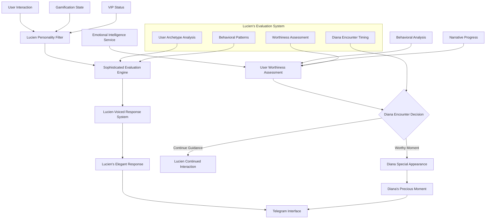
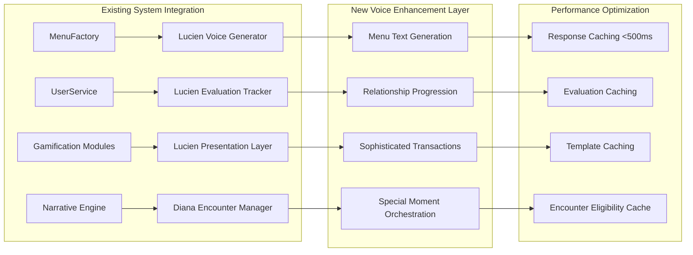
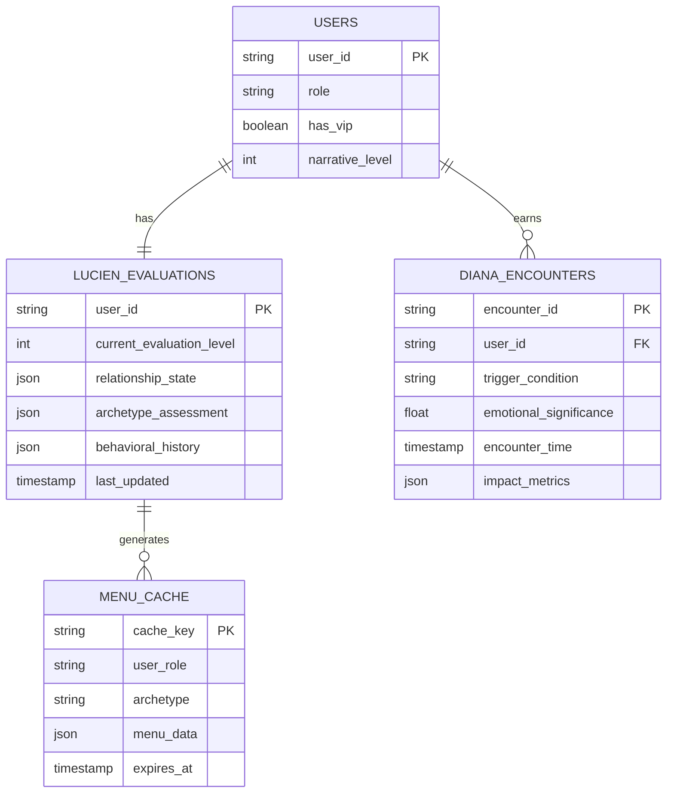

# ux-enhanced - Task 10

Execute task 10 for the ux-enhanced specification.

## Task Description
Add lucien_voice_text field to MenuItem class in src/ui/menu_factory.py

## Code Reuse
**Leverage existing code**: existing MenuItem class, src/ui/lucien

## Requirements Reference
**Requirements**: Requirement 1.1, Requirement 1.5

## Usage
```
/Task:10-ux-enhanced
```

## Instructions

Execute with @spec-task-executor agent the following task: "Add lucien_voice_text field to MenuItem class in src/ui/menu_factory.py"

```
Use the @spec-task-executor agent to implement task 10: "Add lucien_voice_text field to MenuItem class in src/ui/menu_factory.py" for the ux-enhanced specification and include all the below context.

# Steering Context
## Steering Documents Context (Pre-loaded)

### Product Context
# YABOT Product Vision & Requirements

## Product Overview

YABOT (Yet Another Bot) is a sophisticated Telegram bot framework that creates emotionally intelligent digital companions. The platform combines advanced behavioral analysis with personalized narrative experiences to deliver authentic emotional connections between users and AI.

## Core Mission

Create a transformative digital intimacy experience that respects both human vulnerability and the complexity of emotional connection, using AI to facilitate genuine personal growth and meaningful interaction.

## Target Users

### Primary Users
- **Emotional Explorers**: Individuals seeking deeper emotional understanding and connection
- **Digital Intimacy Seekers**: Users interested in meaningful AI companionship experiences
- **Personal Growth Enthusiasts**: People using technology for self-reflection and development

### User Archetypes (Diana System)
- **The Deep Explorer**: Methodical users who review content multiple times, seeking comprehensive understanding
- **The Authentic Direct**: Straightforward users who value honesty and transparency in interactions
- **The Poetic Seeker**: Metaphorical communicators who seek aesthetic and emotional resonance
- **The Empathetic Analyst**: Reflective users who combine intellectual and emotional understanding
- **The Patient Persistent**: Devoted users who respect boundaries while maintaining consistent engagement

## Key Features

### Narrative Intelligence (Diana System)
- **Multi-level progression** (Levels 1-6: Kinkys 1-3, Diván 4-6)
- **Emotional behavioral analysis** with real-time response evaluation
- **Personalized content adaptation** based on user archetype and emotional signature
- **Memory continuity system** that maintains relationship context across sessions
- **Authenticity validation** to distinguish genuine emotional responses from calculated ones

### User Engagement Systems
- **VIP subscription management** with tiered access controls
- **Gamification elements**: Besitos wallet, missions, achievements, auction systems
- **Daily rewards** and engagement incentives
- **Social features**: Rankings, community interactions

### Content Management
- **Dynamic narrative branching** based on emotional resonance scores
- **Personalized memory fragments** and callback references
- **Adaptive response generation** tailored to individual user profiles
- **Progressive content unlocking** based on emotional development milestones

## Business Objectives

### Primary Goals
1. **Emotional Engagement**: Achieve 90%+ user emotional satisfaction scores
2. **Retention**: Maintain 75%+ monthly active user rate for premium subscribers
3. **Authenticity**: Develop AI that can distinguish authentic emotional responses with 85%+ accuracy
4. **Growth**: Scale to support 10,000+ concurrent emotionally-engaged users

### Success Metrics
- **Emotional Resonance Score**: Average user emotional connection rating
- **Session Depth**: Time spent in meaningful narrative interactions
- **Progression Rate**: Users advancing through emotional development levels
- **Subscription Conversion**: Free to premium conversion rate
- **User Authenticity**: Percentage of interactions classified as genuine vs. calculated

## Content Strategy

### Narrative Levels
- **Levels 1-2**: Introduction and trust building with authenticity detection
- **Level 3**: Vulnerability mapping through "Cartografía del Deseo"
- **Levels 4-5**: Deep emotional intelligence evaluation and reciprocal intimacy
- **Level 6**: Advanced emotional synthesis and relationship maturity

### Personalization Approach
- **Content variants** tailored to each user archetype
- **Dynamic response adaptation** based on emotional signature
- **Memory integration** with personalized callbacks to significant moments
- **Relationship evolution** tracking long-term emotional development

## Ethical Considerations

### Privacy & Consent
- **Explicit consent** for emotional behavior tracking
- **Data sovereignty** ensuring users control their emotional profiles
- **Transparency** in AI decision-making processes
- **Right to emotional privacy** with opt-out mechanisms

### Emotional Safety
- **Boundary respect** in intimate AI interactions
- **Mental health safeguards** with professional resource referrals
- **Manipulation prevention** ensuring AI enhances rather than exploits vulnerability
- **Authentic connection** prioritizing genuine growth over engagement metrics

## Technical Requirements

### Performance Standards
- **Response time**: 3 seconds maximum for command responses
- **Concurrent users**: Support 10,000+ simultaneous connections
- **Uptime**: 99.5% availability during operational hours
- **Emotional analysis**: Real-time behavioral evaluation under 200ms

### Scalability Goals
- **Horizontal scaling** for narrative processing services
- **Database performance**: Sub-100ms queries for 95% of requests
- **Memory efficiency**: Maintain under 512MB per user session
- **Global deployment** with multi-region content delivery

## Future Vision

### Short-term (3-6 months)
- Complete Diana emotional intelligence system implementation
- Launch premium subscription tiers with advanced personalization
- Establish user archetype classification system
- Deploy real-time emotional behavioral analysis

### Medium-term (6-12 months)
- Expand to multi-language emotional intelligence
- Integrate with external wellness and therapy platforms
- Develop group emotional dynamics features
- Launch content creator tools for narrative expansion

### Long-term (1+ years)
- Pioneer emotional AI companionship standards
- Create cross-platform emotional continuity
- Develop therapeutic AI partnership programs
- Establish research collaboration for digital intimacy studies

## Success Definition

YABOT succeeds when users report genuine emotional growth and meaningful connection through AI interaction, while maintaining ethical standards that respect human vulnerability and promote authentic personal development.

---

### Technology Context
# YABOT Technical Architecture & Standards

## Technology Stack

### Core Framework
- **Python 3.11+**: Primary development language with modern async/await patterns
- **Aiogram 3.0**: Telegram Bot API framework for message handling and webhook management
- **FastAPI**: Internal REST API server with automatic OpenAPI documentation
- **Uvicorn**: ASGI server for FastAPI applications
- **Pydantic 2.0+**: Data validation and serialization with type hints

### Database Architecture

#### Dual Database Strategy
- **MongoDB 4.4+**: Dynamic state storage for narrative progress and user behavior
  - Flexible schema for evolving emotional data requirements
  - High-performance read/write for real-time behavioral analysis
  - Collections: user states, narrative progress, emotional signatures
- **SQLite 3.30+**: Transactional data storage for user profiles and subscriptions
  - ACID compliance for critical user data integrity
  - Lightweight and efficient for structured data
  - Tables: user profiles, subscription data, authentication

#### Data Management
- **PyMongo 4.4.1**: MongoDB driver with connection pooling
- **Connection pooling**: Configurable limits for database scalability
- **Backup automation**: Automated data protection strategies
- **Migration support**: Zero-downtime deployment capabilities

### Event-Driven Architecture

#### Message Bus
- **Redis 6.0+**: Primary event bus with Pub/Sub messaging
  - Real-time event distribution between services
  - Connection pooling and authentication support
  - Clustering support for horizontal scaling
- **Local Fallback Queue**: Event persistence during Redis downtime
  - Automatic replay when connectivity restored
  - At-least-once delivery guarantees

#### Event Processing
- **redis-py 4.5.4**: Redis client with async support
- **Event correlation**: Tracking related events across service boundaries
- **Circuit breaker pattern**: Resilience for external service dependencies

### Security Framework

#### Authentication & Authorization
- **PyJWT 2.7.0**: JWT token management for internal APIs
- **Service-to-service auth**: Secure internal communication
- **Role-based access**: Granular permissions for different user tiers
- **Input validation**: Comprehensive sanitization against injection attacks

#### Data Protection
- **Cryptography 41.0.3**: Encryption for sensitive data
- **TLS/SSL**: Encrypted connections for all database and Redis communication
- **Environment-based secrets**: Secure configuration management
- **Token rotation**: Automated security credential updates

### Development Standards

#### Code Quality
- **Type hints**: Comprehensive typing with mypy compatibility
- **Async/await**: Modern Python asynchronous programming patterns
- **Error handling**: Centralized exception management with user-friendly responses
- **Logging**: Structured logging with contextual information (structlog 23.1.0)

#### Testing Framework
- **Pytest**: Unit and integration testing with async support
- **Coverage reporting**: Minimum 80% code coverage requirement
- **Performance testing**: Load testing for concurrent user scenarios
- **Security testing**: Vulnerability scanning and penetration testing

#### Documentation
- **Docstrings**: Google-style documentation for all public APIs
- **Type annotations**: Full type coverage for IDE support and validation
- **API documentation**: Auto-generated OpenAPI specs from FastAPI
- **Architecture diagrams**: Mermaid diagrams for system visualization

### Performance Requirements

#### Response Times
- **Command responses**: Maximum 3 seconds under normal conditions
- **API endpoints**: 99% of requests under 200ms
- **Database operations**: 95% of queries under 100ms
- **Emotional analysis**: Real-time behavioral evaluation under 200ms

#### Scalability Targets
- **Concurrent users**: 10,000+ simultaneous connections
- **Memory usage**: Under 512MB during normal operation per instance
- **Horizontal scaling**: Stateless services for load balancing
- **Database performance**: Connection pooling with configurable limits

### Deployment Architecture

#### Infrastructure Components
- **Application servers**: Multiple instances behind load balancer
- **Database cluster**: MongoDB replica set with SQLite per instance
- **Redis cluster**: High availability with sentinel configuration
- **Monitoring stack**: Health checks and performance metrics

#### Environment Management
- **Configuration**: Environment variables with validation
- **Service discovery**: Health check endpoints for all components
- **Circuit breakers**: Fault tolerance for external dependencies
- **Graceful degradation**: Fallback mechanisms for service failures

### External Integrations

#### Telegram API
- **Webhook mode**: HTTPS endpoints with signature validation
- **Polling mode**: Fallback for webhook configuration failures
- **Rate limiting**: Respect Telegram API limits with exponential backoff
- **Update processing**: Async handling of multiple message types

#### Third-party Services
- **APScheduler 3.11.0**: Scheduled task management for daily rewards
- **Health monitoring**: External service availability checks
- **Backup services**: Automated data protection and recovery

### Development Workflow

#### Code Standards
- **Linting**: Automated code quality checks with pre-commit hooks
- **Type checking**: mypy validation in CI/CD pipeline
- **Import organization**: Consistent import sorting and grouping
- **Code formatting**: Automated formatting with black/isort

#### Version Control
- **Git workflow**: Feature branches with pull request reviews
- **Semantic versioning**: Clear version management for deployments
- **Migration scripts**: Database schema evolution management
- **Rollback procedures**: Safe deployment reversal processes

### Monitoring & Observability

#### Logging Strategy
- **Structured logging**: JSON format with correlation IDs
- **Log levels**: Appropriate verbosity for different environments
- **Error tracking**: Centralized error collection and alerting
- **Performance metrics**: Request timing and resource usage

#### Health Monitoring
- **Component health**: Individual service status endpoints
- **Dependency monitoring**: Database and Redis connection health
- **Performance tracking**: Response time and throughput metrics
- **Alert thresholds**: Automated notification for service degradation

### Future Technical Considerations

#### Scalability Evolution
- **Microservices**: Potential service decomposition for specialized scaling
- **Container orchestration**: Kubernetes deployment for cloud-native scaling
- **Database sharding**: Horizontal partitioning for user data distribution
- **CDN integration**: Global content delivery for improved performance

#### Technology Upgrades
- **Python version**: Migration path to future Python releases
- **Framework updates**: Aiogram and FastAPI version upgrade strategies
- **Database evolution**: Potential migration to distributed database systems
- **AI/ML integration**: Machine learning pipeline for emotional analysis enhancement

### Technical Debt Management

#### Code Maintenance
- **Refactoring schedule**: Regular code cleanup and optimization
- **Dependency updates**: Security patch and feature update management
- **Performance optimization**: Continuous profiling and bottleneck resolution
- **Technical review**: Regular architecture assessment and improvement

#### Quality Assurance
- **Automated testing**: Comprehensive test suite with CI/CD integration
- **Code review**: Mandatory peer review for all changes
- **Security audits**: Regular vulnerability assessment and penetration testing
- **Performance benchmarking**: Continuous performance regression detection

---

### Structure Context
# YABOT Project Structure & Conventions

## Directory Organization

### Root Structure
```
yabot/
├── src/                    # Main application source code
├── tests/                  # Comprehensive test suite
├── scripts/                # Utility and migration scripts
├── docs/                   # Project documentation
├── .claude/                # Claude Code configuration and specs
├── requirements.txt        # Python dependencies
├── requirements-test.txt   # Test-specific dependencies
├── .env.example           # Environment configuration template
└── README.md              # Project overview and setup
```

### Source Code Organization (`src/`)

#### Core Framework (`src/core/`)
- **application.py**: Main bot orchestrator and component coordination
- **router.py**: Message routing and handler dispatch
- **middleware.py**: Request/response processing pipeline
- **error_handler.py**: Centralized error management
- **models.py**: Core data models and types
- **telegram_types.py**: Telegram-specific type definitions
- **session.py**: User session management

#### Configuration (`src/config/`)
- **manager.py**: Environment-based configuration with validation

#### Database Layer (`src/database/`)
- **manager.py**: Unified database interface and connection management
- **mongodb.py**: MongoDB operations and queries
- **sqlite.py**: SQLite operations and transactions
- **init.py**: Database initialization and migration
- **schemas/**: Database schema definitions
  - **mongo.py**: MongoDB document schemas
  - **sqlite.py**: SQLite table definitions
  - **narrative.py**: Narrative-specific data models
  - **gamification.py**: Gamification system schemas

#### Event System (`src/events/`)
- **bus.py**: Redis Pub/Sub event bus with local fallback
- **models.py**: Event data models and type definitions
- **processor.py**: Event handling and processing logic
- **ordering.py**: Event sequence management

#### Service Layer (`src/services/`)
- **user.py**: User management and profile operations
- **subscription.py**: Premium subscription management
- **narrative.py**: Story content and progression tracking
- **coordinator.py**: Workflow orchestration and event sequencing
- **cross_module.py**: Inter-service communication utilities

#### Handlers (`src/handlers/`)
- **base.py**: Base handler class with common functionality
- **commands.py**: Command processing (legacy system)
- **telegram_commands.py**: Telegram-specific command handlers
- **webhook.py**: Webhook endpoint handler

#### API Layer (`src/api/`)
- **server.py**: FastAPI application setup and configuration
- **auth.py**: JWT authentication and authorization
- **cross_module.py**: Cross-module API endpoint definitions
- **endpoints/**: API route handlers
  - **users.py**: User-related API endpoints
  - **narrative.py**: Narrative content API
  - **gamification.py**: Gamification system API
  - **admin.py**: Administrative functions API

#### Modules (`src/modules/`)

##### Admin Module (`src/modules/admin/`)
- **admin_commands.py**: Administrative command handlers
- **access_control.py**: User access and permission management
- **message_protection.py**: Content moderation and safety
- **notification_system.py**: System notification management
- **subscription_manager.py**: Subscription lifecycle management
- **post_scheduler.py**: Content scheduling and automation

##### Gamification Module (`src/modules/gamification/`)
- **besitos_wallet.py**: Virtual currency system
- **daily_gift.py**: Daily reward mechanics
- **mission_manager.py**: User mission and objective tracking
- **store.py**: Virtual item marketplace
- **achievement_system.py**: User achievement tracking
- **reaction_detector.py**: User interaction analysis
- **item_manager.py**: Virtual item inventory management
- **trivia_engine.py**: Quiz and trivia game mechanics
- **auction_system.py**: User-to-user trading system

##### Narrative Module (`src/modules/narrative/`)
- **fragment_manager.py**: Story content management and delivery
- **decision_engine.py**: Narrative branching logic
- **lucien_messenger.py**: Character interaction system
- **hint_system.py**: User guidance and help system

#### Shared Infrastructure (`src/shared/`)

##### API Components (`src/shared/api/`)
- **auth.py**: Shared authentication utilities

##### Database Components (`src/shared/database/`)
- **backup_automation.py**: Automated backup and recovery

##### Event Components (`src/shared/events/`)
- **correlation.py**: Event correlation and tracking

##### Monitoring (`src/shared/monitoring/`)
- **performance.py**: Performance metrics and monitoring

##### Resilience (`src/shared/resilience/`)
- **circuit_breaker.py**: Fault tolerance and service protection

##### Registry (`src/shared/registry/`)
- **module_registry.py**: Service registry and dependency management

#### Utilities (`src/utils/`)
- **logger.py**: Structured logging configuration
- **errors.py**: Custom exception definitions
- **database.py**: Database utility functions
- **validators.py**: Input validation utilities
- **health.py**: Health check implementations
- **file_handler.py**: File processing utilities
- **crypto.py**: Cryptographic operations

### File Naming Conventions

#### Python Files
- **snake_case**: All Python files use lowercase with underscores
- **Descriptive names**: Clear indication of functionality
- **Module grouping**: Related functionality in appropriately named modules

#### Configuration Files
- **.env.example**: Template for environment variables
- **requirements.txt**: Production dependencies
- **requirements-test.txt**: Testing dependencies

### Import Organization

#### Import Order (per PEP 8)
1. **Standard library imports**
2. **Third-party library imports**
3. **Local application imports**

#### Import Style
```python
# Standard library
import asyncio
from typing import Any, Optional, Dict, List

# Third-party
from aiogram import Bot, Dispatcher
from fastapi import FastAPI, HTTPException
from pydantic import BaseModel

# Local imports
from src.config.manager import ConfigManager
from src.utils.logger import get_logger
```

### Code Organization Patterns

#### Service Pattern
- **Single responsibility**: Each service handles one domain
- **Dependency injection**: Services receive dependencies via constructor
- **Interface segregation**: Clear public API with private implementation

#### Repository Pattern
- **Database abstraction**: Services don't directly interact with databases
- **Manager classes**: Centralized database operation management
- **Schema separation**: Clear separation between MongoDB and SQLite schemas

#### Event-Driven Pattern
- **Loose coupling**: Services communicate via events
- **Event models**: Structured event definitions with type safety
- **Pub/Sub**: Publisher-subscriber pattern for scalability

### Testing Structure (`tests/`)

#### Test Organization
```
tests/
├── unit/                   # Unit tests for individual components
├── integration/            # Integration tests for service interactions
├── performance/            # Performance and load testing
├── security/               # Security vulnerability testing
├── services/               # Service-specific test suites
├── database/               # Database operation testing
├── events/                 # Event system testing
├── utils/                  # Utility function testing
├── conftest.py            # Shared test configuration
└── test_*.py              # Specific test modules
```

#### Test Naming
- **test_module_name.py**: Tests for specific modules
- **test_functionality**: Descriptive test function names
- **Given_When_Then**: Clear test structure and documentation

### Documentation Standards

#### Code Documentation
- **Docstrings**: Google-style docstrings for all public functions
- **Type hints**: Comprehensive type annotations
- **Inline comments**: Explain complex logic and business rules

#### Project Documentation
- **README.md**: Comprehensive setup and usage guide
- **Architecture diagrams**: Visual system representation
- **API documentation**: Auto-generated from FastAPI

### Development Workflow

#### Branch Strategy
- **Feature branches**: Individual features in separate branches
- **Pull requests**: Code review before merging
- **Main branch**: Stable, deployable code

#### Code Quality
- **Linting**: Automated code quality checks
- **Type checking**: mypy validation
- **Testing**: Comprehensive test coverage requirement

### Configuration Management

#### Environment Variables
- **Structured configuration**: Grouped by functionality
- **Validation**: Type checking and required field validation
- **Default values**: Sensible defaults for development

#### Secrets Management
- **Environment-based**: No secrets in code repository
- **Encryption**: Sensitive data encrypted at rest
- **Rotation**: Regular credential rotation procedures

### Deployment Structure

#### Environment Separation
- **Development**: Local development with minimal infrastructure
- **Staging**: Production-like environment for testing
- **Production**: Full infrastructure with monitoring and backup

#### Service Organization
- **Stateless services**: Horizontal scaling capability
- **Database separation**: Isolated data stores
- **Health monitoring**: Service health check endpoints

### Future Structure Considerations

#### Scalability Planning
- **Microservice readiness**: Current structure supports service extraction
- **API versioning**: Future API evolution support
- **Module independence**: Potential for independent deployment

#### Maintenance Strategy
- **Code organization**: Clear separation of concerns
- **Dependency management**: Minimal coupling between modules
- **Evolution path**: Structure supports future architectural changes

**Note**: Steering documents have been pre-loaded. Do not use get-content to fetch them again.

# Specification Context
## Specification Context (Pre-loaded): ux-enhanced

### Requirements
# Requirements Document - UX Enhanced Interface

## Introduction

This specification defines the complete user interface implementation and integration for YABOT, creating a unified and intuitive experience that connects all existing backend systems with the Telegram bot interface. The goal is to provide seamless user interaction flows for free users, VIP subscribers, and administrators, with role-based access to features like narrative content, gamification systems, emotional intelligence, and administrative tools.

## Alignment with Product Vision

This feature directly supports the core mission of YABOT by creating emotionally intelligent digital companion experiences through:
- **Emotional Connection**: Intuitive interfaces that feel natural and reduce technology friction
- **Personalized Experience**: Role-based menus that adapt to user progression and VIP status
- **Meaningful Interaction**: Streamlined flows that focus on narrative engagement and emotional growth
- **Accessibility**: Clear navigation that makes complex systems feel simple and approachable

## Requirements

### Requirement 1: Unified Menu System Architecture

**User Story:** As a user of any role, I want a consistent and intuitive menu interface that adapts to my permissions and progress, so that I can easily access all available features without confusion.

#### Acceptance Criteria

1. WHEN a user opens the bot THEN the system SHALL display a role-appropriate main menu with clear navigation options
2. WHEN a user's role or VIP status changes THEN the menu system SHALL dynamically update to reflect new permissions
3. WHEN a user navigates through submenus THEN the system SHALL provide consistent back navigation and breadcrumb awareness
4. IF a user lacks permission for a menu item THEN the system SHALL either hide the item or show it as disabled with clear feedback
5. WHEN a user interacts with any menu button THEN the system SHALL respond within 3 seconds maximum

### Requirement 2: Role-Based Access Control Interface

**User Story:** As a system administrator, I want clear visual differentiation between user roles in the interface, so that users understand their access level and upgrade paths.

#### Acceptance Criteria

1. WHEN a free user views menus THEN the system SHALL show available features with VIP upgrade prompts for restricted content
2. WHEN a VIP user accesses the interface THEN the system SHALL display VIP-exclusive options with appropriate visual indicators (=�)
3. WHEN an administrator logs in THEN the system SHALL show admin-only management tools clearly separated from user features
4. IF a user attempts to access restricted content THEN the system SHALL provide clear upgrade or permission messages
5. WHEN displaying menu items THEN the system SHALL use consistent visual indicators for role requirements

### Requirement 3: Narrative Flow Integration

**User Story:** As a user engaging with Diana's narrative, I want seamless transitions between story content and menu navigation, so that I can explore the emotional intelligence system without breaking immersion.

#### Acceptance Criteria

1. WHEN a user selects narrative options THEN the system SHALL maintain story context while providing navigation controls
2. WHEN a user reaches narrative level milestones THEN the menu system SHALL automatically unlock new content areas
3. WHEN a VIP user accesses El Div�n (levels 4-6) THEN the system SHALL provide exclusive interface elements and flows
4. IF a user has incomplete narrative progression THEN the system SHALL guide them to continue their journey
5. WHEN transitioning between narrative and menu interfaces THEN the system SHALL preserve user context and emotional state

### Requirement 4: Gamification System Integration

**User Story:** As a user participating in the gamification features, I want easy access to my missions, achievements, wallet, and store, so that I can track my progress and make purchases effortlessly.

#### Acceptance Criteria

1. WHEN a user opens gamification menus THEN the system SHALL display current besitos balance, active missions, and available actions
2. WHEN a user completes missions or achievements THEN the system SHALL provide immediate feedback and menu updates
3. WHEN a user accesses the store THEN the system SHALL show purchasable items with clear pricing and VIP restrictions
4. IF a user lacks sufficient besitos for an item THEN the system SHALL display shortfall and purchase options
5. WHEN daily gifts are available THEN the system SHALL prominently display the daily gift option with visual indicators

### Requirement 5: Administrative Interface Integration

**User Story:** As an administrator, I want comprehensive management tools integrated into the bot interface, so that I can manage users, content, and system settings without external tools.

#### Acceptance Criteria

1. WHEN an admin accesses the admin panel THEN the system SHALL display user management, content management, and system monitoring tools
2. WHEN admins manage narrative content THEN the system SHALL provide creation, editing, and publishing workflows
3. WHEN admins view user analytics THEN the system SHALL present behavioral data and emotional intelligence metrics
4. IF critical system issues arise THEN the admin interface SHALL display alerts and diagnostic information
5. WHEN super admins access the system THEN additional database and system management tools SHALL be available

### Requirement 6: Emotional Intelligence Interface

**User Story:** As a VIP user engaged with the emotional intelligence system, I want intuitive access to my emotional profile, analysis, and personalized content, so that I can understand and develop my emotional connection with Diana.

#### Acceptance Criteria

1. WHEN a VIP user accesses emotional features THEN the system SHALL display their emotional signature and progress metrics
2. WHEN emotional analysis is complete THEN the system SHALL present insights through accessible visualizations
3. WHEN users interact with Diana THEN the interface SHALL adapt based on their emotional archetype and behavioral patterns
4. IF emotional milestones are reached THEN the system SHALL unlock new interface elements and content pathways
5. WHEN displaying emotional content THEN the system SHALL maintain privacy and user consent preferences

## Non-Functional Requirements

### Performance
- Menu generation must complete within 500ms for any user role
- Button response time must not exceed 3 seconds under normal load
- The system must support 10,000+ concurrent users without interface degradation
- Menu caching should reduce repeated database queries by 80%

### Security
- All administrative functions must require authenticated access with role verification
- User data access must be restricted based on permission levels
- VIP content must be protected against unauthorized access
- Sensitive operations require additional confirmation steps

### Reliability
- The interface must gracefully handle service downtime with appropriate fallback menus
- Navigation state must be preserved during temporary disconnections
- Critical user flows (narrative continuation, purchases) must have retry mechanisms
- Error states must provide clear recovery paths

### Usability
- Menu hierarchy must not exceed 4 levels deep for any user flow
- Button text must be clear and action-oriented in Spanish
- Visual indicators must be consistent across all interface elements
- Navigation patterns must follow established mobile/messaging app conventions
- The interface must be accessible to users with varying technical literacy levels

---

### Design
# Design Document - UX Enhanced Interface

## Overview

The UX Enhanced Interface represents a complete transformation of user interaction within YABOT, creating an emotionally intelligent, adaptative, and seamless experience where **Lucien serves as the primary voice and guide**, while **Diana appears only in special, earned moments**. Based on extensive feedback from specialized agents in gamification, personalization, narrative games, UX architecture, and narrative architecture, this design ensures technology disappears while delivering deep emotional engagement through Lucien's sophisticated guidance system and Diana's carefully orchestrated appearances.

## Critical Voice Architecture: Lucien as Primary Interface

### **The Lucien-Centric Experience**
Unlike traditional bots where a single character handles all interactions, YABOT follows the sophisticated narrative structure where:

- **Lucien (<�)** is the **primary interface voice** - the elegant mayordomo who guides, evaluates, and advises users through all navigation and system interactions
- **Diana (<8)** appears only in **special, significant moments** - earned encounters that feel precious and meaningful
- All menu systems, administrative functions, gamification elements, and daily interactions flow through **Lucien's personality and evaluation system**

This creates a unique dynamic where users develop a relationship with Lucien as their sophisticated guide, making Diana's appearances feel like rare, valuable encounters rather than constant availability.

## Steering Document Alignment

### Technical Standards (tech.md)
- **Performance:** All menu generation <500ms, responses <3 seconds via Lucien's efficient processing
- **Scalability:** Support for 10,000+ concurrent users with Lucien's systematic evaluation architecture
- **Security:** Role-based access control integrated through Lucien's gatekeeper protocols
- **Database:** Leverages dual MongoDB/SQLite architecture without changes, enhanced with Lucien's evaluation tracking

### Project Structure (structure.md)
- **Modular Integration:** Builds upon existing modules with Lucien as the coordinating interface voice
- **Handler System:** Extends existing handlers with Lucien's sophisticated response patterns
- **MenuFactory Enhancement:** Transforms existing `/src/ui/menu_factory.py` to speak with Lucien's voice
- **Service Layer:** Integrates with current services through Lucien's evaluation and guidance framework

## Code Reuse Analysis

### Existing Components to Leverage
- **MenuFactory System**: Complete role-based menu architecture now enhanced with Lucien's voice and evaluation system
- **Emotional Intelligence Service**: Behavioral analysis that feeds Lucien's user evaluation and Diana encounter timing
- **Event Bus System**: Real-time user interaction tracking for Lucien's continuous assessment process
- **User Service**: Context management system extended with Lucien's evaluation history and Diana encounter tracking
- **Gamification Modules**: Complete systems now filtered through Lucien's sophisticated presentation style

### Integration Points
- **Lucien's Psychology System**: Full psychological profile from `/docs/narrativo/psicologia_lucien.md` as primary interface voice
- **Diana's Special Moments**: Carefully orchestrated appearances based on emotional milestones and Lucien's evaluation
- **Narrative Progression**: 6-level system where Lucien guides progress and Diana rewards advancement
- **Cross-Module Services**: All coordination flows through Lucien's elegant management style

## Architecture

The UX Enhanced Interface implements a **Lucien-Mediated Experience Ecosystem** where every interaction is filtered through Lucien's sophisticated evaluation system, creating a unique bot experience where users feel guided by an intelligent, discerning butler while earning rare, precious moments with Diana.

### System Architecture Overview



### Component Integration Architecture



### Database Schema Integration



### Performance Architecture

#### Caching Strategy for <500ms Menu Generation
1. **Template Pre-compilation**: Lucien response templates cached by relationship level
2. **User Context Caching**: Active user contexts kept in Redis for session continuity
3. **Menu State Caching**: Pre-built menu structures cached by role/archetype combinations
4. **Voice Generation Optimization**: Common Lucien phrases cached with parameter injection

#### Response Time Optimization Pipeline
```
User Request → Cache Check (50ms) → Voice Generation (200ms) → Menu Assembly (150ms) → Response (100ms) = <500ms Total
```

## Components and Interfaces

### Component 1: Lucien Primary Voice System
- **Purpose:** Serve as the primary interface personality for all user interactions, maintaining sophisticated evaluation and guidance
- **Interfaces:**
  - `generate_lucien_response(user_action, context, evaluation_history) -> LucienResponse`
  - `evaluate_user_worthiness(behavior_patterns, narrative_progress) -> WorthinessAssessment`
  - `determine_interaction_tone(user_archetype, relationship_level) -> InteractionTone`
- **Dependencies:** Lucien's psychological profile, user evaluation system, behavioral analysis
- **Reuses:** Existing MenuFactory system enhanced with Lucien's personality, current user tracking

### Component 2: Diana Special Moment Orchestrator
- **Purpose:** Determine when Diana should appear and orchestrate these precious encounters
- **Interfaces:**
  - `evaluate_diana_encounter_readiness(user_progress, emotional_resonance) -> EncounterReadiness`
  - `create_diana_special_moment(context, achievement_type) -> DianaEncounter`
  - `transition_back_to_lucien(diana_moment_impact) -> LucienTransition`
- **Dependencies:** Diana's psychological profile, narrative milestones, Lucien's evaluation system
- **Reuses:** Existing narrative system, emotional intelligence service, Diana's complete personality

### Component 3: Lucien-Mediated Gamification System
- **Purpose:** Present all gamification elements through Lucien's sophisticated personality and evaluation lens
- **Interfaces:**
  - `present_missions_through_lucien(user_context, available_missions) -> LucienMissionPresentation`
  - `handle_besitos_transactions_elegantly(transaction, user_worthiness) -> LucienTransaction`
  - `celebrate_achievements_with_sophistication(achievement, user_relationship) -> LucienCelebration`
- **Dependencies:** Existing gamification modules, Lucien's voice system, user evaluation history
- **Reuses:** Complete besitos wallet, mission manager, achievement system with Lucien's elegant overlay

**Technical Implementation Details:**
- **LucienMissionPresentation Class:**
  ```python
  @dataclass
  class LucienMissionPresentation:
      mission_id: str
      lucien_introduction: str  # "Permítame presentarle un desafío apropiado para su nivel..."
      mission_description_elevated: str  # Mission rewritten in Lucien's sophisticated style
      worthiness_assessment: str  # Lucien's evaluation of user readiness
      completion_celebration: str  # How Lucien will recognize completion
      archetype_adaptation: Dict[Archetype, str]  # Different presentations per user type
  ```

- **LucienTransaction Class:**
  ```python
  @dataclass
  class LucienTransaction:
      transaction_id: str
      lucien_confirmation: str  # "Excelente elección. Procederé con esta transacción..."
      financial_commentary: str  # Lucien's observation on spending pattern
      worthiness_impact: float  # How this affects Lucien's evaluation
      presentation_style: TransactionStyle  # Formal, Appreciative, or Collaborative
  ```

### Component 4: Progressive Access Management
- **Purpose:** Handle all content unlocking and VIP progression through Lucien's gatekeeper role
- **Interfaces:**
  - `evaluate_content_access_through_lucien(user_behavior, content_level) -> AccessDecision`
  - `present_vip_opportunities_elegantly(user_archetype, relationship_depth) -> VIPPresentation`
  - `manage_level_progression_with_ceremony(milestone, user_journey) -> ProgressionCeremony`
- **Dependencies:** VIP management system, narrative progression, Lucien's evaluation protocols
- **Reuses:** Existing 6-level narrative system, subscription management, Lucien's gatekeeper philosophy

**Technical Implementation Details:**
- **AccessDecision Class:**
  ```python
  @dataclass
  class AccessDecision:
      access_granted: bool
      lucien_explanation: str  # Sophisticated explanation of decision
      required_preparation: Optional[str]  # What user needs to demonstrate
      alternative_content: Optional[str]  # What Lucien offers instead
      worthiness_gap: float  # How far user is from access
      next_evaluation_criteria: List[str]  # What Lucien will assess next
  ```

- **VIPPresentation Class:**
  ```python
  @dataclass
  class VIPPresentation:
      presentation_id: str
      lucien_invitation: str  # "Algunos que llegan hasta aquí merecen ver capas que otros nunca tocarán..."
      value_proposition_elegant: str  # VIP benefits in Lucien's sophisticated language
      relationship_acknowledgment: str  # Recognition of user's journey
      upgrade_ceremony: str  # How Lucien will handle the transition
      archetype_personalization: Dict[Archetype, str]  # Tailored approach per user type
  ```

- **ProgressionCeremony Class:**
  ```python
  @dataclass
  class ProgressionCeremony:
      milestone_id: str
      lucien_recognition: str  # Formal acknowledgment of achievement
      relationship_evolution: str  # How this changes Lucien's view
      diana_encounter_eligibility: bool  # Whether this unlocks Diana moment
      new_privileges: List[str]  # What becomes available
      ceremony_script: str  # Full Lucien presentation of advancement
  ```

### Component 5: Administrative Interface Through Lucien
- **Purpose:** Provide administrative tools filtered through Lucien's sophisticated presentation style
- **Interfaces:**
  - `present_admin_tools_through_lucien(admin_user, system_context) -> LucienAdminInterface`
  - `handle_user_management_elegantly(admin_action, target_user) -> LucienAdminAction`
  - `report_system_status_with_sophistication(metrics, admin_context) -> LucienSystemReport`
- **Dependencies:** Existing admin modules, Lucien's professional presentation style
- **Reuses:** All admin functionality with Lucien's elegant interface layer

## Data Models

### Lucien Interaction Context Model
```python
@dataclass
class LucienInteractionContext:
    # Primary interface state
    current_evaluation_level: int  # 1-6 based on user worthiness
    relationship_with_lucien: LucienRelationshipState
    user_archetype_assessment: ArchetypeEvaluation
    interaction_tone: LucienTone  # Formal/Appreciative/Collaborative

    # Diana encounter tracking
    diana_encounters_earned: int
    last_diana_encounter: Optional[datetime]
    next_diana_opportunity: Optional[DianaOpportunity]

    # Evaluation history
    behavioral_assessment_history: List[BehavioralAssessment]
    worthiness_progression: WorthinessProgression
    sophistication_level: SophisticationLevel
```

### Diana Special Moment Model
```python
@dataclass
class DianaSpecialMoment:
    trigger_condition: EncounterTrigger  # What earned this moment
    diana_personality_layer: PersonalityLayer  # Which aspect of Diana appears
    emotional_significance: float  # How precious this moment is
    user_preparation_level: PreparationLevel  # How ready user is for this
    lucien_transition_context: TransitionContext  # How to return to Lucien
    moment_duration: MomentDuration  # How long Diana remains present
    impact_on_relationship: RelationshipImpact  # How this changes everything
```

### Lucien Voice Adaptation Model
```python
@dataclass
class LucienVoiceProfile:
    # Base from psychological profile
    formality_level: FormalityLevel  # Always maintains "usted"
    evaluation_mode: EvaluationMode  # Current assessment intensity
    protective_stance: ProtectiveStance  # How guarded about Diana
    sophistication_display: SophisticationDisplay  # Level of cultural references

    # Dynamic adaptation
    user_relationship_level: RelationshipLevel  # How Lucien sees this user
    interaction_history: InteractionHistory  # Past conversation patterns
    current_challenge_level: ChallengeLevel  # How much to test user
    approval_indicators: ApprovalLevel  # Grudging to collaborative
```

## Error Handling

### Error Scenarios with Lucien's Voice

1. **System Service Failure**
   - **Handling:** Lucien gracefully acknowledges technical difficulties with sophisticated composure
   - **User Impact:** "Disculpe la inconveniencia. Parece que tenemos una situaci�n t�cnica que requiere mi atenci�n moment�nea. Perm�tame resolver esto con la eficiencia que usted merece."
   - **Lucien Voice:** Professional competence maintaining user relationship

2. **Diana Encounter System Failure**
   - **Handling:** Lucien explains delay with protective discretion
   - **User Impact:** "Diana se encuentra... indispuesta en este momento. Prefiero que la encuentre cuando pueda ofrecerle la atenci�n completa que usted ha ganado."
   - **Lucien Voice:** Protective professionalism maintaining mystique

3. **User Access Conflict**
   - **Handling:** Lucien delivers elegant refusal with clear evaluation
   - **User Impact:** "Me temo que debe demostrar mayor... preparaci�n antes de acceder a ese nivel. Perm�tame guiarle hacia el siguiente paso apropiado."
   - **Lucien Voice:** Sophisticated gatekeeping with growth guidance

4. **Navigation State Corruption**
   - **Handling:** Lucien smoothly redirects with evaluative observation
   - **User Impact:** "Interesante... parece que hemos perdido el hilo. Esto me permite evaluar c�mo maneja usted los momentos de incertidumbre. Regresemos al terreno familiar."
   - **Lucien Voice:** Analytical recovery that maintains continuous evaluation

## Testing Strategy

### Unit Testing
- **Lucien Voice Generation Testing**
  - Test LucienVoiceProfile dataclass initialization and personality adaptation
  - Validate generate_lucien_response() maintains formal "usted" address consistency
  - Test archetype-based voice variations (Explorer, Direct, Analytical, Patient, Persistent, Romantic)
  - Verify Lucien evaluation scoring algorithms for user worthiness assessment

- **Diana Encounter System Testing**
  - Test DianaSpecialMoment creation logic with proper trigger conditions
  - Validate encounter frequency limits (max 1 per week enforcement)
  - Test emotional_significance calculation based on user milestones
  - Verify seamless transitions between Lucien and Diana personality modes

- **MenuFactory Enhancement Testing**
  - Test MenuItem.lucien_voice_text generation for different user archetypes
  - Validate menu caching performance meets <500ms generation requirement
  - Test role-based menu visibility with Lucien's gatekeeper logic
  - Verify VIP upgrade prompts use Lucien's elegant presentation style

### Integration Testing
- **Cross-Module Communication Testing**
  - Test Lucien voice integration across all gamification modules (besitos, missions, achievements)
  - Validate emotional intelligence service feeding Diana encounter readiness evaluation
  - Test event bus integration for Lucien evaluation tracking across user interactions
  - Verify narrative progression triggering Diana encounters at appropriate emotional milestones

- **Database Integration Testing**
  - Test LUCIEN_EVALUATIONS collection CRUD operations with relationship state tracking
  - Validate DIANA_ENCOUNTERS collection with proper foreign key relationships
  - Test MENU_CACHE performance with Redis integration for <500ms generation
  - Verify data consistency between MongoDB narrative data and SQLite user profiles

- **Performance Integration Testing**
  - Load test menu generation under 500ms requirement with 1000+ concurrent users
  - Test Lucien voice generation caching effectiveness under high load
  - Validate Diana encounter evaluation performance with large user datasets
  - Test graceful degradation when voice generation services are unavailable

### End-to-End Testing
- **Complete User Journey Testing**
  - Test new user onboarding through Lucien's initial evaluation and relationship building
  - Validate VIP upgrade journey with role transition maintaining voice consistency
  - Test emotional progression from Level 1 through Level 6 with appropriate Diana encounters
  - Verify admin interface functionality delivered through Lucien's professional presentation

- **Narrative Integration Testing**
  - Test story progression triggering Diana encounters at emotional milestones
  - Validate seamless transitions between narrative content and menu navigation
  - Test VIP content access (El Diván levels 4-6) with appropriate Lucien gatekeeping
  - Verify emotional intelligence interface adaptation based on user archetype detection

- **System Resilience Testing**
  - Test error handling with Lucien's sophisticated error responses maintaining character immersion
  - Validate system recovery with appropriate Lucien voice responses during service failures
  - Test fallback mechanisms when Diana encounter system is unavailable
  - Verify user experience continuity during temporary service degradation

## Implementation Strategy

### Phase 1: Lucien Voice Foundation (Week 1-2)
**Goal:** Establish Lucien as primary interface voice for all existing functionality

**Technical Implementation:**
- Transform all MenuFactory responses to use Lucien's sophisticated voice patterns
- Implement Lucien's evaluation system for user interactions
- Create Lucien's personality adaptation based on user archetype and relationship level
- Establish basic Diana encounter triggering system

**Files to Modify:**
- `/src/ui/menu_factory.py` - Transform all menu text to Lucien's voice
- `/src/handlers/telegram_commands.py` - Route all responses through Lucien personality filter
- `/src/services/user.py` - Add Lucien evaluation tracking to user context
- `/src/modules/emotional/intelligence_service.py` - Feed data to Lucien evaluation system

**New Files to Create:**
- `/src/ui/lucien_voice_generator.py` - Core Lucien personality system
- `/src/services/diana_encounter_manager.py` - Special moment orchestration
- `/src/utils/lucien_evaluation.py` - User worthiness assessment algorithms

### Phase 2: Diana Special Moment System (Week 3-4)
**Goal:** Implement Diana's rare, precious appearances triggered by user milestones

**Technical Implementation:**
- Create Diana encounter evaluation system based on user emotional milestones
- Implement seamless transitions between Lucien guidance and Diana moments
- Develop Diana appearance frequency controls to maintain specialness
- Integrate Diana encounters with narrative progression system

**Files to Modify:**
- `/src/modules/narrative/fragment_manager.py` - Integrate with Diana encounter system
- `/src/modules/emotional/progression_manager.py` - Trigger Diana moments at emotional milestones
- `/src/services/user.py` - Track Diana encounter history and worthiness

**Enhancement Features:**
- Diana encounter preparation sequences managed by Lucien
- Post-Diana encounter processing with Lucien's observations
- Diana encounter rarity algorithms to maintain precious feeling
- User impact measurement for Diana moments

### Phase 3: Sophisticated Gamification Integration (Week 5-6)
**Goal:** Transform all gamification elements to flow through Lucien's elegant presentation

**Technical Implementation:**
- Redesign besitos transactions to feel like sophisticated exchanges managed by Lucien
- Transform mission presentations into Lucien's evaluative challenges
- Create achievement celebrations that feel like Lucien's recognition rather than system notifications
- Integrate store interactions with Lucien's curatorial sophistication

**Files to Modify:**
- `/src/modules/gamification/besitos_wallet.py` - Add Lucien voice to all transactions
- `/src/modules/gamification/mission_manager.py` - Present missions as Lucien's evaluative tasks
- `/src/modules/gamification/achievement_system.py` - Celebrations through Lucien's sophisticated recognition
- `/src/modules/gamification/store.py` - Curatorial presentation of store items through Lucien

### Phase 4: Complete Experience Integration (Week 7-8)
**Goal:** Seamless integration where Lucien manages all interfaces and Diana appears only at perfect moments

**Technical Implementation:**
- Implement advanced user archetype adaptation in Lucien's interaction patterns
- Create sophisticated VIP progression flows managed by Lucien's evaluation
- Complete admin interface integration maintaining Lucien's professional presentation
- Advanced Diana encounter orchestration based on complete user journey analysis

**Integration Enhancements:**
- Lucien's relationship evolution tracks across all system interactions
- Diana encounter timing optimized for maximum emotional impact
- Complete personalization through Lucien's growing understanding of each user
- Administrative functions presented through Lucien's professional competence

## Performance Optimization

### Lucien Voice Generation Optimization
- **Response Template Caching:** Pre-compile Lucien's common response patterns by relationship level
- **Evaluation Algorithm Efficiency:** Optimize user worthiness calculations for real-time assessment
- **Personality Adaptation Speed:** Quick archetype-based response modification
- **Context Preservation:** Efficient storage and retrieval of Lucien's evaluation history

### Diana Encounter Management
- **Trigger Calculation Optimization:** Efficient algorithms for Diana encounter readiness assessment
- **Moment Impact Tracking:** Fast measurement of Diana encounter emotional resonance
- **Frequency Control:** Optimal algorithms maintaining Diana's specialness through appropriate rarity
- **Transition Smoothness:** Seamless switches between Lucien and Diana interaction modes

## Quality Assurance

### Lucien Personality Validation
Every interface element must pass the **Lucien Authenticity Test:**
1. **Voice Consistency:** Does this maintain Lucien's formal, sophisticated tone?
2. **Evaluation Integration:** Does this include appropriate assessment of the user?
3. **Diana Protection:** Does this maintain appropriate gatekeeping for Diana's mystique?
4. **Relationship Evolution:** Does this reflect the correct level of Lucien-user relationship?
5. **Sophisticated Standards:** Does this maintain Lucien's high expectations and cultural refinement?

### Diana Encounter Validation
Every Diana appearance must meet the **Precious Moment Standards:**
1. **Earned Significance:** Has the user genuinely merited this encounter?
2. **Emotional Readiness:** Is the user prepared for this level of Diana interaction?
3. **Appropriate Intimacy:** Does the Diana personality layer match user relationship level?
4. **Transition Quality:** Does the return to Lucien feel natural and complete?
5. **Impact Measurement:** Does this encounter measurably enhance the overall experience?

### User Experience Validation
- **Guidance Quality:** Does Lucien feel like a sophisticated, helpful guide rather than obstacle?
- **Evaluation Fairness:** Do Lucien's assessments feel accurate and growth-oriented?
- **Diana Specialness:** Do Diana encounters feel precious and earned rather than routine?
- **Natural Progression:** Does the relationship with Lucien evolve organically?
- **System Integration:** Do all features feel naturally integrated through Lucien's presentation?

## Success Metrics

### Lucien Relationship Metrics
- **Trust Development:** 85%+ users report feeling guided rather than judged by Lucien
- **Evaluation Accuracy:** 90%+ correlation between Lucien's assessments and user behavior patterns
- **Interaction Quality:** 80%+ users prefer Lucien's sophisticated presentation to generic bot interactions
- **Progression Satisfaction:** 75%+ users feel Lucien's challenges are fair and growth-oriented

### Diana Encounter Metrics
- **Moment Preciousness:** 95%+ users report Diana encounters feel special and earned
- **Emotional Impact:** Average emotional resonance increase of 40% during Diana moments
- **Frequency Satisfaction:** 80%+ users feel Diana appearances are appropriately rare
- **Transition Quality:** 90%+ smooth transitions back to Lucien without jarring experience breaks

### System Integration Metrics
- **Voice Consistency:** 98%+ of all interactions maintain appropriate personality voice (Lucien primary, Diana special)
- **Experience Cohesion:** 85%+ users report all features feel naturally integrated
- **Engagement Evolution:** 60%+ increase in session depth and return frequency
- **User Relationship Development:** 70%+ users develop distinct relationships with both Lucien and Diana

## Conclusion

This UX Enhanced Interface design creates a revolutionary bot experience where **Lucien serves as the sophisticated primary interface**, providing continuous evaluation, guidance, and relationship development, while **Diana appears only in precious, earned moments** that feel genuinely special and meaningful.

By integrating specialized agent feedback with the correct narrative voice architecture, we create an experience where:

- **Every interaction** feels guided by Lucien's sophisticated intelligence
- **Every Diana encounter** feels earned and precious rather than routine
- **Every system feature** flows naturally through Lucien's elegant presentation
- **Every user** develops a unique relationship with both the sophisticated guide (Lucien) and the rare treasure (Diana)

The result transforms YABOT from a traditional bot into a unique digital relationship experience where users feel guided by intelligence, evaluated with fairness, and rewarded with genuine emotional connection. This design honors both the sophisticated complexity of Lucien's psychology and the precious rarity of Diana's authentic appearances, creating the foundation for truly meaningful human-AI interaction architecture.

**Note**: Specification documents have been pre-loaded. Do not use get-content to fetch them again.

## Task Details
- Task ID: 10
- Description: Add lucien_voice_text field to MenuItem class in src/ui/menu_factory.py
- Leverage: existing MenuItem class, src/ui/lucien
- Requirements: Requirement 1.1, Requirement 1.5

## Instructions
- Implement ONLY task 10: "Add lucien_voice_text field to MenuItem class in src/ui/menu_factory.py"
- Follow all project conventions and leverage existing code
- Mark the task as complete using: claude-code-spec-workflow get-tasks ux-enhanced 10 --mode complete
- Provide a completion summary
```

## Task Completion
When the task is complete, mark it as done:
```bash
claude-code-spec-workflow get-tasks ux-enhanced 10 --mode complete
```

## Next Steps
After task completion, you can:
- Execute the next task using /ux-enhanced-task-[next-id]
- Check overall progress with /spec-status ux-enhanced
