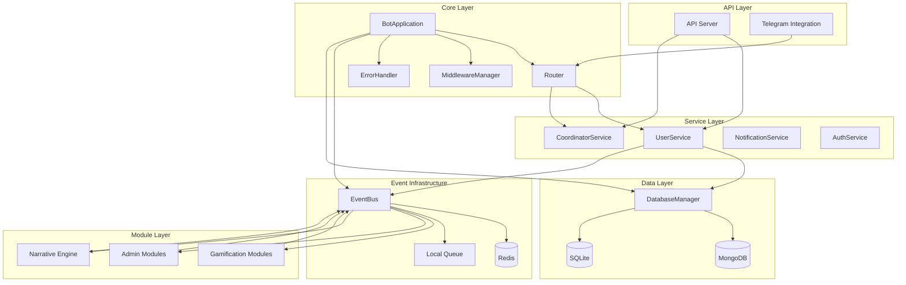

# Design Document

## Overview

This design establishes a comprehensive integration framework for the YABOT system, transforming the current modular architecture into a fully connected, event-driven ecosystem. The design creates the "electrical wiring" of the bot, enabling seamless communication between core services, gamification modules, administrative tools, narrative engines, and external APIs.

The integration follows a layered approach: Core Infrastructure → Service Integration → Module Orchestration → API Unification, ensuring each layer builds upon the previous one with clear separation of concerns and robust error handling.

## Steering Document Alignment

### Technical Standards (tech.md)
While no explicit tech.md was found, the design adheres to the established patterns in the codebase:
- **Event-driven architecture** using Redis Pub/Sub with local fallback
- **Dual-database strategy** maintaining MongoDB for dynamic state and SQLite for persistent data
- **Dependency injection** patterns for service orchestration
- **Resilient design** with graceful degradation and retry mechanisms
- **FastAPI** for REST API implementation following existing patterns

### Project Structure (structure.md)
The design follows the existing project organization:
- **src/core/** - Core infrastructure components
- **src/services/** - Business logic and orchestration services
- **src/modules/** - Feature-specific modules (gamification, admin, narrative)
- **src/api/** - External interface layer
- **src/events/** - Event-driven communication
- **src/database/** - Data persistence layer

## Code Reuse Analysis

### Existing Components to Leverage

- **ConfigManager**: Centralized configuration management for service connections
- **DatabaseManager**: Multi-database connection handling with health checks
- **EventBus**: Redis Pub/Sub infrastructure with local fallback and retry mechanisms
- **UserService**: Foundation for user state management across databases
- **ErrorHandler**: Consistent error handling with contextual logging
- **MiddlewareManager**: Request/response processing pipeline
- **Router**: Event and command routing infrastructure

### Integration Points

- **BotApplication**: Central orchestrator will be enhanced to manage service lifecycle
- **API Server**: FastAPI endpoints will be unified with internal service calls
- **Existing Modules**: Gamification, admin, and narrative modules will be connected through event subscriptions
- **Database Schemas**: Existing MongoDB and SQLite schemas will be leveraged for cross-module data sharing

## Architecture

The integration architecture follows a hub-and-spoke pattern with the EventBus as the central communication hub, allowing services to communicate asynchronously while maintaining loose coupling.



## Components and Interfaces

### ServiceRegistry
- **Purpose:** Centralizes service discovery and lifecycle management
- **Interfaces:**
  - `register_service(name, instance, dependencies)`
  - `get_service(name)`
  - `health_check_all()`
- **Dependencies:** ConfigManager
- **Reuses:** Extends existing service initialization patterns in BotApplication

### IntegrationManager
- **Purpose:** Orchestrates cross-service operations and event workflows
- **Interfaces:**
  - `coordinate_workflow(workflow_name, context)`
  - `register_workflow(workflow_definition)`
  - `handle_service_failure(service_name, error)`
- **Dependencies:** EventBus, ServiceRegistry
- **Reuses:** Built on existing CoordinatorService foundation

### EventSubscriptionManager
- **Purpose:** Manages event subscriptions and delivery across modules
- **Interfaces:**
  - `subscribe(event_type, handler, service_name)`
  - `unsubscribe(event_type, service_name)`
  - `publish_with_retry(event_type, payload)`
- **Dependencies:** EventBus
- **Reuses:** Extends existing EventBus publish/subscribe mechanisms

### ConnectionHealthMonitor
- **Purpose:** Monitors service connectivity and triggers recovery procedures
- **Interfaces:**
  - `monitor_service(service_name)`
  - `get_health_status()`
  - `trigger_recovery(failed_services)`
  - `get_performance_metrics()`
  - `check_circuit_breaker_status(service_name)`
- **Dependencies:** ServiceRegistry, DatabaseManager, EventBus
- **Reuses:** Leverages existing database health check patterns
- **Performance Targets:** Monitor < 100ms event latency, 99.9% uptime metrics

### GamificationIntegrator
- **Purpose:** Coordinates gamification module interactions through events
- **Interfaces:**
  - `process_wallet_transaction(user_id, amount, reason)`
  - `update_mission_progress(user_id, mission_id, progress)`
  - `trigger_achievement_check(user_id, action_type)`
- **Dependencies:** UserService, EventBus
- **Reuses:** Integrates existing gamification modules (besitos_wallet, daily_gift, mission_manager)

### NarrativeIntegrator
- **Purpose:** Connects narrative engine with user state and gamification data
- **Interfaces:**
  - `generate_personalized_content(user_id, context)`
  - `process_narrative_choice(user_id, choice_data)`
  - `update_story_progress(user_id, progress_data)`
- **Dependencies:** UserService, GamificationIntegrator, EventBus
- **Reuses:** Builds on existing narrative module foundation

## Data Models

### ServiceStatus
```python
class ServiceStatus:
    name: str
    status: Literal["healthy", "degraded", "failed"]
    last_check: datetime
    error_count: int
    dependencies: List[str]
    metadata: Dict[str, Any]
```

### IntegrationEvent
```python
class IntegrationEvent:
    event_id: str
    event_type: str
    source_service: str
    target_services: List[str]
    payload: Dict[str, Any]
    timestamp: datetime
    retry_count: int = 0
    correlation_id: Optional[str] = None
```

### WorkflowDefinition
```python
class WorkflowDefinition:
    name: str
    steps: List[WorkflowStep]
    timeout: int
    retry_policy: RetryPolicy
    error_handling: ErrorHandlingStrategy
```

### ServiceDependency
```python
class ServiceDependency:
    service_name: str
    depends_on: List[str]
    startup_order: int
    critical: bool = True
    fallback_strategy: Optional[str] = None
```

## Error Handling

### Error Scenarios

1. **Service Initialization Failure**
   - **Handling:** Log error, mark service as failed, continue with non-critical services
   - **User Impact:** Graceful degradation, specific features may be unavailable

2. **Database Connection Loss**
   - **Handling:** Queue operations locally, retry connection with exponential backoff
   - **User Impact:** Temporary delays, automatic recovery when connection restored

3. **Event Bus Disconnection**
   - **Handling:** Fall back to local event queue, attempt Redis reconnection
   - **User Impact:** Local events continue, cross-service coordination paused

4. **Module Subscription Failure**
   - **Handling:** Log subscription error, attempt re-registration, notify admin
   - **User Impact:** Specific module features affected, core functionality preserved

5. **Cross-Service Communication Timeout**
   - **Handling:** Implement circuit breaker pattern (5 failures in 30s triggers open state, 60s timeout), provide cached responses
   - **User Impact:** Fallback responses, degraded but functional experience
   - **Recovery:** Automatic half-open state testing every 60 seconds, full recovery after 3 successful calls

## Testing Strategy

### Unit Testing
- Test individual service registration and discovery
- Validate event subscription and publication mechanisms
- Test error handling and recovery procedures
- Mock external dependencies for isolated testing

### Integration Testing
- Test complete service startup sequence
- Validate cross-service communication flows
- Test database consistency across MongoDB and SQLite
- Verify event propagation across all modules
- Load testing: Validate 100 events/second throughput capacity
- Performance testing: Confirm < 100ms local event latency, < 500ms Redis event latency

### End-to-End Testing
- Test complete user workflows (registration, gamification actions, narrative interactions)
- Validate admin operations affect all connected services
- Test API endpoints produce same results as internal operations
- Verify system recovery after various failure scenarios

## Implementation Phases

### Phase 1: Core Infrastructure Integration
- Enhance BotApplication with ServiceRegistry
- Implement IntegrationManager for service coordination
- Extend EventBus with improved subscription management
- Add comprehensive health monitoring

### Phase 2: Service Layer Integration
- Connect UserService with all gamification modules
- Implement CoordinatorService for complex workflows
- Add authentication and authorization integration
- Establish consistent error handling across services

### Phase 3: Module Integration
- Connect gamification modules through event workflows
- Integrate narrative engine with user state data
- Implement admin module coordination
- Add cross-module data consistency mechanisms

### Phase 4: API Unification
- Unify REST API endpoints with internal services
- Implement API-level event publishing
- Add external system integration hooks
- Complete monitoring and observability features