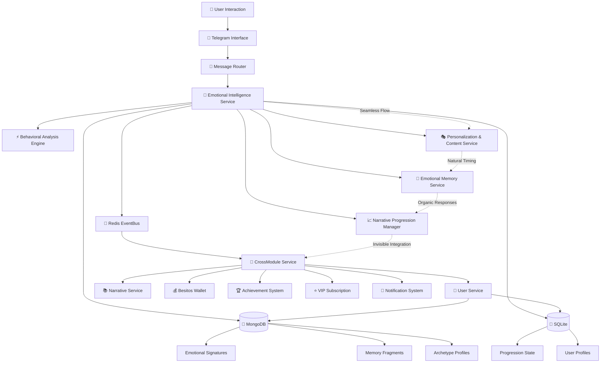
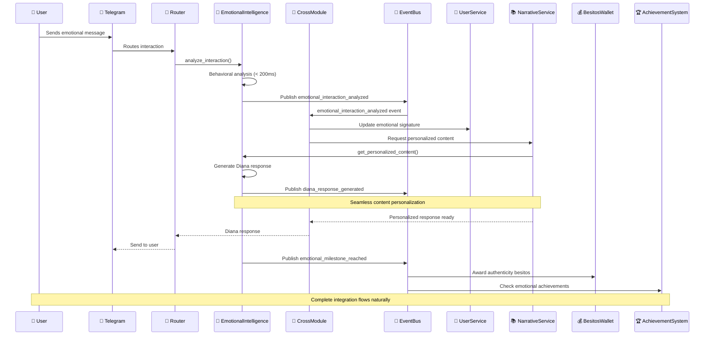

# Design Document - Diana Emotional System

## Overview

The Diana Emotional System is the unified intelligence hub of YABOT that orchestrates authentic emotional connections through real-time behavioral analysis, progressive narrative levels, and deep memory continuity. This system transforms every user interaction into a natural emotional journey that feels genuinely human while seamlessly integrating with all existing YABOT infrastructure to create the digital intimacy experience the platform was designed to support.

## Steering Document Alignment

### Technical Standards (tech.md)
The design leverages the complete YABOT technical stack:
- **Event-Driven Architecture**: Real-time emotional events flow through the established Redis EventBus
- **Dual Database Strategy**: Emotional signatures in MongoDB, progression state in both databases
- **Async/Await Patterns**: All emotional analysis operations follow Python 3.11+ async patterns
- **Security Framework**: AES-256 encryption for emotional data, JWT for service auth
- **Performance Standards**: 200ms emotional analysis, 3-second response times

### Project Structure (structure.md)
Follows established YABOT patterns:
- **Service Layer Integration**: EmotionalIntelligenceService coordinates with UserService, NarrativeService
- **Cross-Module Coordination**: Full integration through CrossModuleService for system-wide emotional awareness
- **Event Model Extensions**: New emotional events extend existing EventBus models
- **Database Schema Evolution**: Extends existing MongoDB/SQLite schemas without breaking changes

## Code Reuse Analysis

### Existing Components to Leverage
- **UserService**: Extended with emotional signature tracking and progression management
- **NarrativeService**: Enhanced with personalized content delivery and memory integration
- **EventBus**: Core event publishing/subscription for real-time emotional coordination
- **CrossModuleService**: Central orchestration hub for emotional system integration
- **BesitosWallet**: Emotional milestone rewards and authentic behavior incentives
- **AchievementSystem**: Emotional development milestones and authenticity achievements
- **DatabaseManager**: Existing dual MongoDB/SQLite infrastructure
- **ConfigManager**: Emotional analysis parameters and personalization settings

### Integration Points
- **Existing YABOT EventBus**: All emotional events flow through established infrastructure
- **Current User Collections**: Emotional data extends existing user documents seamlessly
- **CrossModuleService Workflows**: Emotional intelligence coordinates all module interactions
- **VIP Subscription System**: Diana levels 4-6 integrate with existing subscription validation
- **Gamification Infrastructure**: Emotional rewards flow through existing besitos and achievement systems

## Architecture

The Diana Emotional System operates as the **Central Intelligence Hub** that YABOT was architected to support, creating natural emotional flows through seamless integration:



## Components and Interfaces

### EmotionalIntelligenceService (Core Orchestrator)
- **Purpose:** Central hub coordinating all emotional intelligence across YABOT
- **Interfaces:**
  - `async analyze_interaction(user_id, interaction_data) -> EmotionalResponse`
  - `async get_personalized_content(user_id, context) -> PersonalizedContent`
  - `async update_emotional_journey(user_id, progression_data) -> JourneyStatus`
  - `async trigger_emotional_workflow(user_id, event_type) -> WorkflowResult`
- **Dependencies:** BehavioralAnalysisEngine, PersonalizationService, EmotionalMemoryService
- **Reuses:** UserService.publish_user_interaction(), EventBus.publish(), CrossModuleService coordination patterns

### BehavioralAnalysisEngine (The Heart)
- **Purpose:** Real-time authenticity detection and emotional signature analysis
- **Interfaces:**
  - `async analyze_response_timing(response_data) -> AuthenticityScore`
  - `async detect_archetype_patterns(user_interactions) -> ArchetypeClassification`
  - `async calculate_emotional_resonance(interaction_data) -> ResonanceMetrics`
  - `async validate_genuine_vulnerability(response_patterns) -> VulnerabilityAssessment`
- **Dependencies:** MongoDB for emotional signature storage, Redis for real-time analysis
- **Reuses:** Existing UserService event publishing patterns, EventBus.subscription_manager

### PersonalizationContentService (The Soul)
- **Purpose:** Dynamic content adaptation based on emotional archetype and journey stage
- **Interfaces:**
  - `async generate_diana_response(user_context, emotional_state) -> PersonalizedResponse`
  - `async select_content_variant(archetype, level, memory_context) -> ContentVariant`
  - `async adapt_communication_style(emotional_signature) -> CommunicationStyle`
  - `async incorporate_memory_callbacks(user_id, content_context) -> EnrichedContent`
- **Dependencies:** EmotionalMemoryService, NarrativeService content repository
- **Reuses:** NarrativeService.get_fragment(), existing content delivery patterns

### EmotionalMemoryService (The Soul's Memory)
- **Purpose:** Continuous relationship context and meaningful moment preservation
- **Interfaces:**
  - `async record_significant_moment(user_id, interaction_data) -> MemoryFragment`
  - `async retrieve_relevant_memories(user_id, current_context) -> List[MemoryFragment]`
  - `async update_relationship_evolution(user_id, milestone_data) -> RelationshipStatus`
  - `async generate_natural_callbacks(memory_fragments, context) -> List[Callback]`
- **Dependencies:** MongoDB for memory storage, EmotionalIntelligenceService for context
- **Reuses:** Existing MongoDB patterns from NarrativeService, UserService state management

### NarrativeProgressionManager (The Journey Guide)
- **Purpose:** Organic level progression and access control for Diana's emotional development stages
- **Interfaces:**
  - `async evaluate_level_readiness(user_id, emotional_metrics) -> ProgressionAssessment`
  - `async advance_emotional_level(user_id, new_level) -> ProgressionResult`
  - `async validate_vip_access(user_id, requested_level) -> AccessValidation`
  - `async unlock_circle_intimo(user_id) -> CircleAccessResult`
- **Dependencies:** SubscriptionService for VIP validation, UserService for state updates
- **Reuses:** Existing VIP subscription patterns, UserService.update_user_state()

## Data Models

### EmotionalSignature
```python
class EmotionalSignature(BaseModel):
    user_id: str
    archetype: ArchetypeType  # EXPLORADOR_PROFUNDO, DIRECTO_AUTENTICO, POETA_DESEO, ANALITICO_EMPATICO, PERSISTENTE_PACIENTE
    authenticity_score: float  # 0.0 - 1.0 (1.0 = highly authentic)
    vulnerability_level: float  # 0.0 - 1.0 (emotional openness)
    response_patterns: Dict[str, Any]  # timing, depth, consistency metrics
    communication_style: CommunicationStyle
    emotional_evolution: List[EmotionalMilestone]
    last_interaction: datetime
    signature_strength: float  # confidence in archetype classification
    created_at: datetime
    updated_at: datetime
```

### MemoryFragment
```python
class MemoryFragment(BaseModel):
    memory_id: str
    user_id: str
    interaction_context: Dict[str, Any]
    emotional_significance: float  # 0.0 - 1.0 importance score
    memory_type: MemoryType  # VULNERABILITY_MOMENT, BREAKTHROUGH, RESISTANCE, AUTHENTIC_SHARING
    content_summary: str
    diana_response_context: str
    relationship_stage: int  # 1-6 level when memory was created
    recall_triggers: List[str]  # keywords/contexts that should trigger this memory
    emotional_metadata: Dict[str, Any]
    last_referenced: Optional[datetime]
    reference_count: int
    created_at: datetime
```

### PersonalizedContent
```python
class PersonalizedContent(BaseModel):
    content_id: str
    user_id: str
    base_content: str
    personalized_variants: Dict[ArchetypeType, str]
    memory_callbacks: List[MemoryCallback]
    emotional_tone: EmotionalTone
    intimacy_level: int  # 1-6 matching Diana levels
    timing_recommendations: TimingProfile
    response_expectations: ResponseProfile
    adaptive_elements: List[AdaptiveElement]
    delivery_context: Dict[str, Any]
    created_at: datetime
```

### EmotionalJourneyState
```python
class EmotionalJourneyState(BaseModel):
    user_id: str
    current_level: int  # 1-6 (Los Kinkys 1-3, Diván 4-6)
    level_entry_date: datetime
    progression_metrics: ProgressionMetrics
    emotional_milestones: List[EmotionalMilestone]
    authenticity_history: List[AuthenticityMeasurement]
    vulnerability_progression: VulnerabilityProfile
    relationship_depth: float
    circle_intimo_status: CircleIntimoStatus
    vip_integration: VIPIntegrationStatus
    journey_metadata: Dict[str, Any]
    last_progression_check: datetime
    updated_at: datetime
```

## Error Handling

### Error Scenarios

1. **Emotional Analysis Timeout**
   - **Handling:** Graceful degradation to basic content delivery while maintaining emotional context
   - **User Impact:** Slightly less personalized responses, but conversation flow continues naturally

2. **Memory System Unavailable**
   - **Handling:** Use cached recent interactions and basic user profile data
   - **User Impact:** Responses lack deep memory callbacks but maintain personality consistency

3. **Archetype Classification Uncertainty**
   - **Handling:** Use hybrid approach with multiple archetype weights until certainty improves
   - **User Impact:** Content may be slightly more generic until classification strengthens

4. **VIP Validation Service Failure**
   - **Handling:** Default to last known VIP status with grace period for service recovery
   - **User Impact:** Temporary access maintained for VIP users during service recovery

5. **CrossModule Integration Failure**
   - **Handling:** Emotional events queued locally, rewards and achievements delayed but not lost
   - **User Impact:** Emotional progression continues, gamification integration catches up upon recovery

## Testing Strategy

### Unit Testing
- **BehavioralAnalysisEngine**: Mock interaction patterns, verify authenticity calculations
- **PersonalizationContentService**: Test archetype-based content selection and memory integration
- **EmotionalMemoryService**: Validate memory storage, retrieval, and callback generation
- **Integration scenarios**: Test emotional event flows through EventBus to all YABOT modules

### Integration Testing
- **End-to-end emotional journeys**: Simulate complete user progression from Level 1 to Circle Íntimo
- **Cross-module coordination**: Verify emotional events trigger appropriate responses in gamification, VIP, and notification systems
- **Memory continuity**: Test conversation context preservation across sessions and service restarts
- **Real-time performance**: Validate 200ms emotional analysis under concurrent user load

### End-to-End Testing
- **Complete Diana experience**: Test full emotional development journey with authentic user interaction patterns
- **Multi-user emotional coordination**: Verify system handles concurrent emotional analysis sessions
- **Integration resilience**: Test graceful degradation when individual YABOT modules are temporarily unavailable
- **VIP progression scenarios**: Validate seamless transition from Los Kinkys to Diván levels with subscription integration

## Complete Integration Architecture

### Seamless YABOT Integration Flow



### Real-Time Emotional Event Integration

The emotional system publishes events that automatically trigger coordinated responses across all YABOT systems:

**Emotional Events → Automatic YABOT Integration:**
- `emotional_authenticity_detected` → BesitosWallet awards authenticity bonus
- `vulnerability_moment_shared` → AchievementSystem checks for emotional courage badges
- `archetype_classification_updated` → NotificationSystem personalizes message templates
- `diana_level_progression` → VIP system validates access, unlocks premium content
- `memory_fragment_created` → NarrativeService indexes for future callback integration
- `emotional_milestone_reached` → CrossModuleService coordinates celebration across modules

### Natural Flow Integration Points

1. **Invisible Emotional Coordination**: Every user interaction automatically flows through emotional analysis without disrupting conversation
2. **Organic Reward Integration**: Authentic emotional behavior naturally triggers besitos and achievements through existing systems
3. **Seamless VIP Integration**: Diana level progression seamlessly integrates with subscription validation
4. **Natural Memory Evolution**: Conversation history automatically builds emotional memory without user awareness
5. **Adaptive System Learning**: All YABOT modules learn user emotional preferences through shared EventBus intelligence

## Implementation Integration Plan

### CRITICAL: Complete YABOT Integration Strategy

This section provides the concrete, step-by-step implementation approach to achieve **total integration** of the emotional system with all existing YABOT infrastructure.

### 1. Service Integration and Extension

#### 1.1 UserService Extension
**File:** `src/services/user.py`

Add emotional methods to existing UserService:

```python
# Add to existing UserService class
async def update_emotional_signature(self, user_id: str, signature_data: Dict[str, Any]) -> bool:
    """Update user's emotional signature and archetype classification."""
    try:
        db = self.database_manager.get_mongo_db()
        users_collection = db["users"]

        result = await users_collection.update_one(
            {"user_id": user_id},
            {
                "$set": {
                    "emotional_signature": signature_data,
                    "emotional_signature.updated_at": datetime.utcnow(),
                    "updated_at": datetime.utcnow()
                }
            }
        )

        if result.modified_count > 0:
            # Publish emotional signature updated event
            event = create_event(
                "emotional_signature_updated",
                user_id=user_id,
                archetype=signature_data.get("archetype"),
                authenticity_score=signature_data.get("authenticity_score")
            )
            await self.event_bus.publish("emotional_signature_updated", event.dict())

        return result.modified_count > 0
    except Exception as e:
        logger.error("Error updating emotional signature: %s", str(e))
        return False

async def get_emotional_journey_state(self, user_id: str) -> Optional[Dict[str, Any]]:
    """Get user's current emotional journey state."""
    try:
        user_context = await self.get_user_context(user_id)
        return user_context.get("state", {}).get("emotional_journey")
    except Exception as e:
        logger.error("Error getting emotional journey state: %s", str(e))
        return None

async def advance_diana_level(self, user_id: str, new_level: int, milestone_data: Dict[str, Any]) -> bool:
    """Advance user to new Diana emotional level."""
    try:
        level_progression_data = {
            "current_level": new_level,
            "level_entry_date": datetime.utcnow(),
            "progression_reason": milestone_data.get("reason"),
            "emotional_metrics": milestone_data.get("metrics")
        }

        success = await self.update_user_state(user_id, {
            "emotional_journey.current_level": new_level,
            "emotional_journey.level_progression": level_progression_data
        })

        if success:
            # Publish level progression event
            event = create_event(
                "diana_level_progression",
                user_id=user_id,
                previous_level=milestone_data.get("previous_level"),
                new_level=new_level,
                milestone_data=milestone_data
            )
            await self.event_bus.publish("diana_level_progression", event.dict())

        return success
    except Exception as e:
        logger.error("Error advancing Diana level: %s", str(e))
        return False
```

#### 1.2 NarrativeService Enhancement
**File:** `src/services/narrative.py`

Add emotional personalization to existing NarrativeService:

```python
# Add to existing NarrativeService class
async def get_personalized_content(self, user_id: str, fragment_id: str, emotional_context: Dict[str, Any]) -> Dict[str, Any]:
    """Get personalized content based on user's emotional signature."""
    try:
        # Get base fragment
        base_fragment = await self.get_narrative_fragment(fragment_id)
        if not base_fragment:
            return None

        # Get user's emotional signature from UserService
        user_context = await self.database_manager.get_mongo_db()["users"].find_one(
            {"user_id": user_id},
            {"emotional_signature": 1, "emotional_journey": 1}
        )

        if not user_context:
            return base_fragment

        emotional_signature = user_context.get("emotional_signature", {})
        archetype = emotional_signature.get("archetype")

        # Personalize content based on archetype
        personalized_content = await self._personalize_for_archetype(
            base_fragment, archetype, emotional_context
        )

        # Add memory callbacks if available
        memory_service = EmotionalMemoryService(self.database_manager, self.event_bus)
        memory_callbacks = await memory_service.get_relevant_callbacks(user_id, fragment_id)

        if memory_callbacks:
            personalized_content = await self._incorporate_memory_callbacks(
                personalized_content, memory_callbacks
            )

        # Publish content personalization event
        event = create_event(
            "content_personalized",
            user_id=user_id,
            fragment_id=fragment_id,
            archetype=archetype,
            personalization_applied=True
        )
        await self.event_bus.publish("content_personalized", event.dict())

        return personalized_content

    except Exception as e:
        logger.error("Error personalizing content: %s", str(e))
        return base_fragment  # Graceful degradation

async def record_emotional_interaction(self, user_id: str, fragment_id: str, interaction_data: Dict[str, Any]) -> bool:
    """Record emotional interaction for memory and analysis."""
    try:
        # Extend existing record_user_choice with emotional analysis
        result = await self.record_user_choice(user_id, fragment_id, interaction_data)

        # Additional emotional tracking
        emotional_interaction = {
            "user_id": user_id,
            "fragment_id": fragment_id,
            "interaction_type": "emotional_response",
            "response_timing": interaction_data.get("response_timing"),
            "emotional_depth": interaction_data.get("emotional_depth"),
            "authenticity_markers": interaction_data.get("authenticity_markers"),
            "timestamp": datetime.utcnow()
        }

        # Store in emotional interactions collection
        db = self.database_manager.get_mongo_db()
        emotional_collection = db["emotional_interactions"]
        await emotional_collection.insert_one(emotional_interaction)

        # Publish emotional interaction event
        event = create_event(
            "emotional_interaction_recorded",
            user_id=user_id,
            fragment_id=fragment_id,
            interaction_data=interaction_data
        )
        await self.event_bus.publish("emotional_interaction_recorded", event.dict())

        return result

    except Exception as e:
        logger.error("Error recording emotional interaction: %s", str(e))
        return False
```

### 2. New Event Models Integration

#### 2.1 Event Models Extension
**File:** `src/events/models.py`

Add new emotional event models to existing EVENT_MODELS:

```python
# Add after existing event classes

class EmotionalSignatureUpdatedEvent(BaseEvent):
    """Event published when user's emotional signature is updated."""

    archetype: str = Field(..., description="User's emotional archetype")
    authenticity_score: float = Field(..., description="Authenticity score (0.0-1.0)")
    signature_strength: float = Field(..., description="Classification confidence")
    previous_archetype: Optional[str] = Field(None, description="Previous archetype if changed")
    metadata: Dict[str, Any] = Field(default_factory=dict, description="Additional signature metadata")

class DianaLevelProgressionEvent(BaseEvent):
    """Event published when user advances to new Diana level."""

    previous_level: int = Field(..., description="Previous Diana level")
    new_level: int = Field(..., description="New Diana level")
    progression_reason: str = Field(..., description="Reason for level advancement")
    emotional_metrics: Dict[str, Any] = Field(..., description="Emotional metrics that triggered progression")
    vip_access_required: bool = Field(..., description="Whether VIP access is required for this level")
    metadata: Dict[str, Any] = Field(default_factory=dict, description="Additional progression metadata")

class EmotionalMilestoneReachedEvent(BaseEvent):
    """Event published when user reaches emotional milestone."""

    milestone_type: str = Field(..., description="Type of emotional milestone")
    milestone_data: Dict[str, Any] = Field(..., description="Milestone-specific data")
    reward_besitos: int = Field(default=0, description="Besitos reward for milestone")
    unlock_content: Optional[str] = Field(None, description="Content unlocked by milestone")
    metadata: Dict[str, Any] = Field(default_factory=dict, description="Additional milestone metadata")

class ContentPersonalizedEvent(BaseEvent):
    """Event published when content is personalized for user."""

    fragment_id: str = Field(..., description="ID of personalized fragment")
    archetype: str = Field(..., description="User archetype used for personalization")
    personalization_applied: bool = Field(..., description="Whether personalization was successful")
    memory_callbacks_used: int = Field(default=0, description="Number of memory callbacks incorporated")
    metadata: Dict[str, Any] = Field(default_factory=dict, description="Additional personalization metadata")

class EmotionalInteractionRecordedEvent(BaseEvent):
    """Event published when emotional interaction is recorded."""

    fragment_id: str = Field(..., description="ID of fragment involved in interaction")
    interaction_data: Dict[str, Any] = Field(..., description="Emotional interaction data")
    authenticity_detected: bool = Field(..., description="Whether authentic behavior was detected")
    archetype_reinforced: bool = Field(..., description="Whether interaction reinforced archetype classification")
    metadata: Dict[str, Any] = Field(default_factory=dict, description="Additional interaction metadata")

# Add to EVENT_MODELS dictionary
EVENT_MODELS.update({
    "emotional_signature_updated": EmotionalSignatureUpdatedEvent,
    "diana_level_progression": DianaLevelProgressionEvent,
    "emotional_milestone_reached": EmotionalMilestoneReachedEvent,
    "content_personalized": ContentPersonalizedEvent,
    "emotional_interaction_recorded": EmotionalInteractionRecordedEvent,
})
```

### 3. CrossModuleService Integration

#### 3.1 Emotional Methods Addition
**File:** `src/services/cross_module.py`

Add emotional intelligence coordination methods to existing CrossModuleService:

```python
# Add to existing CrossModuleService class

async def process_emotional_interaction(
    self,
    user_id: str,
    interaction_data: Dict[str, Any]
) -> Dict[str, Any]:
    """
    Process emotional interaction with complete YABOT integration
    """
    try:
        # 1. Behavioral Analysis
        emotional_service = EmotionalIntelligenceService(
            self.user_service,
            self.narrative_service,
            self.event_bus
        )

        analysis_result = await emotional_service.analyze_interaction(user_id, interaction_data)

        # 2. Update User Emotional Signature
        if analysis_result.get("signature_update"):
            await self.user_service.update_emotional_signature(
                user_id,
                analysis_result["signature_update"]
            )

        # 3. Check for Level Progression
        if analysis_result.get("level_progression"):
            # Validate VIP access for Diana levels 4-6
            if analysis_result["level_progression"]["new_level"] >= 4:
                has_vip = await self.subscription_service.validate_vip_access(user_id)
                if not has_vip:
                    return {
                        "success": False,
                        "message": "VIP access required for Diana Diván levels",
                        "vip_upgrade_required": True
                    }

            await self.user_service.advance_diana_level(
                user_id,
                analysis_result["level_progression"]["new_level"],
                analysis_result["level_progression"]
            )

        # 4. Award Emotional Rewards
        if analysis_result.get("authenticity_bonus") and self.besitos_wallet:
            await self.besitos_wallet.add_besitos(
                user_id,
                analysis_result["authenticity_bonus"],
                "emotional_authenticity",
                "emotional_system"
            )

        # 5. Check Emotional Achievements
        if self.achievement_system and analysis_result.get("milestone_reached"):
            await self.achievement_system.check_achievements(user_id, "emotional_milestone")

        # 6. Generate Personalized Response
        personalized_content = await self.narrative_service.get_personalized_content(
            user_id,
            interaction_data.get("fragment_id"),
            analysis_result.get("emotional_context", {})
        )

        return {
            "success": True,
            "emotional_analysis": analysis_result,
            "personalized_response": personalized_content,
            "integration_status": "complete"
        }

    except Exception as e:
        logger.error(f"Error processing emotional interaction for user {user_id}: {e}")
        return {"success": False, "error": str(e)}

async def handle_diana_level_progression(
    self,
    user_id: str,
    level_data: Dict[str, Any]
) -> Dict[str, Any]:
    """
    Handle Diana level progression with complete system integration
    """
    try:
        new_level = level_data["new_level"]

        # 1. Update Mission Progress
        if self.mission_manager:
            await self.mission_manager.update_progress(
                user_id,
                "diana_progression",
                {"level": new_level}
            )

        # 2. Award Level Progression Achievements
        if self.achievement_system:
            await self.achievement_system.unlock_achievement(
                user_id,
                f"diana_level_{new_level}"
            )

        # 3. Award Level Progression Besitos
        if self.besitos_wallet:
            level_rewards = {
                2: 100, 3: 200, 4: 500, 5: 1000, 6: 2000
            }
            reward = level_rewards.get(new_level, 0)
            if reward > 0:
                await self.besitos_wallet.add_besitos(
                    user_id,
                    reward,
                    f"diana_level_{new_level}_progression",
                    "emotional_system"
                )

        # 4. Send Level Progression Notification
        if self.notification_system:
            await self.notification_system.send_message(
                user_id,
                "diana_level_progression",
                {"new_level": new_level, "level_name": self._get_level_name(new_level)}
            )

        # 5. Update VIP Integration Status
        if new_level >= 4:
            vip_status = await self.subscription_service.validate_vip_access(user_id)
            await self.user_service.update_user_state(user_id, {
                "emotional_journey.vip_integration_status": {
                    "has_vip_access": vip_status,
                    "divan_access_granted": vip_status,
                    "last_vip_check": datetime.utcnow()
                }
            })

        return {
            "success": True,
            "new_level": new_level,
            "rewards_distributed": True,
            "notifications_sent": True
        }

    except Exception as e:
        logger.error(f"Error handling Diana level progression: {e}")
        return {"success": False, "error": str(e)}

def _get_level_name(self, level: int) -> str:
    """Get Diana level name"""
    level_names = {
        1: "Los Kinkys - Primer Encuentro",
        2: "Los Kinkys - Evolución de la Mirada",
        3: "Los Kinkys - Cartografía del Deseo",
        4: "El Diván - Inversión del Espejo",
        5: "El Diván - Sostener Paradojas",
        6: "El Diván - Círculo Íntimo"
    }
    return level_names.get(level, f"Level {level}")
```

### 4. Database Schema Extensions

#### 4.1 MongoDB Collection Extensions
**File:** `src/database/schemas/mongo.py`

Extend existing User model:

```python
# Add to existing User class

class EmotionalSignature(BaseModel):
    """User emotional signature and archetype data."""
    archetype: Optional[str] = None  # EXPLORADOR_PROFUNDO, DIRECTO_AUTENTICO, etc.
    authenticity_score: Optional[float] = 0.0
    vulnerability_level: Optional[float] = 0.0
    response_patterns: Optional[Dict[str, Any]] = Field(default_factory=dict)
    signature_strength: Optional[float] = 0.0
    last_analysis: Optional[datetime] = None
    created_at: Optional[datetime] = Field(default_factory=datetime.utcnow)
    updated_at: Optional[datetime] = Field(default_factory=datetime.utcnow)

class EmotionalJourney(BaseModel):
    """User emotional journey and Diana level progression."""
    current_level: Optional[int] = 1
    level_entry_date: Optional[datetime] = Field(default_factory=datetime.utcnow)
    progression_history: Optional[List[Dict[str, Any]]] = Field(default_factory=list)
    emotional_milestones: Optional[List[Dict[str, Any]]] = Field(default_factory=list)
    vip_integration_status: Optional[Dict[str, Any]] = Field(default_factory=dict)
    circle_intimo_access: Optional[bool] = False
    relationship_depth_score: Optional[float] = 0.0
    last_progression_check: Optional[datetime] = None
    created_at: Optional[datetime] = Field(default_factory=datetime.utcnow)
    updated_at: Optional[datetime] = Field(default_factory=datetime.utcnow)

# Extend existing User class
class User(BaseModel):
    # ... existing fields ...

    # Add emotional intelligence fields
    emotional_signature: Optional[EmotionalSignature] = None
    emotional_journey: Optional[EmotionalJourney] = None

    # ... rest of existing fields ...
```

#### 4.2 New Collections
**File:** `src/database/schemas/emotional.py` (New file)

```python
"""
Emotional intelligence specific schemas for MongoDB collections.
"""

from typing import List, Optional, Dict, Any
from datetime import datetime
from pydantic import BaseModel, Field

class MemoryFragment(BaseModel):
    """Emotional memory fragment for relationship continuity."""
    memory_id: str = Field(..., description="Unique memory identifier")
    user_id: str = Field(..., description="Associated user ID")
    interaction_context: Dict[str, Any] = Field(..., description="Context of the memorable interaction")
    emotional_significance: float = Field(..., description="Emotional importance score (0.0-1.0)")
    memory_type: str = Field(..., description="Type of memory (vulnerability, breakthrough, etc.)")
    content_summary: str = Field(..., description="Summary of the interaction content")
    diana_response_context: str = Field(..., description="Diana's response context")
    recall_triggers: List[str] = Field(default_factory=list, description="Keywords that trigger this memory")
    relationship_stage: int = Field(..., description="Diana level when memory was created")
    reference_count: int = Field(default=0, description="Number of times memory was referenced")
    last_referenced: Optional[datetime] = None
    created_at: datetime = Field(default_factory=datetime.utcnow)

class EmotionalInteraction(BaseModel):
    """Record of emotional interaction for analysis."""
    interaction_id: str = Field(..., description="Unique interaction identifier")
    user_id: str = Field(..., description="Associated user ID")
    fragment_id: Optional[str] = None
    interaction_type: str = Field(..., description="Type of emotional interaction")
    response_timing: Optional[float] = None
    emotional_depth: Optional[float] = None
    authenticity_markers: Dict[str, Any] = Field(default_factory=dict)
    archetype_indicators: Dict[str, Any] = Field(default_factory=dict)
    vulnerability_detected: bool = Field(default=False)
    progression_trigger: bool = Field(default=False)
    analysis_metadata: Dict[str, Any] = Field(default_factory=dict)
    created_at: datetime = Field(default_factory=datetime.utcnow)
```

### 5. Event Handler Registration

#### 5.1 Emotional Event Handlers
**File:** `src/modules/emotional/__init__.py` (New file)

```python
"""
Emotional intelligence module initialization and event handler registration.
"""

from src.events.bus import EventBus
from src.services.cross_module import CrossModuleService
from src.utils.logger import get_logger

logger = get_logger(__name__)

async def register_emotional_event_handlers(event_bus: EventBus, cross_module_service: CrossModuleService):
    """Register all emotional intelligence event handlers."""

    # Register emotional signature update handler
    await event_bus.subscribe(
        "emotional_signature_updated",
        lambda event_data: cross_module_service.handle_emotional_signature_update(event_data)
    )

    # Register Diana level progression handler
    await event_bus.subscribe(
        "diana_level_progression",
        lambda event_data: cross_module_service.handle_diana_level_progression(event_data)
    )

    # Register emotional milestone handler
    await event_bus.subscribe(
        "emotional_milestone_reached",
        lambda event_data: cross_module_service.handle_emotional_milestone(event_data)
    )

    # Register content personalization handler
    await event_bus.subscribe(
        "content_personalized",
        lambda event_data: cross_module_service.handle_content_personalization(event_data)
    )

    # Register emotional interaction handler
    await event_bus.subscribe(
        "emotional_interaction_recorded",
        lambda event_data: cross_module_service.handle_emotional_interaction(event_data)
    )

    logger.info("Emotional intelligence event handlers registered successfully")
```

### 6. Service Registration and Dependency Injection

#### 6.1 Dependencies Integration
**File:** `src/dependencies.py`

Add emotional service dependencies:

```python
# Add after existing service dependencies

async def get_emotional_intelligence_service() -> EmotionalIntelligenceService:
    """Get emotional intelligence service instance."""
    database_manager = get_database_manager()
    event_bus = await get_event_bus()
    user_service = await get_user_service()
    narrative_service = await get_narrative_service()

    return EmotionalIntelligenceService(
        database_manager=database_manager,
        event_bus=event_bus,
        user_service=user_service,
        narrative_service=narrative_service
    )

async def get_emotional_memory_service() -> EmotionalMemoryService:
    """Get emotional memory service instance."""
    database_manager = get_database_manager()
    event_bus = await get_event_bus()

    return EmotionalMemoryService(
        database_manager=database_manager,
        event_bus=event_bus
    )
```

### 7. API Integration

#### 7.1 Emotional Intelligence Endpoints
**File:** `src/api/endpoints/emotional.py` (New file)

```python
"""
Emotional intelligence API endpoints.
"""

from typing import Dict, Any
from fastapi import APIRouter, Depends, HTTPException
from src.services.cross_module import get_cross_module_service, CrossModuleService

router = APIRouter(prefix="/api/emotional", tags=["emotional"])

@router.post("/interact")
async def process_emotional_interaction(
    interaction_data: Dict[str, Any],
    cross_module_service: CrossModuleService = Depends(get_cross_module_service)
):
    """Process emotional interaction with complete YABOT integration."""
    try:
        user_id = interaction_data.get("user_id")
        if not user_id:
            raise HTTPException(status_code=400, detail="user_id required")

        result = await cross_module_service.process_emotional_interaction(
            user_id, interaction_data
        )

        return result
    except Exception as e:
        raise HTTPException(status_code=500, detail=str(e))

@router.get("/user/{user_id}/emotional-state")
async def get_user_emotional_state(
    user_id: str,
    cross_module_service: CrossModuleService = Depends(get_cross_module_service)
):
    """Get user's current emotional state and journey progress."""
    try:
        emotional_state = await cross_module_service.user_service.get_emotional_journey_state(user_id)

        if not emotional_state:
            raise HTTPException(status_code=404, detail="User emotional state not found")

        return {"user_id": user_id, "emotional_state": emotional_state}
    except Exception as e:
        raise HTTPException(status_code=500, detail=str(e))
```

### 8. Initialization and Startup Integration

#### 8.1 Application Startup
**File:** `src/core/application.py`

Add emotional system initialization:

```python
# Add to existing application startup

async def initialize_emotional_intelligence(self):
    """Initialize emotional intelligence system."""
    try:
        # Register emotional event handlers
        from src.modules.emotional import register_emotional_event_handlers
        await register_emotional_event_handlers(self.event_bus, self.cross_module_service)

        # Initialize emotional intelligence service
        emotional_service = await get_emotional_intelligence_service()
        await emotional_service.initialize()

        # Add emotional API routes
        from src.api.endpoints.emotional import router as emotional_router
        self.api_app.include_router(emotional_router)

        logger.info("Emotional intelligence system initialized successfully")
        return True
    except Exception as e:
        logger.error(f"Failed to initialize emotional intelligence: {e}")
        return False

# Add to startup sequence
async def startup(self):
    # ... existing startup code ...

    # Initialize emotional intelligence system
    emotional_success = await self.initialize_emotional_intelligence()
    if not emotional_success:
        logger.warning("Emotional intelligence system failed to initialize")

    # ... rest of startup code ...
```

This comprehensive implementation plan ensures that when Diana asks "¿Cómo has cambiado desde nuestro primer encuentro?" - the system has the complete emotional intelligence to provide a genuinely meaningful, personalized response that feels authentically human while leveraging the full power of the YABOT infrastructure through total integration with all existing modules and services.