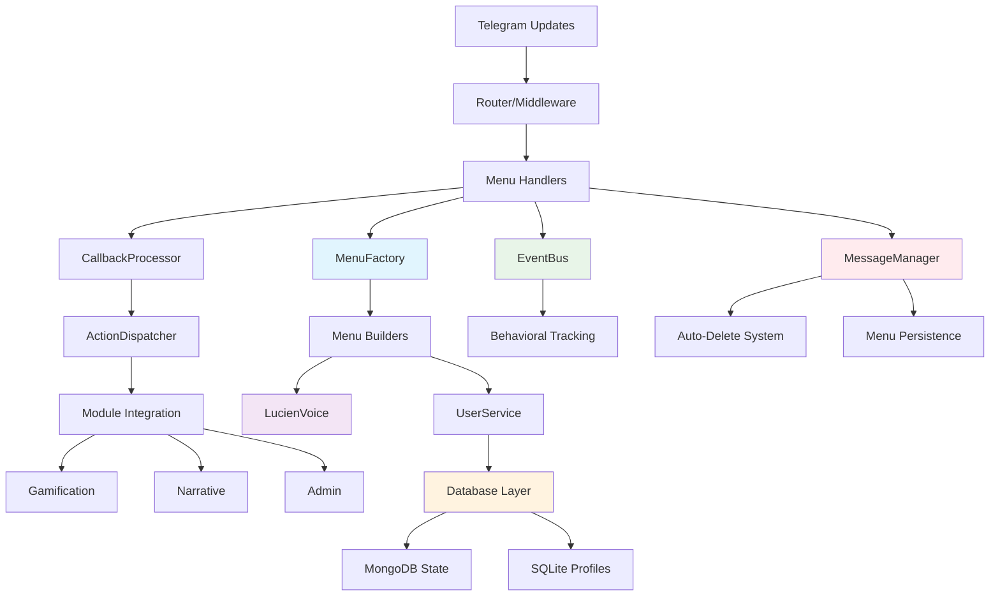

# Design Document - Menu System

## Overview

The menu system design creates a fully functional Telegram bot interface that integrates the existing MenuFactory architecture with comprehensive handlers, callbacks, and routers. The system provides seamless user interaction through organic menu principles, role-based access control, Lucien's sophisticated personality integration, and **automatic message management to maintain a clean chat experience**.

A key design principle is **chat cleanliness**: the system automatically deletes system messages and notifications, keeping only the main menu visible at all times for an optimal user experience.

The design builds upon YABOT's existing infrastructure including the MenuFactory, UserService, EventBus, and Lucien voice generation systems to create a cohesive, scalable, and maintainable menu interaction layer.

## Steering Document Alignment

### Technical Standards (tech.md)
- **Event-Driven Architecture**: Leverages existing Redis EventBus with Pub/Sub messaging for menu interactions
- **Dual Database Strategy**: Integrates with MongoDB for dynamic menu state and SQLite for user profiles
- **Async/Await Patterns**: Follows Python 3.11+ modern asynchronous programming standards
- **Service Pattern**: Implements single responsibility services with dependency injection
- **Repository Pattern**: Uses existing database managers for abstraction
- **Security Framework**: Implements JWT authentication and input validation for callback data

### Project Structure (structure.md)
- **Handler Organization**: Follows `src/handlers/` pattern with base handler inheritance
- **Service Layer**: Integrates with `src/services/` for user management and coordination
- **Module Pattern**: Connects with `src/modules/` for gamification, narrative, and admin features
- **Event System**: Uses `src/events/` for behavioral tracking and user interaction events
- **UI Components**: Extends `src/ui/` with menu factory and Lucien voice integration

## Code Reuse Analysis

### Existing Components to Leverage

- **MenuFactory (`src/ui/menu_factory.py`)**: Complete menu generation system with organic principles, role-based access, and Lucien voice integration
- **CommandHandler (`src/handlers/telegram_commands.py`)**: Existing command processing with Lucien evaluation tracking
- **BaseHandler (`src/handlers/base.py`)**: Abstract base class for standardized response creation
- **UserService (`src/services/user.py`)**: User context management and behavioral assessment tracking
- **EventBus (`src/events/bus.py`)**: Redis-based event publishing for user interactions
- **LucienVoiceGenerator (`src/ui/lucien_voice_generator.py`)**: Sophisticated personality system with relationship levels

### Integration Points

- **Telegram Bot Framework**: Aiogram 3.0 integration through existing router and middleware
- **Database Layer**: MongoDB for menu state, SQLite for user profiles through DatabaseManager
- **Cache System**: Existing cache manager for menu optimization and performance
- **Behavioral Tracking**: Emotional intelligence system for worthiness scoring and user archetype detection
- **VIP System**: Subscription management and access control through existing admin modules

## Architecture

The menu system follows a layered architecture with **automatic message management** for chat cleanliness:



## Components and Interfaces

### MenuHandlerSystem (New Component)
- **Purpose:** Central coordinator for all menu-related interactions with automatic message cleanup
- **Interfaces:**
  - `handle_command(message: Message) -> CommandResponse`
  - `handle_callback(callback_query: CallbackQuery) -> CommandResponse`
  - `get_menu_for_context(user_context: Dict) -> Menu`
  - `cleanup_previous_messages(chat_id: int, user_id: int) -> None`
- **Dependencies:** MenuFactory, UserService, EventBus, MessageManager
- **Reuses:** Existing CommandHandler pattern, BaseHandler response creation

### MessageManager (New Component)
- **Purpose:** Manages chat cleanliness by tracking and automatically deleting system messages
- **Interfaces:**
  - `track_message(chat_id: int, message_id: int, message_type: str, ttl: int) -> None`
  - `delete_old_messages(chat_id: int) -> None`
  - `update_main_menu(chat_id: int, new_menu: Menu) -> int`
  - `preserve_main_menu(chat_id: int, message_id: int) -> None`
- **Dependencies:** Telegram Bot API, Redis cache for message tracking
- **Reuses:** Existing cache manager for temporary data storage

### CallbackProcessor (New Component)
- **Purpose:** Processes Telegram callback queries and routes to appropriate actions with message cleanup
- **Interfaces:**
  - `process_callback(callback_data: str, user_context: Dict) -> ActionResult`
  - `validate_callback_data(data: str) -> bool`
  - `compress_callback_data(data: str) -> str`
  - `cleanup_after_callback(chat_id: int) -> None`
- **Dependencies:** MenuFactory, ActionDispatcher, MessageManager
- **Reuses:** Existing callback data compression from MenuFactory

### ActionDispatcher (New Component)
- **Purpose:** Routes menu actions to appropriate modules and services
- **Interfaces:**
  - `dispatch_action(action_type: str, action_data: str, user_context: Dict) -> ActionResult`
  - `register_action_handler(action_type: str, handler: ActionHandler) -> None`
- **Dependencies:** Module registry, service layer
- **Reuses:** Existing module pattern and service coordination

### MenuIntegrationRouter (New Component)
- **Purpose:** Telegram bot router specifically for menu interactions with message lifecycle management
- **Interfaces:**
  - `route_message(message: Message) -> Handler`
  - `route_callback(callback_query: CallbackQuery) -> Handler`
- **Dependencies:** Existing router pattern, handler registry, MessageManager
- **Reuses:** Core router architecture and middleware pipeline

### TelegramMenuRenderer (New Component)
- **Purpose:** Converts Menu objects to Telegram inline keyboards with edit message capability
- **Interfaces:**
  - `render_menu(menu: Menu) -> InlineKeyboardMarkup`
  - `render_menu_response(menu: Menu, edit_message: bool = True) -> CommandResponse`
  - `edit_existing_menu(chat_id: int, message_id: int, new_menu: Menu) -> bool`
- **Dependencies:** MenuFactory Menu objects, Telegram types, MessageManager
- **Reuses:** Existing CommandResponse creation from BaseHandler

## Data Models

### MenuInteractionEvent (New Model)
```python
@dataclass
class MenuInteractionEvent:
    user_id: str
    menu_id: str
    action_type: str
    action_data: str
    timestamp: datetime
    user_context: Dict[str, Any]
    lucien_assessment: Optional[BehavioralAssessment]
    message_cleanup_triggered: bool = False
```

### CallbackActionResult (New Model)
```python
@dataclass
class CallbackActionResult:
    success: bool
    response_message: str
    new_menu: Optional[Menu]
    user_context_updates: Dict[str, Any]
    events_to_publish: List[Dict[str, Any]]
    should_edit_menu: bool = True
    cleanup_messages: bool = True
```

### MessageTrackingRecord (New Model)
```python
@dataclass
class MessageTrackingRecord:
    chat_id: int
    message_id: int
    message_type: str  # 'main_menu', 'notification', 'system_message', 'temporary'
    created_at: datetime
    ttl_seconds: int
    should_delete: bool = True
    is_main_menu: bool = False
```

### MenuNavigationContext (New Model)
```python
@dataclass
class MenuNavigationContext:
    current_menu_id: str
    navigation_path: List[str]
    user_context: Dict[str, Any]
    session_data: Dict[str, Any]
    main_menu_message_id: Optional[int] = None
    chat_cleanup_enabled: bool = True
```

## Chat Cleanliness Strategy

### Message Management Rules

1. **Main Menu Persistence**: The main menu message is always preserved and updated in-place
2. **Automatic Cleanup**: System notifications, temporary messages, and responses are automatically deleted
3. **TTL-Based Deletion**: Different message types have different time-to-live values
4. **Edit Over Send**: Menu updates use `edit_message` instead of sending new messages

### Message Types and TTL

```python
MESSAGE_TTL_CONFIG = {
    'main_menu': -1,  # Never delete (preserved)
    'system_notification': 5,  # 5 seconds
    'error_message': 10,  # 10 seconds
    'success_feedback': 3,  # 3 seconds
    'loading_message': 2,  # 2 seconds
    'temporary_info': 8,  # 8 seconds
    'lucien_response': 6,  # 6 seconds (for standalone responses)
}
```

### Cleanup Triggers

1. **On Menu Navigation**: Cleanup previous messages when displaying new menu
2. **After Callback Processing**: Remove temporary messages after action completion
3. **Periodic Cleanup**: Background task to remove expired messages
4. **User Command**: Immediate cleanup when user sends new command

## Error Handling

### Error Scenarios

1. **Invalid Callback Data**
   - **Handling:** Validate and sanitize all callback data, use compression mapping for oversized data
   - **User Impact:** Lucien provides elegant explanation via temporary message (auto-deleted after 10s)

2. **Menu Generation Failure**
   - **Handling:** Fallback to basic menu with core navigation options, edit existing menu message
   - **User Impact:** Lucien acknowledges the inconvenience via the main menu header

3. **Message Deletion Failure**
   - **Handling:** Log error, continue operation, queue deletion retry
   - **User Impact:** Minimal impact, occasional extra messages may remain briefly

4. **Main Menu Update Failure**
   - **Handling:** Send new menu message, track as new main menu, attempt cleanup of old message
   - **User Impact:** Brief period with duplicate menu, automatic cleanup resolves

5. **Database Connection Issues**
   - **Handling:** Local fallback for critical operations, queue events for replay
   - **User Impact:** Basic menu navigation continues, message tracking may be limited

## Testing Strategy

### Unit Testing
- **Message Manager**: Test message tracking, TTL handling, and cleanup logic
- **Menu Rendering**: Verify edit message functionality and fallback to new message
- **Callback Processing**: Validate cleanup triggers and message management integration
- **Cleanup Algorithms**: Test TTL expiration and bulk message deletion

### Integration Testing
- **Message Lifecycle**: Complete flow from menu display to callback processing to cleanup
- **Chat Cleanliness**: Verify only main menu remains after various user interactions
- **Error Recovery**: Message management during error conditions and recovery
- **Concurrent Users**: Message tracking and cleanup for multiple simultaneous users

### End-to-End Testing
- **User Experience**: Complete user journey with focus on chat cleanliness
- **Menu Persistence**: Main menu updates correctly through navigation without duplication
- **Notification Handling**: System notifications appear and disappear appropriately
- **Performance Under Load**: Message management performance under high user load

## Implementation Phases

### Phase 1: Core Infrastructure + Message Management
- **MenuHandlerSystem**: Central menu coordination with cleanup
- **MessageManager**: Message tracking and automatic deletion
- **TelegramMenuRenderer**: Menu rendering with edit message capability
- **Basic Integration**: Connect with existing MenuFactory and CommandHandler

### Phase 2: Advanced Features + Chat Optimization
- **CallbackProcessor**: Telegram callback handling with cleanup
- **ActionDispatcher**: Module action routing
- **Event Integration**: Behavioral tracking and assessment
- **Performance Optimization**: Message tracking optimization and bulk operations

### Phase 3: Enhanced Experience
- **Dynamic Personalization**: Real-time menu adaptation
- **Advanced Lucien Integration**: Context-aware personality responses
- **Analytics Integration**: Message management metrics and optimization
- **Admin Tools**: Chat management and debugging interfaces

## Performance Considerations

### Message Management Performance
- **Bulk Message Deletion**: Group delete operations for efficiency
- **Async Cleanup**: Non-blocking message deletion using background tasks
- **Cache Optimization**: Efficient message tracking using Redis with TTL
- **Rate Limiting**: Respect Telegram API limits for message operations

### Memory Management
- **Message Tracking Cleanup**: Automatic removal of expired tracking records
- **Cache TTL**: Appropriate cache expiration for message metadata
- **Memory Leak Prevention**: Proper cleanup of message references

## Security Considerations

### Message Security
- **Message Content Validation**: Ensure no sensitive data in auto-deleted messages
- **Cleanup Verification**: Verify message deletion success for sensitive content
- **User Privacy**: Respect user data in temporary message handling

### Rate Limiting
- **Telegram API Compliance**: Respect message editing and deletion rate limits
- **Abuse Prevention**: Prevent excessive message operations from single users
- **Graceful Degradation**: Fallback strategies when rate limits are reached