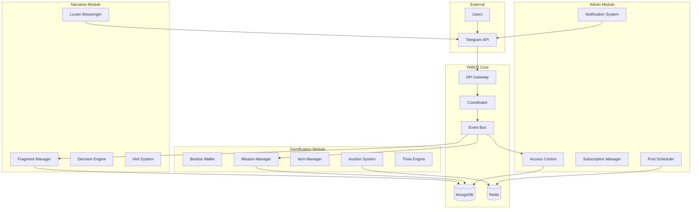
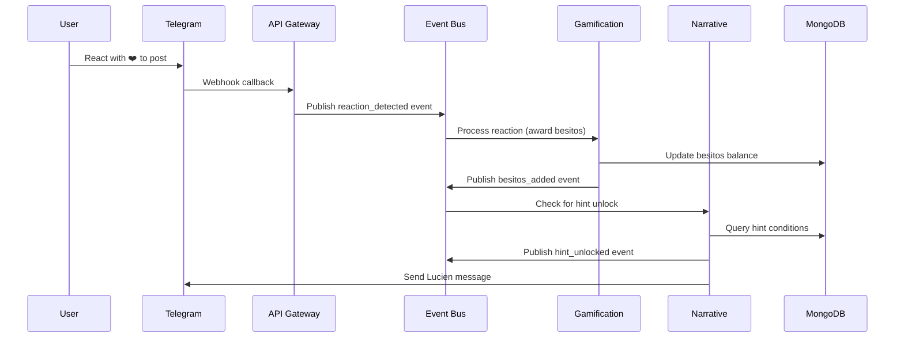
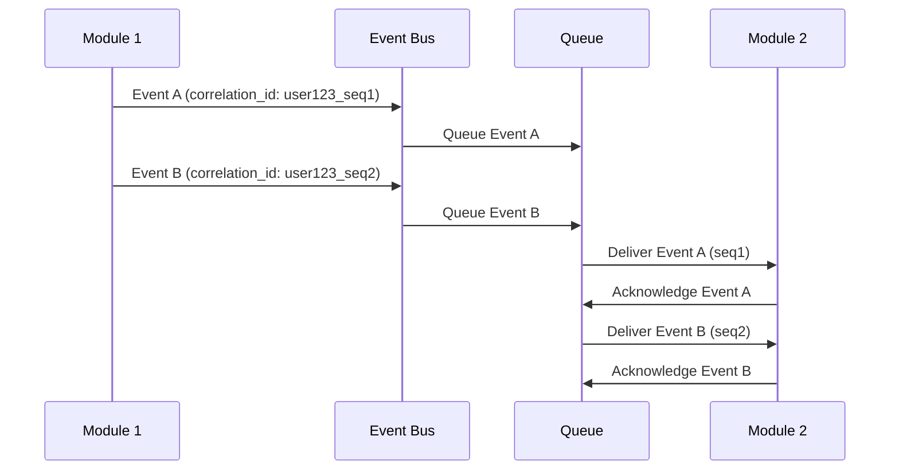

# Design Document - Módulos Atómicos

## Overview

This document defines the technical architecture for implementing three atomic modules within the YABOT system: Narrative Immersion, Gamification, and Channel Administration. The design follows a microservices architecture pattern with event-driven communication, leveraging the existing YABOT infrastructure while maintaining module independence and scalability.

The system architecture enables parallel development and deployment of modules while ensuring seamless cross-module interactions through a robust event bus and API layer.

## Steering Document Alignment

### Technical Standards
The design follows existing YABOT technical patterns:
- **Event Bus**: Extends current `src/events/bus.py` with Redis pub/sub and local queue fallback
- **Database Layer**: Uses established MongoDB patterns from `src/database/mongodb.py`
- **Handler Architecture**: Follows `src/handlers/base.py` patterns for consistent request processing
- **Service Layer**: Builds on existing service patterns in `src/services/`

### Project Structure
Module organization follows YABOT conventions:
```
src/
├── modules/
│   ├── narrative/     # Narrative Immersion Module
│   ├── gamification/  # Gamification Module
│   └── admin/         # Channel Administration Module
├── shared/
│   ├── events/        # Enhanced event bus
│   ├── api/           # Inter-module API layer
│   └── database/      # Database utilities
```

## Code Reuse Analysis

### Existing Components to Leverage
- **Event Bus Foundation**: `src/events/bus.py` and `src/events/models.py` - Will be extended with new event types
- **Database Handlers**: `src/database/mongodb.py` - Collection patterns and indexing strategies
- **Core Models**: `src/core/models.py` - Pydantic base classes for validation
- **Service Coordination**: `src/services/` - Service layer patterns for business logic
- **Handler Base**: `src/handlers/base.py` - Telegram command and webhook processing
- **Configuration**: `src/config/manager.py` - Environment and database configuration

### Missing Components (To Be Created)
- **Inter-Module Authentication**: New API key management system
- **Circuit Breaker**: Fault tolerance patterns for module communication
- **Performance Monitoring**: Metrics collection for requirement compliance
- **Event Correlation**: Correlation ID tracking and event ordering

### Integration Points
- **Event System**: Extend `src/events/models.py` with 12 new event types for cross-module interactions
- **Database Schema**: Add new collections (auctions, trivias, achievements) and extend users collection
- **API Infrastructure**: Extend `src/api/server.py` with module-specific endpoints and authentication
- **Service Layer**: Build new services following patterns in `src/services/narrative.py` and `src/services/subscription.py`
- **Handler Extension**: Create module-specific handlers inheriting from `src/handlers/base.py`

## Architecture

The system implements a modular, event-driven architecture with three main components:



## Components and Interfaces

### Narrative Immersion Module

#### Fragment Manager
- **Purpose**: Manages narrative content storage and retrieval
- **Interfaces**:
  - `get_fragment(fragment_id: str) -> NarrativeFragment`
  - `get_user_progress(user_id: str) -> NarrativeProgress`
  - `update_progress(user_id: str, fragment_id: str) -> bool`
- **Dependencies**: MongoDB, Event Bus
- **Reuses**: `src/database/mongodb.py` patterns, `src/core/models.py` base classes

#### Decision Engine
- **Purpose**: Processes user narrative choices and determines outcomes
- **Interfaces**:
  - `process_decision(user_id: str, choice_id: str) -> DecisionResult`
  - `validate_choice(user_id: str, choice_id: str) -> bool`
- **Dependencies**: Fragment Manager, Event Bus, Coordinator
- **Reuses**: `src/services/coordinator.py` orchestration patterns

#### Hint System
- **Purpose**: Manages narrative hints and unlocking logic
- **Interfaces**:
  - `unlock_hint(user_id: str, hint_id: str) -> bool`
  - `get_user_hints(user_id: str) -> List[Hint]`
- **Dependencies**: Item Manager (Gamification), MongoDB
- **Reuses**: Cross-module API patterns from existing services

#### Lucien Messenger
- **Purpose**: Sends dynamic templated messages via Telegram
- **Interfaces**:
  - `send_message(user_id: str, template: str, context: dict) -> bool`
  - `schedule_message(user_id: str, template: str, delay: int) -> bool`
- **Dependencies**: Telegram API, Redis (for scheduling)
- **Reuses**: `src/handlers/base.py` response patterns

### Gamification Module

#### Besitos Wallet
- **Purpose**: Manages virtual currency transactions with atomicity
- **Interfaces**:
  - `add_besitos(user_id: str, amount: int, reason: str) -> Transaction`
  - `spend_besitos(user_id: str, amount: int, reason: str) -> Transaction`
  - `get_balance(user_id: str) -> int`
- **Dependencies**: MongoDB (atomic transactions), Event Bus
- **Reuses**: Database transaction patterns from existing codebase

#### Mission Manager
- **Purpose**: Assigns and tracks user missions
- **Interfaces**:
  - `assign_mission(user_id: str, mission_type: str) -> Mission`
  - `update_progress(user_id: str, mission_id: str, progress: dict) -> bool`
  - `complete_mission(user_id: str, mission_id: str) -> Reward`
- **Dependencies**: Event Bus, MongoDB
- **Reuses**: `src/events/models.py` event patterns

#### Item Manager (Mochila)
- **Purpose**: Manages user item collection and inventory
- **Interfaces**:
  - `add_item(user_id: str, item_id: str) -> bool`
  - `remove_item(user_id: str, item_id: str) -> bool`
  - `get_inventory(user_id: str) -> List[Item]`
- **Dependencies**: MongoDB
- **Reuses**: `src/database/mongodb.py` collection patterns

#### Auction System
- **Purpose**: Manages timed auctions with Redis-based timers
- **Interfaces**:
  - `create_auction(item_id: str, duration: int) -> Auction`
  - `place_bid(user_id: str, auction_id: str, amount: int) -> bool`
  - `close_auction(auction_id: str) -> AuctionResult`
- **Dependencies**: Redis (timers), Event Bus, Besitos Wallet
- **Reuses**: Redis patterns from existing caching infrastructure

#### Trivia Engine
- **Purpose**: Manages Telegram polls and trivia question processing
- **Interfaces**:
  - `create_trivia(question: str, options: List[str], correct_answer: int) -> Trivia`
  - `process_answer(user_id: str, trivia_id: str, answer: int) -> TriviaResult`
  - `get_trivia_results(trivia_id: str) -> TriviaStats`
- **Dependencies**: Telegram API, Event Bus, Besitos Wallet
- **Reuses**: `src/handlers/base.py` for Telegram poll handling

#### Daily Gift System
- **Purpose**: Manages daily gift claims with Redis cooldowns
- **Interfaces**:
  - `claim_daily_gift(user_id: str) -> GiftResult`
  - `check_gift_availability(user_id: str) -> GiftStatus`
  - `reset_daily_cooldowns() -> List[str]`
- **Dependencies**: Redis (cooldown tracking), Event Bus
- **Reuses**: Redis TTL patterns for cooldown management

#### Achievement System
- **Purpose**: Tracks and unlocks user achievements (logros)
- **Interfaces**:
  - `check_achievements(user_id: str, action: str) -> List[Achievement]`
  - `unlock_achievement(user_id: str, achievement_id: str) -> bool`
  - `get_user_achievements(user_id: str) -> List[Achievement]`
- **Dependencies**: Event Bus, MongoDB
- **Reuses**: Database trigger patterns from existing event handlers

### Channel Administration Module

#### Access Control
- **Purpose**: Validates user permissions and channel access
- **Interfaces**:
  - `validate_access(user_id: str, channel_id: str) -> AccessResult`
  - `grant_access(user_id: str, channel_id: str, duration: int) -> bool`
  - `revoke_access(user_id: str, channel_id: str) -> bool`
- **Dependencies**: Telegram API, Subscription Manager
- **Reuses**: `src/api/auth.py` authentication patterns

#### Subscription Manager
- **Purpose**: Manages VIP subscriptions and expiration
- **Interfaces**:
  - `create_subscription(user_id: str, plan: str, duration: int) -> Subscription`
  - `check_vip_status(user_id: str) -> VipStatus`
  - `process_expiration() -> List[ExpiredSubscription]`
- **Dependencies**: MongoDB, Cron Jobs, Event Bus
- **Reuses**: `src/services/subscription.py` existing patterns

#### Post Scheduler
- **Purpose**: Schedules and manages automated content posting
- **Interfaces**:
  - `schedule_post(content: str, channel_id: str, publish_time: datetime) -> ScheduledPost`
  - `cancel_post(post_id: str) -> bool`
  - `execute_scheduled_posts() -> List[PostResult]`
- **Dependencies**: APScheduler, Telegram API, Redis
- **Reuses**: Existing scheduling patterns

#### Message Protection System
- **Purpose**: Applies Telegram API flags to restrict message access
- **Interfaces**:
  - `protect_message(message_id: str, protection_level: str) -> bool`
  - `check_message_access(user_id: str, message_id: str) -> AccessResult`
- **Dependencies**: Telegram API, Access Control
- **Reuses**: Existing Telegram API wrapper patterns

#### Admin Command Interface
- **Purpose**: Provides private admin commands with inline menus
- **Interfaces**:
  - `process_admin_command(user_id: str, command: str, args: dict) -> CommandResult`
  - `generate_admin_menu(user_id: str) -> InlineKeyboard`
- **Dependencies**: Telegram API, Access Control
- **Reuses**: `src/handlers/base.py` command processing patterns

## Data Models

### Narrative Models
```python
class NarrativeFragment(BaseModel):
    fragment_id: str
    title: str
    content: str
    choices: List[Choice]
    vip_required: bool = False
    metadata: Dict[str, Any]

class Choice(BaseModel):
    choice_id: str
    text: str
    next_fragment_id: Optional[str]
    conditions: Dict[str, Any]

class NarrativeProgress(BaseModel):
    user_id: str
    current_fragment: str
    completed_fragments: List[str]
    unlocked_hints: List[str]
    last_updated: datetime
```

### Gamification Models
```python
class BesitosTransaction(BaseModel):
    transaction_id: str
    user_id: str
    amount: int
    transaction_type: str  # 'credit' or 'debit'
    reason: str
    timestamp: datetime

class Mission(BaseModel):
    mission_id: str
    user_id: str
    mission_type: str
    description: str
    progress: Dict[str, Any]
    reward: Dict[str, Any]
    status: str  # 'active', 'completed', 'failed'

class Item(BaseModel):
    item_id: str
    name: str
    description: str
    type: str
    metadata: Dict[str, Any]

class Auction(BaseModel):
    auction_id: str
    item_id: str
    start_time: datetime
    end_time: datetime
    current_bid: int
    current_bidder: Optional[str]
    bid_history: List[Bid]
    status: str  # 'active', 'closed', 'cancelled'
    notification_sent: bool = False

class Bid(BaseModel):
    bidder_id: str
    amount: int
    timestamp: datetime
    correlation_id: str

class Trivia(BaseModel):
    trivia_id: str
    question: str
    options: List[str]
    correct_answer: int
    created_time: datetime
    end_time: datetime
    participants: List[TriviaParticipant]
    status: str  # 'active', 'closed'

class TriviaParticipant(BaseModel):
    user_id: str
    answer: int
    timestamp: datetime
    points_awarded: int

class Achievement(BaseModel):
    achievement_id: str
    name: str
    description: str
    criteria: Dict[str, Any]
    reward: Dict[str, Any]
    unlocked_by: List[str]  # user_ids
    created_date: datetime
```

### Administration Models
```python
class Subscription(BaseModel):
    subscription_id: str
    user_id: str
    plan_type: str
    start_date: datetime
    end_date: datetime
    status: str  # 'active', 'expired', 'cancelled'

class ScheduledPost(BaseModel):
    post_id: str
    channel_id: str
    content: str
    publish_time: datetime
    status: str  # 'scheduled', 'published', 'failed', 'retrying'
    retry_count: int = 0
    last_error: Optional[str] = None
    correlation_id: str
    metadata: Dict[str, Any]

class MessageProtection(BaseModel):
    message_id: str
    channel_id: str
    protection_level: str  # 'vip_only', 'admin_only', 'timed_access'
    access_conditions: Dict[str, Any]
    created_time: datetime
    expires_at: Optional[datetime]
```

## Error Handling

### Error Scenarios

1. **Module Communication Failure**
   - **Handling**: Circuit breaker pattern with 30-second timeout
   - **User Impact**: Graceful degradation with cached responses
   - **Recovery**: Automatic retry with exponential backoff

2. **Database Connection Loss**
   - **Handling**: Connection pooling with automatic reconnection
   - **User Impact**: Temporary "service unavailable" messages
   - **Recovery**: Health checks every 10 seconds

3. **Event Bus Overload**
   - **Handling**: Queue overflow protection with priority processing
   - **User Impact**: Delayed cross-module interactions
   - **Recovery**: Load balancing and event batching

4. **Cross-Module Data Inconsistency**
   - **Handling**: Reconciliation processes with conflict resolution
   - **User Impact**: Minimal - background synchronization
   - **Recovery**: Automated data repair with audit logs

5. **API Rate Limiting Exceeded**
   - **Handling**: HTTP 429 with exponential backoff retry-after headers
   - **User Impact**: "Por favor, intenta de nuevo en unos segundos" message
   - **Recovery**: Automatic retry with jittered backoff

6. **Authentication Failure**
   - **Handling**: HTTP 401 with specific error codes (AUTH001, AUTH002, etc.)
   - **User Impact**: "Sesión expirada, por favor reinicia" message
   - **Recovery**: Token refresh or re-authentication flow

7. **Event Queue Overflow**
   - **Handling**: Priority-based event processing with critical events first
   - **User Impact**: Delayed cross-module interactions (max 5 seconds)
   - **Recovery**: Queue scaling and event batching

## API Specifications

### Inter-Module Authentication
```python
# API Key-based authentication for inter-module calls
class ModuleAPIKey(BaseModel):
    module_name: str
    api_key: str
    permissions: List[str]
    expires_at: datetime

# Authentication middleware
async def authenticate_module_request(request: Request) -> Optional[str]:
    """Validates API key and returns module name if valid"""
    pass
```

### Performance Monitoring
```python
# Performance tracking for requirements compliance
class PerformanceMetrics(BaseModel):
    operation: str
    duration_ms: float
    timestamp: datetime
    module: str
    success: bool
    correlation_id: str

# Circuit breaker implementation
class CircuitBreaker:
    def __init__(self, failure_threshold: int = 5, timeout: int = 30):
        self.failure_count = 0
        self.failure_threshold = failure_threshold
        self.timeout = timeout
        self.last_failure_time = None
        self.state = 'CLOSED'  # CLOSED, OPEN, HALF_OPEN
```

### Redis Key Patterns
```python
# Redis key naming conventions
REDIS_KEYS = {
    'auction_timer': 'auction:{auction_id}:timer',
    'daily_gift_cooldown': 'gift:{user_id}:cooldown',
    'event_queue': 'events:{module}:queue',
    'user_session': 'session:{user_id}',
    'circuit_breaker': 'circuit:{module}:{operation}'
}

# TTL settings
TTL_SETTINGS = {
    'daily_gift_cooldown': 86400,  # 24 hours
    'auction_timer': 3600,  # 1 hour max
    'user_session': 1800,  # 30 minutes
    'circuit_breaker': 30  # 30 seconds
}
```

## Event Flow Diagrams

### Cross-Module Reaction Workflow


### Event Ordering with Correlation IDs


## Database Schema Extensions

### MongoDB Collection Indexes
```python
# Enhanced indexing strategy for performance requirements
INDEX_STRATEGY = {
    'users': [
        {'user_id': 1},  # Existing
        {'narrative_progress.current_fragment': 1, 'user_id': 1},  # Compound for narrative queries
        {'besitos_balance': 1},  # New for gamification
        {'subscription.status': 1, 'subscription.end_date': 1}  # VIP queries
    ],
    'narrative_fragments': [
        {'fragment_id': 1},  # Existing
        {'vip_required': 1, 'created_at': -1},  # VIP content filtering
        {'metadata.tags': 1}  # Tag-based queries
    ],
    'events': [  # New collection for event auditing
        {'correlation_id': 1},
        {'user_id': 1, 'timestamp': -1},
        {'event_type': 1, 'timestamp': -1}
    ]
}
```

## Testing Strategy

### Unit Testing
- **Framework**: pytest with async support
- **Coverage Target**: 90% code coverage per module
- **Key Components**:
  - **Fragment Manager**: Test narrative logic with mocked MongoDB
  - **Besitos Wallet**: Validate atomic transactions with test database
  - **Access Control**: Permission validation with mocked Telegram API
  - **Event Bus**: Message routing with in-memory queue
  - **Circuit Breaker**: Failure threshold and recovery testing

### Integration Testing
- **Framework**: pytest-asyncio with Docker containers
- **Test Environment**: Isolated MongoDB and Redis instances
- **Key Flows**:
  - **Reaction Workflow**: User reacts → Besitos awarded → Hint unlocked (500ms target)
  - **Decision Flow**: User chooses → Mission assigned → Access granted
  - **VIP Validation**: Subscription check → Fragment access → Event correlation
  - **Subscription Expiration**: Cron job → Access revocation → User notification
  - **Performance Testing**: 1000 concurrent users simulation

### End-to-End Testing
- **Framework**: Selenium with Telegram Bot API simulation
- **Performance Validation**: Response times within 2 seconds
- **User Scenarios**:
  - **Complete Narrative Journey**: Multiple fragments with choices and VIP content
  - **Gamification Loop**: Earn besitos → Buy items → Complete missions → Unlock achievements
  - **Admin Workflow**: Schedule posts → Manage subscriptions → Monitor user activity
  - **Error Recovery**: Module failure → Recovery → Event processing continuation