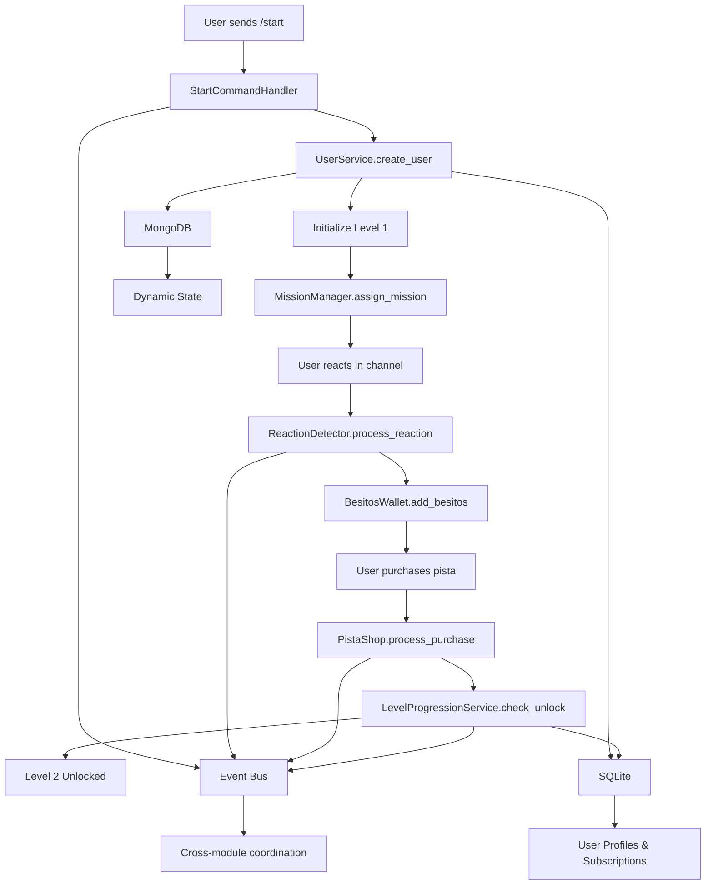

# Design Document - UI Specification

## Overview

This design implements a complete user journey flow for the YABOT Telegram bot, orchestrating existing components to create a seamless progression system from user onboarding through Level 2 unlocking. The architecture leverages the existing event-driven infrastructure while adding new level progression and pista purchase capabilities.

The design creates an emotionally engaging experience that guides users through the core gamification loop while building authentic connections through the Diana emotional intelligence system.

## Steering Document Alignment

### Technical Standards (tech.md)
- **Event-Driven Architecture**: All user actions publish events to the Redis event bus for cross-module coordination
- **Dual Database Strategy**: MongoDB for dynamic state (missions, progress) and SQLite for ACID compliance (subscriptions, profiles)
- **Type Safety**: Comprehensive Pydantic models for all data structures
- **Async/Await Patterns**: Modern Python asynchronous programming throughout
- **Authentication**: Secure JWT tokens for internal API communications

### Project Structure (structure.md)
- **Module Organization**: New components follow `src/modules/` pattern with clear separation of concerns
- **Service Layer**: Level progression logic implemented in `src/services/` following existing patterns
- **Event Models**: New events extend existing `src/events/models.py` patterns
- **Handler Integration**: Telegram handlers extend existing `src/handlers/base.py` architecture
- **Database Schemas**: New level system schemas follow existing `src/database/schemas/` patterns

## Code Reuse Analysis

### Existing Components to Leverage

- **UserService (`src/services/user.py`)**: Handle user creation, profile management, and subscription status updates
- **MissionManager (`src/modules/gamification/mission_manager.py`)**: Assign reaction missions and track completion
- **BesitosWallet (`src/modules/gamification/besitos_wallet.py`)**: Handle atomic besitos transactions for rewards and purchases
- **ReactionDetector (`src/modules/gamification/reaction_detector.py`)**: Detect channel reactions and trigger reward events
- **StartCommandHandler (`src/handlers/commands.py`)**: Extend existing `/start` implementation for Level 1 setup
- **HintSystem (`src/modules/narrative/hint_system.py`)**: Manage pista unlocking and user inventory
- **SubscriptionService (`src/services/subscription.py`)**: Handle level progression as subscription tier changes
- **EventBus (`src/events/bus.py`)**: Publish level progression and purchase events

### Integration Points

- **Database Manager (`src/database/manager.py`)**: Unified operations across MongoDB and SQLite
- **Router Manager (`src/core/router.py`)**: Route new level progression commands and callbacks
- **Event Processor (`src/events/processor.py`)**: Handle cross-module event coordination
- **Configuration Manager (`src/config/manager.py`)**: Level system configuration and validation

## Architecture



## Components and Interfaces

### Component 1: LevelProgressionService
- **Purpose:** Manages user level progression from Level 1 to Level 2 based on mission completion and pista purchases
- **Interfaces:**
  - `async def check_level_progression(user_id: str) -> Optional[int]`: Check if user qualifies for level progression, returns new level or None
  - `async def unlock_level(user_id: str, level: int) -> bool`: Atomically update user level in SQLite subscription table and MongoDB user document
  - `async def get_user_level(user_id: str) -> int`: Retrieve current user level from subscription service, defaults to 1 for new users
  - `async def handle_mission_completion(user_id: str, mission_id: str) -> None`: Process mission completion events and check progression
  - `async def handle_pista_purchase(user_id: str, pista_id: str) -> None`: Process pista purchase events and trigger level unlock if conditions met
- **Dependencies:** UserService, SubscriptionService, MissionManager, EventBus
- **Reuses:** SubscriptionService.create_subscription(), UserService.update_user_state(), existing event publishing patterns

### Component 2: PistaShop
- **Purpose:** Handle pista purchases using besitos and validate sufficient balance
- **Interfaces:**
  - `async def purchase_pista(user_id: str, pista_id: str) -> TransactionResult`: Execute atomic pista purchase with besitos deduction and hint unlocking
  - `async def get_available_pistas(user_id: str, level: int) -> List[Pista]`: Return pistas available for purchase at user's current level
  - `async def validate_purchase(user_id: str, cost: int) -> bool`: Check if user has sufficient besitos balance before purchase
  - `async def process_level_2_pista(user_id: str) -> bool`: Handle the specific "Acceso a Nivel 2" pista purchase and trigger progression
- **Dependencies:** BesitosWallet, HintSystem, LevelProgressionService, EventBus
- **Reuses:** BesitosWallet.spend_besitos(), HintSystem.unlock_hint(), existing TransactionResult patterns

### Component 3: EnhancedStartHandler
- **Purpose:** Extend existing start command to initialize Level 1 users and assign first mission
- **Interfaces:**
  - `async def handle_start_command(message: Message, **kwargs) -> CommandResponse`: Process /start command with Level 1 initialization and mission assignment
  - `async def setup_level_1_user(user_id: str) -> bool`: Initialize new user with Level 1 subscription and 0 besitos balance
  - `async def assign_initial_mission(user_id: str) -> Optional[Mission]`: Create "Reacciona en el Canal Principal" mission for new Level 1 users
  - `async def get_existing_user_status(user_id: str) -> Dict[str, Any]`: Return current level number and besitos balance for existing users
- **Dependencies:** UserService, MissionManager, LevelProgressionService, DatabaseManager
- **Reuses:** StartCommandHandler.process_message(), BaseHandler.create_response(), existing middleware injection patterns

### Component 4: LevelProgressionHandler
- **Purpose:** Handle level progression callbacks and display Level 2 celebration
- **Interfaces:**
  - `async def handle_level_progression(user_id: str, new_level: int) -> None`: Process level progression events and trigger celebration
  - `async def send_level_unlock_message(user_id: str, level: int) -> bool`: Send "¡Felicidades! Desbloqueaste Nivel 2. Nuevas funciones disponibles." with formatting
  - `async def update_user_menu(user_id: str, level: int) -> InlineKeyboardMarkup`: Add at least 2 new menu options for Level 2 users
  - `async def handle_pista_purchase_callback(callback_query: CallbackQuery) -> None`: Process "Comprar Pista - 10 besitos" button callbacks
- **Dependencies:** RouterManager, UserService, Bot (Telegram API), InlineKeyboardBuilder
- **Reuses:** Existing callback handler patterns from commands.py, InlineKeyboardBuilder from existing handlers

## Data Models

### LevelProgressionEvent
```python
class LevelProgressionEvent(BaseEvent):
    """Event published when user progresses to new level"""
    event_id: str = Field(default_factory=lambda: str(uuid.uuid4()))
    user_id: str
    old_level: int
    new_level: int
    trigger_action: str  # "mission_completion", "pista_purchase"
    payload: Dict[str, Any] = Field(default_factory=dict)
    source: str = "level_progression_service"

    def __init__(self, **data):
        super().__init__(
            event_type="level_progression",
            timestamp=datetime.utcnow(),
            **data
        )
```

### PistaPurchaseTransaction
```python
class PistaPurchaseTransaction(BaseModel):
    transaction_id: str
    user_id: str
    pista_id: str
    cost: int
    status: str  # "pending", "completed", "failed"
    timestamp: datetime
    metadata: Dict[str, Any]
```

### UserLevelData
```python
class UserLevelData(BaseModel):
    user_id: str
    current_level: int
    level_unlocked_at: datetime
    missions_completed: List[str]
    pistas_purchased: List[str]
    total_besitos_earned: int
```

## Error Handling

### Error Scenarios

1. **Mission Assignment Failure**
   - **Handling:** Retry mechanism with exponential backoff, fallback to default mission
   - **User Impact:** User sees "Procesando misión..." message with retry option

2. **Besitos Transaction Failure**
   - **Handling:** MongoDB transaction rollback, retry once with exponential backoff, error logging
   - **User Impact:** "Error procesando recompensa. Contacta soporte." message exactly as specified in requirements

3. **Level Progression Service Unavailable**
   - **Handling:** Graceful degradation, queue progression events for later processing
   - **User Impact:** Level progression delayed but preserved, user notified of temporary delay

4. **Telegram API Timeout**
   - **Handling:** Message queuing system with retry logic, fallback to simplified responses
   - **User Impact:** "Conexión temporal interrumpida. Reintentando..." with automatic retry

5. **Database Connection Loss**
   - **Handling:** Circuit breaker pattern, local cache fallback, connection pool recovery
   - **User Impact:** Limited functionality with cached data until connection restored

## Testing Strategy

### Unit Testing
- **LevelProgressionService**: Mock dependencies, test progression logic and level validation
- **PistaShop**: Test transaction flows, balance validation, and error scenarios
- **Event Publishing**: Verify event format, delivery, and cross-module integration
- **Database Operations**: Test atomic transactions and rollback scenarios

### Integration Testing
- **Complete User Journey**: End-to-end flow from `/start` to Level 2 unlocking
- **Cross-Module Events**: Verify event propagation between gamification and narrative modules
- **Database Consistency**: Test data integrity across MongoDB and SQLite operations
- **Error Recovery**: Test system behavior under various failure conditions

### End-to-End Testing
- **Real Telegram Integration**: Test with actual Telegram bot API in staging environment
- **Performance Under Load**: Concurrent users progressing through the journey
- **Event Bus Reliability**: Test event delivery under high load and network issues
- **User Experience Flows**: Validate timing, messages, and interface responsiveness