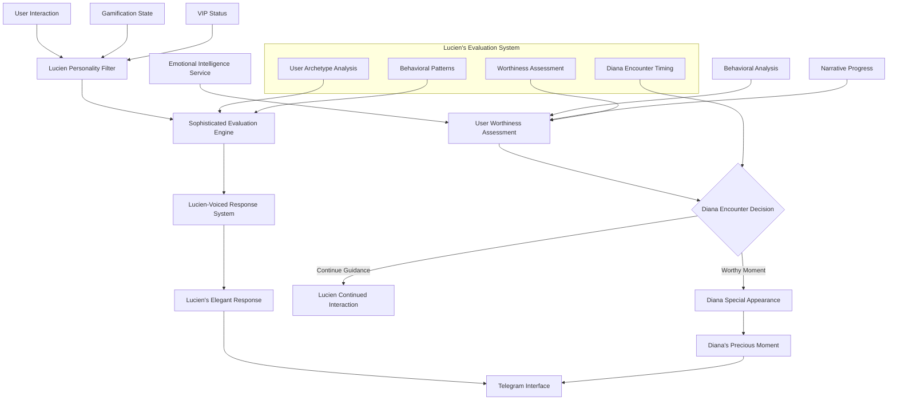
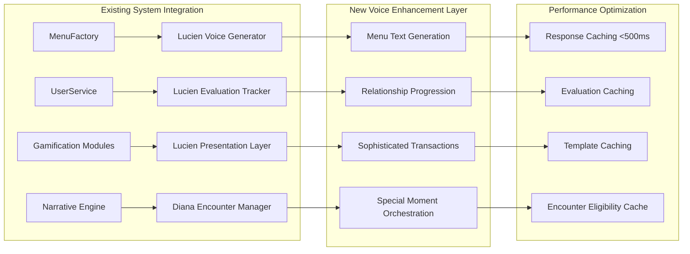
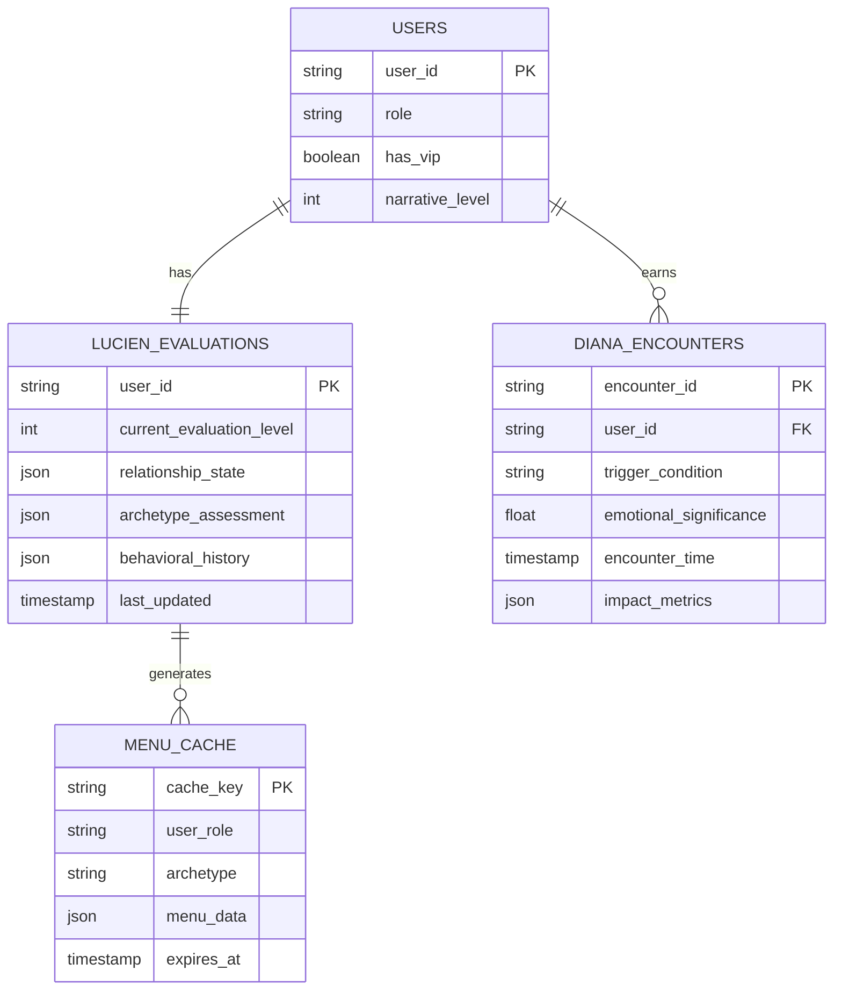

# Design Document - UX Enhanced Interface

## Overview

The UX Enhanced Interface represents a complete transformation of user interaction within YABOT, creating an emotionally intelligent, adaptative, and seamless experience where **Lucien serves as the primary voice and guide**, while **Diana appears only in special, earned moments**. Based on extensive feedback from specialized agents in gamification, personalization, narrative games, UX architecture, and narrative architecture, this design ensures technology disappears while delivering deep emotional engagement through Lucien's sophisticated guidance system and Diana's carefully orchestrated appearances.

## Critical Voice Architecture: Lucien as Primary Interface

### **The Lucien-Centric Experience**
Unlike traditional bots where a single character handles all interactions, YABOT follows the sophisticated narrative structure where:

- **Lucien (<�)** is the **primary interface voice** - the elegant mayordomo who guides, evaluates, and advises users through all navigation and system interactions
- **Diana (<8)** appears only in **special, significant moments** - earned encounters that feel precious and meaningful
- All menu systems, administrative functions, gamification elements, and daily interactions flow through **Lucien's personality and evaluation system**

This creates a unique dynamic where users develop a relationship with Lucien as their sophisticated guide, making Diana's appearances feel like rare, valuable encounters rather than constant availability.

## Steering Document Alignment

### Technical Standards (tech.md)
- **Performance:** All menu generation <500ms, responses <3 seconds via Lucien's efficient processing
- **Scalability:** Support for 10,000+ concurrent users with Lucien's systematic evaluation architecture
- **Security:** Role-based access control integrated through Lucien's gatekeeper protocols
- **Database:** Leverages dual MongoDB/SQLite architecture without changes, enhanced with Lucien's evaluation tracking

### Project Structure (structure.md)
- **Modular Integration:** Builds upon existing modules with Lucien as the coordinating interface voice
- **Handler System:** Extends existing handlers with Lucien's sophisticated response patterns
- **MenuFactory Enhancement:** Transforms existing `/src/ui/menu_factory.py` to speak with Lucien's voice
- **Service Layer:** Integrates with current services through Lucien's evaluation and guidance framework

## Code Reuse Analysis

### Existing Components to Leverage
- **MenuFactory System**: Complete role-based menu architecture now enhanced with Lucien's voice and evaluation system
- **Emotional Intelligence Service**: Behavioral analysis that feeds Lucien's user evaluation and Diana encounter timing
- **Event Bus System**: Real-time user interaction tracking for Lucien's continuous assessment process
- **User Service**: Context management system extended with Lucien's evaluation history and Diana encounter tracking
- **Gamification Modules**: Complete systems now filtered through Lucien's sophisticated presentation style

### Integration Points
- **Lucien's Psychology System**: Full psychological profile from `/docs/narrativo/psicologia_lucien.md` as primary interface voice
- **Diana's Special Moments**: Carefully orchestrated appearances based on emotional milestones and Lucien's evaluation
- **Narrative Progression**: 6-level system where Lucien guides progress and Diana rewards advancement
- **Cross-Module Services**: All coordination flows through Lucien's elegant management style

## Architecture

The UX Enhanced Interface implements a **Lucien-Mediated Experience Ecosystem** where every interaction is filtered through Lucien's sophisticated evaluation system, creating a unique bot experience where users feel guided by an intelligent, discerning butler while earning rare, precious moments with Diana.

### System Architecture Overview



### Component Integration Architecture



### Database Schema Integration



### Performance Architecture

#### Caching Strategy for <500ms Menu Generation
1. **Template Pre-compilation**: Lucien response templates cached by relationship level
2. **User Context Caching**: Active user contexts kept in Redis for session continuity
3. **Menu State Caching**: Pre-built menu structures cached by role/archetype combinations
4. **Voice Generation Optimization**: Common Lucien phrases cached with parameter injection

#### Response Time Optimization Pipeline
```
User Request → Cache Check (50ms) → Voice Generation (200ms) → Menu Assembly (150ms) → Response (100ms) = <500ms Total
```

## Components and Interfaces

### Component 1: Lucien Primary Voice System
- **Purpose:** Serve as the primary interface personality for all user interactions, maintaining sophisticated evaluation and guidance
- **Interfaces:**
  - `generate_lucien_response(user_action, context, evaluation_history) -> LucienResponse`
  - `evaluate_user_worthiness(behavior_patterns, narrative_progress) -> WorthinessAssessment`
  - `determine_interaction_tone(user_archetype, relationship_level) -> InteractionTone`
- **Dependencies:** Lucien's psychological profile, user evaluation system, behavioral analysis
- **Reuses:** Existing MenuFactory system enhanced with Lucien's personality, current user tracking

### Component 2: Diana Special Moment Orchestrator
- **Purpose:** Determine when Diana should appear and orchestrate these precious encounters
- **Interfaces:**
  - `evaluate_diana_encounter_readiness(user_progress, emotional_resonance) -> EncounterReadiness`
  - `create_diana_special_moment(context, achievement_type) -> DianaEncounter`
  - `transition_back_to_lucien(diana_moment_impact) -> LucienTransition`
- **Dependencies:** Diana's psychological profile, narrative milestones, Lucien's evaluation system
- **Reuses:** Existing narrative system, emotional intelligence service, Diana's complete personality

### Component 3: Lucien-Mediated Gamification System
- **Purpose:** Present all gamification elements through Lucien's sophisticated personality and evaluation lens
- **Interfaces:**
  - `present_missions_through_lucien(user_context, available_missions) -> LucienMissionPresentation`
  - `handle_besitos_transactions_elegantly(transaction, user_worthiness) -> LucienTransaction`
  - `celebrate_achievements_with_sophistication(achievement, user_relationship) -> LucienCelebration`
- **Dependencies:** Existing gamification modules, Lucien's voice system, user evaluation history
- **Reuses:** Complete besitos wallet, mission manager, achievement system with Lucien's elegant overlay

**Technical Implementation Details:**
- **LucienMissionPresentation Class:**
  ```python
  @dataclass
  class LucienMissionPresentation:
      mission_id: str
      lucien_introduction: str  # "Permítame presentarle un desafío apropiado para su nivel..."
      mission_description_elevated: str  # Mission rewritten in Lucien's sophisticated style
      worthiness_assessment: str  # Lucien's evaluation of user readiness
      completion_celebration: str  # How Lucien will recognize completion
      archetype_adaptation: Dict[Archetype, str]  # Different presentations per user type
  ```

- **LucienTransaction Class:**
  ```python
  @dataclass
  class LucienTransaction:
      transaction_id: str
      lucien_confirmation: str  # "Excelente elección. Procederé con esta transacción..."
      financial_commentary: str  # Lucien's observation on spending pattern
      worthiness_impact: float  # How this affects Lucien's evaluation
      presentation_style: TransactionStyle  # Formal, Appreciative, or Collaborative
  ```

### Component 4: Progressive Access Management
- **Purpose:** Handle all content unlocking and VIP progression through Lucien's gatekeeper role
- **Interfaces:**
  - `evaluate_content_access_through_lucien(user_behavior, content_level) -> AccessDecision`
  - `present_vip_opportunities_elegantly(user_archetype, relationship_depth) -> VIPPresentation`
  - `manage_level_progression_with_ceremony(milestone, user_journey) -> ProgressionCeremony`
- **Dependencies:** VIP management system, narrative progression, Lucien's evaluation protocols
- **Reuses:** Existing 6-level narrative system, subscription management, Lucien's gatekeeper philosophy

**Technical Implementation Details:**
- **AccessDecision Class:**
  ```python
  @dataclass
  class AccessDecision:
      access_granted: bool
      lucien_explanation: str  # Sophisticated explanation of decision
      required_preparation: Optional[str]  # What user needs to demonstrate
      alternative_content: Optional[str]  # What Lucien offers instead
      worthiness_gap: float  # How far user is from access
      next_evaluation_criteria: List[str]  # What Lucien will assess next
  ```

- **VIPPresentation Class:**
  ```python
  @dataclass
  class VIPPresentation:
      presentation_id: str
      lucien_invitation: str  # "Algunos que llegan hasta aquí merecen ver capas que otros nunca tocarán..."
      value_proposition_elegant: str  # VIP benefits in Lucien's sophisticated language
      relationship_acknowledgment: str  # Recognition of user's journey
      upgrade_ceremony: str  # How Lucien will handle the transition
      archetype_personalization: Dict[Archetype, str]  # Tailored approach per user type
  ```

- **ProgressionCeremony Class:**
  ```python
  @dataclass
  class ProgressionCeremony:
      milestone_id: str
      lucien_recognition: str  # Formal acknowledgment of achievement
      relationship_evolution: str  # How this changes Lucien's view
      diana_encounter_eligibility: bool  # Whether this unlocks Diana moment
      new_privileges: List[str]  # What becomes available
      ceremony_script: str  # Full Lucien presentation of advancement
  ```

### Component 5: Administrative Interface Through Lucien
- **Purpose:** Provide administrative tools filtered through Lucien's sophisticated presentation style
- **Interfaces:**
  - `present_admin_tools_through_lucien(admin_user, system_context) -> LucienAdminInterface`
  - `handle_user_management_elegantly(admin_action, target_user) -> LucienAdminAction`
  - `report_system_status_with_sophistication(metrics, admin_context) -> LucienSystemReport`
- **Dependencies:** Existing admin modules, Lucien's professional presentation style
- **Reuses:** All admin functionality with Lucien's elegant interface layer

## Data Models

### Lucien Interaction Context Model
```python
@dataclass
class LucienInteractionContext:
    # Primary interface state
    current_evaluation_level: int  # 1-6 based on user worthiness
    relationship_with_lucien: LucienRelationshipState
    user_archetype_assessment: ArchetypeEvaluation
    interaction_tone: LucienTone  # Formal/Appreciative/Collaborative

    # Diana encounter tracking
    diana_encounters_earned: int
    last_diana_encounter: Optional[datetime]
    next_diana_opportunity: Optional[DianaOpportunity]

    # Evaluation history
    behavioral_assessment_history: List[BehavioralAssessment]
    worthiness_progression: WorthinessProgression
    sophistication_level: SophisticationLevel
```

### Diana Special Moment Model
```python
@dataclass
class DianaSpecialMoment:
    trigger_condition: EncounterTrigger  # What earned this moment
    diana_personality_layer: PersonalityLayer  # Which aspect of Diana appears
    emotional_significance: float  # How precious this moment is
    user_preparation_level: PreparationLevel  # How ready user is for this
    lucien_transition_context: TransitionContext  # How to return to Lucien
    moment_duration: MomentDuration  # How long Diana remains present
    impact_on_relationship: RelationshipImpact  # How this changes everything
```

### Lucien Voice Adaptation Model
```python
@dataclass
class LucienVoiceProfile:
    # Base from psychological profile
    formality_level: FormalityLevel  # Always maintains "usted"
    evaluation_mode: EvaluationMode  # Current assessment intensity
    protective_stance: ProtectiveStance  # How guarded about Diana
    sophistication_display: SophisticationDisplay  # Level of cultural references

    # Dynamic adaptation
    user_relationship_level: RelationshipLevel  # How Lucien sees this user
    interaction_history: InteractionHistory  # Past conversation patterns
    current_challenge_level: ChallengeLevel  # How much to test user
    approval_indicators: ApprovalLevel  # Grudging to collaborative
```

## Error Handling

### Error Scenarios with Lucien's Voice

1. **System Service Failure**
   - **Handling:** Lucien gracefully acknowledges technical difficulties with sophisticated composure
   - **User Impact:** "Disculpe la inconveniencia. Parece que tenemos una situaci�n t�cnica que requiere mi atenci�n moment�nea. Perm�tame resolver esto con la eficiencia que usted merece."
   - **Lucien Voice:** Professional competence maintaining user relationship

2. **Diana Encounter System Failure**
   - **Handling:** Lucien explains delay with protective discretion
   - **User Impact:** "Diana se encuentra... indispuesta en este momento. Prefiero que la encuentre cuando pueda ofrecerle la atenci�n completa que usted ha ganado."
   - **Lucien Voice:** Protective professionalism maintaining mystique

3. **User Access Conflict**
   - **Handling:** Lucien delivers elegant refusal with clear evaluation
   - **User Impact:** "Me temo que debe demostrar mayor... preparaci�n antes de acceder a ese nivel. Perm�tame guiarle hacia el siguiente paso apropiado."
   - **Lucien Voice:** Sophisticated gatekeeping with growth guidance

4. **Navigation State Corruption**
   - **Handling:** Lucien smoothly redirects with evaluative observation
   - **User Impact:** "Interesante... parece que hemos perdido el hilo. Esto me permite evaluar c�mo maneja usted los momentos de incertidumbre. Regresemos al terreno familiar."
   - **Lucien Voice:** Analytical recovery that maintains continuous evaluation

## Testing Strategy

### Unit Testing
- **Lucien Voice Generation Testing**
  - Test LucienVoiceProfile dataclass initialization and personality adaptation
  - Validate generate_lucien_response() maintains formal "usted" address consistency
  - Test archetype-based voice variations (Explorer, Direct, Analytical, Patient, Persistent, Romantic)
  - Verify Lucien evaluation scoring algorithms for user worthiness assessment

- **Diana Encounter System Testing**
  - Test DianaSpecialMoment creation logic with proper trigger conditions
  - Validate encounter frequency limits (max 1 per week enforcement)
  - Test emotional_significance calculation based on user milestones
  - Verify seamless transitions between Lucien and Diana personality modes

- **MenuFactory Enhancement Testing**
  - Test MenuItem.lucien_voice_text generation for different user archetypes
  - Validate menu caching performance meets <500ms generation requirement
  - Test role-based menu visibility with Lucien's gatekeeper logic
  - Verify VIP upgrade prompts use Lucien's elegant presentation style

### Integration Testing
- **Cross-Module Communication Testing**
  - Test Lucien voice integration across all gamification modules (besitos, missions, achievements)
  - Validate emotional intelligence service feeding Diana encounter readiness evaluation
  - Test event bus integration for Lucien evaluation tracking across user interactions
  - Verify narrative progression triggering Diana encounters at appropriate emotional milestones

- **Database Integration Testing**
  - Test LUCIEN_EVALUATIONS collection CRUD operations with relationship state tracking
  - Validate DIANA_ENCOUNTERS collection with proper foreign key relationships
  - Test MENU_CACHE performance with Redis integration for <500ms generation
  - Verify data consistency between MongoDB narrative data and SQLite user profiles

- **Performance Integration Testing**
  - Load test menu generation under 500ms requirement with 1000+ concurrent users
  - Test Lucien voice generation caching effectiveness under high load
  - Validate Diana encounter evaluation performance with large user datasets
  - Test graceful degradation when voice generation services are unavailable

### End-to-End Testing
- **Complete User Journey Testing**
  - Test new user onboarding through Lucien's initial evaluation and relationship building
  - Validate VIP upgrade journey with role transition maintaining voice consistency
  - Test emotional progression from Level 1 through Level 6 with appropriate Diana encounters
  - Verify admin interface functionality delivered through Lucien's professional presentation

- **Narrative Integration Testing**
  - Test story progression triggering Diana encounters at emotional milestones
  - Validate seamless transitions between narrative content and menu navigation
  - Test VIP content access (El Diván levels 4-6) with appropriate Lucien gatekeeping
  - Verify emotional intelligence interface adaptation based on user archetype detection

- **System Resilience Testing**
  - Test error handling with Lucien's sophisticated error responses maintaining character immersion
  - Validate system recovery with appropriate Lucien voice responses during service failures
  - Test fallback mechanisms when Diana encounter system is unavailable
  - Verify user experience continuity during temporary service degradation

## Implementation Strategy

### Phase 1: Lucien Voice Foundation (Week 1-2)
**Goal:** Establish Lucien as primary interface voice for all existing functionality

**Technical Implementation:**
- Transform all MenuFactory responses to use Lucien's sophisticated voice patterns
- Implement Lucien's evaluation system for user interactions
- Create Lucien's personality adaptation based on user archetype and relationship level
- Establish basic Diana encounter triggering system

**Files to Modify:**
- `/src/ui/menu_factory.py` - Transform all menu text to Lucien's voice
- `/src/handlers/telegram_commands.py` - Route all responses through Lucien personality filter
- `/src/services/user.py` - Add Lucien evaluation tracking to user context
- `/src/modules/emotional/intelligence_service.py` - Feed data to Lucien evaluation system

**New Files to Create:**
- `/src/ui/lucien_voice_generator.py` - Core Lucien personality system
- `/src/services/diana_encounter_manager.py` - Special moment orchestration
- `/src/utils/lucien_evaluation.py` - User worthiness assessment algorithms

### Phase 2: Diana Special Moment System (Week 3-4)
**Goal:** Implement Diana's rare, precious appearances triggered by user milestones

**Technical Implementation:**
- Create Diana encounter evaluation system based on user emotional milestones
- Implement seamless transitions between Lucien guidance and Diana moments
- Develop Diana appearance frequency controls to maintain specialness
- Integrate Diana encounters with narrative progression system

**Files to Modify:**
- `/src/modules/narrative/fragment_manager.py` - Integrate with Diana encounter system
- `/src/modules/emotional/progression_manager.py` - Trigger Diana moments at emotional milestones
- `/src/services/user.py` - Track Diana encounter history and worthiness

**Enhancement Features:**
- Diana encounter preparation sequences managed by Lucien
- Post-Diana encounter processing with Lucien's observations
- Diana encounter rarity algorithms to maintain precious feeling
- User impact measurement for Diana moments

### Phase 3: Sophisticated Gamification Integration (Week 5-6)
**Goal:** Transform all gamification elements to flow through Lucien's elegant presentation

**Technical Implementation:**
- Redesign besitos transactions to feel like sophisticated exchanges managed by Lucien
- Transform mission presentations into Lucien's evaluative challenges
- Create achievement celebrations that feel like Lucien's recognition rather than system notifications
- Integrate store interactions with Lucien's curatorial sophistication

**Files to Modify:**
- `/src/modules/gamification/besitos_wallet.py` - Add Lucien voice to all transactions
- `/src/modules/gamification/mission_manager.py` - Present missions as Lucien's evaluative tasks
- `/src/modules/gamification/achievement_system.py` - Celebrations through Lucien's sophisticated recognition
- `/src/modules/gamification/store.py` - Curatorial presentation of store items through Lucien

### Phase 4: Complete Experience Integration (Week 7-8)
**Goal:** Seamless integration where Lucien manages all interfaces and Diana appears only at perfect moments

**Technical Implementation:**
- Implement advanced user archetype adaptation in Lucien's interaction patterns
- Create sophisticated VIP progression flows managed by Lucien's evaluation
- Complete admin interface integration maintaining Lucien's professional presentation
- Advanced Diana encounter orchestration based on complete user journey analysis

**Integration Enhancements:**
- Lucien's relationship evolution tracks across all system interactions
- Diana encounter timing optimized for maximum emotional impact
- Complete personalization through Lucien's growing understanding of each user
- Administrative functions presented through Lucien's professional competence

## Performance Optimization

### Lucien Voice Generation Optimization
- **Response Template Caching:** Pre-compile Lucien's common response patterns by relationship level
- **Evaluation Algorithm Efficiency:** Optimize user worthiness calculations for real-time assessment
- **Personality Adaptation Speed:** Quick archetype-based response modification
- **Context Preservation:** Efficient storage and retrieval of Lucien's evaluation history

### Diana Encounter Management
- **Trigger Calculation Optimization:** Efficient algorithms for Diana encounter readiness assessment
- **Moment Impact Tracking:** Fast measurement of Diana encounter emotional resonance
- **Frequency Control:** Optimal algorithms maintaining Diana's specialness through appropriate rarity
- **Transition Smoothness:** Seamless switches between Lucien and Diana interaction modes

## Quality Assurance

### Lucien Personality Validation
Every interface element must pass the **Lucien Authenticity Test:**
1. **Voice Consistency:** Does this maintain Lucien's formal, sophisticated tone?
2. **Evaluation Integration:** Does this include appropriate assessment of the user?
3. **Diana Protection:** Does this maintain appropriate gatekeeping for Diana's mystique?
4. **Relationship Evolution:** Does this reflect the correct level of Lucien-user relationship?
5. **Sophisticated Standards:** Does this maintain Lucien's high expectations and cultural refinement?

### Diana Encounter Validation
Every Diana appearance must meet the **Precious Moment Standards:**
1. **Earned Significance:** Has the user genuinely merited this encounter?
2. **Emotional Readiness:** Is the user prepared for this level of Diana interaction?
3. **Appropriate Intimacy:** Does the Diana personality layer match user relationship level?
4. **Transition Quality:** Does the return to Lucien feel natural and complete?
5. **Impact Measurement:** Does this encounter measurably enhance the overall experience?

### User Experience Validation
- **Guidance Quality:** Does Lucien feel like a sophisticated, helpful guide rather than obstacle?
- **Evaluation Fairness:** Do Lucien's assessments feel accurate and growth-oriented?
- **Diana Specialness:** Do Diana encounters feel precious and earned rather than routine?
- **Natural Progression:** Does the relationship with Lucien evolve organically?
- **System Integration:** Do all features feel naturally integrated through Lucien's presentation?

## Success Metrics

### Lucien Relationship Metrics
- **Trust Development:** 85%+ users report feeling guided rather than judged by Lucien
- **Evaluation Accuracy:** 90%+ correlation between Lucien's assessments and user behavior patterns
- **Interaction Quality:** 80%+ users prefer Lucien's sophisticated presentation to generic bot interactions
- **Progression Satisfaction:** 75%+ users feel Lucien's challenges are fair and growth-oriented

### Diana Encounter Metrics
- **Moment Preciousness:** 95%+ users report Diana encounters feel special and earned
- **Emotional Impact:** Average emotional resonance increase of 40% during Diana moments
- **Frequency Satisfaction:** 80%+ users feel Diana appearances are appropriately rare
- **Transition Quality:** 90%+ smooth transitions back to Lucien without jarring experience breaks

### System Integration Metrics
- **Voice Consistency:** 98%+ of all interactions maintain appropriate personality voice (Lucien primary, Diana special)
- **Experience Cohesion:** 85%+ users report all features feel naturally integrated
- **Engagement Evolution:** 60%+ increase in session depth and return frequency
- **User Relationship Development:** 70%+ users develop distinct relationships with both Lucien and Diana

## Conclusion

This UX Enhanced Interface design creates a revolutionary bot experience where **Lucien serves as the sophisticated primary interface**, providing continuous evaluation, guidance, and relationship development, while **Diana appears only in precious, earned moments** that feel genuinely special and meaningful.

By integrating specialized agent feedback with the correct narrative voice architecture, we create an experience where:

- **Every interaction** feels guided by Lucien's sophisticated intelligence
- **Every Diana encounter** feels earned and precious rather than routine
- **Every system feature** flows naturally through Lucien's elegant presentation
- **Every user** develops a unique relationship with both the sophisticated guide (Lucien) and the rare treasure (Diana)

The result transforms YABOT from a traditional bot into a unique digital relationship experience where users feel guided by intelligence, evaluated with fairness, and rewarded with genuine emotional connection. This design honors both the sophisticated complexity of Lucien's psychology and the precious rarity of Diana's authentic appearances, creating the foundation for truly meaningful human-AI interaction architecture.