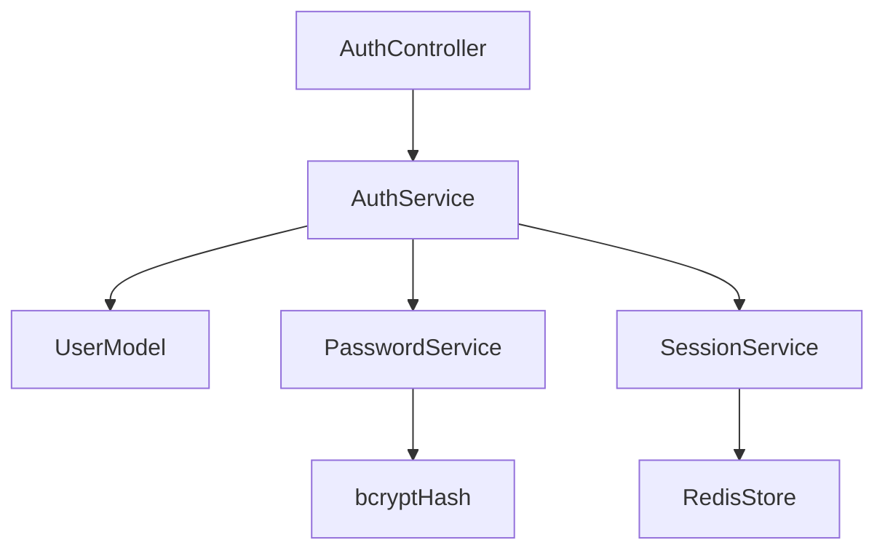

# 🏗️ Documento de Diseño — {{NOMBRE_DEL_FEATURE}}

> **Generado por el flujo spec-driven — Fase 2 de 4**  
> *Basado en los requisitos aprobados en `requirements.md`.*  
> *No avanzar sin aprobación explícita del usuario.*

## 📌 Resumen Ejecutivo

_Descripción de alto nivel de la funcionalidad, su rol dentro del sistema general, y cómo satisface los requisitos definidos en la Fase 1._

## 🧭 Alineación con Documentos de Dirección

### ⚙️ Estándares Técnicos (`tech.md`)
_Cómo este diseño sigue los patrones, tecnologías y convenciones técnicas documentadas._

### 📂 Estructura del Proyecto (`structure.md`)
_Cómo se organizarán los archivos y componentes según las convenciones del proyecto._

## 🔍 Análisis de Reutilización de Código

_Lista de componentes, utilidades o servicios existentes que se aprovecharán, extenderán o integrarán._

### ✅ Componentes/Utilidades a Reutilizar
- **`validateEmail` (utils/validators.js)**:  
  _Se usará para validar formato de email en registro. Ya implementado y testeado._
- **`bcryptHash` (utils/security.js)**:  
  _Se extenderá para incluir salting automático, siguiendo estándar de seguridad actual._
- **`SessionService` (services/session.js)**:  
  _Se integrará directamente para crear y gestionar sesiones post-login._

### 🔄 Puntos de Integración
- **API Gateway (`/api/auth`)**:  
  _Las nuevas rutas se registrarán aquí, siguiendo convención de versionado v1._
- **Base de Datos (`users` collection)**:  
  _Se extenderá el esquema existente con campos `password_hash` y `email_verified`._
- **Servicio de Notificaciones**:  
  _Se llamará para enviar emails de bienvenida tras registro exitoso._

## 🧩 Decisiones de Diseño Clave

_Cada decisión debe incluir: problema, alternativas consideradas, elección final y justificación._

> **Ejemplo**:
> - **Problema**: ¿Dónde manejar la lógica de validación de contraseña?
> - **Alternativas**:  
>   a) En el controlador (rápido, pero rompe SRP)  
>   b) En un servicio dedicado (reutilizable, testable)  
>   c) En middleware (genérico, pero menos específico)  
> - **Elección**: Servicio dedicado (`PasswordService`)  
> - **Justificación**: Permite reutilización en otros features (ej: cambio de contraseña), facilita testing unitario, y cumple con principio de responsabilidad única.

## 🏛️ Arquitectura General

_Descripción de patrones arquitectónicos, flujos de datos y dependencias entre componentes._



> **Leyenda**:  
> - `AuthController`: Recibe peticiones HTTP.  
> - `AuthService`: Orquesta lógica de negocio.  
> - `UserModel`: Acceso a datos de usuario.  
> - `PasswordService`: Hashing y verificación segura.  
> - `SessionService`: Gestión de sesiones en Redis.

## 🧱 Componentes e Interfaces

Cada componente debe definir: propósito, interfaces públicas, dependencias y reutilización.

---

### 🧩 Componente 1: `AuthService`

- **Propósito**:  
  _Orquestar el flujo de registro/login, validar credenciales, y gestionar sesiones._

- **Interfaces Públicas**:  
  ```ts
  register(userData: { email: string, password: string }): Promise<User>
  login(credentials: { email: string, password: string }): Promise<Session>
  ```

- **Dependencias**:  
  - `UserModel` (para persistencia)  
  - `PasswordService` (para hashing/verificación)  
  - `SessionService` (para crear sesión)

- **Reutiliza**:  
  - `validateEmail` desde `utils/validators`  
  - `logError` desde `utils/logger`

---

### 🧩 Componente 2: `PasswordService`

- **Propósito**:  
  _Gestionar hashing seguro de contraseñas y verificación._

- **Interfaces Públicas**:  
  ```ts
  hash(password: string): Promise<string>
  verify(password: string, hash: string): Promise<boolean>
  ```

- **Dependencias**:  
  - Librería `bcrypt` (ya en package.json)

- **Reutiliza**:  
  - Configuración de rounds desde `config/security.js`

## 📊 Modelos de Datos

_Definición clara de estructuras de datos, con tipos y restricciones._

### 🧾 Modelo: `User`

```ts
interface User {
  id: string;           // UUID v4
  email: string;        // Único, validado con RFC 5322
  password_hash: string; // bcrypt hash, min 60 chars
  created_at: Date;     // ISO 8601
  email_verified: boolean; // default: false
}
```

### 🧾 Modelo: `Session`

```ts
interface Session {
  token: string;        // JWT firmado
  user_id: string;      // referencia a User.id
  expires_at: Date;     // +30min desde creación
  ip_address: string;   // para auditoría
}
```

## 🚫 Manejo de Errores

_Especificación de escenarios de error, cómo se manejan y qué ve el usuario._

### 🚨 Escenarios Clave

1. **Email ya registrado**  
   - **Manejo**: Devolver error 409 Conflict con código `EMAIL_EXISTS`.  
   - **Impacto Usuario**: Mensaje: “Este email ya está registrado. ¿Olvidaste tu contraseña?”

2. **Contraseña incorrecta**  
   - **Manejo**: Devolver error 401 Unauthorized con código `INVALID_CREDENTIALS`.  
   - **Impacto Usuario**: Mensaje: “Email o contraseña incorrectos.”

3. **Error de conexión a DB**  
   - **Manejo**: Reintentar hasta 3 veces, luego loggear y devolver 503 Service Unavailable.  
   - **Impacto Usuario**: Mensaje: “Servicio temporalmente no disponible. Inténtalo más tarde.”

## 🧪 Estrategia de Pruebas (TDD Enforced)

_Cómo se validará que el diseño funciona correctamente — **prueba primero, código después**._

### ✅ Pruebas Unitarias
- **Enfoque**: Mockear dependencias, probar lógica de cada componente en aislamiento.
- **Componentes Clave**:  
  - `PasswordService.hash/verify` → Validar que genera hashes válidos y verifica correctamente.  
  - `AuthService.register` → Validar que rechaza emails inválidos o duplicados.

### 🔗 Pruebas de Integración
- **Enfoque**: Probar flujos completos con servicios reales (DB, Redis en modo test).
- **Flujos Clave**:  
  - Registro → Login → Obtención de perfil → Cierre de sesión.  
  - Registro con email duplicado → debe fallar elegantemente.

### 🌐 Pruebas End-to-End (E2E)
- **Enfoque**: Simular usuario real con navegador o cliente HTTP.
- **Escenarios Clave**:  
  - Usuario nuevo se registra, recibe email, inicia sesión y accede a su perfil.  
  - Usuario intenta login con credenciales erróneas → ve mensaje de error claro.

## 🔄 Alternativas Consideradas (Opcional pero Recomendado)

_Documentar brevemente opciones descartadas y por qué._

> **Ejemplo**:  
> - **JWT vs Sesiones en DB**: Se eligió JWT por escalabilidad y simplicidad, aunque sesiones en DB ofrecen mejor control de revocación.  
> - **OAuth2 vs Auth básica**: Se descartó OAuth2 por complejidad innecesaria para MVP.

## ✅ Checklist de Validación (Para Agente o Autovalidación)

Antes de presentar al usuario, verificar:

- [ ] El diseño cubre **todos** los requisitos funcionales y no funcionales de `requirements.md`.
- [ ] Todos los componentes definen claramente interfaces, dependencias y reutilización.
- [ ] Los diagramas Mermaid reflejan fielmente las dependencias y flujos.
- [ ] Los modelos de datos incluyen tipos, restricciones y ejemplos.
- [ ] Cada escenario de error tiene manejo definido e impacto de usuario claro.
- [ ] La estrategia de pruebas cubre unitario, integración y E2E — **con enfoque TDD**.
- [ ] Existe alineación explícita con `tech.md` y `structure.md`.
- [ ] Se documentaron decisiones clave y alternativas consideradas.

## 📝 Notas para el Usuario

> “Por favor, revisa este diseño detenidamente. Asegúrate de que:  
> - La arquitectura es técnicamente sólida y escalable.  
> - Se reutiliza adecuadamente el código existente.  
> - Los componentes y modelos están claramente definidos.  
> - Los escenarios de error están bien manejados.  
> - **La estrategia de pruebas permite implementar con TDD (prueba primero, código después).**  
>   
> **Responde ‘aprobado’ solo si todo está correcto. Si hay cambios, indícalos específicamente.**”

## ✅ Estado del Flujo

```text
[ ] Diseño aprobado → Esperando aprobación del usuario
```
