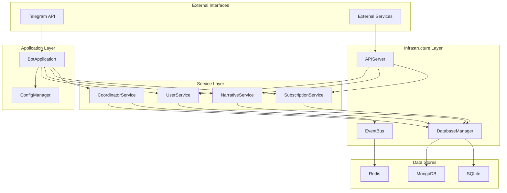
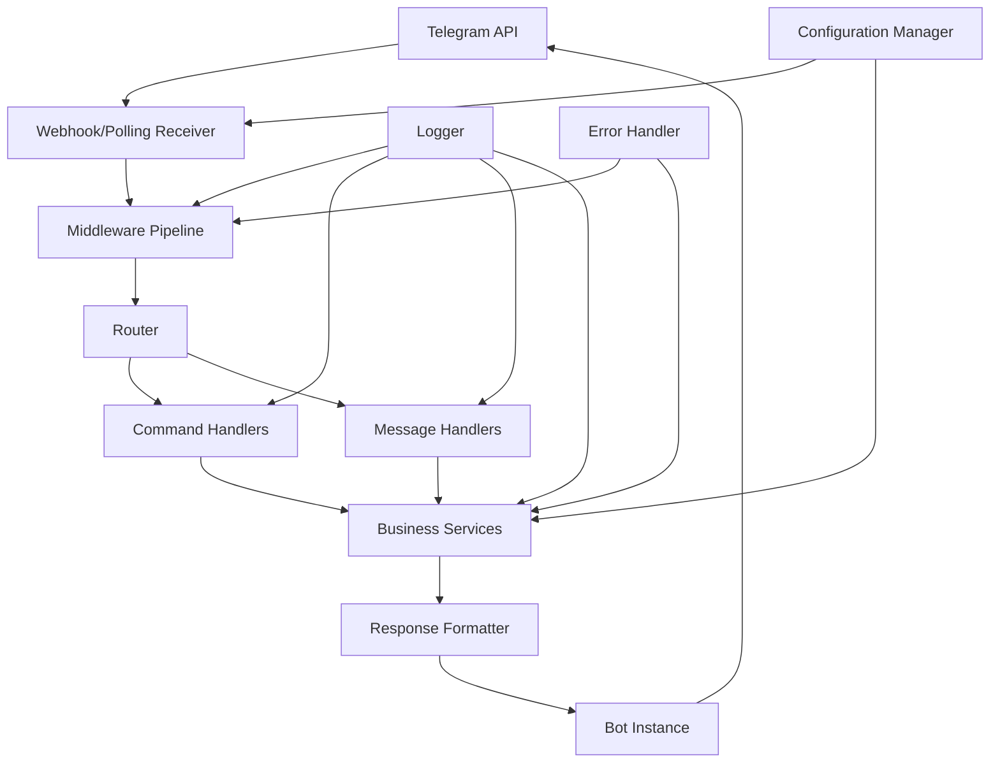

# YABOT - Yet Another Bot

A Telegram bot framework built with Aiogram 3.

## Overview

YABOT (Yet Another Bot) is a modern, scalable Telegram bot framework that provides essential functionality for user interaction and system management. 
The framework serves as the base infrastructure for a Telegram bot with basic command handling, webhook connectivity, and menu navigation capabilities.

## Features

- **Command Handling**: Built-in support for /start, /menu, and /help commands
- **Dual Mode Operation**: Supports both webhook and polling modes for receiving updates
- **Structured Architecture**: Clean separation of concerns with layered architecture
- **Configuration Management**: Environment-based configuration with validation
- **Error Handling**: Comprehensive error handling with graceful degradation
- **Logging**: Structured logging with contextual information
- **Middleware Support**: Request/response processing pipeline
- **Extensible Design**: Easy to extend with new commands and features
- **Database Infrastructure**: Dual database support (MongoDB for dynamic state, SQLite for transactional data)
- **Event-Driven Architecture**: Redis Pub/Sub event bus with local fallback queues
- **Internal REST APIs**: FastAPI-based internal service communication
- **User Management**: Unified user operations across multiple databases
- **Subscription Services**: Premium feature management with access control
- **Narrative Engine**: Dynamic story content management and progression tracking

## Requirements

### Functional Requirements

1. **Telegram Bot Configuration**
   - WHEN the bot is initialized THEN the system SHALL establish a connection with Telegram API using a valid bot token
   - WHEN the bot token is invalid THEN the system SHALL log an appropriate error and fail gracefully
   - WHEN the bot is configured THEN the system SHALL support both polling and webhook modes for receiving updates
   - WHEN the bot starts THEN the system SHALL validate all required configuration parameters before beginning operation

2. **Basic Command Implementation**
   - WHEN a user sends /start command THEN the bot SHALL respond with a welcome message and basic usage instructions
   - WHEN a user sends /menu command THEN the bot SHALL display the main menu with available options
   - WHEN a user sends an unrecognized command THEN the bot SHALL respond with a helpful message explaining available commands
   - WHEN commands are executed THEN the bot SHALL respond within 3 seconds under normal network conditions
   - WHEN multiple users send commands simultaneously THEN the bot SHALL handle all requests without blocking

3. **Webhook Integration**
   - WHEN webhook mode is enabled THEN the system SHALL configure a secure HTTPS endpoint for receiving Telegram updates
   - WHEN a webhook receives an update THEN the system SHALL process it asynchronously without blocking other requests
   - WHEN webhook configuration fails THEN the system SHALL fallback to polling mode and log the webhook error
   - WHEN the webhook endpoint receives invalid requests THEN the system SHALL reject them and log security warnings
   - WHEN webhook SSL certificate is invalid THEN the system SHALL fail with a clear error message during configuration

4. **Error Handling and Logging**
   - WHEN any error occurs THEN the system SHALL log the error with timestamp, severity level, and context information
   - WHEN a user encounters an error THEN the bot SHALL respond with a user-friendly error message without exposing system details
   - WHEN critical errors occur THEN the system SHALL attempt graceful recovery and continue operating if possible
   - WHEN the bot is unable to send a message THEN the system SHALL retry with exponential backoff up to 3 attempts

5. **Message Processing**
   - WHEN a text message is received THEN the system SHALL route it to the appropriate handler based on content
   - WHEN an unsupported message type is received THEN the bot SHALL inform the user about supported message types
   - WHEN message processing takes longer than expected THEN the system SHALL send a "processing" indicator to the user
   - WHEN message handlers are registered THEN the system SHALL support middleware for preprocessing and postprocessing

6. **Database Infrastructure**
   - WHEN the system initializes THEN it SHALL establish connections to both MongoDB and SQLite databases
   - WHEN storing user dynamic states THEN the system SHALL use MongoDB for flexible schema requirements
   - WHEN storing subscription data and user profiles THEN the system SHALL use SQLite for ACID compliance
   - WHEN database operations fail THEN the system SHALL implement graceful fallback mechanisms

7. **Event Bus**
   - WHEN the system starts THEN it SHALL establish Redis connection with connection pooling
   - WHEN events are published THEN the system SHALL include timestamp, event_id, and correlation_id for tracing
   - WHEN Redis is unavailable THEN the system SHALL queue events locally and replay them when connection is restored

8. **Internal REST APIs**
   - WHEN the API service starts THEN it SHALL expose endpoints following OpenAPI 3.0 specification
   - WHEN accessing APIs THEN requests SHALL include valid JWT tokens in Authorization headers
   - WHEN APIs are modified THEN the system SHALL maintain backward compatibility

9. **Migration Support**
   - WHEN deploying new infrastructure THEN existing webhook and polling functionality SHALL continue to work
   - WHEN migrating user data THEN the system SHALL create database records for existing active users
   - WHEN migration fails THEN the system SHALL rollback to previous functionality automatically

### Non-Functional Requirements

1. **Performance**
   - The bot SHALL respond to commands within 3 seconds under normal conditions
   - The system SHALL handle at least 100 concurrent users without performance degradation
   - Memory usage SHALL not exceed 512MB during normal operation
   - Database operations SHALL complete within 100ms for 95% of requests
   - Event publication SHALL have latency under 10ms for local Redis instances
   - API endpoints SHALL respond within 200ms for 99% of requests
   - The system SHALL support up to 10,000 concurrent users

2. **Security**
   - All communication with Telegram API SHALL use HTTPS/TLS encryption
   - Bot token SHALL be stored securely using environment variables
   - Webhook endpoint SHALL validate incoming request signatures
   - User input SHALL be sanitized to prevent injection attacks
   - All database connections SHALL use encrypted connections (TLS/SSL)
   - Redis connections SHALL use authentication and encryption in production
   - Internal APIs SHALL validate all input parameters against schema definitions
   - Sensitive data (tokens, credentials) SHALL never be logged in plain text

3. **Reliability**
   - The bot SHALL have 99% uptime during operational hours
   - System SHALL automatically restart after crashes with state preservation
   - Failed message deliveries SHALL be retried with exponential backoff
   - Critical errors SHALL be logged with sufficient detail for debugging
   - The system SHALL achieve 99.5% uptime
   - Database failover SHALL complete within 30 seconds
   - Event processing SHALL implement at-least-once delivery guarantees
   - All components SHALL implement health check endpoints

4. **Usability**
   - Command responses SHALL be clear and include helpful instructions
   - Error messages SHALL be user-friendly and actionable
   - Menu navigation SHALL be intuitive with clear option descriptions
   - Bot SHALL provide help documentation accessible via commands

5. **Scalability**
   - Database connections SHALL use connection pooling with configurable limits
   - Redis SHALL support clustering for horizontal scaling
   - The coordinator service SHALL be stateless to enable multiple instances
   - APIs SHALL support horizontal scaling through load balancing

## Project Structure

```
yabot/
├── src/
│   ├── api/            # Internal REST API components
│   │   ├── auth.py           # JWT authentication service
│   │   ├── server.py         # FastAPI server setup
│   │   └── endpoints/        # API endpoint handlers
│   │       ├── users.py      # User-related endpoints
│   │       └── narrative.py  # Narrative-related endpoints
│   ├── config/         # Configuration management
│   │   └── manager.py        # Configuration manager
│   ├── core/           # Core framework components
│   │   ├── application.py    # Main bot application
│   │   ├── models.py         # Data models
│   │   ├── router.py         # Message routing
│   │   ├── middleware.py     # Middleware management
│   │   └── error_handler.py  # Error handling
│   ├── database/       # Database abstraction and connection management
│   │   ├── manager.py        # Database manager
│   │   ├── init.py           # Database initialization
│   │   ├── schemas/          # Database schemas
│   │   ├── mongodb.py        # MongoDB operations
│   │   ├── sqlite.py         # SQLite operations
│   ├── events/         # Event bus and coordination services
│   │   ├── bus.py            # Redis Pub/Sub event bus
│   │   ├── models.py         # Event data models
│   │   └── processor.py      # Event processing
│   ├── handlers/       # Message and command handlers
│   │   ├── base.py           # Base handler class
│   │   ├── commands.py       # Command handlers
│   │   └── webhook.py        # Webhook handler
│   ├── services/       # Business logic services
│   │   ├── user.py           # User management service
│   │   ├── subscription.py    # Subscription management service
│   │   ├── narrative.py      # Narrative management service
│   │   └── coordinator.py    # Workflow coordination service
│   ├── utils/          # Shared utilities
│   │   ├── logger.py         # Logging utilities
│   │   ├── errors.py         # Error handling utilities
│   │   └── database.py       # Database utilities
│   └── main.py         # Main entry point
├── tests/              # Test suite
│   ├── unit/           # Unit tests
│   ├── integration/    # Integration tests
│   ├── performance/    # Performance tests
│   ├── security/       # Security tests
│   ├── services/       # Service tests
│   ├── database/       # Database tests
│   ├── events/         # Event tests
│   ├── utils/          # Utility tests
│   ├── test_api_server.py    # API server tests
│   ├── test_commands.py      # Command handler tests
│   ├── test_config.py        # Configuration tests
│   ├── test_database_manager.py  # Database manager tests
│   └── conftest.py           # Test configuration
├── scripts/            # Utility scripts
│   └── migrate_to_fase1.py   # Migration script for Fase1 infrastructure
├── docs/               # Documentation
├── requirements.txt    # Dependencies
├── requirements-test.txt  # Test dependencies
├── .env.example        # Environment configuration template
└── README.md           # This file
```

## Installation

### Prerequisites

Before installing YABOT, ensure you have the following:

- Python 3.11+
- MongoDB 4.4+ (for dynamic state storage)
- Redis 6.0+ (for event bus)
- SQLite 3.30+ (for transactional data)
- Telegram Bot Token (from BotFather)

### System Dependencies

For Debian/Ubuntu systems:
```bash
# Install system dependencies
sudo apt-get update
sudo apt-get install -y python3 python3-pip python3-venv
sudo apt-get install -y mongodb redis-server sqlite3
```

For macOS (using Homebrew):
```bash
# Install system dependencies
brew install python3 mongodb-community redis sqlite3
```

### Database Setup

1. **MongoDB Configuration**:
   ```bash
   # Start MongoDB service
   sudo systemctl start mongod
   
   # Create database user (optional but recommended)
   mongosh
   use yabot_db
   db.createUser({
     user: "yabot_user",
     pwd: "secure_password",
     roles: [{role: "readWrite", db: "yabot_db"}]
   })
   exit
   ```

2. **Redis Configuration**:
   ```bash
   # Start Redis service
   sudo systemctl start redis
   
   # Optional: Configure Redis password
   # Edit /etc/redis/redis.conf and set requirepass your_password
   sudo systemctl restart redis
   ```

3. **SQLite Setup**:
   ```bash
   # SQLite is file-based, no service needed
   # Database will be created automatically at the specified path
   ```

### Application Installation

1. Clone the repository:
   ```bash
   git clone <repository-url>
   cd yabot
   ```

2. Create a virtual environment:
   ```bash
   python3 -m venv venv
   source venv/bin/activate  # On Windows: venv\Scripts\activate
   ```

3. Install dependencies:
   ```bash
   pip install -r requirements.txt
   ```

4. Set up environment variables:
   ```bash
   cp .env.example .env
   # Edit .env with your configuration
   ```

5. Run database migrations:
   ```bash
   python scripts/migrate_to_fase1.py --dual-mode
   ```

6. Run the bot:
   ```bash
   python -m src.main
   ```

## Configuration

The bot is configured using environment variables. Copy the `.env.example` file to `.env` and modify the values as needed:

```bash
# Telegram Bot Configuration
BOT_TOKEN=your_telegram_bot_token_here

# Webhook Configuration (leave empty to use polling mode)
WEBHOOK_URL=https://yourdomain.com/webhook
WEBHOOK_SECRET=your_webhook_secret_here

# Polling Configuration (used when WEBHOOK_URL is empty)
POLLING_ENABLED=True

# Logging Configuration
LOG_LEVEL=INFO
LOG_FORMAT=json

# Database Configuration
MONGODB_URI=mongodb://localhost:27017
MONGODB_DATABASE=yabot_db
SQLITE_DATABASE_PATH=/var/lib/yabot/yabot.db

# Redis Configuration
REDIS_URL=redis://localhost:6379
REDIS_PASSWORD=your_redis_password_here

# API Configuration
API_HOST=127.0.0.1
API_PORT=8000
API_RELOAD=false

# JWT Configuration (for internal API authentication)
JWT_SECRET_KEY=your_jwt_secret_key_here
```

### Environment-Specific Configuration

For development:
```bash
LOG_LEVEL=DEBUG
API_RELOAD=true
```

For production:
```bash
LOG_LEVEL=INFO
API_RELOAD=false
```

## Infrastructure Components

### Database Infrastructure

YABOT uses a dual database approach for optimal performance and data integrity:

1. **MongoDB** (Dynamic State Storage):
   - Stores user dynamic states (narrative progress, current menu context)
   - Flexible schema for evolving data requirements
   - High-performance read/write operations

2. **SQLite** (Transactional Data Storage):
   - Stores user profiles and subscription information
   - ACID compliance for data integrity
   - Lightweight and efficient for structured data

### Event Bus Infrastructure

The event-driven architecture uses Redis Pub/Sub with reliability features:

1. **Redis Pub/Sub**:
   - Real-time event distribution
   - Low-latency message passing
   - Support for multiple subscribers

2. **Local Fallback Queue**:
   - Event persistence during Redis downtime
   - Automatic replay when connectivity is restored
   - Guaranteed delivery with at-least-once semantics

### Internal REST API

YABOT provides internal REST APIs for service communication:

1. **User Management**:
   - GET /api/v1/user/{id}/state - Retrieve user context
   - PUT /api/v1/user/{id}/preferences - Update user preferences
   - GET /api/v1/user/{id}/subscription - Get subscription status

2. **Narrative Management**:
   - GET /api/v1/narrative/{fragment_id} - Retrieve narrative content

3. **Authentication**:
   - JWT-based authentication for all API endpoints
   - Service-to-service authentication

## Migration Process

YABOT includes a zero-downtime migration process for existing deployments:

1. **Pre-Migration Setup**:
   ```bash
   # Run validation-only mode to check readiness
   python scripts/migrate_to_fase1.py --validate-only
   ```

2. **Execute Migration**:
   ```bash
   # Run migration with dual read/write mode
   python scripts/migrate_to_fase1.py --dual-mode
   ```

3. **Post-Migration Validation**:
   ```bash
   # Verify migration success
   python scripts/migrate_to_fase1.py --validate-only
   ```

## Architecture

The bot follows a layered architecture with clear boundaries between components:



### Components

1. **BotApplication**: Main application orchestrator that initializes and coordinates all components
2. **ConfigManager**: Centralized configuration management with validation
3. **DatabaseManager**: Unified interface for MongoDB and SQLite operations
4. **EventBus**: Redis Pub/Sub event bus with local fallback queue
5. **UserService**: Unified user operations across multiple databases
6. **SubscriptionService**: Premium feature management with access control
7. **NarrativeService**: Dynamic story content management and progression tracking
8. **CoordinatorService**: Workflow orchestration and event sequencing
9. **APIServer**: Internal REST API server for service communication
10. **Router**: Routes incoming messages to appropriate handlers
11. **Command Handlers**: Handle bot commands like /start and /menu
12. **MiddlewareManager**: Manages request/response processing pipeline
13. **ErrorHandler**: Centralized error handling with user-friendly responses
14. **WebhookHandler**: Handles webhook endpoint for receiving Telegram updates

## Usage

### Basic Commands

- `/start` - Display welcome message and basic usage instructions
- `/menu` - Display the main menu with available options
- `/help` - Display help information

### Webhook vs Polling

The bot supports both webhook and polling modes:

- **Webhook Mode**: Set `WEBHOOK_URL` to enable webhook mode for real-time updates
- **Polling Mode**: Leave `WEBHOOK_URL` empty to use polling mode

## Development

### Running Tests

```bash
# Run all tests
pytest

# Run tests with coverage
pytest --cov=src tests/

# Run specific test file
pytest tests/test_config.py

# Run integration tests
pytest tests/integration/

# Run performance tests
pytest tests/performance/
```

### Adding New Commands

1. Add the command handler method in `src/handlers/commands.py`
2. Register the command in `src/core/application.py` in the `_setup_command_handlers` method
3. Add tests in `tests/test_commands.py`

### Adding New Message Handlers

1. Create a new handler class that extends `BaseHandler`
2. Register the handler with the router in `src/core/application.py`
3. Add tests for the new handler

### Adding New Services

1. Create a new service class in `src/services/`
2. Register the service in `src/core/application.py`
3. Add tests in `tests/services/`

## Error Handling

The bot implements comprehensive error handling with the following features:

- **Centralized Error Management**: All errors are processed through a central ErrorHandler
- **Graceful Degradation**: The bot continues operating even when non-critical errors occur
- **User-Friendly Messages**: Technical error details are logged but not exposed to users
- **Retry Mechanisms**: Failed operations are retried with exponential backoff
- **Contextual Logging**: Errors are logged with full context for debugging
- **Health Monitoring**: Component health is continuously monitored

## Testing

The project includes comprehensive tests:

- **Unit Tests**: Test individual components in isolation
- **Integration Tests**: Test component interactions
- **Performance Tests**: Validate performance requirements
- **Security Tests**: Test security features and vulnerabilities
- **Configuration Tests**: Test configuration management

Run tests with:
```bash
pytest tests/
```

## Requirements

- Python 3.11+
- Aiogram 3
- Pydantic 2.0+
- Structlog
- Python-dotenv
- PyMongo
- Redis-py
- FastAPI
- Uvicorn
- PyJWT

## License

This project is licensed under the MIT License - see the LICENSE file for details.

## Contributing

1. Fork the repository
2. Create a feature branch
3. Commit your changes
4. Push to the branch
5. Create a Pull Request

## Installation

1. Clone the repository:
   ```bash
   git clone <repository-url>
   cd yabot
   ```

2. Install dependencies:
   ```bash
   pip install -r requirements.txt
   ```

3. Set up environment variables:
   ```bash
   cp .env.example .env
   # Edit .env with your configuration
   ```

4. Run the bot:
   ```bash
   python -m src.main
   ```

## Configuration

The bot is configured using environment variables. Copy the `.env.example` file to `.env` and modify the values as needed:

```bash
# Telegram Bot Configuration
BOT_TOKEN=your_telegram_bot_token_here

# Webhook Configuration (leave empty to use polling mode)
WEBHOOK_URL=https://yourdomain.com/webhook
WEBHOOK_SECRET=your_webhook_secret_here

# Polling Configuration (used when WEBHOOK_URL is empty)
POLLING_ENABLED=True

# Logging Configuration
LOG_LEVEL=INFO
LOG_FORMAT=json
```

## Architecture

The bot follows a layered architecture with clear boundaries between components:



### Components

1. **BotApplication**: Main application orchestrator that initializes and coordinates all components
2. **ConfigManager**: Centralized configuration management with validation
3. **Router**: Routes incoming messages to appropriate handlers
4. **Command Handlers**: Handle bot commands like /start and /menu
5. **MiddlewareManager**: Manages request/response processing pipeline
6. **ErrorHandler**: Centralized error handling with user-friendly responses
7. **WebhookHandler**: Handles webhook endpoint for receiving Telegram updates

## Usage

### Basic Commands

- `/start` - Display welcome message and basic usage instructions
- `/menu` - Display the main menu with available options
- `/help` - Display help information

### Webhook vs Polling

The bot supports both webhook and polling modes:

- **Webhook Mode**: Set `WEBHOOK_URL` to enable webhook mode for real-time updates
- **Polling Mode**: Leave `WEBHOOK_URL` empty to use polling mode

## Development

### Running Tests

```bash
# Run all tests
pytest

# Run tests with coverage
pytest --cov=src tests/

# Run specific test file
pytest tests/test_config.py
```

### Adding New Commands

1. Add the command handler method in `src/handlers/commands.py`
2. Register the command in `src/core/application.py` in the `_setup_command_handlers` method
3. Add tests in `tests/test_commands.py`

### Adding New Message Handlers

1. Create a new handler class that extends `BaseHandler`
2. Register the handler with the router in `src/core/application.py`
3. Add tests for the new handler

## Error Handling

The bot implements comprehensive error handling with the following features:

- **Centralized Error Management**: All errors are processed through a central ErrorHandler
- **Graceful Degradation**: The bot continues operating even when non-critical errors occur
- **User-Friendly Messages**: Technical error details are logged but not exposed to users
- **Retry Mechanisms**: Failed operations are retried with exponential backoff
- **Contextual Logging**: Errors are logged with full context for debugging

## Testing

The project includes comprehensive tests:

- **Unit Tests**: Test individual components in isolation
- **Integration Tests**: Test component interactions
- **Configuration Tests**: Test configuration management

Run tests with:
```bash
pytest tests/
```

## Requirements

- Python 3.11+
- Aiogram 3
- Pydantic 2.0+
- Structlog
- Python-dotenv

## License

This project is licensed under the MIT License - see the LICENSE file for details.

## Contributing

1. Fork the repository
2. Create a feature branch
3. Commit your changes
4. Push to the branch
5. Create a Pull Request