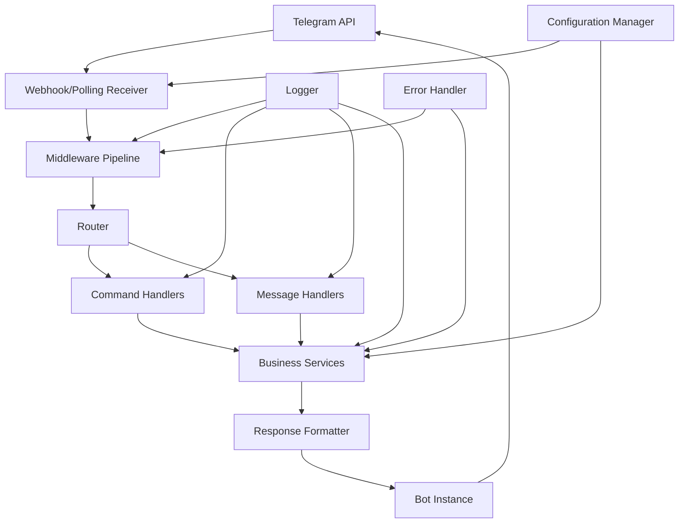

# YABOT - Yet Another Bot

A Telegram bot framework built with Aiogram 3.

## Overview

YABOT (Yet Another Bot) is a modern, scalable Telegram bot framework that provides essential functionality for user interaction and system management. 
The framework serves as the base infrastructure for a Telegram bot with basic command handling, webhook connectivity, and menu navigation capabilities.

## Features

- **Command Handling**: Built-in support for /start, /menu, and /help commands
- **Dual Mode Operation**: Supports both webhook and polling modes for receiving updates
- **Structured Architecture**: Clean separation of concerns with layered architecture
- **Configuration Management**: Environment-based configuration with validation
- **Error Handling**: Comprehensive error handling with graceful degradation
- **Logging**: Structured logging with contextual information
- **Middleware Support**: Request/response processing pipeline
- **Extensible Design**: Easy to extend with new commands and features

## Requirements

### Functional Requirements

1. **Telegram Bot Configuration**
   - WHEN the bot is initialized THEN the system SHALL establish a connection with Telegram API using a valid bot token
   - WHEN the bot token is invalid THEN the system SHALL log an appropriate error and fail gracefully
   - WHEN the bot is configured THEN the system SHALL support both polling and webhook modes for receiving updates
   - WHEN the bot starts THEN the system SHALL validate all required configuration parameters before beginning operation

2. **Basic Command Implementation**
   - WHEN a user sends /start command THEN the bot SHALL respond with a welcome message and basic usage instructions
   - WHEN a user sends /menu command THEN the bot SHALL display the main menu with available options
   - WHEN a user sends an unrecognized command THEN the bot SHALL respond with a helpful message explaining available commands
   - WHEN commands are executed THEN the bot SHALL respond within 3 seconds under normal network conditions
   - WHEN multiple users send commands simultaneously THEN the bot SHALL handle all requests without blocking

3. **Webhook Integration**
   - WHEN webhook mode is enabled THEN the system SHALL configure a secure HTTPS endpoint for receiving Telegram updates
   - WHEN a webhook receives an update THEN the system SHALL process it asynchronously without blocking other requests
   - WHEN webhook configuration fails THEN the system SHALL fallback to polling mode and log the webhook error
   - WHEN the webhook endpoint receives invalid requests THEN the system SHALL reject them and log security warnings
   - WHEN webhook SSL certificate is invalid THEN the system SHALL fail with a clear error message during configuration

4. **Error Handling and Logging**
   - WHEN any error occurs THEN the system SHALL log the error with timestamp, severity level, and context information
   - WHEN a user encounters an error THEN the bot SHALL respond with a user-friendly error message without exposing system details
   - WHEN critical errors occur THEN the system SHALL attempt graceful recovery and continue operating if possible
   - WHEN the bot is unable to send a message THEN the system SHALL retry with exponential backoff up to 3 attempts

5. **Message Processing**
   - WHEN a text message is received THEN the system SHALL route it to the appropriate handler based on content
   - WHEN an unsupported message type is received THEN the bot SHALL inform the user about supported message types
   - WHEN message processing takes longer than expected THEN the system SHALL send a "processing" indicator to the user
   - WHEN message handlers are registered THEN the system SHALL support middleware for preprocessing and postprocessing

### Non-Functional Requirements

1. **Performance**
   - The bot SHALL respond to commands within 3 seconds under normal conditions
   - The system SHALL handle at least 100 concurrent users without performance degradation
   - Memory usage SHALL not exceed 512MB during normal operation

2. **Security**
   - All communication with Telegram API SHALL use HTTPS/TLS encryption
   - Bot token SHALL be stored securely using environment variables
   - Webhook endpoint SHALL validate incoming request signatures
   - User input SHALL be sanitized to prevent injection attacks

3. **Reliability**
   - The bot SHALL have 99% uptime during operational hours
   - System SHALL automatically restart after crashes with state preservation
   - Failed message deliveries SHALL be retried with exponential backoff
   - Critical errors SHALL be logged with sufficient detail for debugging

4. **Usability**
   - Command responses SHALL be clear and include helpful instructions
   - Error messages SHALL be user-friendly and actionable
   - Menu navigation SHALL be intuitive with clear option descriptions
   - Bot SHALL provide help documentation accessible via commands

## Project Structure

```
yabot/
├── src/
│   ├── core/           # Core framework components
│   │   ├── application.py    # Main bot application
│   │   ├── models.py         # Data models
│   │   ├── router.py         # Message routing
│   │   ├── middleware.py      # Middleware management
│   │   ├── error_handler.py   # Error handling
│   ├── handlers/       # Message and command handlers
│   │   ├── base.py           # Base handler class
│   │   ├── commands.py       # Command handlers
│   │   ├── webhook.py        # Webhook handler
│   ├── services/       # Business logic services
│   ├── config/         # Configuration management
│   │   ├── manager.py        # Configuration manager
│   ├── utils/          # Shared utilities
│   │   ├── logger.py         # Logging utilities
│   │   ├── errors.py         # Error handling utilities
├── tests/              # Test suite
├── docs/               # Documentation
├── requirements.txt    # Dependencies
├── .env.example        # Environment configuration template
└── README.md           # This file
```

## Installation

1. Clone the repository:
   ```bash
   git clone <repository-url>
   cd yabot
   ```

2. Install dependencies:
   ```bash
   pip install -r requirements.txt
   ```

3. Set up environment variables:
   ```bash
   cp .env.example .env
   # Edit .env with your configuration
   ```

4. Run the bot:
   ```bash
   python -m src.main
   ```

## Configuration

The bot is configured using environment variables. Copy the `.env.example` file to `.env` and modify the values as needed:

```bash
# Telegram Bot Configuration
BOT_TOKEN=your_telegram_bot_token_here

# Webhook Configuration (leave empty to use polling mode)
WEBHOOK_URL=https://yourdomain.com/webhook
WEBHOOK_SECRET=your_webhook_secret_here

# Polling Configuration (used when WEBHOOK_URL is empty)
POLLING_ENABLED=True

# Logging Configuration
LOG_LEVEL=INFO
LOG_FORMAT=json
```

## Architecture

The bot follows a layered architecture with clear boundaries between components:



### Components

1. **BotApplication**: Main application orchestrator that initializes and coordinates all components
2. **ConfigManager**: Centralized configuration management with validation
3. **Router**: Routes incoming messages to appropriate handlers
4. **Command Handlers**: Handle bot commands like /start and /menu
5. **MiddlewareManager**: Manages request/response processing pipeline
6. **ErrorHandler**: Centralized error handling with user-friendly responses
7. **WebhookHandler**: Handles webhook endpoint for receiving Telegram updates

## Usage

### Basic Commands

- `/start` - Display welcome message and basic usage instructions
- `/menu` - Display the main menu with available options
- `/help` - Display help information

### Webhook vs Polling

The bot supports both webhook and polling modes:

- **Webhook Mode**: Set `WEBHOOK_URL` to enable webhook mode for real-time updates
- **Polling Mode**: Leave `WEBHOOK_URL` empty to use polling mode

## Development

### Running Tests

```bash
# Run all tests
pytest

# Run tests with coverage
pytest --cov=src tests/

# Run specific test file
pytest tests/test_config.py
```

### Adding New Commands

1. Add the command handler method in `src/handlers/commands.py`
2. Register the command in `src/core/application.py` in the `_setup_command_handlers` method
3. Add tests in `tests/test_commands.py`

### Adding New Message Handlers

1. Create a new handler class that extends `BaseHandler`
2. Register the handler with the router in `src/core/application.py`
3. Add tests for the new handler

## Error Handling

The bot implements comprehensive error handling with the following features:

- **Centralized Error Management**: All errors are processed through a central ErrorHandler
- **Graceful Degradation**: The bot continues operating even when non-critical errors occur
- **User-Friendly Messages**: Technical error details are logged but not exposed to users
- **Retry Mechanisms**: Failed operations are retried with exponential backoff
- **Contextual Logging**: Errors are logged with full context for debugging

## Testing

The project includes comprehensive tests:

- **Unit Tests**: Test individual components in isolation
- **Integration Tests**: Test component interactions
- **Configuration Tests**: Test configuration management

Run tests with:
```bash
pytest tests/
```

## Requirements

- Python 3.11+
- Aiogram 3
- Pydantic 2.0+
- Structlog
- Python-dotenv

## License

This project is licensed under the MIT License - see the LICENSE file for details.

## Contributing

1. Fork the repository
2. Create a feature branch
3. Commit your changes
4. Push to the branch
5. Create a Pull Request