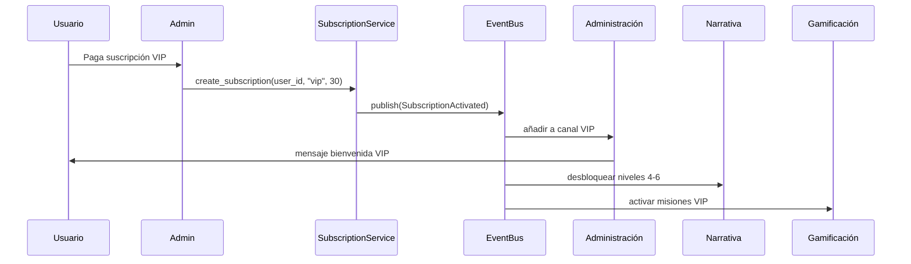
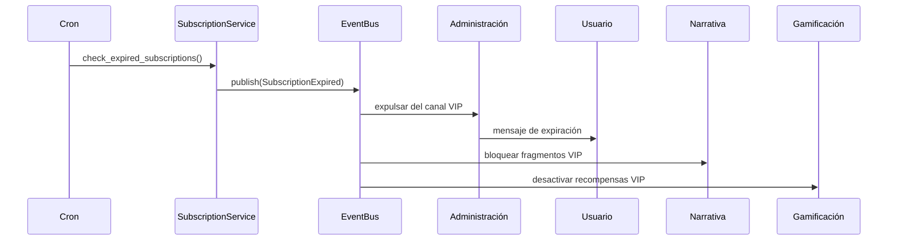
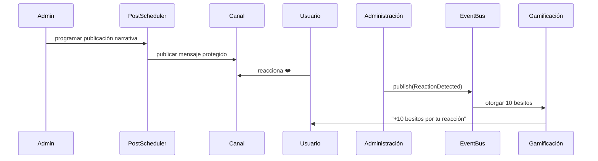
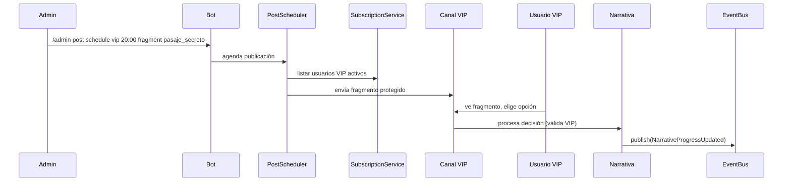
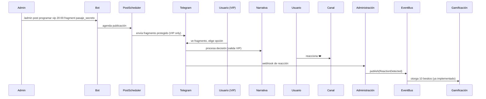

# Contextualización del Módulo de Administración de Canales - DianaBot

## 🎯 Objetivo del Módulo (según concepto oficial)

El módulo de Administración de Canales es el **sistema nervioso central de control y monetización** de DianaBot. Su propósito es:

- Gestionar el **acceso diferenciado** entre canal gratuito (niveles 1–3) y canal VIP (niveles 4–6).
- **Automatizar la publicación** de contenido narrativo, gamificado y administrativo.
- **Proteger el contenido** contra reenvíos, descargas o accesos no autorizados.
- **Integrar activamente** con Narrativa y Gamificación mediante publicaciones inteligentes.

## 🔧 Componentes Clave del Sistema de Administración

### Gestión de Acceso VIP
- **Control de suscripciones**: Validación automática de estado VIP basada en fecha de expiración.
- **Expulsión automática**: Usuarios expulsados del canal VIP al expirar suscripción.
- **Mensajes de bienvenida/despedida**: Automatizados según el estado de suscripción.

### Publicación Inteligente
- **Programación avanzada**: Publicaciones con fecha/hora específica utilizando APScheduler.
- **Protección de contenido**: Mensajes VIP con `protect_content=True` (impide reenvío/descarga).
- **Integración transmodular**: Publicaciones que disparan eventos en Narrativa y Gamificación.

### Notificaciones Automáticas
- **Recordatorios de renovación**: 3 días antes del vencimiento de suscripción VIP.
- **Confirmaciones de pago**: Mensaje automático tras activar suscripción.
- **Alertas administrativas**: Notificaciones a admins sobre eventos críticos.

## 📊 Modelos de Datos Clave (Alineados con Fase 2 y Concepto)

### `Subscription` (ya validado en SubscriptionService)
```python
{
    "user_id": str,
    "plan_type": "free" | "vip",
    "start_date": datetime,
    "end_date": datetime,
    "status": "active" | "expired" | "cancelled"
}
```
- Almacenado en MongoDB (`subscriptions`)

### `ScheduledPost` (nuevo)
```python
{
    "post_id": str,
    "channel_id": str,
    "publish_time": datetime,
    "content_type": "text" | "poll" | "fragment" | "trivia",
    "content": str,
    "protection_level": "free" | "vip_only",
    "metadata": {
        "narrative_fragment_id": Optional[str],
        "trivia_id": Optional[str],
        "mission_id": Optional[str]
    },
    "status": "scheduled" | "published" | "failed",
    "created_by": str  # admin user_id
}
```

### `MessageProtection` (nuevo)
```python
{
    "protection_id": str,
    "rules": {
        "vip_content_protected": bool,
        "disable_forwarding": bool,
        "disable_download": bool
    },
    "applied_to": ["channel_id1", "channel_id2"]
}
```

### `AdminLog` (nuevo)
```python
{
    "log_id": str,
    "admin_user_id": str,
    "action": str,  # "subscription_add", "post_schedule", "user_expel"
    "target_user_id": Optional[str],
    "details": Dict[str, Any],
    "timestamp": datetime,
    "ip_address": Optional[str]
}
```

## 🔄 Servicios a Reutilizar (ya implementados)

### `SubscriptionService` (ya validado)
- **Crear/verificar/expirar suscripciones**
- Métodos: `create_subscription()`, `check_subscription_status()`, `update_subscription_status()`
- Ya integrado con EventBus para publicar `SubscriptionActivated/Expired`

### `EventBus` (ya validado)
- **Publicar eventos clave**:
  - `SubscriptionActivated(user_id)` → notificar módulos
  - `SubscriptionExpired(user_id)` → expulsar y revocar beneficios
  - `PostPublished(post_id, channel_id, content_type)` → disparar acciones
  - `ReactionDetected(user_id, content_id, reaction_type)` → otorgar besitos

- **Suscribirse a**:
  - `BesitosAdded` → registrar participación activa (evitar expulsión)
  - `NarrativeProgressUpdated` → ajustar publicaciones futuras
  - `MissionCompleted` → otorgar acceso temporal VIP

### `UserService` (ya validado)
- **Obtener contexto del usuario** para mensajes personalizados
- **Actualizar roles** y permisos de acceso

## 🤖 Handlers y Flujos Esperados (Aiogram 3)

### Handlers Automáticos
#### Cron Job Diario
```python
@scheduler.scheduled_job('cron', hour=0, minute=0)
async def check_expired_subscriptions():
    """Verifica suscripciones expiradas → expulsa del canal VIP → publica evento"""
```

#### Webhook de Reacciones
```python
@router.message(F.content_type == ContentType.ANY)
async def handle_channel_reaction(message: Message, event_bus: EventBus):
    """Al recibir reacción → valida canal gestionado → publica ReactionDetected"""
```

### Handlers Administrativos (Privados)
#### Comandos exclusivos para admins
```python
@router.message(Command("admin"), StateFilter(None))
async def admin_command(message: Message, command: CommandObject, user_service: UserService):
    """
    Comandos:
    /admin subscription add <user_id> <días>
    /admin subscription remove <user_id>
    /admin post schedule <canal> <hora> <tipo> <contenido>
    /admin access status <user_id>
    """
    # Validación estricta: solo usuarios con rol 'admin'
```

#### Validación de Acceso Administrativo
```python
async def admin_required(handler: Callable, message: Message, data: Dict[str, Any]):
    user_service = data.get('user_service')
    user = await user_service.get_user(str(message.from_user.id))
    if not user or user.get('role') != 'admin':
        await message.answer("⛔ Acceso denegado: se requieren permisos de administrador.")
        return
    return await handler(message, data)
```

### Características Técnicas
- **Todos los mensajes VIP**: `protect_content=True` siempre
- **Trivias integradas**: Usar `aiogram.types.Poll` + `TriviaEngine` ya validado
- **Publicaciones programadas**: `APScheduler` con persistencia en MongoDB
- **Manejo de errores**: Circuit breaker pattern para APIs de Telegram

## ⚡ Eventos Críticos para la Sinergia del Ecosistema

| Evento | Publicado por | Consumido por | Propósito |
|-------|----------------|----------------|----------|
| `SubscriptionExpired` | Administración | Gamificación + Narrativa | Revocar beneficios VIP, bloquear fragmentos |
| `PostPublished(content_type="fragment")` | Administración | Narrativa | Enviar fragmento si el usuario está suscrito |
| `PostPublished(content_type="trivia")` | Administración | Gamificación | Procesar trivia y otorgar recompensas |
| `ReactionDetected` | Administración | Gamificación | Otorgar besitos por reacción |
| `MissionCompleted` | Gamificación | Administración | Registrar actividad (evitar expulsión) |
| `NarrativeDecisionMade` | Narrativa | Administración | Programar publicaciones según decisiones |

## 🔄 Flujos Clave del Concepto que debe Soportar

### Flujo 1: Suscripción VIP


### Flujo 2: Expiración Automática


### Flujo 3: Publicación con Reacciones


### Flujo 4: Publicación Narrativa VIP


## ⚖️ Reglas de Negocio No Negociables (del concepto)

- 🔒 **Ningún mensaje VIP debe ser reenviable ni descargable** → `protect_content=True` siempre.
- ⏳ **La expulsión de usuarios VIP debe ser automática y confiable** al expirar la suscripción.
- 📊 **Las reacciones solo generan besitos si son en canales gestionados por DianaBot** → validar `chat_id`.
- 🎯 **Las trivias deben usar el `TriviaEngine` ya validado**, no lógica ad-hoc.
- 📝 **Todas las acciones administrativas deben loggearse** con `user_id` del admin y del objetivo.
- 🚫 **Solo administradores verificados pueden usar comandos admin** → validación de rol estricta.
- 📅 **Las publicaciones programadas deben persistir** tras reinicios del bot (usar MongoDB).
- 🔔 **Los recordatorios de renovación deben enviarse exactamente 3 días antes** del vencimiento.

## 🏗️ Arquitectura del Módulo de Administración

### Servicios Principales

#### `AccessControl` (nuevo)
```python
class AccessControl:
    async def validate_vip_access(self, user_id: str) -> bool
    async def add_user_to_vip_channel(self, user_id: str) -> bool
    async def remove_user_from_vip_channel(self, user_id: str) -> bool
    async def validate_admin_permissions(self, user_id: str) -> bool
```

#### `PostScheduler` (nuevo)
```python
class PostScheduler:
    async def schedule_post(self, post_data: ScheduledPost) -> bool
    async def publish_scheduled_posts(self) -> List[str]
    async def cancel_scheduled_post(self, post_id: str) -> bool
    async def get_pending_posts(self) -> List[ScheduledPost]
```

#### `MessageProtection` (nuevo)
```python
class MessageProtection:
    async def apply_vip_protection(self, message_data: Dict) -> Dict
    async def validate_channel_permissions(self, chat_id: str) -> bool
    def get_protection_settings(self, protection_level: str) -> Dict
```

#### `NotificationSystem` (nuevo)
```python
class NotificationSystem:
    async def send_renewal_reminders(self) -> int
    async def notify_subscription_changes(self, user_id: str, event_type: str) -> bool
    async def send_admin_alerts(self, alert_data: Dict) -> bool
```

### Dependencias de Infraestructura

- **Base de datos**: MongoDB (`subscriptions`, `scheduled_posts`, `admin_logs`)
- **Event Bus**: Redis con fallback local (ya validado)
- **Scheduler**: APScheduler con JobStore en MongoDB
- **Telegram API**: aiogram 3.x con rate limiting
- **Middleware**: Inyección de servicios ya implementada

## 🌟 Sinergia con el Ecosistema DianaBot

El módulo de Administración es el **sistema de control central** que:

- **Gobierna el acceso** a niveles narrativos avanzados mediante suscripciones VIP
- **Monetiza la experiencia** a través de canales de pago protegidos
- **Coordina las publicaciones** que disparan eventos en Narrativa y Gamificación
- **Protege el contenido** para garantizar la sostenibilidad del modelo de negocio
- **Administra la comunidad** con herramientas de gestión robustas

### Flujo Representativo del Ecosistema Completo


## 🎨 Tono y Experiencia del Usuario

Siguiendo el **tono emocional y erótico** del ecosistema DianaBot, los mensajes del módulo de administración deben:

- **Mensajes de bienvenida VIP**: Cálidos, íntimos, que hagan sentir especial al usuario
- **Recordatorios de renovación**: Sugestivos, que enfaticen los beneficios perdidos
- **Mensajes de expulsión**: Melancólicos pero con incentivo a regresar
- **Confirmaciones**: Profesionales pero con el toque personal de Diana y Lucien

### Ejemplos de Mensajes
```python
WELCOME_VIP = "✨ Bienvenido al santuario íntimo de Diana... Lucien te ha preparado experiencias que solo los más devotos pueden vivir."
EXPIRATION_WARNING = "💔 Mi querido, tu acceso al mundo secreto de Diana expira en 3 días. ¿Renovarás tu devoción?"
SUBSCRIPTION_EXPIRED = "🌙 El velo se cierra... Has perdido el acceso a los niveles más profundos. Diana te espera para tu regreso."
```

Este contexto asegura que el módulo de Administración de Canales no sea solo un sistema técnico, sino una parte integral de la experiencia narrativa y emocional de DianaBot, manteniendo la cohesión del universo mientras proporciona las herramientas necesarias para la gestión y monetización efectiva del bot.