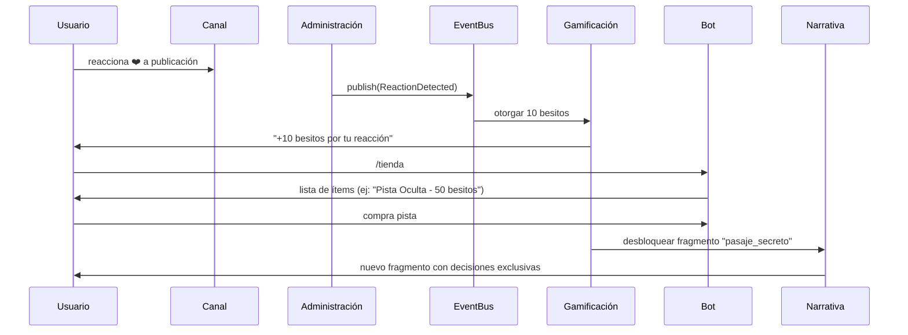

# Contexto del Módulo de Gamificación - DianaBot

## 🎯 Objetivo del Módulo (según concepto oficial)

Crear una **economía interna viva** centrada en los **besitos** como moneda virtual. El sistema debe:

- Incentivar la **interacción diaria** mediante misiones, trivias, regalos diarios y reacciones.
- Ofrecer **recompensas significativas**: ítems coleccionables, pistas narrativas, logros con beneficios pasivos.
- Fomentar **exploración transcanal** y **competencia amigable** (subastas).
- **Conectar directamente con la narrativa**: decisiones desbloquean misiones; ítems y logros alteran el rumbo de la historia.
- Reflejar el **tono emocional y erótico** del ecosistema DianaBot.

## 🔧 Componentes Clave del Sistema de Gamificación

### Besitos
- **Moneda central** del sistema de gamificación.
- **Fuentes de obtención**:
  - Reacciones ❤️ a publicaciones
  - Completar misiones (diarias/semanales/personalizadas)
  - Ganar trivias
  - Recoger regalo diario

### Mochila (Inventario)
- Almacena objetos que pueden ser:
  - Necesarios para avanzar en la narrativa
  - Canjeables en subastas
  - Coleccionables con valor simbólico

### Tienda Virtual
- Donde se gastan besitos en ítems, pistas o herramientas.

### Subastas
- Eventos en tiempo real por artículos exclusivos.

### Trivias
- Preguntas interactivas con recompensas inmediatas.

### Logros (Badges)
- Reconocimientos por acciones clave, con efectos duraderos (ej: +10% besitos por reacción).

## 📊 Modelos de Datos Clave (Alineados con Fase 2 y Concepto)

- `BesitosTransaction`: con `reason` que refleje la fuente (ej: `"reaction"`, `"daily_gift"`, `"mission_complete"`).
- `Mission`: debe soportar tipos: `"daily"`, `"weekly"`, `"narrative_unlock"`.
- `Item`: con `type` (`"pista"`, `"coleccionable"`, `"herramienta"`) y `metadata` para efectos narrativos.
- `Achievement`: con `criteria` y `reward` que puedan modificar el comportamiento del sistema (ej: desbloquear fragmento).
- Todos almacenados en MongoDB, con índices en `user_id` y `status`.

## 🔄 Servicios a Reutilizar

- `UserService`: para acceder a `besitos_balance` y `inventory`.
- `EventBus`: para publicar eventos clave:
  - `BesitosAdded(user_id, amount, reason)`
  - `MissionCompleted(user_id, mission_id)`
  - `ItemAcquired(user_id, item_id)`
  - `AchievementUnlocked(user_id, achievement_id)`
- `NarrativeService`: para desbloquear fragmentos tras adquirir ítems o logros.
- `SubscriptionService`: para ofrecer misiones o recompensas exclusivas VIP.

## 🤖 Handlers Esperados (Aiogram 3)

### Comandos de Usuario
- `/mochila` → muestra inventario con descripción y uso potencial.
- `/tienda` → lista ítems disponibles con precio en besitos.
- `/misiones` → muestra misiones activas y progreso.
- `/regalo` → reclama regalo diario (con cooldown en Redis).

### Interacciones Automáticas
- Listener de `ReactionDetected` → otorga besitos.
- Handler de encuestas de Telegram → procesa respuestas de trivias.

### Características
- Uso de `InlineKeyboard` para comprar, pujar o usar ítems.
- FSM solo para flujos complejos (ej: subasta con múltiples pujas).

## ⚡ Eventos Críticos para la Sinergia del Ecosistema

### Publicar
- `BesitosAdded` → puede disparar notificaciones o logros.
- `ItemAcquired` → puede desbloquear decisiones en narrativa.

### Suscribirse
- `NarrativeProgressUpdated` → activar misiones narrativas ("Explora el Pasaje Secreto").
- `SubscriptionStatusChanged` → ajustar recompensas o acceso a subastas VIP.
- `PostPublished` (de Administración) → iniciar trivia o misión ligada a la publicación.

## 🔄 Flujo de Usuario Representativo

## ⚖️ Reglas de Negocio No Negociables

- Los **besitos no son transferibles** entre usuarios.
- Las **subastas son eventos limitados en el tiempo**, con notificación al ganador.
- Los **logros son permanentes** y deben reflejarse en el perfil del usuario.
- La **mochila es personal e intransferible**.
- Las **trivias usan encuestas nativas de Telegram** para máxima interacción.
- El **regalo diario tiene cooldown de 24h por usuario** (usar Redis con TTL).

## 🌟 Sinergia con el Ecosistema DianaBot

El módulo de gamificación no es un sistema aislado, sino el **sistema circulatorio** que da vida a todo DianaBot. Cada componente debe estar diseñado para:

- Potenciar la narrativa a través de mecanismos de juego
- Interactuar con el sistema de administración para maximizar la participación
- Crear una economía interna que incentive la exploración y la interacción continua
- Reforzar el tono emocional y erótico del universo DianaBot

Este contexto garantiza que cada línea de código implementada refleje fielmente el concepto oficial de DianaBot y cree una experiencia cohesiva para los usuarios.