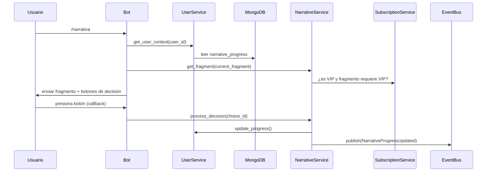

# Contextualización del Módulo de Narrativa Inmersiva

## Objetivo del Módulo

El módulo de Narrativa Inmersiva permite que el usuario protagonice una historia ramificada guiada por **Lucien** (mayordomo) y **Diana** (musa enigmática). La narrativa es emocional, sensorial, psicológica y erótica, con decisiones que alteran el rumbo de la historia. Existen niveles gratuitos (1–3) y niveles VIP (4–6).

## Modelos de Datos Clave

Los siguientes modelos ya están definidos en `src/database/schemas/mongo.py`:

- `NarrativeFragment`: Fragmentos con `fragment_id`, `content`, `choices`, `vip_required`
- `NarrativeProgress`: Estado del usuario (`current_fragment`, `completed_fragments`, `unlocked_hints`)

Estos modelos se almacenan en:
- Colección `narrative_fragments` para los fragmentos narrativos
- Documento del usuario en la colección `users` para el progreso narrativo

## Servicios a Reutilizar

- `UserService`: Para obtener y actualizar `narrative_progress`
- `SubscriptionService`: Para validar acceso a fragmentos con `vip_required=True`
- `EventBus`: Para publicar eventos como `NarrativeProgressUpdated`, `HintUnlocked`

## Handlers Esperados (Aiogram 3)

### Comandos
- `/narrativa` → Muestra el fragmento actual

### Callbacks
- Callbacks de decisiones → Procesan `choice_id` y avanzan la historia

### Implementación
Los handlers deben usar:
- `message: Message` o `callback: CallbackQuery`
- Inyección de `user_service`, `narrative_service` vía middleware
- FSM solo si se requiere flujo multietapa (por ejemplo, secuencia de decisiones)

## Eventos a Publicar/Suscribir

### Publicar
- `NarrativeProgressUpdated(user_id, fragment_id)`
- `HintUnlocked(user_id, hint_id)`

### Suscribirse
(Vía `CoordinatorService` o listener propio)
- `MissionCompleted` → Puede desbloquear fragmentos
- `ItemAcquired` → Puede habilitar decisiones ocultas

## Dependencias de Infraestructura

- Base de datos: **MongoDB** (colecciones `users`, `narrative_fragments`)
- Event Bus: **Redis** con fallback local (ya implementado en Fase 2)
- Middleware: Ya inyecta `user_service` y `event_bus` en `data`

## Flujo Básico de Usuario

## Restricciones y Reglas de Negocio

- No se puede acceder a fragmentos VIP sin suscripción activa
- Las decisiones deben validarse contra el estado actual del usuario
- Los fragmentos ocultos requieren ítems o logros específicos
- Las decisiones deben ser consistentes con el progreso narrativo del usuario
- Cada usuario tiene su propio estado narrativo independiente
- El sistema debe garantizar la integridad del estado narrativo entre sesiones
- Las decisiones incorrectas o inválidas deben manejar errores de forma adecuada