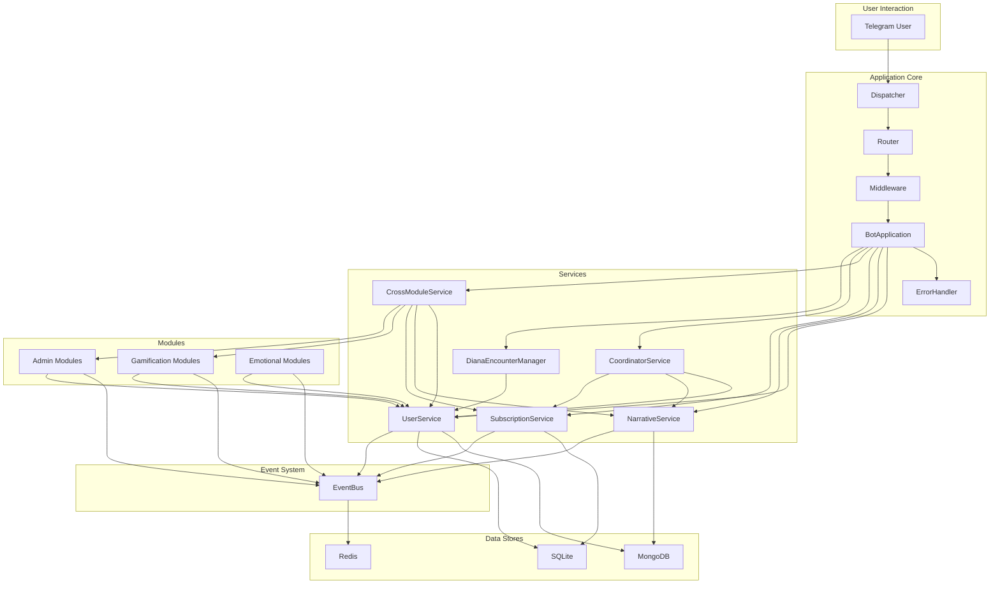

# System Architecture

## Resumen
This document provides a high-level overview of the YABOT system architecture. It describes the main components of the system and how they interact with each other.

## Architecture Diagram

The following diagram illustrates the high-level architecture of the YABOT system:

## Component Descriptions

- **Application Core**: This is the heart of the application. It includes the `BotApplication` class, which is the central orchestrator, as well as the `Dispatcher`, `Router`, `Middleware`, and `ErrorHandler`.
- **Services**: The services layer contains the core business logic of the application. Each service is responsible for a specific domain of functionality.
- **Data Stores**: The application uses MongoDB, SQLite, and Redis to store data.
- **Event System**: The event system is the backbone of the application's architecture. It enables decoupled communication between different components.
- **Modules**: The application is composed of several modules that provide specific features, such as gamification, admin tools, and emotional intelligence.

## Data Flow

1.  A Telegram user sends a message to the bot.
2.  The `Dispatcher` receives the message and passes it to the `Router`.
3.  The `Router` routes the message to the appropriate handler.
4.  The handler processes the message and may call one or more services.
5.  The services execute the business logic and may interact with the data stores.
6.  The services may also publish events to the `EventBus`.
7.  Other services or modules that are subscribed to these events will be notified and can react accordingly.

## Points of Extension

The system is designed to be extensible. Here are some of the main points of extension:

- **Services**: You can add new services to provide new functionality.
- **Modules**: You can add new modules to provide new features.
- **Events**: You can define new events and subscribe to them to create new workflows.
- **Menus**: You can add new menus to the `MENU_DEFINITIONS` dictionary in `src/ui/menu_config.py` to expose new features to the user.
