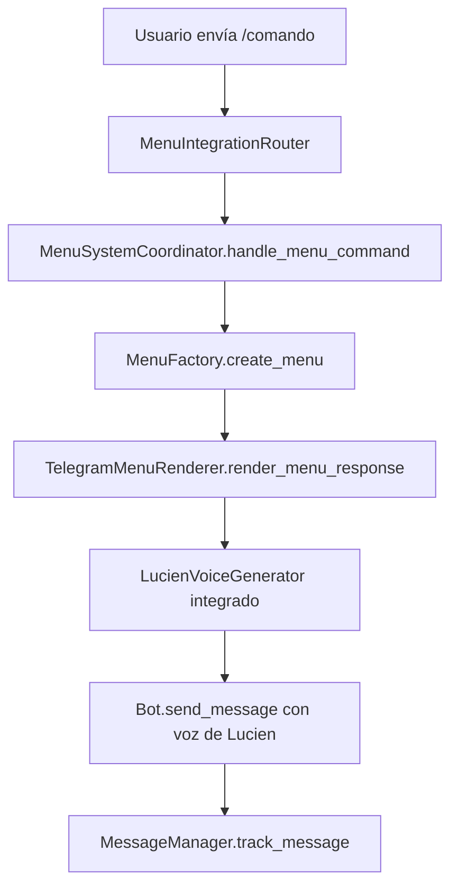

# Sistema de Menús - YABOT

## Resumen

El sistema de menús de YABOT es un componente sofisticado que integra la **voz de Lucien**, generación dinámica de contenido y gestión avanzada de mensajes. Es el sistema **primario** para todas las interacciones de comandos.

## Arquitectura del Sistema

### Componentes Principales

```
MenuSystemCoordinator (Coordinador Central)
    ├── MenuFactory (Generación de menús)
    ├── TelegramMenuRenderer (Renderizado con voz de Lucien)
    ├── MessageManager (Gestión de mensajes)
    ├── MenuConfig (Configuración centralizada)
    └── MenuIntegrationRouter (Enrutamiento)
```

## Archivos Clave y Sus Funciones

### 🎯 **Archivo Principal de Coordinación**
- **`src/handlers/menu_system.py`**: `MenuSystemCoordinator`
  - **Función**: Coordinador central que orquesta todo el sistema
  - **Responsabilidades**: Manejo de comandos, integración con Lucien, eventos
  - **Punto de entrada**: `handle_menu_command(message)`

### 🏭 **Generación de Menús**
- **`src/ui/menu_factory.py`**: `MenuFactory`
  - **Función**: Fabrica de menús dinámicos basados en contexto del usuario
  - **Crea**: Objetos `Menu` personalizados según rol, VIP, nivel
  - **Método clave**: `create_menu(menu_id, user_context)`

### 🎨 **Renderizado con Voz de Lucien**
- **`src/ui/telegram_menu_renderer.py`**: `TelegramMenuRenderer`
  - **Función**: Convierte menús en mensajes de Telegram con voz de Lucien
  - **Integra**: `LucienVoiceProfile` para respuestas sofisticadas
  - **Método clave**: `render_menu_response(menu)`

### ⚙️ **Configuración Centralizada**
- **`src/ui/menu_config.py`**: Configuración del sistema
  - **Contiene**: Definiciones de menús, reglas de enrutamiento, configuraciones
  - **Variable global**: `menu_system_config`
  - **Método clave**: `get_routing_rule(command)`

### 📨 **Gestión de Mensajes**
- **`src/ui/message_manager.py`**: `MessageManager`
  - **Función**: Manejo inteligente de mensajes (limpieza, tracking)
  - **Previene**: Spam de mensajes antiguos
  - **Método clave**: `track_message(chat_id, message_id, menu_type)`

### 🔀 **Enrutamiento**
- **`src/handlers/menu_router.py`**: `MenuIntegrationRouter`
  - **Función**: Enruta TODOS los comandos al MenuSystemCoordinator
  - **Elimina**: Duplicación con sistema básico
  - **Método clave**: `route_message(message)`

### 🎭 **Integración de Lucien**
- **`src/ui/lucien_voice_generator.py`**: Voz de Lucien
  - **Función**: Genera respuestas sofisticadas con personalidad
  - **Evalúa**: Worthiness, sophistication, relaciones
  - **Método clave**: `generate_lucien_response(profile, action, context)`

## Flujo de Procesamiento



## Cómo Agregar un Nuevo Botón

### 1. **Definir en MenuConfig** (`src/ui/menu_config.py`)

```python
# En MENU_DEFINITIONS, buscar el menú correspondiente
"main_menu": MenuConfig(
    menu_id="main_menu",
    title="Menú Principal",
    description="Opciones principales del bot",
    items=[
        # Agregar nuevo botón aquí
        MenuItemConfig(
            id="new_feature",
            text="🆕 Nueva Funcionalidad",
            action_type=ActionType.CALLBACK,
            callback_data="new_feature",
            description="Descripción de la nueva función",
            required_role=UserRole.FREE_USER,  # Requisitos de acceso
            required_vip=False,
            required_level=1
        ),
        # ... otros botones existentes
    ]
)
```

### 2. **Agregar Regla de Enrutamiento** (mismo archivo)

```python
# En routing_rules del MenuSystemConfig
routing_rules = {
    "start": "main_menu",
    "menu": "main_menu",
    "help": "help_menu",
    "new_feature": "new_feature_menu",  # ← Agregar aquí
}
```

### 3. **Crear Handler para el Callback**

En el archivo apropiado del sistema (ej: `src/handlers/callback_processor.py`):

```python
async def handle_new_feature_callback(self, callback_query, user_context):
    """Manejar callback de nueva funcionalidad."""
    # Tu lógica aquí
    return {
        "success": True,
        "response": "Funcionalidad ejecutada",
        "next_menu": "main_menu"  # Menú siguiente
    }
```

### 4. **Registrar el Handler**

En `src/handlers/callback_processor.py` o el archivo correspondiente:

```python
# En el diccionario de handlers
CALLBACK_HANDLERS = {
    "new_feature": handle_new_feature_callback,
    # ... otros handlers
}
```

## Cómo Quitar una Sección del Menú

### 1. **Comentar/Eliminar en MenuConfig**

```python
"main_menu": MenuConfig(
    items=[
        # Comentar o eliminar la sección
        # MenuItemConfig(
        #     id="old_feature",
        #     text="🗑️ Función Antigua",
        #     ...
        # ),

        # Otros botones que permanecen
        MenuItemConfig(id="keep_this", ...),
    ]
)
```

### 2. **Limpiar Handlers Relacionados**

```python
# En callback_processor.py, comentar/eliminar
CALLBACK_HANDLERS = {
    # "old_feature": handle_old_feature,  # ← Comentar
    "keep_this": handle_keep_this,
}
```

### 3. **Limpiar Reglas de Enrutamiento**

```python
# En menu_config.py
routing_rules = {
    "start": "main_menu",
    # "old_command": "old_menu",  # ← Comentar si ya no se usa
}
```

## Modificar Respuestas de Lucien

### 1. **Personalizar por Tipo de Menú**

En `src/ui/telegram_menu_renderer.py`, método `_generate_lucien_text_for_menu`:

```python
# Personalizar el prompt según el menú
if menu_id == "new_feature_menu":
    menu_prompt = "Ah, exploring new territories. How... intriguing."
elif menu_id == "admin_menu":
    menu_prompt = "Administrator privileges... you've earned certain considerations."
else:
    menu_prompt = f"Welcome to the {menu_title} menu."
```

### 2. **Ajustar Contexto para Lucien**

```python
context = {
    "menu_id": menu_id,
    "menu_type": str(menu_type),
    "user_sophistication": user_context.get("worthiness", 0),
    "special_context": "new_feature_exploration",  # ← Agregar contexto específico
}
```

## Ejemplos de Desarrollo

### Ejemplo 1: Menú de Configuración

```python
# 1. Definir en menu_config.py
"settings_menu": MenuConfig(
    menu_id="settings_menu",
    title="⚙️ Configuración",
    items=[
        MenuItemConfig(
            id="language",
            text="🌐 Idioma",
            action_type=ActionType.CALLBACK,
            callback_data="set_language"
        ),
        MenuItemConfig(
            id="notifications",
            text="🔔 Notificaciones",
            action_type=ActionType.CALLBACK,
            callback_data="toggle_notifications"
        ),
        MenuItemConfig(
            id="back_main",
            text="🔙 Volver",
            action_type=ActionType.CALLBACK,
            callback_data="main_menu"
        )
    ]
)

# 2. Agregar regla de enrutamiento
routing_rules = {
    "settings": "settings_menu",
}
```

### Ejemplo 2: Botón Condicional por VIP

```python
MenuItemConfig(
    id="vip_lounge",
    text="💎 Salón VIP",
    action_type=ActionType.CALLBACK,
    callback_data="vip_lounge",
    required_vip=True,  # ← Solo usuarios VIP
    visible_condition="user.has_vip",  # Condición dinámica
    description="Acceso exclusivo para miembros VIP"
)
```

### Ejemplo 3: Menú Dinámico por Nivel

```python
MenuItemConfig(
    id="advanced_features",
    text="🚀 Funciones Avanzadas",
    action_type=ActionType.SUBMENU,
    callback_data="advanced_menu",
    required_level=5,  # ← Solo nivel 5+
    enabled_condition="user.narrative_level >= 5"
)
```

## Debugging y Logs

### Logs Importantes a Monitorear

```bash
# Coordinador principal
grep "MenuSystemCoordinator" logs/bot.log

# Errores de renderizado
grep "Failed to generate Lucien text" logs/bot.log

# Problemas de enrutamiento
grep "MenuIntegrationRouter" logs/bot.log

# Errores de caché de mensajes
grep "Invalid.*menu ID" logs/bot.log
```

### Debugger Integrado

El sistema incluye prints de debug:
```python
print(f"[DEBUGGER:handle_menu_command:2.1] About to determine menu type", file=sys.stderr)
```

## Integración con Otros Sistemas

### Con Sistema de Usuarios
- **UserService**: Proporciona contexto del usuario (rol, VIP, nivel)
- **Método clave**: `get_enhanced_user_menu_context(user_id)`

### Con Sistema de Eventos
- **EventBus**: Publica eventos de interacción de menús
- **Eventos**: `menu_interaction`, `user_progression`

### Con Voz de Lucien
- **LucienVoiceProfile**: Personalidad y evaluación de worthiness
- **Genera**: Respuestas contextuales según relación con usuario

## Archivos NO Modificados (Sistema Básico Eliminado)

❌ **NO TOCAR** - Estos son solo fallbacks:
- `src/handlers/telegram_commands.py`: Solo fallback de emergencia
- `src/core/router.py`: Router básico, no se usa

✅ **MODIFICAR** - Sistema principal:
- `src/handlers/menu_system.py`: Coordinador principal
- `src/ui/menu_config.py`: Configuración centralizada
- `src/ui/menu_factory.py`: Generación de menús
- `src/ui/telegram_menu_renderer.py`: Renderizado con Lucien

---

## Notas Importantes

1. **Sistema Unificado**: Todo pasa por MenuSystemCoordinator - no hay duplicación
2. **Voz de Lucien Integrada**: Todas las respuestas tienen la personalidad de Lucien
3. **Gestión Inteligente**: MessageManager previene spam de mensajes
4. **Configuración Centralizada**: Todo en menu_config.py para fácil mantenimiento
5. **Debugging**: Logs detallados para troubleshooting

El sistema está diseñado para ser **extensible**, **mantenible** y **sofisticado**. 🎭✨